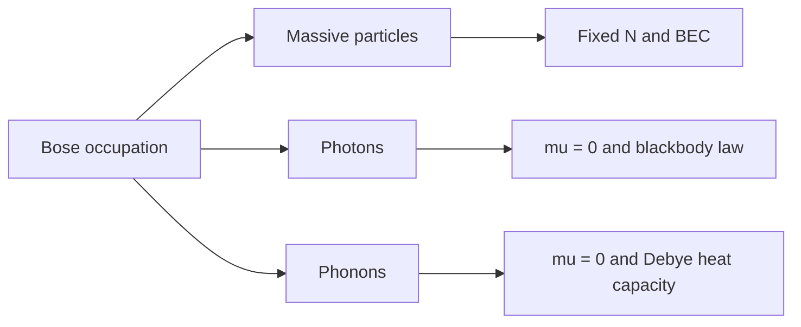

# Bose Gases, Photons, and Phonons

Bosons can pile into the same quantum state. That simple fact produces three major ideal-gas phenomena in Schwabl's treatment: Bose-Einstein condensation of massive particles, blackbody radiation for photons, and low-temperature heat capacity of solids through phonons. All three use Bose occupation numbers, but their constraints differ. Massive atoms conserve particle number; photons and phonons usually do not.

This distinction is essential. A conserved Bose gas has a chemical potential set by $N$. A photon gas in thermal equilibrium has $\mu=0$ because photons can be created and absorbed by the walls. Phonons also have $\mu=0$ in ordinary equilibrium because lattice vibrations are quasiparticles, not conserved atoms.

## Definitions

The Bose-Einstein occupation is

$$
f_{\mathrm{BE}}(\epsilon)
={1\over e^{\beta(\epsilon-\mu)}-1}.
$$

For a massive ideal Bose gas in a box, $\mu$ must not exceed the ground-state energy. Taking the ground energy as zero, $\mu\le 0$. The thermal wavelength is

$$
\lambda_T={h\over \sqrt{2\pi m k_BT}}.
$$

The excited-state density at $\mu=0$ is

$$
n_{\mathrm{ex}}(T)
={1\over \lambda_T^3}\zeta(3/2).
$$

Bose-Einstein condensation occurs when $n\gt n_{\mathrm{ex}}(T)$, with critical temperature

$$
T_c={2\pi\hbar^2\over mk_B}
\left({n\over \zeta(3/2)}\right)^{2/3}.
$$

For photons, $\epsilon=\hbar\omega$ and $\mu=0$. The spectral energy density is Planck's law:

$$
u(\omega)d\omega
={\hbar\over \pi^2c^3}
{\omega^3\,d\omega\over e^{\beta\hbar\omega}-1}.
$$

For acoustic phonons in the Debye model, $\omega=c_s k$ up to a Debye cutoff chosen to give the correct number of modes.

## Key results

Below $T_c$, the condensate fraction for a uniform ideal Bose gas is

$$
{N_0\over N}=1-\left({T\over T_c}\right)^{3/2}.
$$

This result is idealized; interactions, traps, and finite-size effects modify it, but it captures the statistical origin of macroscopic ground-state occupation.

For photons, integrating Planck's law gives the Stefan-Boltzmann energy density

$$
u(T)=aT^4,
\qquad
a={\pi^2 k_B^4\over 15\hbar^3 c^3}.
$$

The pressure of radiation is

$$
p={u\over 3}.
$$

The photon number is not fixed; it scales as $T^3$ rather than being set by a chemical potential.

For phonons, the Debye low-temperature heat capacity is

$$
C_V
=12{\pi^4\over 5}Nk_B\left({T\over \Theta_D}\right)^3
\qquad (T\ll \Theta_D),
$$

where $\Theta_D=\hbar\omega_D/k_B$ is the Debye temperature. At high temperature, the heat capacity approaches the Dulong-Petit value $3Nk_B$.

The recurring mathematical pattern is the Bose integral

$$
\int_0^\infty {x^{s-1}\over e^x-1}\,dx
=\Gamma(s)\zeta(s).
$$

The power of $T$ in thermodynamic quantities comes from the density of states and the dispersion relation.

For Bose-Einstein condensation, the important point is saturation of excited states. In three dimensions, the excited-particle integral at $\mu=0$ is finite:

$$
N_{\mathrm{ex,max}}=V{\zeta(3/2)\over \lambda_T^3}.
$$

If the total $N$ is larger than this value, the extra particles cannot be accommodated by making $\mu$ positive, because that would make the ground-state occupation formula singular with the wrong sign. Instead, they accumulate in the ground state. This is a statistical transition, not a consequence of attraction between particles.

Dimensionality matters. For a uniform ideal Bose gas in one or two dimensions, the corresponding excited-state integral does not produce the same finite saturation at nonzero temperature in the thermodynamic limit. Traps, interactions, and finite size can change experimental behavior, but the simple uniform ideal-gas result is dimension sensitive.

For photons, Planck's law combines Bose statistics with a density of modes proportional to $\omega^2$ and an energy per mode $\hbar\omega$. The low-frequency Rayleigh-Jeans limit follows from $e^x-1\approx x$, while the high-frequency Wien tail follows from $e^x-1\approx e^x$. The ultraviolet catastrophe is avoided precisely because the quantum occupation decays exponentially when $\hbar\omega\gg k_BT$.

For phonons, the Debye model replaces the true lattice dispersion by linear acoustic branches up to a cutoff. The cutoff is not arbitrary; it is chosen so the total number of vibrational modes is $3N$. This preserves the correct high-temperature heat capacity while capturing the low-temperature dominance of long-wavelength acoustic modes.

The comparison between photons and phonons is useful because both are bosonic fields with approximately linear low-energy dispersion, but their speeds and mode structures differ. Photons have two transverse polarizations in vacuum and speed $c$. Acoustic phonons in a solid have one longitudinal and two transverse branches with sound speeds set by elastic constants. Optical phonons, present in multi-atom unit cells, have nonzero frequencies at long wavelength and are often frozen out at sufficiently low temperature.

For blackbody radiation, the absence of particle-number conservation is not a minor detail. If photons had a fixed number, one would need a chemical potential and could discuss photon condensation under special conditions. Ordinary cavity radiation instead equilibrates by exchanging photons with matter, setting $\mu=0$ and making temperature the only intensive parameter controlling photon number.

Interactions change the physical interpretation of Bose condensation. In an ideal gas, condensation is macroscopic ground-state occupation. In liquid helium, interactions are strong, the condensate fraction is not close to one, and superfluidity involves collective excitations and phase coherence. Schwabl's discussion of phonons, rotons, and the two-fluid picture points beyond the ideal Bose gas while keeping Bose statistics as the starting point.

The Debye model has a similar status. It is not a detailed band-structure calculation of a particular crystal, but it captures the universal low-temperature fact that only long-wavelength acoustic modes are thermally occupied. Microscopic details enter through sound velocities and the Debye temperature.

The common mathematical reason for BEC, blackbody radiation, and Debye heat capacity is the competition between Bose occupation and density of states. Changing the dispersion relation or spatial dimension changes the power of energy in the density of states, and therefore changes whether integrals converge and which power of temperature appears.

Finite systems smooth the condensation singularity. A trapped atomic gas can have a very sharp crossover and a macroscopically occupied lowest state, but the true nonanalyticity belongs to the thermodynamic limit. This mirrors the general phase-transition lesson developed later in the section.

## Visual

| System | Quasiparticle energy | Chemical potential | Signature result |
|---|---:|---:|---|
| Massive Bose gas | $p^2/(2m)$ | set by $N$, $\mu\le 0$ | Bose-Einstein condensation |
| Photon gas | $\hbar\omega$ | $\mu=0$ | Planck law, $u\propto T^4$ |
| Acoustic phonons | $\hbar c_s k$ | $\mu=0$ | Debye $C_V\propto T^3$ |



## Worked example 1: Condensate fraction below the critical temperature

Problem: An ideal Bose gas is at $T=0.40T_c$. Find the fraction of particles in the condensate.

Method:

1. Use the ideal uniform-gas result:

$$
{N_0\over N}=1-\left({T\over T_c}\right)^{3/2}.
$$

2. Insert $T/T_c=0.40$:

$$
\left(0.40\right)^{3/2}
=0.40\sqrt{0.40}.
$$

3. Since $\sqrt{0.40}\approx 0.6325$,

$$
0.40\sqrt{0.40}\approx 0.253.
$$

4. Therefore

$$
{N_0\over N}\approx 1-0.253=0.747.
$$

Checked answer: about $75\%$ of the particles occupy the ground state in this idealized model.

## Worked example 2: Low-temperature Debye heat capacity

Problem: A crystal has Debye temperature $\Theta_D=300\,\mathrm K$. Estimate $C_V/(Nk_B)$ at $T=30\,\mathrm K$ using the low-temperature Debye law.

Method:

1. Use

$$
{C_V\over Nk_B}
=12{\pi^4\over 5}\left({T\over \Theta_D}\right)^3.
$$

2. Compute the temperature ratio:

$$
{T\over \Theta_D}={30\over 300}=0.1.
$$

3. Cube it:

$$
(0.1)^3=0.001.
$$

4. Compute the coefficient:

$$
12{\pi^4\over 5}\approx 12(19.48)=233.8.
$$

5. Multiply:

$$
{C_V\over Nk_B}\approx 233.8(0.001)=0.234.
$$

Checked answer: this is much smaller than the high-temperature value $3$, consistent with frozen-out short-wavelength phonons.

## Code

```python
import numpy as np

def condensate_fraction(T_over_Tc):
    x = np.asarray(T_over_Tc)
    return np.where(x < 1.0, 1.0 - x**1.5, 0.0)

def debye_low_cv(T, theta_D, N=1.0, kB=1.0):
    return 12 * np.pi**4 / 5 * N * kB * (T / theta_D)**3

for x in [0.2, 0.4, 0.8, 1.2]:
    print(x, condensate_fraction(x))

for T in [10, 30, 100]:
    print(T, debye_low_cv(T, theta_D=300))
```

## Common pitfalls

- Assigning a nonzero conserved-particle chemical potential to equilibrium photons or phonons.
- Forgetting to separate the Bose ground state when deriving condensation; the continuum integral counts only excited states well.
- Treating ideal Bose condensation and superfluidity as identical. Interactions matter for real superfluid helium.
- Applying the Debye $T^3$ law near or above $\Theta_D$ where the low-temperature approximation fails.
- Missing polarization factors for photons and phonon branches when counting modes.

## Connections

- [Quantum statistics and ideal quantum gases](/physics/statistical-mechanics/quantum-statistics-and-ideal-quantum-gases)
- [Degenerate Fermi gas](/physics/statistical-mechanics/degenerate-fermi-gas)
- [Canonical ensemble and fluctuations](/physics/statistical-mechanics/canonical-ensemble-and-fluctuations)
- [Harmonic oscillator](/physics/quantum-mechanics/harmonic-oscillator-ladder-operators)
- [Finite-temperature field theory bridge](/physics/statistical-mechanics/irreversibility-master-equations-and-finite-temperature-field-theory)
