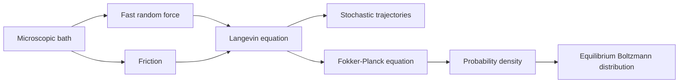

# Brownian Motion, Langevin, and Fokker-Planck Dynamics

Brownian motion is the statistical mechanics of a slow observed variable coupled to many fast microscopic degrees of freedom. Instead of tracking every solvent molecule, one writes an effective stochastic equation with friction and noise. Schwabl develops this route through Langevin equations and derives the corresponding Fokker-Planck equations for probability densities.

The key lesson is balance. Friction alone would drain energy; noise alone would heat without bound. Equilibrium requires a fluctuation-dissipation relation tying the noise strength to the damping coefficient and temperature.

## Definitions

The free Langevin equation for a particle of mass $m$ is

$$
m\dot v=-\gamma v+\eta(t),
$$

where $\gamma$ is the friction coefficient and $\eta(t)$ is a random force with

$$
\langle \eta(t)\rangle=0,
\qquad
\langle \eta(t)\eta(t')\rangle=2\gamma k_BT\,\delta(t-t').
$$

In a force field $F(x)=-\partial_x U(x)$,

$$
m\dot v=-\gamma v+F(x)+\eta(t),
\qquad
\dot x=v.
$$

The overdamped Langevin equation is

$$
\gamma\dot x=F(x)+\eta(t).
$$

For overdamped motion in one dimension, the probability density $P(x,t)$ obeys the Smoluchowski equation

$$
{\partial P\over \partial t}
=-{\partial\over \partial x}\left({F\over \gamma}P\right)
+D{\partial^2P\over \partial x^2},
$$

with diffusion constant

$$
D={k_BT\over \gamma}.
$$

## Key results

For free overdamped diffusion,

$$
{\partial P\over \partial t}=D{\partial^2P\over \partial x^2}.
$$

Starting at $x=0$, the solution is Gaussian:

$$
P(x,t)={1\over \sqrt{4\pi Dt}}
\exp\left(-{x^2\over 4Dt}\right),
$$

and the mean-square displacement is

$$
\langle x^2(t)\rangle=2Dt
$$

in one dimension. In $d$ dimensions,

$$
\langle |\mathbf x(t)-\mathbf x(0)|^2\rangle=2dDt.
$$

For the velocity Langevin equation, the deterministic relaxation time is

$$
\tau={m\over \gamma}.
$$

The velocity autocorrelation function is

$$
\langle v(t)v(0)\rangle={k_BT\over m}e^{-\gamma |t|/m}.
$$

Integrating the autocorrelation gives the diffusion constant:

$$
D=\int_0^\infty \langle v(t)v(0)\rangle\,dt
={k_BT\over \gamma}.
$$

This is the Einstein relation. It is an elementary form of fluctuation-dissipation: equilibrium fluctuations determine dissipative transport.

The stationary solution of the Fokker-Planck equation in a potential is the Boltzmann distribution

$$
P_{\mathrm{eq}}(x)={1\over Z}e^{-\beta U(x)}
$$

when $D=k_BT/\gamma$. If the noise strength and damping are inconsistent, the process does not relax to the correct thermal equilibrium.

The underdamped and overdamped descriptions apply on different time scales. At times short compared with $\tau=m/\gamma$, the particle remembers its velocity and motion is approximately ballistic:

$$
\langle x^2(t)\rangle\approx {k_BT\over m}t^2.
$$

At times long compared with $\tau$, velocity memory has decayed and diffusion becomes linear in time:

$$
\langle x^2(t)\rangle\approx 2Dt.
$$

Experiments on colloids can observe both regimes if temporal resolution is high enough.

The Fokker-Planck equation has the structure of a continuity equation in probability space:

$$
{\partial P\over \partial t}=-{\partial J\over \partial x},
\qquad
J={F\over \gamma}P-D{\partial P\over \partial x}.
$$

Equilibrium in a closed system usually means zero probability current, not merely a time-independent density. In nonequilibrium steady states, $P$ can be stationary while currents circulate; such states require driving or reservoirs and lie beyond the simplest equilibrium Brownian model.

The same formalism also describes activated escape. In a double-well potential, noise occasionally drives a system over an energy barrier. At weak noise, escape rates have Arrhenius form

$$
r\propto e^{-\Delta U/(k_BT)}.
$$

The prefactor depends on damping and potential curvature. This connects stochastic dynamics to chemical reaction rates, nucleation, and switching of order parameters near metastable states.

Schwabl's treatment of critical dynamics uses Langevin-type equations for coarse-grained order parameters. There the "coordinate" is not a particle position but a field such as magnetization density. The same questions recur: What is the deterministic relaxation law, what noise correlator enforces equilibrium, and which conservation laws change the dynamic universality class?

The Markov assumption is another approximation. A true microscopic bath has finite correlation times, and eliminating it exactly can produce memory friction and colored noise. The simple Langevin equation is valid when bath correlations decay quickly compared with the slow variable's evolution. If this separation fails, generalized Langevin equations are needed:

$$
m\dot v(t)=-\int_0^t \Gamma(t-t')v(t')\,dt' + \eta(t).
$$

The fluctuation-dissipation relation then ties the memory kernel $\Gamma$ to the colored-noise correlation.

Boundary conditions turn diffusion into first-passage physics. Absorbing boundaries model reactions or escape, while reflecting boundaries model confinement. Many measurable quantities are not just densities at a time but hitting probabilities and mean first-passage times. This is one reason Brownian motion remains central in chemical physics and soft matter.

When the noise amplitude depends on position, stochastic calculus conventions matter. Ito and Stratonovich interpretations can lead to different drift terms for the same formal equation. The simple additive-noise Langevin equations on this page avoid that ambiguity, but multiplicative noise appears naturally in coarse-grained variables, chemical reaction networks, and diffusion in inhomogeneous media.

Fokker-Planck equations are therefore not merely differential equations; they encode modeling assumptions about coarse-graining, time-scale separation, and noise interpretation.

They also provide a direct route to numerical simulation. One may either integrate stochastic trajectories and estimate distributions from many paths, or solve the deterministic equation for $P(x,t)$. Agreement between these two descriptions is a useful check that drift, diffusion, and boundary conditions have been implemented consistently.

In higher dimensions the diffusion tensor can be anisotropic, especially in crystals, membranes, or complex fluids. Then $D$ is a matrix and the Fokker-Planck equation uses tensor diffusion. The scalar formulas here are the isotropic limit, chosen because they expose the core fluctuation-dissipation structure.

## Visual



| Description | Equation | Object evolved |
|---|---:|---|
| Langevin | $\gamma\dot x=F+\eta$ | individual noisy trajectory |
| Fokker-Planck | $\partial_tP=-\partial_x(AP)+\partial_x^2(DP)$ | probability density |
| Diffusion | $\partial_tP=D\partial_x^2P$ | density without drift |
| Smoluchowski | drift plus diffusion | overdamped thermal relaxation |

## Worked example 1: Mean-square displacement from the diffusion equation

Problem: Show that the one-dimensional diffusion equation implies $\langle x^2(t)\rangle=2Dt$ for a normalized density that decays at infinity.

Method:

1. Start with

$$
{\partial P\over \partial t}=D{\partial^2P\over \partial x^2}.
$$

2. Differentiate the second moment:

$$
{d\over dt}\langle x^2\rangle
=\int_{-\infty}^{\infty}x^2{\partial P\over \partial t}\,dx
=D\int x^2{\partial^2P\over \partial x^2}\,dx.
$$

3. Integrate by parts once:

$$
\int x^2P''\,dx
=\left[x^2P'\right]_{-\infty}^{\infty}
-\int 2xP'\,dx.
$$

The boundary term vanishes.

4. Integrate by parts again:

$$
-\int 2xP'\,dx
=-\left[2xP\right]_{-\infty}^{\infty}
+2\int P\,dx
=2.
$$

5. Therefore

$$
{d\over dt}\langle x^2\rangle=2D.
$$

For a particle starting at the origin, $\langle x^2(0)\rangle=0$, so

$$
\langle x^2(t)\rangle=2Dt.
$$

Checked answer: the result depends only on normalization and boundary decay, not on the detailed Gaussian solution.

## Worked example 2: Velocity autocorrelation and diffusion

Problem: Given

$$
\langle v(t)v(0)\rangle={k_BT\over m}e^{-t/\tau},
\qquad \tau={m\over \gamma},
$$

compute $D$.

Method:

1. Use the Green-Kubo relation for diffusion:

$$
D=\int_0^\infty \langle v(t)v(0)\rangle\,dt.
$$

2. Substitute:

$$
D={k_BT\over m}\int_0^\infty e^{-t/\tau}\,dt.
$$

3. Evaluate the integral:

$$
\int_0^\infty e^{-t/\tau}\,dt=\tau.
$$

4. Therefore

$$
D={k_BT\over m}\tau
={k_BT\over m}{m\over \gamma}
={k_BT\over \gamma}.
$$

Checked answer: the mass cancels in the long-time diffusion constant, although it controls the short-time relaxation scale.

## Code

```python
import numpy as np

def simulate_overdamped(T=1.0, gamma=2.0, dt=1e-3, steps=20_000, seed=0):
    rng = np.random.default_rng(seed)
    kB = 1.0
    D = kB * T / gamma
    x = 0.0
    xs = []
    for _ in range(steps):
        x += np.sqrt(2 * D * dt) * rng.normal()
        xs.append(x)
    return np.array(xs), D

xs, D = simulate_overdamped()
times = np.arange(1, len(xs) + 1) * 1e-3
print("D", D)
print("final x^2", xs[-1] ** 2)
print("ensemble estimate needs many paths; theory final <x^2>", 2 * D * times[-1])
```

## Common pitfalls

- Choosing noise strength independently of friction and temperature, thereby breaking thermal equilibrium.
- Confusing a stochastic trajectory with the probability density governed by the Fokker-Planck equation.
- Applying overdamped dynamics when inertial relaxation is not fast compared with observation time.
- Forgetting boundary conditions in Fokker-Planck problems; reflecting and absorbing boundaries change the solution.
- Treating white noise as an ordinary function rather than a distribution requiring stochastic interpretation.

## Connections

- [Linear response, fluctuation-dissipation, and Onsager theory](/physics/statistical-mechanics/linear-response-fluctuation-dissipation-and-onsager-theory)
- [Boltzmann equation and transport](/physics/statistical-mechanics/boltzmann-equation-and-transport)
- [Irreversibility, master equations, and finite-temperature field theory](/physics/statistical-mechanics/irreversibility-master-equations-and-finite-temperature-field-theory)
- [Markov chains](/math/probability-and-random-variables/markov-chains)
- [Poisson processes](/math/probability-and-random-variables/poisson-random-variables-and-processes)
