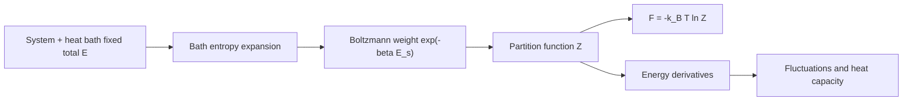

# Canonical Ensemble and Fluctuations

The canonical ensemble describes a system that can exchange energy with a heat bath while its volume and particle number remain fixed. It is the workhorse of equilibrium statistical mechanics because many laboratory systems are closer to fixed temperature than fixed energy, and because the partition function turns sums over states into thermodynamic potentials.

Schwabl derives the canonical density by embedding the system in a larger microcanonical universe. The bath's entropy supplies the Boltzmann factor, and the system's partition function normalizes it. Fluctuations, response functions, and thermodynamic stability all follow from derivatives of this one object.

## Definitions

For inverse temperature

$$
\beta={1\over k_BT},
$$

the quantum canonical density matrix is

$$
\rho={e^{-\beta H}\over Z},
\qquad
Z=\mathrm{Tr}\,e^{-\beta H}.
$$

For a classical system,

$$
Z={1\over h^{3N}N!}\int dq\,dp\,e^{-\beta H(q,p)}.
$$

The Helmholtz free energy is

$$
F(T,V,N)=-k_BT\ln Z.
$$

Canonical averages are

$$
\langle A\rangle={1\over Z}\mathrm{Tr}\,A e^{-\beta H}.
$$

When $A$ commutes with $H$, this is an ordinary weighted average over energy eigenstates. When it does not, the trace formula remains valid, but operator ordering matters in correlation functions.

## Key results

The energy follows from the partition function:

$$
\langle E\rangle
=-\frac{\partial}{\partial \beta}\ln Z.
$$

The energy variance is the second derivative:

$$
\langle(\Delta E)^2\rangle
=\frac{\partial^2}{\partial \beta^2}\ln Z
=-\frac{\partial \langle E\rangle}{\partial \beta}.
$$

Using $\partial/\partial\beta=-k_BT^2\partial/\partial T$, one obtains the fluctuation formula

$$
\langle(\Delta E)^2\rangle=k_BT^2 C_V.
$$

This is a central bridge between fluctuations and response. A large heat capacity means the system can absorb energy with little temperature change, and it also means its canonical energy distribution is broad in absolute terms. Relative fluctuations still vanish for macroscopic systems because both $C_V$ and $\langle E\rangle$ are extensive.

The canonical entropy can be written as

$$
S=-k_B\mathrm{Tr}\,\rho\ln\rho
=k_B(\ln Z+\beta\langle E\rangle).
$$

Since $F=E-TS$, one also has

$$
S=-\left({\partial F\over \partial T}\right)_{V,N},
\qquad
p=-\left({\partial F\over \partial V}\right)_{T,N}.
$$

The equipartition theorem follows for classical quadratic degrees of freedom. If the Hamiltonian contains a term $a x^2$, then

$$
\langle a x^2\rangle={1\over 2}k_BT.
$$

The virial theorem generalizes this structure and is especially useful for classical gases and bound systems:

$$
\left\langle x_i{\partial H\over \partial x_i}\right\rangle=k_BT
$$

under the usual assumptions that boundary terms vanish.

The canonical ensemble can be viewed as a saddle-point approximation to the microcanonical ensemble of a larger system. If the bath density of states is $\Omega_B(E_{\mathrm{tot}}-E_s)$, then

$$
\ln \Omega_B(E_{\mathrm{tot}}-E_s)
\approx
\ln \Omega_B(E_{\mathrm{tot}})
-\beta E_s
-{E_s^2\over 2k_BT^2C_{V,B}}+\cdots .
$$

The first-order term gives the Boltzmann factor. The quadratic correction is negligible when the bath heat capacity is very large compared with the subsystem's exchanged energy scale. This derivation explains both the power and the limitation of fixed-temperature descriptions: the reservoir must be large and internally equilibrated.

Partition-function derivatives generate cumulants, not only means. If

$$
K(\beta)=\ln Z(\beta),
$$

then

$$
\langle E\rangle=-K'(\beta),
\qquad
\langle(\Delta E)^2\rangle=K''(\beta),
\qquad
\langle(\Delta E)^3\rangle=-K'''(\beta).
$$

This is why response functions and fluctuations are so tightly connected. A singular heat capacity at a continuous transition is also a statement that energy fluctuations become anomalously large.

The free energy has a variational property. For any trial density matrix $\sigma$,

$$
F\le \mathrm{Tr}\,\sigma H+k_BT\,\mathrm{Tr}\,\sigma\ln\sigma .
$$

The minimum is reached at $\sigma=e^{-\beta H}/Z$. This Gibbs-Bogoliubov inequality is a standard route to mean-field approximations: choose a solvable trial Hamiltonian, minimize the variational free energy, and interpret the optimum as an effective field or quasiparticle description. Schwabl's later molecular-field theory fits this broader pattern.

Canonical calculations also require attention to degeneracy. If an energy $E_n$ has degeneracy $g_n$, its contribution is $g_ne^{-\beta E_n}$. Entropy often comes as much from degeneracy as from energy. In a spin system, for example, a macrostate with nearly equal up and down spins has huge combinatorial degeneracy even if its energy is not minimal. The canonical distribution balances this entropy against the Boltzmann energy penalty.

At low temperature, $Z$ is dominated by the ground state and the first few excitations. At high temperature, many states contribute, and classical approximations may become valid if quantum level spacings are small compared with $k_BT$. This low/high temperature reasoning is used repeatedly for oscillators, molecular rotations, phonons, and magnetic systems.

The same derivative machinery also gives generalized forces. If the Hamiltonian depends on an external parameter $\lambda$, then

$$
{\partial F\over \partial \lambda}
=\left\langle{\partial H\over \partial \lambda}\right\rangle.
$$

Pressure is the case where $\lambda=V$ with a sign convention, magnetization is the case where $\lambda=B$, and elastic stress follows from differentiating with respect to strain. Thus the canonical ensemble is not just a method for energy; it is a generator of equations of state for any controlled parameter.

For finite systems, canonical energy fluctuations are not negligible background. They can dominate calorimetry of nanoscale systems, clusters, and mesoscopic conductors. The thermodynamic limit hides them, but the fluctuation formulas remain exact and measurable.

## Visual



| Quantity | Canonical formula | Thermodynamic role |
|---|---:|---|
| Partition function | $Z=\mathrm{Tr}\,e^{-\beta H}$ | normalization and generator |
| Free energy | $F=-k_BT\ln Z$ | potential at fixed $T,V,N$ |
| Mean energy | $\langle E\rangle=-\partial_\beta\ln Z$ | caloric equation |
| Heat capacity | $C_V=(\partial E/\partial T)_{V,N}$ | response to temperature |
| Energy variance | $\langle(\Delta E)^2\rangle=k_BT^2C_V$ | equilibrium fluctuation |

## Worked example 1: Two-level system in the canonical ensemble

Problem: A system has energies $0$ and $\epsilon$. Find $Z$, $\langle E\rangle$, and $C_V$.

Method:

1. Sum the Boltzmann weights:

$$
Z=1+e^{-\beta\epsilon}.
$$

2. Compute the mean energy:

$$
\langle E\rangle
={0\cdot 1+\epsilon e^{-\beta\epsilon}\over 1+e^{-\beta\epsilon}}
={\epsilon\over e^{\beta\epsilon}+1}.
$$

3. Differentiate with respect to temperature. Let $x=\beta\epsilon=\epsilon/(k_BT)$:

$$
\langle E\rangle={\epsilon\over e^x+1},
\qquad
{dx\over dT}=-{x\over T}.
$$

4. Then

$$
C_V={d\langle E\rangle\over dT}
=\epsilon\left[-{e^x\over (e^x+1)^2}\right]\left[-{x\over T}\right]
=k_B x^2{e^x\over (e^x+1)^2}.
$$

Checked answer: $C_V$ vanishes at very low $T$ because the excited state is frozen out, and at very high $T$ because both levels are nearly equally populated.

## Worked example 2: Energy fluctuation of a harmonic oscillator

Problem: A quantum oscillator has levels $E_n=\hbar\omega(n+1/2)$. Compute $\langle E\rangle$ and the variance.

Method:

1. The partition function is a geometric series:

$$
Z=\sum_{n=0}^{\infty}e^{-\beta\hbar\omega(n+1/2)}
={e^{-\beta\hbar\omega/2}\over 1-e^{-\beta\hbar\omega}}.
$$

2. Its logarithm is

$$
\ln Z=-{\beta\hbar\omega\over 2}
-\ln(1-e^{-\beta\hbar\omega}).
$$

3. Differentiate:

$$
\langle E\rangle=-\partial_\beta\ln Z
=\hbar\omega\left({1\over 2}+{1\over e^{\beta\hbar\omega}-1}\right).
$$

4. The variance is

$$
\langle(\Delta E)^2\rangle
=-\partial_\beta\langle E\rangle
=(\hbar\omega)^2
{e^{\beta\hbar\omega}\over (e^{\beta\hbar\omega}-1)^2}.
$$

Checked answer: the zero-point energy contributes to $\langle E\rangle$ but not to the variance because it is a constant shift.

## Code

```python
import numpy as np

def two_level_cv(T, eps=1.0, kB=1.0):
    x = eps / (kB * T)
    return kB * x**2 * np.exp(x) / (np.exp(x) + 1.0)**2

def oscillator_energy(T, hw=1.0, kB=1.0):
    x = hw / (kB * T)
    return hw * (0.5 + 1.0 / np.expm1(x))

for T in [0.2, 0.5, 1.0, 3.0]:
    print(T, two_level_cv(T), oscillator_energy(T))
```

## Common pitfalls

- Forgetting that $Z$ is dimensionless; the classical phase-space measure needs $h^{3N}N!$.
- Confusing fixed-temperature energy fluctuations with microcanonical fixed-energy constraints.
- Dropping constant energy shifts in $Z$ without checking the target quantity. They do not affect heat capacity but they do affect $F$ and $\langle E\rangle$.
- Applying equipartition to quantum degrees of freedom at low temperature. Equipartition is classical and high-temperature in spirit.
- Using $\partial/\partial T$ and $\partial/\partial\beta$ interchangeably without the factor $-k_BT^2$.

## Connections

- [Microcanonical ensemble and entropy](/physics/statistical-mechanics/microcanonical-ensemble-and-entropy)
- [Grand canonical ensemble and particle exchange](/physics/statistical-mechanics/grand-canonical-ensemble-and-particle-exchange)
- [Classical ideal gas and Maxwell distribution](/physics/statistical-mechanics/classical-ideal-gas-and-maxwell-distribution)
- [Harmonic oscillator in quantum mechanics](/physics/quantum-mechanics/harmonic-oscillator-ladder-operators)
- [Thermodynamics](/physics/thermodynamics/)
