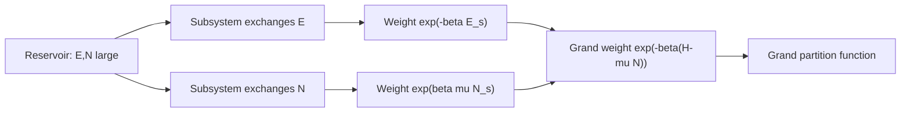

# Grand Canonical Ensemble and Particle Exchange

The grand canonical ensemble describes a system that exchanges both energy and particles with a reservoir. It is the natural language for gases, adsorption, chemical equilibrium, quantum occupation numbers, and field-theoretic many-body systems. Instead of fixing $N$ exactly, it fixes the mean particle number through the chemical potential $\mu$.

In Schwabl's development, the grand ensemble completes the hierarchy from isolated systems to open subsystems. It also prepares the notation for ideal Fermi and Bose gases, where each single-particle state can be treated as a small subsystem exchanging particles with the rest.

## Definitions

Let $N$ be the particle-number operator. The grand canonical density matrix is

$$
\rho={e^{-\beta(H-\mu N)}\over \mathcal Z},
\qquad
\mathcal Z=\mathrm{Tr}\,e^{-\beta(H-\mu N)}.
$$

The grand potential is

$$
\Phi_G=-k_BT\ln\mathcal Z.
$$

Many texts denote it by $\Omega$, but this wiki page uses $\Phi_G$ to avoid confusion with the microcanonical density of states. Thermodynamics gives

$$
\Phi_G=E-TS-\mu N=-pV
$$

for a homogeneous bulk system. The average particle number and energy are generated by

$$
\langle N\rangle
={1\over \beta}{\partial \ln\mathcal Z\over \partial \mu},
\qquad
\langle H-\mu N\rangle
=-\partial_\beta\ln\mathcal Z
$$

when $\mu$ is held fixed in the second derivative.

The fugacity is

$$
z=e^{\beta\mu}.
$$

For a classical ideal gas,

$$
\mathcal Z=\sum_{N=0}^{\infty} z^N Z_N
=\exp\left({zV\over \lambda_T^3}\right),
\qquad
\lambda_T={h\over \sqrt{2\pi m k_BT}}.
$$

## Key results

The grand ensemble is obtained by expanding the reservoir entropy in both energy and particle number. If the subsystem has energy $E_s$ and particle number $N_s$, the reservoir has $E_{\mathrm{tot}}-E_s$ and $N_{\mathrm{tot}}-N_s$. To first order,

$$
S_R(E_{\mathrm{tot}}-E_s,N_{\mathrm{tot}}-N_s)
\approx S_R
-{E_s\over T}
+{\mu N_s\over T}.
$$

The subsystem weight is therefore

$$
P(s)\propto e^{-\beta(E_s-\mu N_s)}.
$$

Number fluctuations are controlled by derivatives of $\ln\mathcal Z$:

$$
\langle(\Delta N)^2\rangle
=k_BT\left({\partial \langle N\rangle\over \partial \mu}\right)_{T,V}.
$$

For a classical ideal gas, $\langle N\rangle=zV/\lambda_T^3$, so the number distribution is Poisson:

$$
P(N)=e^{-\langle N\rangle}{\langle N\rangle^N\over N!},
\qquad
\langle(\Delta N)^2\rangle=\langle N\rangle.
$$

In second quantization, noninteracting quantum particles have

$$
H=\sum_\alpha \epsilon_\alpha n_\alpha,
\qquad
N=\sum_\alpha n_\alpha.
$$

The grand partition function factorizes over single-particle levels:

$$
\mathcal Z_{\mathrm{F}}=\prod_\alpha\left(1+ze^{-\beta\epsilon_\alpha}\right),
\qquad
\mathcal Z_{\mathrm{B}}=\prod_\alpha {1\over 1-ze^{-\beta\epsilon_\alpha}}.
$$

This factorization leads directly to the Fermi-Dirac and Bose-Einstein distributions.

The chemical potential has several complementary meanings. Thermodynamically it is the change in free energy when a particle is added:

$$
\mu=\left({\partial F\over \partial N}\right)_{T,V}.
$$

Statistically it is the Lagrange multiplier that fixes $\langle N\rangle$. Physically it controls diffusive equilibrium: particles flow, on average, from higher chemical potential to lower chemical potential until the chemical potentials match. In mixtures and reactions, equality or stoichiometric balance of chemical potentials replaces the simpler equality of temperature used for energy exchange.

Number fluctuations are not just noise; they encode compressibility. For a one-component system,

$$
\langle(\Delta N)^2\rangle
=k_BT\left({\partial N\over \partial \mu}\right)_{T,V}.
$$

Since the isothermal compressibility is related to density response, large density fluctuations occur near liquid-gas criticality. In a stable macroscopic phase away from criticality, $\Delta N\sim \sqrt{N}$ and relative fluctuations vanish. Near a critical point, the same formula warns that the grand ensemble becomes visually and physically fluctuation dominated.

The grand ensemble is also the cleanest language for occupation-number statistics. For one level, the variance is

$$
\langle(\Delta n)^2\rangle
=f(1-f)
$$

for fermions and

$$
\langle(\Delta n)^2\rangle
=f(1+f)
$$

for bosons. The signs are not cosmetic. Pauli exclusion suppresses fluctuations, while Bose enhancement increases them. Photon bunching and Fermi degeneracy pressure are two experimentally important consequences of these formulas.

Finally, equivalence with the canonical ensemble assumes ordinary short-range systems in the thermodynamic limit. If one studies small systems, phase coexistence, long-range forces, or constrained particle numbers, grand-canonical fluctuations may represent a different physical preparation rather than a harmless calculational convenience.

The grand potential is especially useful because it is extensive in volume at fixed $T$ and $\mu$. For a homogeneous phase,

$$
\Phi_G=-pV,
$$

so pressure can be computed directly from $\ln\mathcal Z$ without first solving for the Helmholtz free energy. This is why quantum ideal gases are often treated by computing $\Phi_G$, then deriving $N$, $S$, and $E$ by differentiation.

In phase coexistence problems, fixed $\mu$ is also natural. Two phases can exchange particles until their chemical potentials are equal. At coexistence the grand potentials per volume compete; the stable phase is the one with lower $\Phi_G$ under the imposed reservoir conditions. This viewpoint is the particle-exchange analogue of minimizing $F$ at fixed $N$.

Adsorption gives a concrete use case. A surface in contact with a gas does not have a fixed number of adsorbed particles; sites fill and empty according to the gas chemical potential. Simple lattice adsorption models are grand-canonical systems, and their coverage curves are occupation-number problems. When adsorbates interact, the same framework becomes a lattice gas and can show cooperative transitions.

The ensemble also clarifies chemical equilibrium. Reactions change particle numbers of several species while conserving atoms and charge. Equilibrium is obtained by minimizing the appropriate thermodynamic potential subject to those conservation laws, which leads to stoichiometric relations among chemical potentials.

This is why $\mu$ is best treated as an experimentally meaningful control variable, not just an algebraic device.

## Visual



| Ensemble | Fixed externally | Fluctuates | Potential |
|---|---:|---:|---|
| Microcanonical | $E,V,N$ | none of these | $S(E,V,N)$ |
| Canonical | $T,V,N$ | $E$ | $F(T,V,N)$ |
| Grand canonical | $T,V,\mu$ | $E,N$ | $\Phi_G(T,V,\mu)$ |

## Worked example 1: Classical ideal gas from the grand partition function

Problem: Use

$$
\mathcal Z=\exp\left({zV\over \lambda_T^3}\right)
$$

to derive $\langle N\rangle$ and $pV=\langle N\rangle k_BT$.

Method:

1. Compute the mean particle number:

$$
\langle N\rangle
=z{\partial \ln\mathcal Z\over \partial z}
=z{\partial\over \partial z}\left({zV\over \lambda_T^3}\right)
={zV\over \lambda_T^3}.
$$

2. The grand potential is

$$
\Phi_G=-k_BT\ln\mathcal Z
=-k_BT{zV\over \lambda_T^3}.
$$

3. For a homogeneous system, $\Phi_G=-pV$, so

$$
pV=k_BT{zV\over \lambda_T^3}.
$$

4. Substitute the result for $\langle N\rangle$:

$$
pV=\langle N\rangle k_BT.
$$

Checked answer: the ideal-gas law emerges with $\langle N\rangle$ because $N$ fluctuates in this ensemble.

## Worked example 2: Occupation of one fermionic level

Problem: A single fermionic state has energy $\epsilon$. Find its average occupation in the grand ensemble.

Method:

1. Fermion occupation is restricted to $n=0,1$.
2. The single-level grand partition function is

$$
\mathcal Z_\epsilon
=\sum_{n=0}^1 e^{-\beta(\epsilon-\mu)n}
=1+e^{-\beta(\epsilon-\mu)}.
$$

3. The average occupation is

$$
\langle n\rangle
={0\cdot 1+1\cdot e^{-\beta(\epsilon-\mu)}
\over
1+e^{-\beta(\epsilon-\mu)}}.
$$

4. Simplify:

$$
\langle n\rangle
={1\over e^{\beta(\epsilon-\mu)}+1}.
$$

Checked answer: this is the Fermi-Dirac distribution. The plus sign in the denominator is the signature of Pauli exclusion.

## Code

```python
import numpy as np

def classical_grand_stats(T, mu, V=1.0, m=1.0, h=1.0, kB=1.0):
    lam = h / np.sqrt(2 * np.pi * m * kB * T)
    z = np.exp(mu / (kB * T))
    mean_N = z * V / lam**3
    pressure = mean_N * kB * T / V
    return mean_N, pressure

def fermi_level(T, eps, mu, kB=1.0):
    return 1.0 / (np.exp((eps - mu) / (kB * T)) + 1.0)

print(classical_grand_stats(T=2.0, mu=-1.0))
for eps in [-1.0, 0.0, 1.0]:
    print(eps, fermi_level(T=0.25, eps=eps, mu=0.0))
```

## Common pitfalls

- Treating $\mu$ as an arbitrary fitting constant. It is fixed by the desired mean particle number or by chemical equilibrium with a reservoir.
- Forgetting that $N$ fluctuates. Equations using $N$ in the grand ensemble usually mean $\langle N\rangle$.
- Using the same symbol $\Omega$ for both density of states and grand potential without context.
- Allowing Bose fugacity to violate $ze^{-\beta\epsilon_0}\lt 1$ for the lowest level. This signals the onset of Bose condensation rather than a valid ordinary product.
- Missing the sign change between Fermi and Bose factorization over occupation numbers.

## Connections

- [Canonical ensemble and fluctuations](/physics/statistical-mechanics/canonical-ensemble-and-fluctuations)
- [Quantum statistics and ideal quantum gases](/physics/statistical-mechanics/quantum-statistics-and-ideal-quantum-gases)
- [Bose gases, photons, and phonons](/physics/statistical-mechanics/bose-gases-photons-and-phonons)
- [Identical particles in quantum mechanics](/physics/quantum-mechanics/identical-particles-symmetrization)
- [Thermodynamics](/physics/thermodynamics/)
