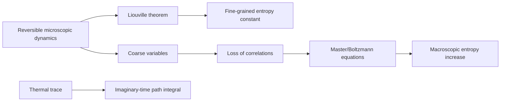

# Irreversibility, Master Equations, and Finite-Temperature Field Theory

Microscopic mechanics is reversible in many basic models, but macroscopic thermodynamics is irreversible. Schwabl's final chapter examines this tension through recurrence, coarse-graining, Brownian models, master equations, phase-space volume, Gibbs and Boltzmann entropy, and the approach to equilibrium.

This page also includes a short supplementary bridge to finite-temperature quantum field theory, as requested for SJ Wiki cross-linking. The bridge uses the same density-matrix object $Z=\mathrm{Tr}\,e^{-\beta H}$ and rewrites it as imaginary-time evolution. It is not the focus of Schwabl's main text, but it is the standard connection from statistical mechanics to thermal field theory.

## Definitions

Fine-grained Gibbs entropy for a classical density $\rho(q,p,t)$ is

$$
S_G=-k_B\int dq\,dp\,\rho\ln\rho.
$$

Under exact Liouville evolution, $S_G$ is constant. Boltzmann entropy instead assigns entropy to a macrostate $M$:

$$
S_B(M)=k_B\ln |M|,
$$

where $\vert M\vert $ is the phase-space volume compatible with the macrostate.

A continuous-time master equation for probabilities $P_i(t)$ is

$$
{dP_i\over dt}
=\sum_j\left[W_{ij}P_j-W_{ji}P_i\right],
$$

where $W_{ij}$ is the transition rate from $j$ to $i$.

Detailed balance with equilibrium distribution $P_i^{\mathrm{eq}}$ is

$$
W_{ij}P_j^{\mathrm{eq}}=W_{ji}P_i^{\mathrm{eq}}.
$$

For finite-temperature quantum systems,

$$
Z=\mathrm{Tr}\,e^{-\beta H}.
$$

In imaginary time $\tau=it$, thermal traces are represented by evolution over interval $\hbar\beta$.

## Key results

Liouville's theorem preserves phase-space volume and fine-grained entropy, so irreversible entropy increase cannot be obtained merely by rewriting exact microscopic equations. It enters through coarse-graining, special initial conditions, instability to perturbations, or kinetic assumptions such as molecular chaos.

Poincare recurrence says that a finite isolated Hamiltonian system with bounded phase-space volume returns arbitrarily close to its initial state after sufficiently long times. For macroscopic systems, recurrence times are astronomically large and do not undermine practical thermodynamics. The key point is logical rather than experimental: exact microscopic reversibility and macroscopic irreversibility describe different levels of description.

For a master equation with detailed balance, the relative entropy

$$
D(P||P^{\mathrm{eq}})
=\sum_i P_i\ln{P_i\over P_i^{\mathrm{eq}}}
$$

decreases monotonically under broad conditions. This is a discrete stochastic analogue of relaxation to equilibrium.

Boltzmann's H-theorem has the same structure: entropy increases after assuming a kinetic description that discards pre-collision correlations. The apparent paradoxes, such as Loschmidt's reversibility objection, are resolved by recognizing which step introduces time-asymmetric statistical information.

Supplementary bridge to finite-temperature field theory: the canonical partition function resembles a real-time quantum evolution operator with imaginary time:

$$
e^{-\beta H}=e^{-H(\hbar\beta)/\hbar}.
$$

Bosonic fields are periodic in imaginary time,

$$
\phi(\tau+\hbar\beta)=\phi(\tau),
$$

while fermionic fields are antiperiodic,

$$
\psi(\tau+\hbar\beta)=-\psi(\tau).
$$

The corresponding Matsubara frequencies are

$$
\omega_n^{\mathrm B}={2\pi n\over \hbar\beta},
\qquad
\omega_n^{\mathrm F}={(2n+1)\pi\over \hbar\beta}.
$$

This is the field-theory version of the same Bose and Fermi statistical distinction developed in the ideal quantum gas.

The distinction between Gibbs and Boltzmann entropy is often the cleanest way to discuss irreversibility. Gibbs entropy belongs to a probability density. If that density is evolved exactly, Liouville or unitary evolution preserves its fine-grained information. Boltzmann entropy belongs to a macrostate: a large region of phase space specified by coarse variables. A system prepared in a small, low-entropy macroregion will typically move into larger macroregions simply because they occupy overwhelmingly more phase-space volume. This is a probabilistic statement about typicality, not a strict theorem forbidding fluctuations.

Large fluctuations are possible but rare. If an entropy decrease of size $\Delta S$ requires entering a macroregion whose phase volume is smaller by $e^{-\Delta S/k_B}$, the waiting time is correspondingly enormous for macroscopic $\Delta S$. This explains why the second law is effectively certain in daily thermodynamics while remaining statistical at the microscopic level.

Master equations make the coarse-graining explicit by replacing microscopic trajectories with transition rates between states or macrostates. Detailed balance ensures the correct equilibrium distribution, but relaxation also depends on connectivity and spectral gaps of the rate matrix. Systems with bottlenecks, metastable states, or glassy landscapes can obey detailed balance and still equilibrate extremely slowly.

The imaginary-time field-theory bridge should be read as a change of representation, not as a new postulate. The same thermal density matrix that defines the canonical ensemble becomes a path integral on a compact Euclidean time interval. Boundary conditions encode quantum statistics, and Matsubara sums replace continuous frequency integrals. This is why finite-temperature QFT naturally reuses statistical-mechanical ideas: partition functions, correlation functions, response, and symmetry breaking all persist, but the degrees of freedom are fields rather than particles in fixed single-particle levels.

The arrow of time in statistical mechanics is therefore not a new microscopic force. It is a statement about preparation, typicality, coarse variables, and the overwhelming phase-space dominance of equilibrium macrostates. Low-entropy initial conditions are special; once prepared, their typical microscopic representatives evolve toward macrostates with larger volume. Time-reversed trajectories exist, but selecting them would require extraordinarily precise correlations.

This final viewpoint ties the section together. Ensembles describe what is typical under constraints, kinetic equations describe how selected coarse variables relax, and field-theory methods repackage the same thermal trace for systems with infinitely many modes.

Open systems sharpen the distinction further. Coupling to reservoirs can make the subsystem dynamics dissipative even when the combined system plus reservoirs evolves reversibly. Master equations, Langevin equations, and linear response theory are all reduced descriptions of this kind. Their success depends on identifying the right slow variables and the right reservoir assumptions.

The finite-temperature QFT bridge is included as a short orientation point: for detailed calculations one must add regularization, interactions, analytic continuation, and real-time response formalisms. The statistical core, however, is already present in $Z=\mathrm{Tr}\,e^{-\beta H}$.

## Visual



| Entropy concept | Formula | Time behavior |
|---|---:|---|
| Gibbs fine-grained | $-k_B\int\rho\ln\rho$ | constant under Liouville flow |
| Coarse-grained Gibbs | cells replace exact density | can increase after smoothing |
| Boltzmann | $k_B\ln \vert M\vert $ | increases for typical macrostates |
| Relative entropy | $\sum_i P_i\ln(P_i/P_i^{eq})$ | decreases in detailed-balance Markov relaxation |

## Worked example 1: Two-state master equation relaxation

Problem: A system jumps between states $0$ and $1$ with rates $W_{10}=a$ and $W_{01}=b$. Find the equilibrium probability of state $1$ and the relaxation rate.

Method:

1. The master equation for $P_1$ is

$$
{dP_1\over dt}=aP_0-bP_1.
$$

2. Since $P_0=1-P_1$,

$$
{dP_1\over dt}=a(1-P_1)-bP_1
=a-(a+b)P_1.
$$

3. At equilibrium, set the derivative to zero:

$$
0=a-(a+b)P_1^{\mathrm{eq}}.
$$

4. Therefore

$$
P_1^{\mathrm{eq}}={a\over a+b},
\qquad
P_0^{\mathrm{eq}}={b\over a+b}.
$$

5. Solve the linear equation:

$$
P_1(t)-P_1^{\mathrm{eq}}
=\left[P_1(0)-P_1^{\mathrm{eq}}\right]e^{-(a+b)t}.
$$

Checked answer: the relaxation time is $\tau=1/(a+b)$, and detailed balance is $aP_0^{eq}=bP_1^{eq}$.

## Worked example 2: Matsubara frequencies from boundary conditions

Problem: Derive bosonic and fermionic Matsubara frequencies from imaginary-time boundary conditions over interval $\hbar\beta$.

Method:

1. A Fourier mode has form

$$
e^{-i\omega_n\tau}.
$$

2. Bosonic periodicity requires

$$
e^{-i\omega_n(\tau+\hbar\beta)}
=e^{-i\omega_n\tau}.
$$

3. Cancel the common factor:

$$
e^{-i\omega_n\hbar\beta}=1.
$$

Thus

$$
\omega_n\hbar\beta=2\pi n,
\qquad
\omega_n^{\mathrm B}={2\pi n\over \hbar\beta}.
$$

4. Fermionic antiperiodicity requires

$$
e^{-i\omega_n\hbar\beta}=-1=e^{-i(2n+1)\pi}.
$$

5. Therefore

$$
\omega_n^{\mathrm F}={(2n+1)\pi\over \hbar\beta}.
$$

Checked answer: integer multiples appear for bosons, half-odd-integer multiples for fermions.

## Code

```python
import numpy as np

def two_state_prob(t, a, b, p1_initial):
    p_eq = a / (a + b)
    return p_eq + (p1_initial - p_eq) * np.exp(-(a + b) * t)

def matsubara(beta, hbar=1.0, nmax=3):
    n = np.arange(-nmax, nmax + 1)
    boson = 2 * np.pi * n / (hbar * beta)
    fermion = (2 * n + 1) * np.pi / (hbar * beta)
    return boson, fermion

times = np.linspace(0, 5, 6)
print([two_state_prob(t, a=2.0, b=1.0, p1_initial=0.0) for t in times])
print(matsubara(beta=2.0))
```

## Common pitfalls

- Claiming microscopic reversibility is false because macroscopic entropy increases. The point is the change of description and assumptions.
- Confusing fine-grained Gibbs entropy with coarse-grained or Boltzmann entropy.
- Forgetting that recurrence times can be finite in principle but physically irrelevant for macroscopic systems.
- Using a master equation without checking probability conservation and nonnegative transition rates.
- Treating the finite-temperature QFT bridge as a different ensemble; it is the same thermal trace written in imaginary-time language.

## Connections

- [Phase space, Liouville theorem, and ergodicity](/physics/statistical-mechanics/phase-space-liouville-ergodicity)
- [Boltzmann equation and transport](/physics/statistical-mechanics/boltzmann-equation-and-transport)
- [Brownian motion, Langevin, and Fokker-Planck dynamics](/physics/statistical-mechanics/brownian-motion-langevin-and-fokker-planck-dynamics)
- [Path integrals in quantum mechanics](/physics/quantum-mechanics/path-integral-formulation)
- [Path integral formulation in QFT](/physics/quantum-field-theory/path-integral-formulation)
