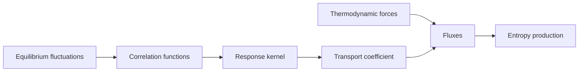

# Linear Response, Fluctuation-Dissipation, and Onsager Theory

Linear response theory asks how a system near equilibrium reacts to a weak external perturbation. The answer is not arbitrary: the same equilibrium fluctuations that occur without forcing determine the dissipative response when a small force is applied. Schwabl's nonequilibrium material uses this idea in stochastic dynamics, hydrodynamics, and relaxation functions.

Onsager's theory gives a complementary macroscopic statement. Thermodynamic forces drive fluxes, entropy production is nonnegative, and microscopic time-reversal symmetry implies reciprocal kinetic coefficients under suitable variable parities.

## Definitions

Suppose a perturbation couples to an observable $B$:

$$
H'(t)=-f(t)B.
$$

The linear response of observable $A$ is

$$
\delta\langle A(t)\rangle
=\int_{-\infty}^{t}\chi_{AB}(t-t')f(t')\,dt'.
$$

In quantum mechanics, the Kubo response function is

$$
\chi_{AB}(t)
={i\over \hbar}\theta(t)\langle [A(t),B(0)]\rangle_{\mathrm{eq}}.
$$

In classical mechanics, the commutator is replaced by a Poisson-bracket form or an equivalent correlation formula.

For nonequilibrium thermodynamics, write fluxes $J_i$ and thermodynamic forces $X_i$. Near equilibrium,

$$
J_i=\sum_j L_{ij}X_j.
$$

The entropy production rate is

$$
\dot S_{\mathrm{prod}}=\sum_i J_iX_i\ge 0.
$$

Onsager reciprocity states, for variables with the same time-reversal parity,

$$
L_{ij}=L_{ji}.
$$

With opposite parities or magnetic fields, signs and field reversal must be handled carefully.

## Key results

The fluctuation-dissipation theorem relates response to equilibrium correlation functions. A simple classical version for Brownian motion is

$$
D={1\over k_BT}\int_0^\infty \langle v(t)v(0)\rangle m\,dt
$$

or, more commonly,

$$
D=\int_0^\infty \langle v(t)v(0)\rangle\,dt.
$$

Mobility $\mu_{\mathrm{mob}}$ is the steady velocity per applied force. The Einstein relation is

$$
D=\mu_{\mathrm{mob}} k_BT.
$$

For electrical conduction in a simple relaxation picture, the conductivity can be written as a current-current correlation:

$$
\sigma={1\over 3Vk_BT}\int_0^\infty
\langle \mathbf J(t)\cdot \mathbf J(0)\rangle\,dt.
$$

The exact prefactors depend on the definition of total current, but the conceptual structure is universal: transport coefficients are time integrals of equilibrium current fluctuations.

Onsager reciprocity follows from microscopic reversibility and the regression hypothesis: spontaneous equilibrium fluctuations regress according to the same laws as small externally prepared deviations. This is a deep connection between probability, dynamics, and macroscopic irreversible laws.

Entropy production constrains the matrix $L$. For any vector $X$,

$$
\sum_{ij}X_iL_{ij}X_j\ge 0,
$$

so the symmetric part of $L$ must be positive semidefinite.

Linear response is local in amplitude, not necessarily local in time. Memory kernels appear when slow variables retain history:

$$
J_i(t)=\sum_j\int_{-\infty}^{t} L_{ij}(t-t')X_j(t')\,dt'.
$$

Ordinary transport laws such as Fourier's law are Markovian approximations valid when the memory kernel decays quickly compared with the time scale of macroscopic variation. Frequency-dependent conductivity, viscoelasticity, and dielectric response require the full time-dependent kernel.

The distinction between reactive and dissipative response is also important. The imaginary and real parts of a frequency-domain susceptibility are not independent; causality implies Kramers-Kronig relations. Dissipation is tied to the part of the response that is out of phase with the driving force, and fluctuation-dissipation relates that dissipative part to equilibrium noise spectra.

Onsager reciprocity has precise hypotheses. The variables must be chosen so their behavior under time reversal is known, the system must be near equilibrium, and microscopic dynamics must satisfy the appropriate reversibility condition. In a magnetic field $B$, the reciprocal relation becomes Onsager-Casimir symmetry:

$$
L_{ij}(B)=\epsilon_i\epsilon_j L_{ji}(-B),
$$

where $\epsilon_i=\pm 1$ is the time-reversal parity of variable $i$.

Nonequilibrium thermodynamics is deliberately coarse. It does not derive the coefficients $L_{ij}$ microscopically; it constrains their form and signs. Statistical mechanics, through Green-Kubo formulas or kinetic theory, supplies the coefficients from correlation functions. The two viewpoints meet in transport theory: macroscopic entropy production tells us what is allowed, while microscopic dynamics tells us how large the coefficients are.

A common example is thermoelectric coupling. A temperature gradient can drive an electric current, and an electric field can drive a heat current. Onsager reciprocity relates the corresponding cross-coefficients after the fluxes and forces are defined with consistent thermodynamic conventions. The symmetry is not obvious from macroscopic phenomenology alone; it encodes microscopic reversibility.

Linear response also explains why equilibrium simulations can compute nonequilibrium coefficients. Instead of imposing a large gradient and measuring a current, one may simulate an equilibrium system and integrate spontaneous current autocorrelations. This is conceptually powerful because it turns irreversible transport into an equilibrium fluctuation problem, but it is numerically demanding when correlations decay slowly or have long hydrodynamic tails.

The fluctuation-dissipation theorem has quantum versions with commutators, anticommutators, and frequency-dependent Bose factors. At high temperature, these reduce to classical relations. At low temperature, quantum zero-point fluctuations and operator ordering become important, especially for electromagnetic response and quantum condensed matter.

Susceptibilities also encode sum rules. Because response functions are built from commutators and equilibrium averages, their frequency integrals are constrained by equal-time commutation relations or conservation laws. In practice, these sum rules are checks on approximate calculations and numerical simulations.

The response framework is deliberately perturbative in the external field. If the perturbation changes the state substantially, heats the system, or drives it into a new phase, the linear kernel no longer describes the full behavior. Nonequilibrium steady states far from equilibrium require additional tools.

Even within linear response, choosing the correct observable matters. A conserved density responds differently from a nonconserved order parameter because conservation laws force slow hydrodynamic modes. This is why response functions often have strong frequency and wave-number dependence near critical points or in fluids.

Spatial dependence is handled by response functions $\chi(k,\omega)$ rather than only $\chi(\omega)$. The limits $k\to 0$ and $\omega\to 0$ need not commute, especially for transport. Static susceptibilities, conductivities, and diffusion constants can therefore probe different aspects of the same microscopic dynamics.

Careful order of limits is therefore part of the physics, not just mathematical bookkeeping.
The same warning appears in hydrodynamics, critical phenomena, and quantum transport calculations.

## Visual



| Phenomenon | Force | Flux | Coefficient |
|---|---:|---:|---|
| Diffusion | $-\nabla(\mu/T)$ | particle current | diffusion coefficient |
| Heat conduction | $\nabla(1/T)$ | heat current | thermal conductivity |
| Electrical conduction | electric field | charge current | conductivity |
| Viscosity | velocity gradient | momentum flux | viscosity |

## Worked example 1: Einstein relation from drift and diffusion

Problem: An overdamped particle has mobility $\mu_{\mathrm{mob}}=1/\gamma$. Show that $D=\mu_{\mathrm{mob}}k_BT$ is required for equilibrium in potential $U(x)$.

Method:

1. The Smoluchowski current is

$$
J={F\over \gamma}P-D{\partial P\over \partial x},
\qquad
F=-{dU\over dx}.
$$

2. At equilibrium with no net current, $J=0$:

$$
{F\over \gamma}P=D{dP\over dx}.
$$

3. Use the Boltzmann density

$$
P_{\mathrm{eq}}={1\over Z}e^{-\beta U}.
$$

4. Its derivative is

$$
{dP_{\mathrm{eq}}\over dx}
=-\beta {dU\over dx}P_{\mathrm{eq}}
=\beta F P_{\mathrm{eq}}.
$$

5. Substitute into the zero-current condition:

$$
{F\over \gamma}P_{\mathrm{eq}}
=D\beta F P_{\mathrm{eq}}.
$$

6. Cancel common factors:

$$
D={1\over \beta\gamma}={k_BT\over \gamma}
=\mu_{\mathrm{mob}}k_BT.
$$

Checked answer: the relation is forced by the requirement that the stationary distribution be thermal.

## Worked example 2: Entropy production for coupled fluxes

Problem: Let

$$
\begin{pmatrix}J_1\\J_2\end{pmatrix}
=
\begin{pmatrix}2&1\\1&3\end{pmatrix}
\begin{pmatrix}X_1\\X_2\end{pmatrix}.
$$

Show that entropy production is nonnegative.

Method:

1. The entropy production is

$$
\sigma=J_1X_1+J_2X_2=X^T L X.
$$

2. Substitute the matrix:

$$
\sigma=2X_1^2+2X_1X_2+3X_2^2.
$$

3. Complete the square:

$$
\sigma=2\left(X_1+{X_2\over 2}\right)^2
+{5\over 2}X_2^2.
$$

4. Both terms are nonnegative for all real $X_1,X_2$.

Checked answer: the symmetric Onsager matrix is positive definite, so it satisfies the second-law constraint.

## Code

```python
import numpy as np

def green_kubo_diffusion(times, vacf):
    return np.trapz(vacf, times)

gamma = 2.0
m = 1.0
kBT = 3.0
times = np.linspace(0, 20, 20001)
vacf = (kBT / m) * np.exp(-gamma * times / m)
D = green_kubo_diffusion(times, vacf)

L = np.array([[2.0, 1.0], [1.0, 3.0]])
eig = np.linalg.eigvalsh((L + L.T) / 2)

print("D from Green-Kubo", D)
print("Einstein D", kBT / gamma)
print("Onsager eigenvalues", eig)
```

## Common pitfalls

- Applying linear response far from equilibrium where fluxes need not be linear in forces.
- Forgetting causality: response kernels vanish for negative time.
- Ignoring time-reversal parity in Onsager reciprocity, especially with magnetic fields or angular velocities.
- Confusing mobility with chemical potential; both are often denoted by variants of $\mu$.
- Treating fluctuation-dissipation as optional noise tuning rather than a condition for thermal equilibrium.

## Connections

- [Brownian motion, Langevin, and Fokker-Planck dynamics](/physics/statistical-mechanics/brownian-motion-langevin-and-fokker-planck-dynamics)
- [Boltzmann equation and transport](/physics/statistical-mechanics/boltzmann-equation-and-transport)
- [Canonical ensemble and fluctuations](/physics/statistical-mechanics/canonical-ensemble-and-fluctuations)
- [Quantum dynamics pictures](/physics/quantum-mechanics/quantum-dynamics-pictures)
- [Collective and condensed-matter field theory](/physics/quantum-field-theory/collective-and-condensed-matter-field-theory)
