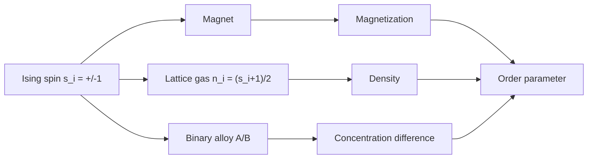

# Magnetism, Lattice Gases, and Binary Alloys

Magnetic systems turn statistical mechanics into a theory of collective order. Independent spins give paramagnetism, but exchange interactions can align spins and produce ferromagnetism. The same Ising variables also describe lattice gases and binary alloys, making magnetism a prototype for phase transitions beyond literal magnets.

Schwabl's magnetism chapter moves from single moments in a field to interacting spin models, molecular-field approximations, correlation functions, domains, and related systems. The unifying idea is an order parameter: magnetization for spins, density difference for a lattice gas, or concentration difference for a binary alloy.

## Definitions

For independent spin-$1/2$ moments in magnetic field $B$, the Hamiltonian is

$$
H=-\mu B\sum_i s_i,
\qquad s_i=\pm 1.
$$

The single-spin partition function is

$$
z_1=2\cosh(\beta\mu B).
$$

The magnetization is

$$
M=N\mu\tanh(\beta\mu B).
$$

The magnetic susceptibility at small field is

$$
\chi=\left({\partial M\over \partial B}\right)_{B=0}
={N\mu^2\over k_BT},
$$

the Curie law.

The Ising Hamiltonian is

$$
H=-J\sum_{\langle ij\rangle}s_i s_j-h\sum_i s_i,
\qquad s_i=\pm 1.
$$

Here $J\gt 0$ is ferromagnetic, $h$ is an external field, and $\langle ij\rangle$ denotes nearest-neighbor pairs.

## Key results

Mean-field theory replaces neighboring spins by their average $m=\langle s\rangle$:

$$
H_i^{\mathrm{mf}}=-(h+zJm)s_i,
$$

where $z$ is the coordination number. Self-consistency gives

$$
m=\tanh[\beta(h+zJm)].
$$

At $h=0$, a nonzero solution appears below

$$
k_BT_c=zJ.
$$

The Ising-lattice-gas mapping uses occupation variables $n_i=0,1$ and spins

$$
s_i=2n_i-1.
$$

A lattice gas with attraction between neighboring occupied sites maps to an Ising model; gas-liquid coexistence maps to spontaneous magnetization. In a binary alloy, $s_i=+1$ can label atom $A$ and $s_i=-1$ atom $B$. Depending on interaction signs, the alloy may order or phase-separate.

Correlation functions measure spatial order:

$$
G(r)=\langle s_0s_r\rangle-\langle s_0\rangle\langle s_r\rangle.
$$

Away from criticality, many systems have asymptotic behavior

$$
G(r)\sim {e^{-r/\xi}\over r^{d-2+\eta}},
$$

where $\xi$ is the correlation length. Near a continuous phase transition, $\xi$ becomes large and the system loses memory of microscopic lattice details.

The exchange interaction is quantum mechanical in origin even when the Ising model is written with classical variables. It reflects the combination of Coulomb interactions and the symmetry constraints on many-electron wavefunctions. Effective spin Hamiltonians keep only the low-energy magnetic degrees of freedom. This is why the same statistical model can describe very different microscopic materials once the effective coupling constants are known.

Mean-field theory predicts ferromagnetic order whenever $T\lt zJ/k_B$, but dimensionality and symmetry matter. A one-dimensional nearest-neighbor Ising chain has no finite-temperature transition, while the two-dimensional Ising model does. Continuous-symmetry magnets in low dimensions require still more care because long-wavelength spin waves can destroy long-range order. These facts motivate the scaling and renormalization-group treatment rather than invalidating the simpler molecular-field picture.

The lattice-gas mapping is especially important for liquid-gas transitions. With $n_i=(s_i+1)/2$, the Ising magnetization maps to density relative to half filling. The magnetic field maps to a chemical potential, and the exchange coupling maps to attraction between occupied neighboring sites. The liquid and gas phases are then the two magnetized phases of an Ising-like model. This explains why fluids and magnets share critical exponents in the same universality class when their order parameters have the same symmetry and dimensionality.

Binary alloys add another interpretation. If neighboring unlike atoms are energetically favored, the alloy tends toward ordered alternating structures. If like neighbors are favored, it tends toward phase separation. In both cases, entropy favors mixing at high temperature. The transition temperature marks the point where energetic ordering overcomes configurational entropy.

Domains in real ferromagnets reflect a competition absent from the simplest nearest-neighbor Ising model. Exchange favors uniform magnetization, while dipolar magnetic fields can lower energy by splitting the sample into domains. Domain walls cost exchange and anisotropy energy, so the observed pattern minimizes a balance between wall energy and magnetostatic energy.

Paramagnetism and ferromagnetism should also be separated experimentally. A paramagnet can have large magnetization in a strong field, but it has no remanent magnetization when the field is removed. A ferromagnet below $T_c$ has locally ordered domains even at zero field. The measured bulk magnetization may still vanish if domains cancel, so microscopic order is better detected through hysteresis, susceptibility, scattering, or domain imaging.

Correlation functions connect magnetic models to experiments. Neutron scattering, for example, measures spin correlations in momentum space. The Fourier transform of $G(r)$ is the structure factor, and near a critical point its peak sharpens as $\xi$ grows. This is the experimental counterpart of the Ornstein-Zernike form discussed in statistical mechanics.

The lattice-gas and alloy mappings also teach economy. Once an Ising calculation is done, it can be reinterpreted across several physical systems by translating variables. This is not merely mathematical cleverness; it is an early form of universality.

Anisotropy determines which spin model is appropriate. Ising spins have a preferred axis, XY spins rotate in a plane, and Heisenberg spins rotate in three dimensions. The symmetry of the order parameter affects low-temperature excitations and the possibility of long-range order. Thus the Hamiltonian's symmetry is not decorative; it helps define the universality class.

Magnetic susceptibility above $T_c$ often follows a Curie-Weiss form,

$$
\chi\propto {1\over T-T_c},
$$

in mean-field theory. Deviations near $T_c$ are a sensitive probe of critical fluctuations.

Real magnetic materials also include anisotropy, impurities, itinerant electrons, and magnetoelastic coupling. The simple spin models isolate universal mechanisms, while material-specific modeling decides which effective couplings and symmetries are appropriate. This division between universal model and microscopic parameter estimation is typical of statistical mechanics.

The same separation appears in alloys. A minimal lattice model may predict ordering or demixing, but quantitative phase diagrams require actual pair energies, elastic strain effects, and sometimes longer-range interactions. The statistical framework tells us how these ingredients compete through free energy.

That free-energy competition is the shared language behind magnetic ordering, condensation, and alloy phase diagrams.
It is also why simple lattice models remain useful long after their microscopic idealizations are understood.

## Visual



| System | Variable | Interaction meaning | Ordered state |
|---|---:|---|---|
| Ferromagnet | $s_i=\pm1$ | exchange favors alignment | nonzero magnetization |
| Lattice gas | $n_i=0,1$ | attraction favors occupied neighbors | dense-liquid vs dilute-gas |
| Binary alloy | $s_i=\pm1$ for $A/B$ | pair energies favor mixing or separation | concentration order |
| Paramagnet | independent $s_i$ | field only | no spontaneous order |

## Worked example 1: Curie law for independent spin halves

Problem: Derive the small-field susceptibility for $N$ independent spins with moment $\mu$.

Method:

1. The single-spin partition function is

$$
z_1=e^{\beta\mu B}+e^{-\beta\mu B}
=2\cosh(\beta\mu B).
$$

2. The total partition function is

$$
Z=z_1^N.
$$

3. Magnetization is

$$
M={1\over \beta}{\partial \ln Z\over \partial B}
={N\over \beta}{\partial\over \partial B}
\ln[2\cosh(\beta\mu B)].
$$

4. Differentiate:

$$
M=N\mu\tanh(\beta\mu B).
$$

5. For small $B$, $\tanh x\approx x$, so

$$
M\approx N\mu(\beta\mu B)
={N\mu^2\over k_BT}B.
$$

Checked answer:

$$
\chi={M\over B}={N\mu^2\over k_BT}.
$$

## Worked example 2: Mean-field critical temperature of the Ising model

Problem: Use the self-consistency equation

$$
m=\tanh(\beta zJm)
$$

at $h=0$ to find the critical temperature.

Method:

1. Near the transition, $m$ is small.
2. Expand the hyperbolic tangent:

$$
\tanh x=x-{x^3\over 3}+\cdots.
$$

3. Insert $x=\beta zJm$:

$$
m=\beta zJm-{1\over 3}(\beta zJm)^3+\cdots.
$$

4. A nonzero small solution becomes possible when the coefficient of the linear term equals $1$:

$$
\beta_c zJ=1.
$$

5. Therefore

$$
k_BT_c=zJ.
$$

Checked answer: this mean-field $T_c$ depends only on coordination number and exchange strength; fluctuation corrections reduce or eliminate ordering in low dimensions.

## Code

```python
import numpy as np

def mean_field_m(T, J=1.0, z=4, h=0.0, steps=500):
    beta = 1.0 / T
    m = 0.5
    for _ in range(steps):
        m = np.tanh(beta * (h + z * J * m))
    return m

for T in [1.0, 2.5, 4.0, 5.0]:
    print(T, mean_field_m(T, J=1.0, z=4))
```

## Common pitfalls

- Confusing paramagnetic alignment in a field with spontaneous ferromagnetic order at zero field.
- Treating mean-field theory as exact in one or two dimensions. Fluctuations can change or destroy its predictions.
- Forgetting the factor of coordination number $z$ in molecular-field equations.
- Mapping a lattice gas to Ising spins but losing the chemical-potential term, which maps to magnetic field.
- Interpreting nonzero finite-size magnetization without considering symmetry breaking and the thermodynamic limit.

## Connections

- [Phase transitions and order parameters](/physics/statistical-mechanics/phase-transitions-and-order-parameters)
- [Mean-field and Landau theory](/physics/statistical-mechanics/mean-field-and-landau-theory)
- [Scaling, universality, and renormalization group](/physics/statistical-mechanics/scaling-universality-and-renormalization-group)
- [Spin one-half systems](/physics/quantum-mechanics/spin-one-half-systems)
- [Symmetry breaking in QFT](/physics/quantum-field-theory/symmetry-breaking-goldstone-higgs)
