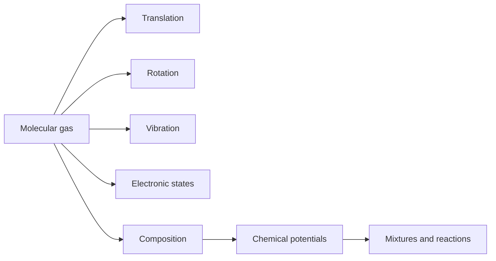

# Molecular Gases, Mixtures, and Solutions

Real molecules have internal structure. Translation gives the ideal-gas law, but rotations, vibrations, electronic states, and nuclear spin contribute to entropy and heat capacity. Mixtures and dilute solutions add another layer: the entropy of mixing and the chemical potentials of components determine partial pressures, osmotic pressure, vapor-pressure shifts, and reaction equilibria.

Schwabl treats these topics as applications of the same partition-function method. The molecular partition function factorizes when internal modes are weakly coupled, while mixture thermodynamics follows from the dependence of free energy on particle numbers $N_i$.

## Definitions

For a dilute ideal molecular gas with separable degrees of freedom,

$$
Z_N={1\over N!}\left(
{V\over \lambda_T^3}z_{\mathrm{int}}
\right)^N,
$$

where

$$
z_{\mathrm{int}}=z_{\mathrm{rot}}z_{\mathrm{vib}}z_{\mathrm{elec}}\cdots .
$$

For a linear rigid rotor with rotational constant energy scale $\epsilon_{\mathrm{rot}}=\hbar^2/(2I)$,

$$
z_{\mathrm{rot}}=\sum_{\ell=0}^{\infty}(2\ell+1)e^{-\beta \epsilon_{\mathrm{rot}}\ell(\ell+1)}.
$$

At high temperature, with symmetry number $\sigma$,

$$
z_{\mathrm{rot}}\approx {T\over \sigma\Theta_{\mathrm{rot}}},
\qquad
\Theta_{\mathrm{rot}}={\epsilon_{\mathrm{rot}}\over k_B}.
$$

A harmonic vibrational mode has

$$
z_{\mathrm{vib}}
={e^{-\beta\hbar\omega/2}\over 1-e^{-\beta\hbar\omega}}.
$$

For an ideal mixture of species $i$,

$$
F=\sum_i N_i k_BT
\left[
\ln\left({N_i\lambda_i^3\over V z_{\mathrm{int},i}}\right)-1
\right].
$$

The chemical potential is

$$
\mu_i=\left({\partial F\over \partial N_i}\right)_{T,V,N_{j\ne i}}.
$$

## Key results

The ideal mixture chemical potential is

$$
\mu_i=k_BT\ln\left({n_i\lambda_i^3\over z_{\mathrm{int},i}}\right),
\qquad n_i={N_i\over V}.
$$

The pressure is additive:

$$
p=\sum_i n_i k_BT,
\qquad
p_i=n_i k_BT.
$$

This is Dalton's law of partial pressures.

The entropy of mixing for ideal gases at fixed $T$ and $p$ is

$$
\Delta S_{\mathrm{mix}}
=-k_B\sum_i N_i\ln x_i,
$$

where $x_i=N_i/\sum_j N_j$ is the mole fraction. The expression is positive because $0\lt x_i\lt 1$.

For a dilute solute, osmotic pressure obeys the van't Hoff law

$$
\Pi V=N_s k_BT,
$$

where $N_s$ is the solute particle number. This is formally the ideal-gas law for solute particles, even though they move in a solvent.

Chemical equilibrium follows by minimizing free energy subject to stoichiometric constraints. For a reaction

$$
\sum_i \nu_i A_i=0,
$$

equilibrium requires

$$
\sum_i \nu_i\mu_i=0.
$$

In ideal mixtures this becomes a law of mass action: products of concentrations raised to stoichiometric powers equal a temperature-dependent equilibrium constant.

Internal partition functions are only separable approximations. Translation, rotation, vibration, and electronic states are coupled in real molecules, but factorization is accurate when energy scales are well separated and interactions during collisions do not strongly perturb internal spectra. The temperature dependence of heat capacity is a map of these energy scales. Translational modes are active at all ordinary temperatures; rotations activate when $k_BT$ exceeds rotational spacings; vibrations often require much higher temperatures; electronic excitations are usually frozen unless low-lying states exist.

The nuclear spin contribution is subtle because it affects state counting without necessarily changing energy in a simple way. Homonuclear molecules have exchange-symmetry restrictions coupling rotational quantum numbers to nuclear spin symmetry. This is the origin of ortho and para forms in molecules such as hydrogen. Schwabl includes such effects to emphasize that indistinguishability is not limited to ideal monatomic quantum gases; it also constrains molecular spectra.

Mixture entropy also resolves the Gibbs paradox. Mixing two different gases increases entropy because final macrostates contain new composition arrangements. Mixing two samples of the same gas does not produce a thermodynamic entropy of mixing once the $N!$ indistinguishability factor is included. The paradox appears only if identical classical particles are incorrectly labeled.

For dilute solutions, the solvent often acts as a reservoir setting temperature and pressure, while the solute contributes an ideal mixing term at leading order. Colligative properties depend primarily on the number of solute particles, not their microscopic identity. This is why osmotic pressure, boiling-point elevation, and freezing-point depression can be derived from chemical-potential equality using ideal dilute-solution approximations.

Chemical reactions combine all these ideas. The equilibrium constant contains translational factors, internal partition functions, and binding-energy differences. Changing temperature shifts equilibrium because it changes the relative statistical weights of reactant and product molecular states.

A practical way to organize molecular gases is by temperature windows. At very low temperature, translation may still be classical for a dilute gas, but rotations and vibrations can be frozen. At intermediate temperatures, rotations of many molecules are active and add heat capacity. At high temperatures, vibrations contribute and chemical dissociation or electronic excitation may become relevant. Each new active mode changes both energy and entropy, so calorimetric measurements can reveal microscopic spectra.

Mixtures also illustrate why chemical potential is more fundamental than concentration alone. Two species at equal concentration can have different chemical potentials if their masses, internal partition functions, or interactions differ. Equilibrium across a membrane or phase boundary is controlled by equality of the appropriate chemical potentials, not by equal concentration. In ideal dilute limits, this reduces to familiar concentration laws; outside those limits, activity coefficients are needed.

Schwabl's inclusion of solutions and reactions makes the point that statistical mechanics is not only a theory of gases and magnets. The same partition-function logic underlies physical chemistry: vapor pressure lowering, osmotic pressure, surface-tension shifts, and reaction equilibrium are all consequences of minimizing thermodynamic potentials with particle-number constraints.

Surface effects enter when particle numbers near interfaces are not negligible. Curvature changes pressure across an interface through surface tension, and it can shift vapor pressure for small droplets. These corrections are not captured by the bulk ideal-mixture formula, but they use the same chemical-potential equality condition once surface free energy is included.

In solution problems, one must distinguish solvent molecules, solute formula units, and dissociated ions. Colligative properties count independently moving solute particles, so electrolytes can produce larger effects than nonelectrolytes at the same formula concentration.

## Visual

| Contribution | Partition factor | Heat-capacity behavior |
|---|---:|---|
| Translation | $V/\lambda_T^3$ | $3k_B/2$ per molecule |
| Linear rotation | $\sum_\ell(2\ell+1)e^{-\beta\epsilon_\ell}$ | activates near $\Theta_{\mathrm{rot}}$ |
| Vibration | $e^{-x/2}/(1-e^{-x})$ | frozen for $T\ll \hbar\omega/k_B$ |
| Electronic states | $\sum_j g_j e^{-\beta E_j}$ | often frozen at ordinary $T$ |
| Mixing | combinatorial $N_i!$ factors | entropy from composition |



## Worked example 1: High-temperature rotational heat capacity

Problem: A heteronuclear diatomic molecule is in the high-temperature rotational regime. Show that rotations contribute $k_B$ per molecule to $C_V$.

Method:

1. At high temperature,

$$
z_{\mathrm{rot}}\approx {T\over \Theta_{\mathrm{rot}}}.
$$

2. The rotational internal energy is

$$
U_{\mathrm{rot}}
=-{\partial\over \partial\beta}\ln z_{\mathrm{rot}}.
$$

3. Since $T=1/(k_B\beta)$,

$$
\ln z_{\mathrm{rot}}
=\ln T-\ln\Theta_{\mathrm{rot}}
=-\ln\beta-\ln(k_B\Theta_{\mathrm{rot}}).
$$

4. Differentiate:

$$
U_{\mathrm{rot}}
=-{\partial\over \partial\beta}(-\ln\beta+\text{constant})
={1\over \beta}=k_BT.
$$

5. Therefore

$$
C_{V,\mathrm{rot}}={\partial U_{\mathrm{rot}}\over \partial T}=k_B.
$$

Checked answer: a linear rotor has two quadratic rotational degrees of freedom, each contributing $(1/2)k_BT$.

## Worked example 2: Entropy of mixing for a binary ideal gas

Problem: Mix $N_A=N_B=N$ ideal gas molecules at the same $T$ and $p$. Find $\Delta S_{\mathrm{mix}}$.

Method:

1. Mole fractions are

$$
x_A=x_B={1\over 2}.
$$

2. Use

$$
\Delta S_{\mathrm{mix}}
=-k_B\sum_i N_i\ln x_i.
$$

3. Substitute:

$$
\Delta S_{\mathrm{mix}}
=-k_B\left[N\ln{1\over 2}+N\ln{1\over 2}\right].
$$

4. Since $\ln(1/2)=-\ln 2$,

$$
\Delta S_{\mathrm{mix}}=2Nk_B\ln 2.
$$

Checked answer: the entropy is positive and extensive in the total number $2N$.

## Code

```python
import numpy as np

def z_rot_linear(T, theta_rot, lmax=200, sigma=1):
    ell = np.arange(lmax + 1)
    terms = (2 * ell + 1) * np.exp(-theta_rot * ell * (ell + 1) / T)
    return terms.sum() / sigma

def mixing_entropy(Ns, kB=1.0):
    Ns = np.asarray(Ns, dtype=float)
    xs = Ns / Ns.sum()
    return -kB * np.sum(Ns * np.log(xs))

for T in [1, 5, 20, 100]:
    print(T, z_rot_linear(T, theta_rot=2.0))
print("mixing entropy", mixing_entropy([1000, 1000]))
```

## Common pitfalls

- Assuming every internal degree of freedom contributes equipartition at every temperature. Quantum level spacing controls activation.
- Forgetting the symmetry number for homonuclear molecular rotations.
- Mixing distinguishable and indistinguishable counting in entropy of mixing.
- Using mole fractions where concentrations or partial pressures are required without checking the ensemble.
- Treating reaction equilibrium constants as temperature independent; they inherit internal partition functions and binding energies.

## Connections

- [Classical ideal gas and Maxwell distribution](/physics/statistical-mechanics/classical-ideal-gas-and-maxwell-distribution)
- [Real gases, virial expansion, and van der Waals theory](/physics/statistical-mechanics/real-gases-virial-expansion-and-van-der-waals-theory)
- [Thermodynamic potentials and phase equilibrium](/physics/statistical-mechanics/thermodynamic-potentials-and-phase-equilibrium)
- [Grand canonical ensemble and particle exchange](/physics/statistical-mechanics/grand-canonical-ensemble-and-particle-exchange)
- [Thermodynamics](/physics/thermodynamics/)
