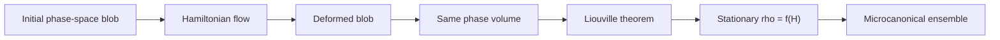

# Phase Space, Liouville Theorem, and Ergodicity

Classical statistical mechanics represents a microstate of $N$ particles by a point in $6N$-dimensional phase space. The statistical state is not a single point but a density $\rho(q,p,t)$ over many possible microscopic states compatible with the observed macrostate. The microscopic dynamics moves this density according to Hamilton's equations.

This page explains why Hamiltonian flow preserves phase-space volume, why stationary distributions must be functions of conserved quantities, and why the ergodic hypothesis is a bridge rather than a theorem for every physical system. It is the dynamical background for the microcanonical ensemble and for the later discussion of irreversibility.

## Definitions

For $N$ particles in three spatial dimensions, write

$$
q=(q_1,\ldots,q_{3N}),\qquad p=(p_1,\ldots,p_{3N}).
$$

The phase-space density $\rho(q,p,t)$ satisfies

$$
\rho(q,p,t)\ge 0,\qquad
\int dq\,dp\,\rho(q,p,t)=1.
$$

Hamilton's equations are

$$
\dot q_i={\partial H\over \partial p_i},
\qquad
\dot p_i=-{\partial H\over \partial q_i}.
$$

The Poisson bracket of two functions $A(q,p)$ and $B(q,p)$ is

$$
\{A,B\}
=\sum_i \left(
{\partial A\over \partial q_i}{\partial B\over \partial p_i}
-{\partial A\over \partial p_i}{\partial B\over \partial q_i}
\right).
$$

A distribution is stationary when $\partial_t\rho=0$. A constant of motion $I(q,p)$ satisfies $\dot I=\{I,H\}=0$. Ergodicity, in its physical use, means that a typical trajectory on the energy surface samples that surface in such a way that long-time averages equal microcanonical phase-space averages.

## Key results

The Liouville equation follows by applying probability conservation in phase space:

$$
{\partial \rho\over \partial t}
=-\{\rho,H\}
=-\sum_i\left(
\dot q_i{\partial \rho\over \partial q_i}
+\dot p_i{\partial \rho\over \partial p_i}
\right).
$$

Equivalently,

$$
{d\over dt}\rho(q(t),p(t),t)=0.
$$

The phase-space density is constant along a Hamiltonian trajectory. This does not mean the system is static; it means the ensemble flows like an incompressible fluid. The incompressibility is

$$
\sum_i\left(
{\partial \dot q_i\over \partial q_i}
+{\partial \dot p_i\over \partial p_i}
\right)
=
\sum_i\left(
{\partial^2 H\over \partial q_i\partial p_i}
-{\partial^2 H\over \partial p_i\partial q_i}
\right)=0.
$$

Therefore a phase-space volume element transported by Hamiltonian dynamics preserves its volume. This is Liouville's theorem.

Any density of the form $\rho=f(H)$ is stationary for an isolated time-independent Hamiltonian because

$$
\{\rho,H\}=f'(H)\{H,H\}=0.
$$

The microcanonical distribution chooses a narrow shell in energy,

$$
\rho_{\mathrm{mc}}(q,p)
={1\over \Omega(E)}
\delta(E-H(q,p)),
$$

or a thin energy window when a literal delta function is too singular. Schwabl emphasizes that this is the basic equilibrium hypothesis for isolated systems. The canonical and grand canonical ensembles are then derived by considering small subsystems of a larger isolated whole.

Ergodicity adds an interpretive layer. If time averages equal microcanonical averages, then the ensemble is not merely a calculational device; it predicts the result of long measurements on one system. However, exact ergodicity can fail in integrable systems, systems with conserved quantities beyond energy, and systems trapped in disconnected regions of phase space. Statistical mechanics remains powerful because weak perturbations, large dimensionality, and coarse macroscopic observables often make the microcanonical ensemble correct even when mathematical ergodicity is delicate.

It is also useful to separate three related but different ideas. Stationarity means the density does not change in time. Mixing means initially localized distributions are stretched and folded so that coarse-grained observations look uniform over the accessible region. Ergodicity means almost every trajectory has time averages equal to phase-space averages. A stationary distribution need not be mixing, and a system can be nonergodic while still giving accurate thermodynamics for a restricted class of observables. For example, a harmonic oscillator has closed ellipses in phase space and is not ergodic on the filled energy disk, yet its energy-shell description is still meaningful for the one conserved energy.

Liouville's theorem also explains why irreversibility cannot follow from exact fine-grained Hamiltonian flow alone. A compact blob in phase space may stretch into thin filaments, but its volume is preserved. Macroscopic entropy increase appears when we replace the filamented exact density by a coarse-grained description that cannot resolve microscopic folds. This point is not a technicality: it is the core reason that kinetic theory needs an assumption such as molecular chaos and why recurrence objections can be logically sharp even when recurrence times are physically irrelevant.

Finally, the classical theorem has a quantum parallel. The von Neumann equation preserves the eigenvalues of $\rho$ under unitary time evolution, just as Liouville flow preserves phase-space volume. Therefore $\mathrm{Tr}\,\rho^n$ and the fine-grained von Neumann entropy are constants for a closed quantum system. Equilibrium statistical mechanics enters when one restricts attention to macroscopic data, subsystems, or coarse observables rather than the full microscopic state.

This perspective also explains why the thermodynamic limit is taken before many idealizations. A small Hamiltonian system may visibly remember its initial condition, while a macroscopic one distributes that information among an enormous number of degrees of freedom. The information is not destroyed in the exact equations, but it becomes practically inaccessible to the few macroscopic observables that define a thermodynamic state.

## Visual



| Concept | Mathematical statement | Physical meaning |
|---|---:|---|
| Trajectory | $(q(t),p(t))$ | one microscopic history |
| Ensemble | $\rho(q,p,t)$ | many compatible microstates |
| Liouville equation | $\partial_t\rho=-\{\rho,H\}$ | density advected by Hamiltonian flow |
| Volume preservation | $d\Gamma(t)=d\Gamma(0)$ | no compression in phase space |
| Stationarity | $\{\rho,H\}=0$ | equilibrium candidate |
| Ergodicity | time average = shell average | single long run samples the shell |

## Worked example 1: Harmonic oscillator phase-space area

Problem: For a one-dimensional harmonic oscillator

$$
H={p^2\over 2m}+{1\over 2}m\omega^2 q^2,
$$

show that the phase-space orbit has area $2\pi E/\omega$ inside the energy ellipse.

Method:

1. The energy shell is

$$
{p^2\over 2mE}+{m\omega^2 q^2\over 2E}=1.
$$

2. Put it in ellipse form:

$$
{q^2\over a^2}+{p^2\over b^2}=1,
\qquad
a=\sqrt{2E\over m\omega^2},
\qquad
b=\sqrt{2mE}.
$$

3. The area inside an ellipse is $\pi ab$, so

$$
\Gamma(E)=\pi
\sqrt{2E\over m\omega^2}
\sqrt{2mE}
={2\pi E\over \omega}.
$$

4. The density of phase-space area per unit energy is

$$
{d\Gamma\over dE}={2\pi\over \omega}.
$$

Checked answer: the orbit itself is one-dimensional, but the number of states up to energy $E$ is proportional to the enclosed area. This is the classical precursor of the quantum spacing $\hbar\omega$.

## Worked example 2: Verifying stationarity of a canonical density

Problem: Show that

$$
\rho(q,p)={1\over Z}e^{-\beta H(q,p)}
$$

is stationary under Hamiltonian flow for a time-independent Hamiltonian.

Method:

1. Compute the Poisson bracket:

$$
\{\rho,H\}
=\sum_i\left(
{\partial \rho\over \partial q_i}{\partial H\over \partial p_i}
-{\partial \rho\over \partial p_i}{\partial H\over \partial q_i}
\right).
$$

2. Since $\rho=Z^{-1}e^{-\beta H}$,

$$
{\partial \rho\over \partial q_i}
=-\beta\rho{\partial H\over \partial q_i},
\qquad
{\partial \rho\over \partial p_i}
=-\beta\rho{\partial H\over \partial p_i}.
$$

3. Substitute:

$$
\begin{aligned}
\{\rho,H\}
&=\sum_i\left[
(-\beta\rho H_{q_i})H_{p_i}
-(-\beta\rho H_{p_i})H_{q_i}
\right]\\
&=0.
\end{aligned}
$$

4. Therefore

$$
\partial_t\rho=-\{\rho,H\}=0.
$$

Checked answer: any function of $H$ is stationary. The canonical form is selected not by stationarity alone, but by contact with a heat bath or by entropy maximization with fixed mean energy.

## Code

```python
import numpy as np

def oscillator_flow(q0, p0, m=1.0, w=2.0, t=0.0):
    q = q0 * np.cos(w * t) + p0 / (m * w) * np.sin(w * t)
    p = p0 * np.cos(w * t) - m * w * q0 * np.sin(w * t)
    return q, p

# Transport a small rectangle and estimate its area by the shoelace formula.
corners = np.array([[-0.05, -0.05], [0.05, -0.05], [0.05, 0.05], [-0.05, 0.05]])
for time in [0.0, 0.7, 1.4]:
    moved = np.array([oscillator_flow(q, p, t=time) for q, p in corners])
    x, y = moved[:, 0], moved[:, 1]
    area = 0.5 * abs(np.dot(x, np.roll(y, -1)) - np.dot(y, np.roll(x, -1)))
    print(time, area)
```

## Common pitfalls

- Reading Liouville's theorem as "entropy cannot increase." Fine-grained Gibbs entropy is constant under Hamiltonian flow, but coarse-graining and macroscopic relaxation are separate issues.
- Thinking stationarity alone selects the correct ensemble. Many functions of constants of motion are stationary.
- Treating ergodicity as automatically true for every many-body Hamiltonian. Extra conserved quantities and broken phase-space connectivity matter.
- Confusing phase-space volume with ordinary spatial volume. The preserved object is $dq\,dp$, not $dq$ alone.
- Forgetting that external time-dependent driving can invalidate the simple $f(H)$ stationarity argument.

## Connections

- [Probability and density matrices](/physics/statistical-mechanics/probability-and-density-matrices)
- [Microcanonical ensemble and entropy](/physics/statistical-mechanics/microcanonical-ensemble-and-entropy)
- [Irreversibility, master equations, and finite-temperature field theory](/physics/statistical-mechanics/irreversibility-master-equations-and-finite-temperature-field-theory)
- [Hamiltonian dynamics in quantum mechanics](/physics/quantum-mechanics/quantum-dynamics-pictures)
- [Thermodynamics](/physics/thermodynamics/)
