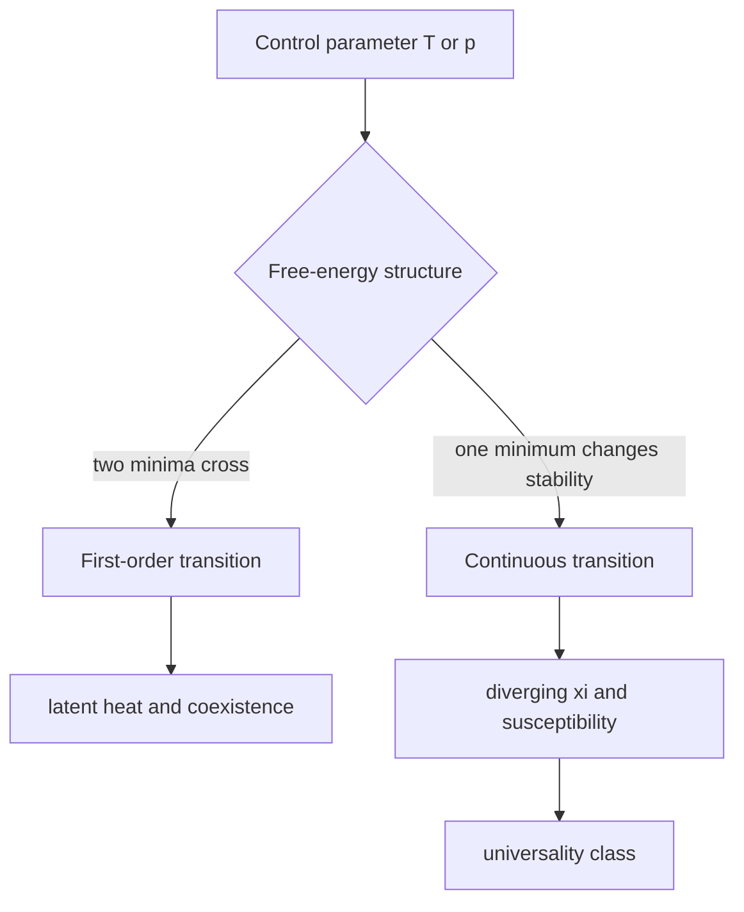

# Phase Transitions and Order Parameters

Phase transitions are nonanalytic changes in macroscopic behavior that emerge only in the thermodynamic limit. A finite partition function is an analytic sum, but as $N\to\infty$ its zeros or singular features can accumulate into sharp transitions. Schwabl treats phase transitions as a unifying subject across fluids, magnets, mixtures, superfluids, percolation, and other many-body systems.

The practical language is order parameters, symmetry, and response. A phase is characterized not just by an equation of state but by which symmetries are realized and which are broken. Critical points then reveal universal behavior that does not depend strongly on microscopic details.

## Definitions

An order parameter is a macroscopic quantity that distinguishes phases. Examples include:

$$
m={1\over N}\sum_i \langle s_i\rangle
$$

for an Ising ferromagnet,

$$
\rho_l-\rho_g
$$

for liquid-gas coexistence, and a complex condensate amplitude for superfluid or Bose-condensed phases.

A first-order transition has discontinuities in first derivatives of the thermodynamic potential, such as entropy or volume:

$$
L=T\Delta S\ne 0.
$$

A continuous transition has continuous first derivatives but singular higher derivatives or response functions. The older Ehrenfest classification labels transitions by the lowest derivative of the free energy that is discontinuous, but modern usage focuses more on first-order versus continuous and on scaling near criticality.

Critical exponents describe singular behavior near a continuous transition. With reduced temperature

$$
t={T-T_c\over T_c},
$$

typical definitions are

$$
C\sim |t|^{-\alpha},
\qquad
m\sim (-t)^\beta\quad (t<0),
$$

$$
\chi\sim |t|^{-\gamma},
\qquad
\xi\sim |t|^{-\nu}.
$$

## Key results

The thermodynamic limit is essential. For finite $N$,

$$
Z_N=\sum_s e^{-\beta E_s}
$$

is analytic for positive temperature. Singularities arise only after taking $N\to\infty$, where competing phases can have free energies that cross or a correlation length can diverge.

Broken symmetry means the equilibrium state has less symmetry than the Hamiltonian. The Ising Hamiltonian at $h=0$ is invariant under $s_i\to -s_i$, but below $T_c$ a ferromagnet chooses one of two magnetized states. In a finite system without a symmetry-breaking field, the exact average magnetization may be zero; the ordered phase is exposed by taking the thermodynamic limit before sending the field to zero:

$$
m=\lim_{h\to 0^+}\lim_{N\to\infty}{1\over N}\sum_i \langle s_i\rangle.
$$

First-order transitions have phase coexistence and latent heat. Continuous transitions have no latent heat but show diverging susceptibility and correlation length. The divergence of $\xi$ explains universality: when $\xi$ is much larger than the lattice spacing, microscopic details are coarse-grained away.

The Ising model gives the canonical argument. At high temperature, entropy favors disordered spin configurations. At low temperature, energy favors aligned spins when $J\gt 0$. A transition occurs when the balance changes in dimensions where domain-wall entropy cannot destroy long-range order.

First-order and continuous transitions also differ in metastability. In a first-order transition, one phase can persist beyond the coexistence line as a local minimum of the free energy. Superheated liquid and supercooled vapor are familiar examples. Nucleation is required to form a droplet of the stable phase large enough that bulk free-energy gain beats surface free-energy cost. Continuous transitions, by contrast, are characterized by the loss of stability of a phase and by critical slowing down rather than by latent heat and nucleation barriers.

Order parameters need not be directly visible in the microscopic Hamiltonian. In a liquid-gas transition, the density difference is an order parameter even though there is no exact $\mathbb Z_2$ symmetry away from the critical isochore. Near the critical point, however, the long-distance theory has an emergent Ising-like scalar order parameter. This is another example of universality: the symmetry and dimensionality of the coarse-grained order parameter matter more than molecular details.

Response functions reveal the transition experimentally. Magnetic susceptibility measures fluctuations of magnetization:

$$
\chi={1\over k_BT}\langle(\Delta M)^2\rangle
$$

in the appropriate ensemble. Compressibility similarly measures density fluctuations, and heat capacity measures energy fluctuations. Diverging response is therefore a direct statement that fluctuations occur on all length scales.

Finite-size rounding is unavoidable in simulations and experiments on small samples. Instead of a true divergence, one observes a peak whose height and location depend on system size. Finite-size scaling uses this dependence to estimate thermodynamic critical exponents. This is why Monte Carlo studies of Ising and percolation models usually simulate several lattice sizes rather than a single large one.

The language of symmetry also distinguishes explicit and spontaneous breaking. A nonzero magnetic field explicitly breaks Ising spin-flip symmetry, so the magnetization changes smoothly as temperature crosses the zero-field critical temperature. At exactly zero field, the Hamiltonian has the symmetry and the system can break it spontaneously below $T_c$. This is why phase diagrams often show a critical line or point only on a symmetry-preserving subspace.

Not every transition is well described by a local scalar order parameter. Topological transitions, glass transitions, and some quantum phase transitions require additional concepts. Schwabl's core examples are conventional thermal transitions, but the careful reader should treat the order-parameter framework as a powerful starting point rather than a universal final vocabulary.

The thermodynamic path matters. Crossing a first-order coexistence line at fixed pressure may show latent heat, while moving around the critical point can continuously transform gas into liquid without crossing any singularity. This is why phase diagrams, not isolated equations of state, are the natural representation of phase behavior.

For continuous transitions, the correlation length is the organizing scale. When $\xi$ is large, microscopic lengths such as lattice spacing or molecular diameter become irrelevant to leading singular behavior. This is the physical content behind the later RG treatment.

This is also why the same page links naturally to both thermodynamics and field theory: singular free energies are macroscopic, but their long-distance descriptions are often field theories of order-parameter fluctuations.

## Visual



| Transition type | Free-energy signal | Physical signal | Example |
|---|---:|---|---|
| First-order | crossing of competing minima | latent heat, hysteresis | liquid-gas below critical point |
| Continuous | minimum changes continuously | divergent $\chi$, $\xi$ | Ising ferromagnet at $h=0$ |
| Critical point | end of coexistence line | scale invariance | liquid-gas critical point |
| Crossover | no singularity | smooth change | finite systems, nonzero field |

## Worked example 1: Order of a transition from free energy

Problem: A model has equilibrium free energy

$$
F(T)=
\begin{cases}
F_0-aT, & T<T_0,\\
F_0-bT, & T>T_0,
\end{cases}
$$

with $a\ne b$. Classify the transition at $T_0$.

Method:

1. The free energy itself is continuous at $T_0$ because both branches give $F_0$ if written relative to the crossing point.
2. Entropy is

$$
S=-{\partial F\over \partial T}.
$$

3. Below $T_0$,

$$
S_-=a.
$$

4. Above $T_0$,

$$
S_+=b.
$$

5. Since $a\ne b$, entropy jumps:

$$
\Delta S=b-a.
$$

6. The latent heat is

$$
L=T_0\Delta S.
$$

Checked answer: this is a first-order transition because a first derivative of free energy is discontinuous.

## Worked example 2: Symmetry breaking limit in an Ising magnet

Problem: Explain why the order parameter is defined as

$$
m=\lim_{h\to 0^+}\lim_{N\to\infty}\langle M\rangle/N
$$

rather than simply $\langle M\rangle/N$ at $h=0$ for a finite system.

Method:

1. At $h=0$, the finite Ising Hamiltonian is invariant under all spins flipping sign.
2. For every configuration with magnetization $M$, there is a configuration with magnetization $-M$ and the same energy.
3. Their Boltzmann weights are equal, so the finite-system average cancels:

$$
\langle M\rangle=0.
$$

4. Add a small positive field $h\gt 0$. The $+M$ state is favored by energy $-hM$.
5. Take $N\to\infty$ first. The free-energy difference between the two magnetized phases is extensive, so the positive phase is selected.
6. Then send $h\to 0^+$. The selected phase remains magnetized below $T_c$.

Checked answer: the order of limits distinguishes true spontaneous symmetry breaking from finite-size symmetry averaging.

## Code

```python
import numpy as np

def landau_minima(a, b=1.0, h=0.0):
    m = np.linspace(-2.0, 2.0, 20001)
    f = 0.5 * a * m**2 + 0.25 * b * m**4 - h * m
    idx = np.argmin(f)
    return m[idx], f[idx]

for a in [1.0, 0.2, -0.2, -1.0]:
    print(a, landau_minima(a, b=1.0, h=1e-4))
```

## Common pitfalls

- Looking for true nonanalytic phase transitions in small finite systems.
- Using Ehrenfest classification as if it were the modern complete taxonomy; fluctuations and scaling are more informative for continuous transitions.
- Forgetting the order of limits in spontaneous symmetry breaking.
- Treating every sharp-looking numerical crossover as a thermodynamic transition.
- Assuming the order parameter must be a scalar. It can be vector, tensor, complex, or topological depending on the phase.

## Connections

- [Thermodynamic potentials and phase equilibrium](/physics/statistical-mechanics/thermodynamic-potentials-and-phase-equilibrium)
- [Mean-field and Landau theory](/physics/statistical-mechanics/mean-field-and-landau-theory)
- [Scaling, universality, and renormalization group](/physics/statistical-mechanics/scaling-universality-and-renormalization-group)
- [Magnetism, lattice gases, and binary alloys](/physics/statistical-mechanics/magnetism-lattice-gases-and-binary-alloys)
- [Symmetry breaking in QFT](/physics/quantum-field-theory/symmetry-breaking-goldstone-higgs)
