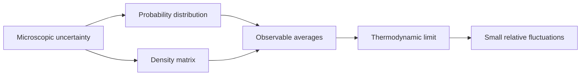

# Probability and Density Matrices

Statistical mechanics begins by replacing an impossible microscopic description with a precise probabilistic one. A gas with $10^{23}$ particles has a well-defined Hamiltonian, but the detailed microstate is neither measurable nor useful for thermodynamic questions. What matters is the probability distribution over microstates and the way macroscopic observables become sharply predictable when many weakly correlated degrees of freedom are combined.

Schwabl starts here because the later ensembles are not guesses about ignorance. They are distributions or density matrices constrained by macroscopic data and by the microscopic equations of motion. The same language also ties classical phase-space densities to quantum statistical operators, so this page is the common vocabulary for the rest of the section.

## Definitions

A random variable $X$ has probability density $w(x)$ when $w(x)\,dx$ is the probability that $X$ lies in $[x,x+dx]$. Normalization and expectation are

$$
\int_{-\infty}^{\infty} w(x)\,dx = 1,
\qquad
\langle F(X)\rangle = \int_{-\infty}^{\infty} F(x) w(x)\,dx .
$$

The moments and variance are

$$
\mu_n=\langle X^n\rangle,\qquad
\sigma^2=\langle (X-\langle X\rangle)^2\rangle
=\langle X^2\rangle-\langle X\rangle^2 .
$$

The characteristic function is the Fourier transform of the density,

$$
\phi(k)=\langle e^{-ikX}\rangle=\int e^{-ikx}w(x)\,dx ,
\qquad
w(x)=\int {dk\over 2\pi}e^{ikx}\phi(k).
$$

For many variables $X_i$, the covariance matrix is

$$
K_{ij}=\langle (X_i-\langle X_i\rangle)(X_j-\langle X_j\rangle)\rangle .
$$

In quantum mechanics, a pure state $\vert \psi\rangle$ defines the density operator

$$
\rho=|\psi\rangle\langle\psi|,\qquad
\langle A\rangle=\mathrm{Tr}\,\rho A .
$$

A mixed ensemble with states $\vert \psi_i\rangle$ and probabilities $p_i$ has

$$
\rho=\sum_i p_i |\psi_i\rangle\langle\psi_i|,
\qquad
\sum_i p_i=1,
\qquad
\mathrm{Tr}\,\rho=1.
$$

Pure states obey $\rho^2=\rho$ and $\mathrm{Tr}\,\rho^2=1$. A genuine mixed state has $\mathrm{Tr}\,\rho^2\lt 1$. This distinction becomes central when we use $Z=\mathrm{Tr}\,e^{-\beta H}$ rather than a single wavefunction to describe equilibrium.

## Key results

The first structural result is the central limit theorem in its statistical-mechanical form. Let $X_1,\ldots,X_N$ be independent identically distributed random variables with mean $\mu$ and variance $\sigma^2$, and let

$$
Y=\sum_{i=1}^N X_i .
$$

Then for large $N$, the distribution of $Y$ approaches a Gaussian with

$$
\langle Y\rangle=N\mu,\qquad
\mathrm{Var}(Y)=N\sigma^2,\qquad
{\sqrt{\mathrm{Var}(Y)}\over \langle Y\rangle}
= {\sigma\over \mu\sqrt{N}} .
$$

This is why thermodynamic quantities are reproducible. Energy, magnetization, and particle number have fluctuations of order $\sqrt{N}$ while their means are usually of order $N$, so relative fluctuations vanish in the thermodynamic limit.

The cumulant generating form of the characteristic function makes this transparent:

$$
\phi(k)=\exp\left[\sum_{n=1}^{\infty}{(-ik)^n\over n!} C_n\right],
$$

where $C_1=\mu$, $C_2=\sigma^2$, and higher cumulants describe non-Gaussian corrections. For $Y$, the characteristic function is $\phi_Y(k)=\phi(k)^N$. After centering and scaling by $\sqrt{N}$, the second cumulant survives and higher cumulants are suppressed by powers of $N^{-1/2}$.

For density matrices, the dynamical counterpart is the von Neumann equation,

$$
{\partial \rho\over \partial t}=-{i\over \hbar}[H,\rho].
$$

It is the quantum analogue of Liouville flow. A stationary equilibrium density matrix must commute with the Hamiltonian, $[H,\rho]=0$, which is why equilibrium ensembles can be written as functions of conserved operators such as $H$ and $N$.

Another key result is entropy as a functional of a distribution or density matrix:

$$
S=-k_B\sum_i p_i\ln p_i
\quad\text{or}\quad
S=-k_B\mathrm{Tr}\,\rho\ln\rho .
$$

Schwabl later derives the usual ensembles by maximizing this entropy subject to macroscopic constraints, or equivalently by considering weakly coupled subsystems of a microcanonical total system.

Two refinements are worth keeping in mind throughout the subject. First, independence is an idealization; many statistical-mechanical variables are weakly correlated rather than strictly independent. The central-limit conclusion remains useful when correlations decay fast enough that the system can be divided into many almost independent correlation volumes. If the correlation length $\xi$ is finite in $d$ dimensions, a macroscopic sample of volume $V$ contains roughly $V/\xi^d$ independent blocks, so relative fluctuations are suppressed by the square root of that number. This estimate fails near a critical point, where $\xi$ grows and fluctuations become macroscopic.

Second, entropy maximization is not a substitute for dynamics. It selects the least biased stationary distribution compatible with known constraints, but the list of constraints must come from conserved quantities and physical preparation. For an ordinary isolated gas, energy, volume, and particle number are enough. For an integrable or nearly integrable system, there may be many additional conserved quantities, and a simple microcanonical or canonical ensemble may not describe all relaxation phenomena. Schwabl's later discussion of irreversibility returns to this distinction between formal probability assignments and actual approach to equilibrium.

In quantum notation, diagonalizing $\rho$ shows why the von Neumann entropy has the same form as the classical expression. If

$$
\rho=\sum_i p_i |i\rangle\langle i|,
$$

then

$$
S=-k_B\sum_i p_i\ln p_i.
$$

The basis-independent trace formula matters because the same mixed state can be represented by different convex decompositions into nonorthogonal pure states. The eigenvalues of $\rho$, not a particular story about preparation, determine entropy and equilibrium averages.

## Visual

| Object | Classical probability | Quantum statistics | Typical use |
|---|---:|---:|---|
| State description | $w(x)$ or $\rho(q,p)$ | density operator $\rho$ | encode incomplete microscopic information |
| Normalization | $\int w(x)\,dx=1$ | $\mathrm{Tr}\,\rho=1$ | total probability |
| Observable average | $\int A(x)w(x)\,dx$ | $\mathrm{Tr}\,\rho A$ | macroscopic prediction |
| Pure state test | delta-like idealization | $\rho^2=\rho$ | one microscopic state |
| Mixed state test | broad distribution | $\mathrm{Tr}\,\rho^2\lt 1$ | statistical ensemble |
| Equilibrium condition | stationary under flow | $[H,\rho]=0$ | time-independent ensemble |



## Worked example 1: Central-limit scaling of energy fluctuations

Problem: A model solid has $N=10^{20}$ independent modes. Each mode has mean energy $\mu=4.0\times 10^{-21}\,\mathrm{J}$ and standard deviation $\sigma=3.0\times 10^{-21}\,\mathrm{J}$. Estimate the mean total energy, the standard deviation, and the relative fluctuation.

Method:

1. The total energy is $E=\sum_i X_i$.
2. The mean is additive:

$$
\langle E\rangle=N\mu
=10^{20}(4.0\times 10^{-21}\,\mathrm{J})
=0.40\,\mathrm{J}.
$$

3. The variance is additive for independent modes:

$$
\mathrm{Var}(E)=N\sigma^2.
$$

Thus

$$
\Delta E=\sqrt{N}\sigma
=10^{10}(3.0\times 10^{-21}\,\mathrm{J})
=3.0\times 10^{-11}\,\mathrm{J}.
$$

4. The relative fluctuation is

$$
{\Delta E\over \langle E\rangle}
={3.0\times 10^{-11}\over 0.40}
=7.5\times 10^{-11}.
$$

Checked answer: even though the microscopic mode energy is random, the macroscopic energy is effectively sharp. The suppression factor is $1/\sqrt{N}$.

## Worked example 2: Density matrix for a spin mixture

Problem: A spin-$1/2$ ensemble contains $70\%$ $\vert \uparrow_z\rangle$ and $30\%$ $\vert \downarrow_z\rangle$. Compute $\rho$, $\langle S_z\rangle$, and $\mathrm{Tr}\,\rho^2$.

Method:

1. In the basis $\{\vert \uparrow_z\rangle,\vert \downarrow_z\rangle\}$,

$$
\rho=0.7|\uparrow\rangle\langle\uparrow|
+0.3|\downarrow\rangle\langle\downarrow|
=
\begin{pmatrix}
0.7 & 0\\
0 & 0.3
\end{pmatrix}.
$$

2. The operator $S_z$ is

$$
S_z={\hbar\over 2}
\begin{pmatrix}
1 & 0\\
0 & -1
\end{pmatrix}.
$$

3. The expectation value is

$$
\langle S_z\rangle=\mathrm{Tr}\,\rho S_z
={\hbar\over 2}(0.7-0.3)
=0.2\hbar .
$$

4. The purity is

$$
\mathrm{Tr}\,\rho^2
=0.7^2+0.3^2
=0.58.
$$

Checked answer: $\mathrm{Tr}\,\rho^2\lt 1$, so this is mixed. It is not the pure spinor $\sqrt{0.7}\vert \uparrow\rangle+\sqrt{0.3}\vert \downarrow\rangle$, which would also contain off-diagonal coherence.

## Code

```python
import numpy as np

rng = np.random.default_rng(7)
N = 200_000
trials = 4_000

# Exponential variables are visibly non-Gaussian, but their sums become Gaussian.
samples = rng.exponential(scale=1.0, size=(trials, N // 1000))
sums = samples.sum(axis=1)

mean = sums.mean()
std = sums.std(ddof=1)
relative = std / mean

rho = np.diag([0.7, 0.3])
sz = 0.5 * np.array([[1.0, 0.0], [0.0, -1.0]])

print("sum mean", mean)
print("sum std", std)
print("relative fluctuation", relative)
print("<Sz>/hbar", np.trace(rho @ sz))
print("purity", np.trace(rho @ rho))
```

## Common pitfalls

- Confusing a classical probability mixture with a coherent quantum superposition. A mixture has probabilities; a superposition has amplitudes and phase-sensitive off-diagonal density-matrix elements.
- Forgetting that fluctuations add as variances, not as standard deviations, when variables are independent.
- Treating the central limit theorem as requiring Gaussian microscopic variables. It requires finite variance and weak enough dependence, not Gaussian inputs.
- Using $\rho^2=\rho$ for every density matrix. That identity is special to pure states.
- Dropping normalization factors in probability densities; without normalization, averages and entropies are meaningless.

## Connections

- [Phase space, Liouville theorem, and ergodicity](/physics/statistical-mechanics/phase-space-liouville-ergodicity)
- [Canonical ensemble and fluctuations](/physics/statistical-mechanics/canonical-ensemble-and-fluctuations)
- [Density operators in quantum mechanics](/physics/quantum-mechanics/density-operator-entanglement-decoherence)
- [Characteristic functions and moments](/math/probability-and-random-variables/moment-and-characteristic-functions)
- [Central limit theorem](/math/probability-and-random-variables/weak-law-concentration-central-limit-theorem)
