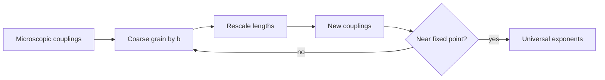

# Scaling, Universality, and Renormalization Group

Near a continuous phase transition, the correlation length becomes much larger than microscopic scales. This is why very different systems can share the same critical exponents: they flow toward the same long-distance description. Schwabl treats this through scaling hypotheses, real-space renormalization ideas, Ginzburg-Landau functionals, percolation, and Ising-model examples.

The renormalization group is a controlled way to ask what changes when short-distance degrees of freedom are averaged out. Parameters that grow under coarse-graining are relevant, parameters that shrink are irrelevant, and fixed points classify universal critical behavior.

## Definitions

The reduced temperature is

$$
t={T-T_c\over T_c}.
$$

The correlation length diverges as

$$
\xi\sim |t|^{-\nu}.
$$

The connected correlation function has scaling form

$$
G(r)=\langle m(0)m(r)\rangle-\langle m\rangle^2
\sim {1\over r^{d-2+\eta}}\,g(r/\xi).
$$

The singular part of the free-energy density is assumed to obey homogeneous scaling:

$$
f_s(t,h)=b^{-d}f_s(b^{y_t}t,b^{y_h}h),
$$

where $b\gt 1$ is a length rescaling factor and $y_t,y_h$ are scaling dimensions.

A renormalization-group transformation maps couplings $K$ to new couplings $K'=R_b(K)$ after coarse-graining by factor $b$. A fixed point satisfies

$$
K^\star=R_b(K^\star).
$$

## Key results

Scaling relations connect critical exponents. Common examples include

$$
\alpha+2\beta+\gamma=2,
$$

$$
\gamma=\beta(\delta-1),
$$

$$
2-\alpha=d\nu,
$$

and

$$
\gamma=(2-\eta)\nu.
$$

The last two include hyperscaling assumptions and can fail above the upper critical dimension or when dangerous irrelevant variables matter.

For the one-dimensional Ising model with nearest-neighbor coupling, the transfer matrix gives no finite-temperature phase transition. The correlation length is finite for every $T\gt 0$ and diverges only as $T\to 0$. This result is a warning against overusing mean-field theory.

The two-dimensional Ising model is exactly soluble at zero field. Onsager's solution shows a finite-temperature transition with non-mean-field exponents such as

$$
\beta={1\over 8},\qquad
\gamma={7\over 4},\qquad
\nu=1,\qquad
\alpha=0
$$

where $\alpha=0$ corresponds to a logarithmic heat-capacity singularity.

Monte Carlo methods sample configurations with Boltzmann weight. The Metropolis rule proposes a change with energy difference $\Delta E$ and accepts it with probability

$$
P_{\mathrm{acc}}=\min(1,e^{-\beta\Delta E}).
$$

This satisfies detailed balance and is the standard numerical entry point for Ising and lattice-gas models.

Percolation, also treated by Schwabl, has no energy in its simplest form. Sites or bonds are occupied with probability $p$, and a geometric transition occurs at $p_c$ when an infinite connected cluster appears. Its scaling structure parallels thermal critical phenomena.

Real-space renormalization can be illustrated by decimation. In a one-dimensional Ising chain, summing over every other spin produces a new effective coupling $K'$ between the remaining spins. With $K=\beta J$, the zero-field recursion is

$$
\tanh K'=(\tanh K)^2.
$$

The only finite fixed point is $K=0$, corresponding to infinite temperature, while $K=\infty$ is reached only at zero temperature. This RG flow encodes the absence of a finite-temperature transition in one dimension.

In two dimensions, block-spin transformations are harder because coarse-graining generates many couplings not present in the original nearest-neighbor Hamiltonian. This is a general RG lesson: the space of Hamiltonians is large, and a transformation usually generates every interaction allowed by symmetry. Universality arises because only a few directions near the critical fixed point are relevant; the rest are irrelevant and die out under repeated coarse-graining.

The connection to field theory comes through the Ginzburg-Landau functional. Near criticality, a lattice model can often be replaced by a continuum scalar field with local interactions such as $m^4$. Momentum-shell RG integrates out Fourier modes in a thin shell $\Lambda/b\lt \vert k\vert \lt \Lambda$ and rescales lengths and fields. The upper critical dimension for scalar $\phi^4$ theory is $d_c=4$, above which mean-field exponents hold up to corrections.

Monte Carlo simulations provide numerical access when exact solutions and perturbative RG are unavailable. Near criticality, however, local Metropolis updates suffer critical slowing down because large correlated regions change only through many local moves. Cluster algorithms reduce this problem for some spin models by flipping correlated domains rather than individual spins.

Percolation reinforces the geometric side of scaling. The order parameter is the probability that a site belongs to the spanning cluster, the susceptibility is related to the mean finite-cluster size, and the correlation length measures typical cluster radius. There is no Boltzmann factor, but the same fixed-point vocabulary applies.

Critical exponents are universal, but critical temperatures usually are not. The value of $T_c$ depends on lattice type, coupling strength, density, pressure, and microscopic interactions. Exponents and scaling functions survive because they are controlled by the fixed point, while nonuniversal metric factors translate microscopic units into scaling variables. This is why two materials can have different Curie temperatures but the same asymptotic exponent ratios.

Relevant perturbations move a system away from the fixed point. Temperature deviation $t$ and ordering field $h$ are the standard relevant directions for the Ising universality class. Irrelevant perturbations, such as many microscopic lattice details, decay under coarse-graining. Marginal perturbations require special care because they can produce logarithms or continuously varying exponents.

The RG viewpoint also clarifies why mean-field theory becomes exact above an upper critical dimension. Fluctuations become less effective at destabilizing the saddle-point solution, and the Gaussian fixed point controls the transition. Below that dimension, interactions among fluctuations change the exponents.

Finite-size scaling converts the divergence of $\xi$ into a practical numerical method. In a finite box of linear size $L$, the correlation length cannot exceed $L$, so singular quantities become functions of $L/\xi$. At criticality one expects, for example,

$$
\chi(L,T_c)\sim L^{\gamma/\nu}.
$$

Crossings of dimensionless ratios, such as Binder cumulants, help locate $T_c$ without relying only on rounded peaks.

This finite-size viewpoint is also useful experimentally whenever samples, grains, or domains limit the largest correlated length. The thermodynamic singularity is then cut off, but scaling can still reveal the underlying universality class.

## Visual



| Universality class | Dimension | Representative system | Selected exponents |
|---|---:|---|---|
| Mean-field Ising | $d\ge 4$ | Landau theory | $\beta=1/2$, $\gamma=1$, $\nu=1/2$ |
| 2D Ising | $2$ | square-lattice Ising | $\beta=1/8$, $\gamma=7/4$, $\nu=1$ |
| 1D Ising | $1$ | nearest-neighbor chain | no finite-$T$ transition |
| Percolation | model-dependent | random clusters | geometric order parameter |

## Worked example 1: Scaling relation check for 2D Ising exponents

Problem: Check the Rushbrooke scaling relation

$$
\alpha+2\beta+\gamma=2
$$

for the two-dimensional Ising exponents $\alpha=0$, $\beta=1/8$, and $\gamma=7/4$.

Method:

1. Substitute:

$$
\alpha+2\beta+\gamma
=0+2\left({1\over 8}\right)+{7\over 4}.
$$

2. Compute the middle term:

$$
2\left({1\over 8}\right)={1\over 4}.
$$

3. Put over a common denominator:

$$
{1\over 4}+{7\over 4}={8\over 4}=2.
$$

4. The relation is satisfied exactly.

Checked answer: scaling relations are consistency conditions among exponents, not independent microscopic calculations.

## Worked example 2: One-dimensional Ising correlation length

Problem: The 1D Ising correlation function at zero field behaves as

$$
\langle s_0s_r\rangle=(\tanh\beta J)^r.
$$

Find the correlation length $\xi$.

Method:

1. Write exponential decay in the form

$$
\langle s_0s_r\rangle=e^{-r/\xi}.
$$

2. Equate with the exact expression:

$$
(\tanh\beta J)^r=e^{r\ln(\tanh\beta J)}.
$$

3. Therefore

$$
-{1\over \xi}=\ln(\tanh\beta J).
$$

4. Since $\tanh\beta J\lt 1$ for finite $T$, the logarithm is negative, and

$$
\xi=-{1\over \ln(\tanh\beta J)}.
$$

Checked answer: $\xi$ is finite for every finite temperature and diverges only as $T\to 0$, so there is no finite-$T$ transition in the nearest-neighbor 1D model.

## Code

```python
import numpy as np

def metropolis_ising_step(spins, beta, J=1.0, rng=None):
    rng = np.random.default_rng() if rng is None else rng
    L = spins.shape[0]
    i = rng.integers(L)
    j = rng.integers(L)
    s = spins[i, j]
    nb = spins[(i + 1) % L, j] + spins[(i - 1) % L, j] + spins[i, (j + 1) % L] + spins[i, (j - 1) % L]
    dE = 2 * J * s * nb
    if dE <= 0 or rng.random() < np.exp(-beta * dE):
        spins[i, j] = -s

rng = np.random.default_rng(4)
L = 20
spins = rng.choice([-1, 1], size=(L, L))
for _ in range(50_000):
    metropolis_ising_step(spins, beta=0.45, rng=rng)
print("magnetization", spins.mean())
```

## Common pitfalls

- Assuming all critical exponents are mean-field because Landau theory is simple.
- Treating finite-size Monte Carlo rounding as a true singularity.
- Forgetting that detailed balance is about the stationary distribution, not necessarily about fast convergence.
- Applying hyperscaling above the upper critical dimension without checking its assumptions.
- Mixing geometric percolation exponents with thermal Ising exponents without identifying the universality class.

## Connections

- [Phase transitions and order parameters](/physics/statistical-mechanics/phase-transitions-and-order-parameters)
- [Mean-field and Landau theory](/physics/statistical-mechanics/mean-field-and-landau-theory)
- [Magnetism, lattice gases, and binary alloys](/physics/statistical-mechanics/magnetism-lattice-gases-and-binary-alloys)
- [Renormalization group in QFT](/physics/quantum-field-theory/renormalization-group)
- [Scalar phi-four theory](/physics/quantum-field-theory/scalar-phi-four-theory)
