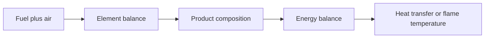

# Chemical Reactions and Combustion

Combustion analysis combines stoichiometry with the first law. Fuels react with oxygen, usually supplied by air, to form products such as carbon dioxide, water, nitrogen, excess oxygen, carbon monoxide, and unburned fuel. The mole balance determines product composition; the energy balance determines heat transfer or adiabatic flame temperature.

Cengel's combustion chapter covers fuels, theoretical and excess air, equivalence ratio, enthalpy of formation, enthalpy of combustion, heating values, adiabatic flame temperature, and dew point of combustion products. The major shift from earlier chapters is that mass is conserved by element, not by species: methane disappears, but carbon, hydrogen, oxygen, and nitrogen atoms are accounted for.

## Definitions

- A **fuel** is a substance that releases energy during chemical reaction, commonly hydrocarbons such as methane, propane, gasoline approximations, or coal compositions.
- **Combustion** is rapid oxidation with heat release. Complete combustion of a hydrocarbon forms $CO_2$ and $H_2O$ when enough oxygen is available.
- **Theoretical air** or **stoichiometric air** is the exact amount of air needed for complete combustion with no free oxygen in products.
- **Excess air** is air supplied above theoretical. Percent excess air is $(\mathrm{actual}-\mathrm{theoretical})/\mathrm{theoretical}\times100\%$.
- **Equivalence ratio** compares actual fuel-air ratio with stoichiometric fuel-air ratio. Rich mixtures have equivalence ratio above 1; lean mixtures have it below 1.
- **Air-fuel ratio** may be molar or mass based. Always label the basis.
- **Enthalpy of formation** is the enthalpy change when a compound forms from stable elements at the reference state.
- **Enthalpy of combustion** is the heat released by complete combustion at specified reactant and product states.
- **Higher heating value** includes condensation of product water to liquid. **Lower heating value** leaves product water as vapor.
- **Adiabatic flame temperature** is the product temperature for adiabatic combustion with no work and specified reactant state.

Combustion equations are usually written on a kmol fuel basis. Air is modeled as $O_2+3.76N_2$ by moles for dry air. Nitrogen is often treated as inert in ordinary combustion temperatures, but at high temperatures some dissociation and $NO_x$ formation may matter.
For this topic, a complete engineering model should state the boundary, the time basis, the property model, and the sign convention before any numbers are substituted. In chemical reactions and combustion, that habit is especially important because several formulas look similar while answering different physical questions. A closed-system expression, a steady-flow expression, an ideal-gas relation, and a property-table interpolation may all contain pressure, temperature, or enthalpy, but they do not have the same assumptions. The safest workflow is to write the general balance or defining relation first, cancel terms with a written reason, and only then insert table values or constants.

The second modeling habit is to keep the basis visible. Some calculations are per unit mass, some per mole, some per kg dry air, and some per unit time. A correct formula on the wrong basis is a common source of errors that look numerically plausible. When a table gives $\mathrm{kJ/kg}$, multiply by $\dot m$ to get $\mathrm{kW}$; when a reaction is balanced in kmol, convert to mass only after the element balance is complete; when a mixture property uses mole fraction, do not substitute mass fraction without conversion.

## Key results

For a hydrocarbon $C_aH_b$ undergoing complete stoichiometric combustion,

$$
C_aH_b+\left(a+\frac{b}{4}\right)(O_2+3.76N_2)
\rightarrow
aCO_2+\frac{b}{2}H_2O+3.76\left(a+\frac{b}{4}\right)N_2.
$$

For excess air fraction $e$,

$$
O_{2,actual}=(1+e)O_{2,stoich}
$$

and unused oxygen appears in products. The steady-flow reacting-system energy balance, neglecting kinetic and potential changes, can be written as

$$
Q-W=\sum N_p\left(\bar h_f^{\circ}+\Delta \bar h\right)_p
-\sum N_r\left(\bar h_f^{\circ}+\Delta \bar h\right)_r.
$$

For adiabatic combustion with no work,

$$
\sum N_p\left(\bar h_f^{\circ}+\Delta \bar h(T_p)\right)_p
=
\sum N_r\left(\bar h_f^{\circ}+\Delta \bar h(T_r)\right)_r.
$$

This equation is solved iteratively for product temperature because product sensible enthalpies depend on temperature. Product water phase matters for heating value and dew point. If water vapor condenses in exhaust, the recovered latent heat corresponds to the difference between higher and lower heating values.
These results should be read as a hierarchy rather than a list of isolated equations. Conservation of mass and energy set the allowed accounting; property relations supply the missing state data; the second law or equilibrium criterion decides direction, limits, and losses. A numerical answer is not finished until it passes three checks: the units reduce to the requested quantity, the sign matches the stated energy or entropy transfer direction, and the magnitude is reasonable compared with a limiting case. Useful limiting cases include zero heat transfer, reversible operation, incompressible behavior, ideal-gas behavior, saturated-liquid or saturated-vapor endpoints, and equal reservoir temperatures.

Because the textbook often moves between exact laws and engineering approximations, the approximation should be named in the solution. Examples include constant specific heats, negligible kinetic energy, negligible pump work, adiabatic devices, isentropic turbomachinery, ideal-gas mixtures, dry-air approximations, and linear interpolation. Naming the approximation makes later refinement straightforward: replace the approximate property model or restore the neglected term without rebuilding the whole analysis.

## Visual

| Quantity | Lean combustion | Stoichiometric combustion | Rich combustion |
|---|---|---|---|
| Air supplied | more than theoretical | exactly theoretical | less than theoretical |
| Product oxygen | present | none ideally | none |
| CO or unburned fuel | usually small if complete | none ideally | likely |
| Equivalence ratio | $\lt 1$ | $1$ | $\gt 1$ |



## Worked example 1: stoichiometric and excess-air methane combustion

**Problem.** Write the complete combustion equation for methane with theoretical air, then with $20\%$ excess air. Find the stoichiometric mass air-fuel ratio. Use $M_{CH4}=16\ \mathrm{kg/kmol}$, $M_{O2}=32$, and $M_{N2}=28$.

**Method.**

1. Stoichiometric oxygen for methane:

$$
CH_4+2O_2\rightarrow CO_2+2H_2O.
$$

2. Include air nitrogen:

$$
CH_4+2(O_2+3.76N_2)
\rightarrow CO_2+2H_2O+7.52N_2.
$$

3. Air mass per kmol fuel:

$$
m_{air}=2(32)+7.52(28)=64+210.56=274.56\ \mathrm{kg}.
$$

4. Fuel mass per kmol:

$$
m_f=16\ \mathrm{kg}.
$$

5. Stoichiometric air-fuel ratio:

$$
AFR=274.56/16=17.16\ \mathrm{kg\ air/kg\ fuel}.
$$

6. With $20\%$ excess air, oxygen supplied is $2(1.20)=2.4\ \mathrm{kmol}$. Products contain unused oxygen:

$$
CH_4+2.4(O_2+3.76N_2)
\rightarrow CO_2+2H_2O+0.4O_2+9.024N_2.
$$

**Checked answer.** The stoichiometric mass air-fuel ratio is about $17.2$. The excess-air equation conserves C, H, O, and N atoms.

## Worked example 2: simplified adiabatic flame-temperature estimate

**Problem.** Estimate the adiabatic product temperature for stoichiometric methane-air combustion using a simplified constant product heat capacity. Take the lower heating value as $802,000\ \mathrm{kJ/kmol\ CH_4}$ and approximate the total product heat capacity as $\sum N_pc_{p,p}=0.333\ \mathrm{kJ/(mol\,K)}=333\ \mathrm{kJ/(kmol\ fuel\,K)}$ for the product mixture over the high-temperature range. Reactants enter at $298\ \mathrm{K}$.

**Method.**

1. For stoichiometric methane-air combustion:

$$
CH_4+2O_2+7.52N_2\rightarrow CO_2+2H_2O+7.52N_2.
$$

2. In a rough constant-$c_p$ adiabatic estimate, heat release raises product sensible enthalpy:

$$
LHV\approx \left(\sum N_pc_{p,p}\right)(T_{ad}-298).
$$

3. Solve:

$$
T_{ad}=298+\frac{802,000}{333}=298+2408=2706\ \mathrm{K}.
$$

4. Interpret carefully: real calculations use temperature-dependent heat capacities and may include dissociation, which usually lowers the flame temperature from a crude constant-$c_p$ estimate.

**Checked answer.** The estimate is about $2700\ \mathrm{K}$, a high but plausible first pass. It should not replace a full enthalpy-table calculation.

## Code

```python
def methane_stoich_afr():
    air_mass = 2 * 32.0 + 2 * 3.76 * 28.0
    return air_mass / 16.0

def excess_air_products_for_methane(excess_fraction):
    O2_actual = 2.0 * (1.0 + excess_fraction)
    return {
        "CO2": 1.0,
        "H2O": 2.0,
        "O2": O2_actual - 2.0,
        "N2": 3.76 * O2_actual,
    }

def crude_flame_temperature(LHV_kJ_per_kmol, cp_products, T_ref=298.0):
    return T_ref + LHV_kJ_per_kmol / cp_products

print(methane_stoich_afr())
print(excess_air_products_for_methane(0.20))
print(crude_flame_temperature(802000, 333))
```

## Common pitfalls

- Balancing oxygen but forgetting nitrogen carried with air.
- Mixing molar and mass air-fuel ratios without conversion.
- Using lower heating value when product water is liquid, or higher heating value when it remains vapor.
- Assuming adiabatic flame temperature can be found without iteration when heat capacities vary strongly.
- Ignoring incomplete combustion products in rich mixtures.
- Starting from a special-case equation before checking that its assumptions actually hold. Write the general balance or definition first, then reduce it.
- Leaving property-table values unlabeled. Record the substance, phase region, pressure or temperature row, interpolation fraction, and units so the result can be audited.
- Rounding intermediate states too aggressively. Keep extra digits through property lookup, quality calculation, and efficiency ratios, then round the final answer to justified precision.
- Skipping a limiting-case check. Test the result against reversible operation, zero pressure drop, saturated endpoints, ideal-gas behavior, or equal-temperature reservoirs when those limits are meaningful.
- Treating a numerical solver or chart as a substitute for physical reasoning. Software can return a precise-looking number even when the selected phase, reference state, or boundary model is wrong.
- Forgetting to state whether the reported answer is specific, total, or rate based.

## Connections

- [gas mixtures](/physics/thermodynamics/gas-mixtures)
- [chemical and phase equilibrium](/physics/thermodynamics/chemical-and-phase-equilibrium)
- [thermochemistry](/chemistry/general/thermochemistry)
- [microscopic foundations](/physics/statistical-mechanics/)
- [basic thermal physics](/physics/general/)
- [thermochemistry](/chemistry/general/thermochemistry)
- [physical chemistry](/chemistry/physical-chemistry/)
- [engineering mathematics](/math/engineering-math/)
- [thermal systems control](/cs/control-engineering/)
