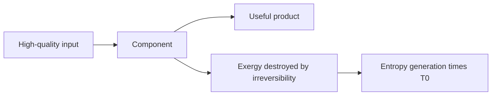

# Exergy and Second-Law Efficiency

Exergy measures useful work potential relative to an environment. Energy is conserved, but exergy is destroyed by irreversibility. That distinction makes exergy the engineering language for identifying where performance is lost and where improvements matter most.

Cengel's exergy chapter extends first-law balances by including the environment state, often called the dead state. A stream at high pressure, a hot reservoir, a moving fluid, or a fuel has work potential only because it is not in equilibrium with its surroundings. Once it reaches the dead state, its exergy is zero even though it still contains internal energy.

## Definitions

- **Environment** is the large surroundings at pressure $P_0$ and temperature $T_0$ used as the reference for useful work potential.
- The **dead state** is complete thermodynamic equilibrium with the environment: no pressure, temperature, kinetic, potential, chemical, or phase disequilibrium remains.
- **Exergy** is the maximum useful work obtainable as a system comes to equilibrium with the environment through reversible processes.
- **Reversible work** is the maximum work output or minimum work input for a specified change between states and environment.
- **Irreversibility** is destroyed exergy: $I=T_0S_{\mathrm{gen}}$.
- **Second-law efficiency** compares actual performance with reversible performance for the same task. It is often more revealing than first-law efficiency because it includes quality degradation.
- **Closed-system exergy** includes internal energy, volume displacement against the environment, entropy relative to the environment, kinetic energy, and potential energy.
- **Flow exergy** applies to streams crossing a control volume and uses enthalpy rather than internal energy.
- **Exergy transfer by heat** is $(1-T_0/T_b)Q$ for heat crossing at boundary temperature $T_b$.
- **Exergy transfer by work** is usually the useful work itself, except for boundary work against the environment, which is not useful.

Exergy analysis does not replace energy analysis. It starts from the same mass and energy balances, then adds entropy generation and the environment. A component with small energy loss can still have large exergy destruction if high-quality work potential is degraded.
For this topic, a complete engineering model should state the boundary, the time basis, the property model, and the sign convention before any numbers are substituted. In exergy and second-law efficiency, that habit is especially important because several formulas look similar while answering different physical questions. A closed-system expression, a steady-flow expression, an ideal-gas relation, and a property-table interpolation may all contain pressure, temperature, or enthalpy, but they do not have the same assumptions. The safest workflow is to write the general balance or defining relation first, cancel terms with a written reason, and only then insert table values or constants.

The second modeling habit is to keep the basis visible. Some calculations are per unit mass, some per mole, some per kg dry air, and some per unit time. A correct formula on the wrong basis is a common source of errors that look numerically plausible. When a table gives $\mathrm{kJ/kg}$, multiply by $\dot m$ to get $\mathrm{kW}$; when a reaction is balanced in kmol, convert to mass only after the element balance is complete; when a mixture property uses mole fraction, do not substitute mass fraction without conversion.

## Key results

For a closed system with negligible kinetic and potential energy changes, nonflow exergy is

$$
\phi=(u-u_0)+P_0(v-v_0)-T_0(s-s_0).
$$

With kinetic and potential terms,

$$
\phi=(u-u_0)+P_0(v-v_0)-T_0(s-s_0)+\frac{V^2}{2}+gz.
$$

Flow exergy is

$$
\psi=(h-h_0)-T_0(s-s_0)+\frac{V^2}{2}+gz.
$$

Exergy destruction is the Gouy-Stodola relation:

$$
X_{\mathrm{destroyed}}=I=T_0S_{\mathrm{gen}}.
$$

For heat transfer at boundary temperature $T_b$,

$$
X_Q=\left(1-\frac{T_0}{T_b}\right)Q.
$$

This term is positive for heat supplied above the environment temperature and negative for heat removed below the environment temperature. A common steady-flow exergy balance is

$$
\dot X_{in}-\dot X_{out}-\dot X_{destroyed}=\frac{dX_{CV}}{dt}.
$$

For steady devices, the storage term vanishes. The second-law efficiency depends on device purpose. For a turbine it may be $\eta_{II}=w_{actual}/w_{rev}$, while for a compressor it may be $\eta_{II}=w_{rev}/w_{actual}$.
These results should be read as a hierarchy rather than a list of isolated equations. Conservation of mass and energy set the allowed accounting; property relations supply the missing state data; the second law or equilibrium criterion decides direction, limits, and losses. A numerical answer is not finished until it passes three checks: the units reduce to the requested quantity, the sign matches the stated energy or entropy transfer direction, and the magnitude is reasonable compared with a limiting case. Useful limiting cases include zero heat transfer, reversible operation, incompressible behavior, ideal-gas behavior, saturated-liquid or saturated-vapor endpoints, and equal reservoir temperatures.

Because the textbook often moves between exact laws and engineering approximations, the approximation should be named in the solution. Examples include constant specific heats, negligible kinetic energy, negligible pump work, adiabatic devices, isentropic turbomachinery, ideal-gas mixtures, dry-air approximations, and linear interpolation. Naming the approximation makes later refinement straightforward: replace the approximate property model or restore the neglected term without rebuilding the whole analysis.

## Visual

| Quantity | Conserved? | Reference needed? | Main use |
|---|---|---|---|
| Energy | Yes | no environment reference | first-law accounting |
| Entropy | No, generated by irreversibility | boundary temperatures | direction and irreversibility |
| Exergy | No, destroyed by irreversibility | $T_0$, $P_0$, environment composition | useful work potential |
| Irreversibility | Not a property | $T_0$ | lost work: $T_0S_{gen}$ |



## Worked example 1: work potential of heat transfer

**Problem.** A furnace supplies $100\ \mathrm{kJ}$ of heat to a device at a boundary temperature of $800\ \mathrm{K}$. The environment is at $300\ \mathrm{K}$. Find the exergy transfer associated with this heat.

**Method.**

1. Heat exergy depends on the Carnot factor:

$$
X_Q=\left(1-\frac{T_0}{T_b}\right)Q.
$$

2. Substitute:

$$
X_Q=\left(1-\frac{300}{800}\right)(100)
=0.625(100)
=62.5\ \mathrm{kJ}.
$$

3. The remaining energy has no work potential relative to a $300\ \mathrm{K}$ environment:

$$
100-62.5=37.5\ \mathrm{kJ}.
$$

**Checked answer.** The heat carries $62.5\ \mathrm{kJ}$ of exergy. This matches the maximum work a reversible engine could produce from $100\ \mathrm{kJ}$ between $800\ \mathrm{K}$ and $300\ \mathrm{K}$.

## Worked example 2: lost work from entropy generation

**Problem.** A compressor process generates entropy at a rate of $0.12\ \mathrm{kW/K}$ while operating in an environment at $T_0=298\ \mathrm{K}$. Find the exergy destruction rate.

**Method.**

1. Use the Gouy-Stodola relation:

$$
\dot X_{destroyed}=T_0\dot S_{gen}.
$$

2. Substitute:

$$
\dot X_{destroyed}=(298\ \mathrm{K})(0.12\ \mathrm{kW/K})=35.8\ \mathrm{kW}.
$$

3. Interpret the result: a reversible compressor doing the same pressure-rise task would require about $35.8\ \mathrm{kW}$ less power if all other inlet and exit specifications were identical.

**Checked answer.** The destroyed exergy is $35.8\ \mathrm{kW}$. Entropy generation is not just a philosophical measure; multiplied by $T_0$, it becomes a lost-work rate.

## Code

```python
def heat_exergy(Q, T_boundary, T0=300.0):
    return (1.0 - T0 / T_boundary) * Q

def exergy_destroyed(Sgen, T0=298.0):
    return T0 * Sgen

print(heat_exergy(100.0, 800.0, 300.0))
print(exergy_destroyed(0.12, 298.0))
```

## Common pitfalls

- Computing exergy without stating the environment temperature and pressure.
- Treating exergy as conserved. It is destroyed by irreversibility.
- Using first-law efficiency when the real question is lost work potential.
- Forgetting that boundary work against the environment is not useful work.
- Assuming heat at low temperature has the same value as work with the same energy amount.
- Starting from a special-case equation before checking that its assumptions actually hold. Write the general balance or definition first, then reduce it.
- Leaving property-table values unlabeled. Record the substance, phase region, pressure or temperature row, interpolation fraction, and units so the result can be audited.
- Rounding intermediate states too aggressively. Keep extra digits through property lookup, quality calculation, and efficiency ratios, then round the final answer to justified precision.
- Skipping a limiting-case check. Test the result against reversible operation, zero pressure drop, saturated endpoints, ideal-gas behavior, or equal-temperature reservoirs when those limits are meaningful.
- Treating a numerical solver or chart as a substitute for physical reasoning. Software can return a precise-looking number even when the selected phase, reference state, or boundary model is wrong.
- Forgetting to state whether the reported answer is specific, total, or rate based.

## Connections

- [entropy and entropy balance](/physics/thermodynamics/entropy-and-entropy-balance)
- [gas power cycles](/physics/thermodynamics/gas-power-cycles)
- [vapor and combined power cycles](/physics/thermodynamics/vapor-and-combined-power-cycles)
- [microscopic foundations](/physics/statistical-mechanics/)
- [basic thermal physics](/physics/general/)
- [thermochemistry](/chemistry/general/thermochemistry)
- [physical chemistry](/chemistry/physical-chemistry/)
- [engineering mathematics](/math/engineering-math/)
- [thermal systems control](/cs/control-engineering/)
