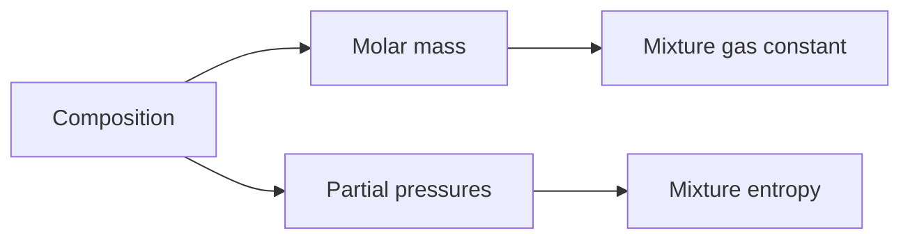

# Gas Mixtures

Many thermodynamic systems contain mixtures rather than single substances: air, combustion products, natural gas, exhaust streams, and refrigerant blends. Gas-mixture analysis connects composition with pressure, volume, molecular mass, gas constant, internal energy, enthalpy, entropy, and density.

Cengel's gas-mixture chapter emphasizes Dalton's law of additive pressures, Amagat's law of additive volumes, mole and mass fractions, ideal-gas mixture properties, and real-gas mixture approximations. The crucial modeling choice is whether the mixture behaves ideally and whether composition remains fixed during the process.

## Definitions

- A **mole fraction** is $y_i=N_i/N_m$, where $N_i$ is moles of component $i$ and $N_m$ is total moles.
- A **mass fraction** is $mf_i=m_i/m_m$. It is related to mole fraction through molar masses.
- The **mixture molar mass** is $M_m=\sum y_iM_i$.
- The **mixture gas constant** is $R_m=R_u/M_m$.
- **Dalton's law** for ideal-gas mixtures says total pressure is the sum of partial pressures, $P=\sum P_i$, and $P_i=y_iP$.
- **Amagat's law** says total volume is the sum of component partial volumes at the same mixture temperature and pressure, $V=\sum V_i$, and $V_i=y_iV$ for ideal gases.
- A **partial pressure** is the pressure a component would exert if it alone occupied the mixture volume at the mixture temperature.
- A **partial volume** is the volume a component would occupy if it alone were at the mixture temperature and pressure.
- **Gibbs-Dalton behavior** means each ideal-gas component behaves as if it exists alone at its partial pressure and mixture temperature.
- **Kay's rule** estimates pseudocritical properties for real-gas mixtures using mole-fraction averages.

Use a mole basis for reactions and partial pressures, and a mass basis for flow rates and energy balances. Most mistakes in mixture problems come from switching bases invisibly. Write either $1\ \mathrm{kmol}$ of mixture or $1\ \mathrm{kg}$ of mixture at the start and keep every term compatible.
For this topic, a complete engineering model should state the boundary, the time basis, the property model, and the sign convention before any numbers are substituted. In gas mixtures, that habit is especially important because several formulas look similar while answering different physical questions. A closed-system expression, a steady-flow expression, an ideal-gas relation, and a property-table interpolation may all contain pressure, temperature, or enthalpy, but they do not have the same assumptions. The safest workflow is to write the general balance or defining relation first, cancel terms with a written reason, and only then insert table values or constants.

The second modeling habit is to keep the basis visible. Some calculations are per unit mass, some per mole, some per kg dry air, and some per unit time. A correct formula on the wrong basis is a common source of errors that look numerically plausible. When a table gives $\mathrm{kJ/kg}$, multiply by $\dot m$ to get $\mathrm{kW}$; when a reaction is balanced in kmol, convert to mass only after the element balance is complete; when a mixture property uses mole fraction, do not substitute mass fraction without conversion.

## Key results

Composition relations:

$$
y_i=\frac{N_i}{N_m}, \qquad
mf_i=\frac{m_i}{m_m}, \qquad
M_m=\sum_i y_iM_i.
$$

Mass and mole fractions are related by

$$
mf_i=\frac{y_iM_i}{M_m},
\qquad
y_i=\frac{mf_i/M_i}{\sum_j mf_j/M_j}.
$$

For ideal-gas mixtures,

$$
P_i=y_iP, \qquad V_i=y_iV, \qquad Pv=R_mT.
$$

Mixture internal energy and enthalpy on a mass basis can be written as

$$
u_m=\sum_i mf_i u_i(T),
\qquad
h_m=\sum_i mf_i h_i(T)
$$

for ideal gases because $u_i$ and $h_i$ depend on temperature only. Entropy of an ideal-gas mixture includes the effect of each component's partial pressure:

$$
s_m=\sum_i mf_i s_i(T,P_i)
$$

when component entropies are evaluated consistently. Mixing increases entropy because each species occupies a larger accessible volume after mixing.

For real mixtures, pseudoreduced properties from Kay's rule are rough estimates:

$$
T_{c,m}=\sum y_iT_{c,i}, \qquad P_{c,m}=\sum y_iP_{c,i}.
$$

These results should be read as a hierarchy rather than a list of isolated equations. Conservation of mass and energy set the allowed accounting; property relations supply the missing state data; the second law or equilibrium criterion decides direction, limits, and losses. A numerical answer is not finished until it passes three checks: the units reduce to the requested quantity, the sign matches the stated energy or entropy transfer direction, and the magnitude is reasonable compared with a limiting case. Useful limiting cases include zero heat transfer, reversible operation, incompressible behavior, ideal-gas behavior, saturated-liquid or saturated-vapor endpoints, and equal reservoir temperatures.

Because the textbook often moves between exact laws and engineering approximations, the approximation should be named in the solution. Examples include constant specific heats, negligible kinetic energy, negligible pump work, adiabatic devices, isentropic turbomachinery, ideal-gas mixtures, dry-air approximations, and linear interpolation. Naming the approximation makes later refinement straightforward: replace the approximate property model or restore the neglected term without rebuilding the whole analysis.

## Visual

| Quantity | Mole basis | Mass basis | Use case |
|---|---|---|---|
| Composition | $y_i=N_i/N$ | $mf_i=m_i/m$ | reactions vs energy balances |
| Molecular weight | $M_m=\sum y_iM_i$ | implicit through fractions | convert kmol to kg |
| Partial pressure | $P_i=y_iP$ | convert mass to mole first | ideal-gas mixtures |
| Enthalpy | $\bar h_m=\sum y_i\bar h_i$ | $h_m=\sum mf_i h_i$ | flow energy |



## Worked example 1: partial pressures and mixture gas constant

**Problem.** A mixture contains $1\ \mathrm{kmol}$ of oxygen and $3\ \mathrm{kmol}$ of nitrogen at $400\ \mathrm{kPa}$ and $300\ \mathrm{K}$. Find mole fractions, partial pressures, mixture molar mass, and mixture gas constant. Use $M_{O2}=32\ \mathrm{kg/kmol}$, $M_{N2}=28\ \mathrm{kg/kmol}$, and $R_u=8.314\ \mathrm{kJ/(kmol\,K)}$.

**Method.**

1. Total moles:

$$
N_m=1+3=4\ \mathrm{kmol}.
$$

2. Mole fractions:

$$
y_{O2}=1/4=0.25, \qquad y_{N2}=3/4=0.75.
$$

3. Partial pressures:

$$
P_{O2}=0.25(400)=100\ \mathrm{kPa},
\qquad
P_{N2}=0.75(400)=300\ \mathrm{kPa}.
$$

4. Mixture molar mass:

$$
M_m=0.25(32)+0.75(28)=29\ \mathrm{kg/kmol}.
$$

5. Gas constant:

$$
R_m=\frac{8.314}{29}=0.2867\ \mathrm{kJ/(kg\,K)}.
$$

**Checked answer.** The result is nearly the gas constant of air because the composition is close to dry air's oxygen-nitrogen mixture.

## Worked example 2: converting mass fractions to mole fractions

**Problem.** A gas mixture is $60\%$ methane and $40\%$ carbon dioxide by mass. Find the mole fractions using $M_{CH4}=16\ \mathrm{kg/kmol}$ and $M_{CO2}=44\ \mathrm{kg/kmol}$.

**Method.**

1. Choose a $1\ \mathrm{kg}$ mixture basis:

$$
m_{CH4}=0.60\ \mathrm{kg}, \qquad m_{CO2}=0.40\ \mathrm{kg}.
$$

2. Convert to kmol:

$$
N_{CH4}=0.60/16=0.0375\ \mathrm{kmol},
$$

$$
N_{CO2}=0.40/44=0.00909\ \mathrm{kmol}.
$$

3. Total:

$$
N_m=0.0375+0.00909=0.04659\ \mathrm{kmol}.
$$

4. Mole fractions:

$$
y_{CH4}=0.0375/0.04659=0.805,
$$

$$
y_{CO2}=0.00909/0.04659=0.195.
$$

**Checked answer.** Methane's mole fraction is much higher than its mass fraction because methane has a much smaller molar mass than carbon dioxide.

## Code

```python
def mole_to_mass_fractions(y, M):
    Mm = sum(yi * Mi for yi, Mi in zip(y, M))
    return [yi * Mi / Mm for yi, Mi in zip(y, M)], Mm

def mass_to_mole_fractions(mf, M):
    n_over_m = [mfi / Mi for mfi, Mi in zip(mf, M)]
    total = sum(n_over_m)
    return [value / total for value in n_over_m]

print(mole_to_mass_fractions([0.25, 0.75], [32, 28]))
print(mass_to_mole_fractions([0.60, 0.40], [16, 44]))
```

## Common pitfalls

- Using mass fraction where mole fraction is required for partial pressure.
- Forgetting to compute the mixture gas constant from the mixture molar mass.
- Assuming air composition by mass and by mole are the same.
- Using ideal-gas mixture rules at high pressure without checking real-gas effects.
- Ignoring entropy of mixing when computing mixture entropy.
- Starting from a special-case equation before checking that its assumptions actually hold. Write the general balance or definition first, then reduce it.
- Leaving property-table values unlabeled. Record the substance, phase region, pressure or temperature row, interpolation fraction, and units so the result can be audited.
- Rounding intermediate states too aggressively. Keep extra digits through property lookup, quality calculation, and efficiency ratios, then round the final answer to justified precision.
- Skipping a limiting-case check. Test the result against reversible operation, zero pressure drop, saturated endpoints, ideal-gas behavior, or equal-temperature reservoirs when those limits are meaningful.
- Treating a numerical solver or chart as a substitute for physical reasoning. Software can return a precise-looking number even when the selected phase, reference state, or boundary model is wrong.
- Forgetting to state whether the reported answer is specific, total, or rate based.

## Connections

- [chemical reactions and combustion](/physics/thermodynamics/chemical-reactions-and-combustion)
- [gas-vapor mixtures and air conditioning](/physics/thermodynamics/gas-vapor-mixtures-and-air-conditioning)
- [thermodynamic property relations](/physics/thermodynamics/thermodynamic-property-relations)
- [microscopic foundations](/physics/statistical-mechanics/)
- [basic thermal physics](/physics/general/)
- [thermochemistry](/chemistry/general/thermochemistry)
- [physical chemistry](/chemistry/physical-chemistry/)
- [engineering mathematics](/math/engineering-math/)
- [thermal systems control](/cs/control-engineering/)
