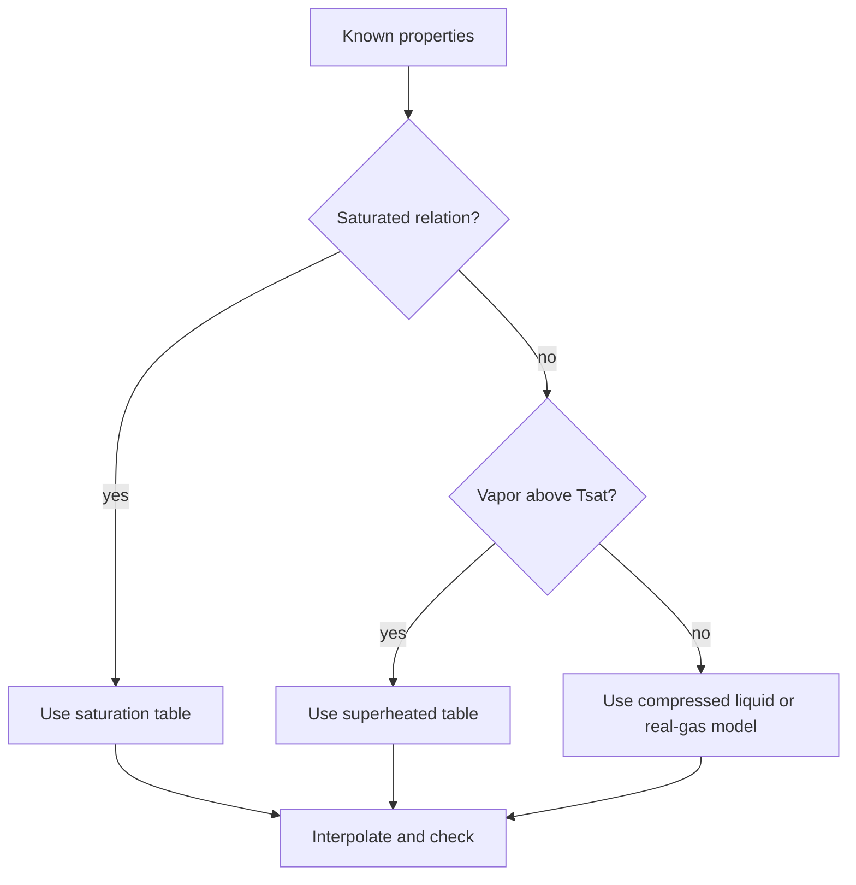

# Property-Table Workflows and Software

Property tables are not an appendix afterthought; they are the numerical backbone of engineering thermodynamics. Most realistic water, refrigerant, and real-gas calculations require table lookup, interpolation, chart reading, or property software. Cengel repeatedly uses tables for saturated mixtures, superheated vapor, compressed liquid, ideal-gas temperature functions, compressibility charts, and psychrometric data.

This supplementary page systematizes that workflow. It does not add a new physical law; it makes the existing laws usable without guessing properties. The goal is to make a state reproducible: another reader should be able to follow the same table choice, interpolation, and unit basis and recover the same property values within rounding.

## Definitions

- A **property table** is a tabulated equation of state or derived property set for a substance over a grid of states.
- A **saturation table** lists liquid and vapor properties along the phase boundary, usually indexed by either temperature or pressure.
- A **superheated table** lists vapor properties at pressures and temperatures above saturation.
- A **compressed-liquid table** lists liquid properties at pressures above saturation pressure for a given temperature.
- **Interpolation** estimates a property between tabulated values. Linear interpolation is common, but it is an approximation.
- **Double interpolation** estimates a property between rows and columns, such as a superheated table where both $P$ and $T$ are between tabulated values.
- A **Mollier chart** or $h$-$s$ diagram visualizes enthalpy and entropy, especially for steam turbines and nozzles.
- A **psychrometric chart** is a property chart for moist air at a specified pressure.
- **Reference state** is the arbitrary zero assigned to properties such as internal energy, enthalpy, and entropy in a table.
- **Property software** implements equations of state and correlations. It is useful, but it does not remove the need to identify the phase region and check units.

A reproducible table workflow has five steps: identify the substance, identify the phase region, choose the correct table, interpolate visibly, and sanity-check the result. The sanity check may be as simple as confirming that a saturated-mixture value lies between saturated liquid and vapor values or that superheated vapor enthalpy increases with temperature at fixed pressure.
For this topic, a complete engineering model should state the boundary, the time basis, the property model, and the sign convention before any numbers are substituted. In property-table workflows and software, that habit is especially important because several formulas look similar while answering different physical questions. A closed-system expression, a steady-flow expression, an ideal-gas relation, and a property-table interpolation may all contain pressure, temperature, or enthalpy, but they do not have the same assumptions. The safest workflow is to write the general balance or defining relation first, cancel terms with a written reason, and only then insert table values or constants.

The second modeling habit is to keep the basis visible. Some calculations are per unit mass, some per mole, some per kg dry air, and some per unit time. A correct formula on the wrong basis is a common source of errors that look numerically plausible. When a table gives $\mathrm{kJ/kg}$, multiply by $\dot m$ to get $\mathrm{kW}$; when a reaction is balanced in kmol, convert to mass only after the element balance is complete; when a mixture property uses mole fraction, do not substitute mass fraction without conversion.

## Key results

Single linear interpolation between table entries $(x_1,y_1)$ and $(x_2,y_2)$ is

$$
y=y_1+\frac{x-x_1}{x_2-x_1}(y_2-y_1).
$$

For saturated mixtures,

$$
y=y_f+xy_{fg}
$$

is not interpolation in temperature or pressure; it is a mass-weighted phase average at a fixed saturation state.

For a two-variable table, one transparent method is to interpolate in one direction at each bounding value, then interpolate the intermediate results in the second direction. For example, to estimate $h(P,T)$:

$$
\begin{aligned}
h(P_1,T)&=h(P_1,T_1)+\alpha[h(P_1,T_2)-h(P_1,T_1)], \\
h(P_2,T)&=h(P_2,T_1)+\alpha[h(P_2,T_2)-h(P_2,T_1)], \\
h(P,T)&=h(P_1,T)+\beta[h(P_2,T)-h(P_1,T)].
\end{aligned}
$$

where

$$
\alpha=\frac{T-T_1}{T_2-T_1}, \qquad \beta=\frac{P-P_1}{P_2-P_1}.
$$

Table values are rounded, so answers should not imply false precision. When using software, report the model or package if the calculation depends on a specific equation of state. For educational work, a clear table lookup is often preferred because it reveals the phase logic.
These results should be read as a hierarchy rather than a list of isolated equations. Conservation of mass and energy set the allowed accounting; property relations supply the missing state data; the second law or equilibrium criterion decides direction, limits, and losses. A numerical answer is not finished until it passes three checks: the units reduce to the requested quantity, the sign matches the stated energy or entropy transfer direction, and the magnitude is reasonable compared with a limiting case. Useful limiting cases include zero heat transfer, reversible operation, incompressible behavior, ideal-gas behavior, saturated-liquid or saturated-vapor endpoints, and equal reservoir temperatures.

Because the textbook often moves between exact laws and engineering approximations, the approximation should be named in the solution. Examples include constant specific heats, negligible kinetic energy, negligible pump work, adiabatic devices, isentropic turbomachinery, ideal-gas mixtures, dry-air approximations, and linear interpolation. Naming the approximation makes later refinement straightforward: replace the approximate property model or restore the neglected term without rebuilding the whole analysis.

## Visual

| Task | First question | Tool | Check |
|---|---|---|---|
| Find saturated mixture properties | Is quality known or recoverable? | saturation table | $y_f\le y\le y_g$ |
| Find superheated steam state | Is $T\gt T_{sat}(P)$? | superheated table | values trend with $T$ |
| Find compressed-liquid water | Is pressure high relative to saturation? | compressed table or $y_f(T)$ approximation | liquid $v$ small |
| HVAC moist air | Is total pressure standard? | psychrometric chart | $0\le\phi\le1$ unless supersaturated |
| Real-gas estimate | Is $Z$ far from 1? | compressibility chart or software | compare ideal gas first |



## Worked example 1: linear interpolation in a saturation table

**Problem.** A saturation table gives water saturation pressure $P_{sat}=143.4\ \mathrm{kPa}$ at $110{}^{\circ}C$ and $198.5\ \mathrm{kPa}$ at $120{}^{\circ}C$. Estimate $P_{sat}$ at $115{}^{\circ}C$ by linear interpolation.

**Method.**

1. Identify the bracketing temperatures:

$$
T_1=110{}^{\circ}C, \qquad T_2=120{}^{\circ}C.
$$

2. Compute the interpolation fraction:

$$
f=\frac{115-110}{120-110}=0.5.
$$

3. Interpolate:

$$
P=143.4+0.5(198.5-143.4).
$$

4. Evaluate:

$$
P=143.4+27.55=170.95\ \mathrm{kPa}.
$$

**Checked answer.** The estimate is $171\ \mathrm{kPa}$, halfway between the two entries because the requested temperature is halfway between the tabulated temperatures. The true saturation curve is nonlinear, so finer tables or software give a slightly different value.

## Worked example 2: bilinear interpolation for a superheated property

**Problem.** A simplified superheated table gives enthalpy values for a vapor:

|  | $T=300{}^{\circ}C$ | $T=400{}^{\circ}C$ |
|---|---:|---:|
| $P=1\ \mathrm{MPa}$ | $3050$ | $3260$ |
| $P=2\ \mathrm{MPa}$ | $3020$ | $3235$ |

Estimate $h$ at $P=1.5\ \mathrm{MPa}$ and $T=350{}^{\circ}C$.

**Method.**

1. Interpolate at $P=1\ \mathrm{MPa}$ in temperature. The temperature fraction is

$$
\alpha=\frac{350-300}{400-300}=0.5.
$$

2. Thus

$$
h(1,350)=3050+0.5(3260-3050)=3155\ \mathrm{kJ/kg}.
$$

3. Interpolate at $P=2\ \mathrm{MPa}$:

$$
h(2,350)=3020+0.5(3235-3020)=3127.5\ \mathrm{kJ/kg}.
$$

4. Pressure fraction:

$$
\beta=\frac{1.5-1.0}{2.0-1.0}=0.5.
$$

5. Final interpolation:

$$
h(1.5,350)=3155+0.5(3127.5-3155)=3141.25\ \mathrm{kJ/kg}.
$$

**Checked answer.** The estimate is $3141\ \mathrm{kJ/kg}$, between all four table values and closer to the center because the target state is centered in the rectangle.

## Code

```python
def lerp(x, x1, x2, y1, y2):
    return y1 + (x - x1) / (x2 - x1) * (y2 - y1)

def bilinear(P, T, P1, P2, T1, T2, h11, h12, h21, h22):
    h_P1 = lerp(T, T1, T2, h11, h12)
    h_P2 = lerp(T, T1, T2, h21, h22)
    return lerp(P, P1, P2, h_P1, h_P2)

print(lerp(115, 110, 120, 143.4, 198.5))
print(bilinear(1.5, 350, 1.0, 2.0, 300, 400, 3050, 3260, 3020, 3235))
```

## Common pitfalls

- Interpolating before identifying the correct phase region.
- Treating quality formulas as temperature interpolation.
- Reporting more significant digits than the table supports.
- Combining values from SI and English tables or from different reference states.
- Trusting property software output without checking phase, units, and reasonableness.
- Starting from a special-case equation before checking that its assumptions actually hold. Write the general balance or definition first, then reduce it.
- Leaving property-table values unlabeled. Record the substance, phase region, pressure or temperature row, interpolation fraction, and units so the result can be audited.
- Rounding intermediate states too aggressively. Keep extra digits through property lookup, quality calculation, and efficiency ratios, then round the final answer to justified precision.
- Skipping a limiting-case check. Test the result against reversible operation, zero pressure drop, saturated endpoints, ideal-gas behavior, or equal-temperature reservoirs when those limits are meaningful.
- Treating a numerical solver or chart as a substitute for physical reasoning. Software can return a precise-looking number even when the selected phase, reference state, or boundary model is wrong.
- Forgetting to state whether the reported answer is specific, total, or rate based.

## Connections

- [pure substances and property tables](/physics/thermodynamics/pure-substances-and-property-tables)
- [vapor and combined power cycles](/physics/thermodynamics/vapor-and-combined-power-cycles)
- [refrigeration cycles](/physics/thermodynamics/refrigeration-cycles)
- [microscopic foundations](/physics/statistical-mechanics/)
- [basic thermal physics](/physics/general/)
- [thermochemistry](/chemistry/general/thermochemistry)
- [physical chemistry](/chemistry/physical-chemistry/)
- [engineering mathematics](/math/engineering-math/)
- [thermal systems control](/cs/control-engineering/)
