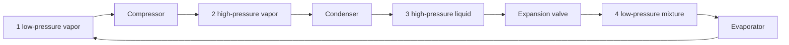

# Refrigeration Cycles

Refrigeration cycles move heat from a low-temperature region to a higher-temperature sink by consuming work or another energy input. The vapor-compression cycle dominates engineering practice because it uses phase change to absorb large heat loads at nearly constant temperature and a compressor to raise refrigerant pressure and temperature before heat rejection.

Cengel compares reversed Carnot refrigeration, ideal and actual vapor-compression cycles, refrigerant selection, heat pumps, cascade and multistage systems, gas refrigeration, and absorption refrigeration. The central design measure is coefficient of performance, but real decisions also involve pressure levels, compressor discharge temperature, toxicity, flammability, environmental impact, and matching evaporator and condenser temperatures to the application.

## Definitions

- A **refrigerator** removes heat from a low-temperature space. A **heat pump** delivers heat to a warm space; the hardware may be similar, but the desired effect differs.
- The **ideal vapor-compression refrigeration cycle** has four processes: isentropic compression, constant-pressure heat rejection, throttling, and constant-pressure heat absorption.
- The **evaporator** absorbs heat from the refrigerated space as low-pressure refrigerant vaporizes.
- The **compressor** raises vapor pressure and temperature, requiring work input.
- The **condenser** rejects heat to surroundings and condenses the refrigerant.
- The **expansion valve** throttles refrigerant to the evaporator pressure. It is modeled as $h_3=h_4$.
- **COP of a refrigerator** is $COP_R=q_L/w_{in}$. **COP of a heat pump** is $COP_{HP}=q_H/w_{in}=COP_R+1$ for the same cycle.
- **Cascade refrigeration** uses multiple cycles with different refrigerants or pressure levels to span large temperature differences.
- **Multistage compression with intercooling** reduces compressor work and discharge temperature.
- **Absorption refrigeration** replaces much of the mechanical compressor work with heat-driven desorption and absorption processes.

Actual vapor-compression cycles deviate from the ideal because compression is not isentropic, pressure drops occur in heat exchangers and lines, refrigerant leaves the evaporator superheated, and liquid leaving the condenser may be subcooled. Some deviations protect equipment even if they reduce idealized COP.
For this topic, a complete engineering model should state the boundary, the time basis, the property model, and the sign convention before any numbers are substituted. In refrigeration cycles, that habit is especially important because several formulas look similar while answering different physical questions. A closed-system expression, a steady-flow expression, an ideal-gas relation, and a property-table interpolation may all contain pressure, temperature, or enthalpy, but they do not have the same assumptions. The safest workflow is to write the general balance or defining relation first, cancel terms with a written reason, and only then insert table values or constants.

The second modeling habit is to keep the basis visible. Some calculations are per unit mass, some per mole, some per kg dry air, and some per unit time. A correct formula on the wrong basis is a common source of errors that look numerically plausible. When a table gives $\mathrm{kJ/kg}$, multiply by $\dot m$ to get $\mathrm{kW}$; when a reaction is balanced in kmol, convert to mass only after the element balance is complete; when a mixture property uses mole fraction, do not substitute mass fraction without conversion.

## Key results

For the ideal vapor-compression cycle, with states 1 compressor inlet, 2 compressor exit, 3 condenser exit, and 4 evaporator inlet,

$$
q_L=h_1-h_4, \qquad
w_{in}=h_2-h_1, \qquad
q_H=h_2-h_3.
$$

The throttling valve gives

$$
h_3=h_4.
$$

The refrigerator and heat-pump COP values are

$$
COP_R=\frac{h_1-h_4}{h_2-h_1},
\qquad
COP_{HP}=\frac{h_2-h_3}{h_2-h_1}.
$$

For a reversible refrigerator operating between reservoirs,

$$
COP_{R,\mathrm{Carnot}}=\frac{T_L}{T_H-T_L}.
$$

The ideal cycle is improved by raising evaporator temperature or lowering condenser temperature because both reduce the required pressure ratio and compressor work. However, the evaporator must remain colder than the refrigerated space, and the condenser must remain hotter than the heat sink, so finite heat-transfer differences impose practical limits.

Refrigerant selection balances thermodynamics with safety and environmental constraints. A favorable refrigerant has suitable saturation pressures, high latent heat, moderate discharge temperature, chemical stability, compatibility with lubricants and materials, low toxicity, low flammability, and acceptable ozone-depletion and global-warming impacts.
These results should be read as a hierarchy rather than a list of isolated equations. Conservation of mass and energy set the allowed accounting; property relations supply the missing state data; the second law or equilibrium criterion decides direction, limits, and losses. A numerical answer is not finished until it passes three checks: the units reduce to the requested quantity, the sign matches the stated energy or entropy transfer direction, and the magnitude is reasonable compared with a limiting case. Useful limiting cases include zero heat transfer, reversible operation, incompressible behavior, ideal-gas behavior, saturated-liquid or saturated-vapor endpoints, and equal reservoir temperatures.

Because the textbook often moves between exact laws and engineering approximations, the approximation should be named in the solution. Examples include constant specific heats, negligible kinetic energy, negligible pump work, adiabatic devices, isentropic turbomachinery, ideal-gas mixtures, dry-air approximations, and linear interpolation. Naming the approximation makes later refinement straightforward: replace the approximate property model or restore the neglected term without rebuilding the whole analysis.

## Visual



| Component | Ideal model | Main property change |
|---|---|---|
| Compressor | isentropic, adiabatic | $h$ and $P$ rise |
| Condenser | constant pressure heat rejection | vapor becomes liquid |
| Expansion valve | throttling | $h$ constant, $P$ drops |
| Evaporator | constant pressure heat absorption | mixture becomes vapor |

## Worked example 1: ideal vapor-compression COP

**Problem.** An ideal vapor-compression refrigerator has refrigerant enthalpies $h_1=398\ \mathrm{kJ/kg}$, $h_2=430\ \mathrm{kJ/kg}$, $h_3=250\ \mathrm{kJ/kg}$, and $h_4=250\ \mathrm{kJ/kg}$. Find $q_L$, compressor work, heat rejection, and COP.

**Method.**

1. Refrigeration effect:

$$
q_L=h_1-h_4=398-250=148\ \mathrm{kJ/kg}.
$$

2. Compressor work:

$$
w_{in}=h_2-h_1=430-398=32\ \mathrm{kJ/kg}.
$$

3. Heat rejection:

$$
q_H=h_2-h_3=430-250=180\ \mathrm{kJ/kg}.
$$

4. COP:

$$
COP_R=\frac{q_L}{w_{in}}=\frac{148}{32}=4.63.
$$

5. First-law check:

$$
q_H=q_L+w_{in}=148+32=180\ \mathrm{kJ/kg}.
$$

**Checked answer.** The COP is $4.63$, and the heat rejection check closes exactly with the given enthalpies.

## Worked example 2: cooling-load mass flow rate

**Problem.** A refrigeration system must remove $12\ \mathrm{kW}$ from a cold room. The refrigerant effect in the evaporator is $q_L=148\ \mathrm{kJ/kg}$ from the previous example. Find the required mass flow rate and compressor power if $w_{in}=32\ \mathrm{kJ/kg}$.

**Method.**

1. Use the evaporator load:

$$
\dot Q_L=\dot m q_L.
$$

2. Solve for mass flow:

$$
\dot m=\frac{12\ \mathrm{kJ/s}}{148\ \mathrm{kJ/kg}}
=0.0811\ \mathrm{kg/s}.
$$

3. Compressor power:

$$
\dot W_{in}=\dot m w_{in}
=(0.0811)(32)=2.60\ \mathrm{kW}.
$$

4. Check with COP:

$$
\dot W_{in}=\frac{\dot Q_L}{COP_R}
=\frac{12}{4.63}=2.59\ \mathrm{kW}.
$$

**Checked answer.** The required refrigerant mass flow is $0.081\ \mathrm{kg/s}$ and the compressor power is about $2.6\ \mathrm{kW}$.

## Code

```python
def vapor_compression(h1, h2, h3, h4):
    qL = h1 - h4
    win = h2 - h1
    qH = h2 - h3
    return qL, win, qH, qL / win

def mass_flow_for_load(Qdot_L, qL, win):
    mdot = Qdot_L / qL
    return mdot, mdot * win

qL, win, qH, cop = vapor_compression(398, 430, 250, 250)
print(qL, win, qH, cop)
print(mass_flow_for_load(12.0, qL, win))
```

## Common pitfalls

- Forgetting that throttling is approximately constant enthalpy, not isentropic.
- Comparing COP to thermal efficiency as if both must be below 1.
- Ignoring pressure drops and superheat/subcooling when moving from ideal to actual cycles.
- Choosing a refrigerant using COP alone without safety and environmental constraints.
- Making condenser temperature too close to ambient in calculations without allowing finite heat-transfer area.
- Starting from a special-case equation before checking that its assumptions actually hold. Write the general balance or definition first, then reduce it.
- Leaving property-table values unlabeled. Record the substance, phase region, pressure or temperature row, interpolation fraction, and units so the result can be audited.
- Rounding intermediate states too aggressively. Keep extra digits through property lookup, quality calculation, and efficiency ratios, then round the final answer to justified precision.
- Skipping a limiting-case check. Test the result against reversible operation, zero pressure drop, saturated endpoints, ideal-gas behavior, or equal-temperature reservoirs when those limits are meaningful.
- Treating a numerical solver or chart as a substitute for physical reasoning. Software can return a precise-looking number even when the selected phase, reference state, or boundary model is wrong.
- Forgetting to state whether the reported answer is specific, total, or rate based.

## Connections

- [second-law heat engines and refrigerators](/physics/thermodynamics/second-law-heat-engines-and-refrigerators)
- [gas-vapor mixtures and air conditioning](/physics/thermodynamics/gas-vapor-mixtures-and-air-conditioning)
- [pure substances and property tables](/physics/thermodynamics/pure-substances-and-property-tables)
- [microscopic foundations](/physics/statistical-mechanics/)
- [basic thermal physics](/physics/general/)
- [thermochemistry](/chemistry/general/thermochemistry)
- [physical chemistry](/chemistry/physical-chemistry/)
- [engineering mathematics](/math/engineering-math/)
- [thermal systems control](/cs/control-engineering/)
