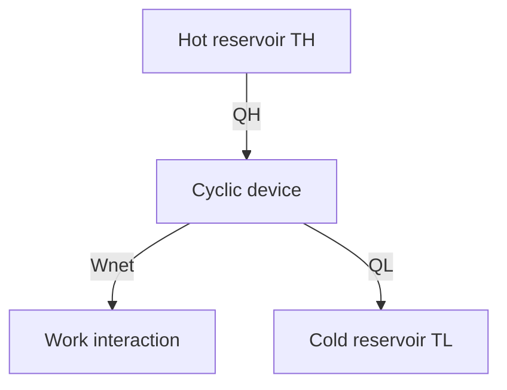

# Second-Law Heat Engines and Refrigerators

The first law allows any process that conserves energy. The second law adds direction and quality: heat naturally flows from high temperature to low temperature, and a cyclic device cannot convert all heat from a single reservoir into net work. This is why real power plants reject heat and real refrigerators require work input.

Cengel introduces the second law through heat engines, refrigerators, heat pumps, reversible processes, and the Carnot cycle. These devices make the law concrete. A heat engine seeks work output from heat input; a refrigerator seeks heat removal from a cold space; a heat pump seeks heat delivery to a warm space. The same energy interactions appear, but the desired effect changes.

## Definitions

- A **thermal energy reservoir** is an ideal body that can supply or absorb finite heat without changing temperature. Large lakes, the atmosphere, furnaces, and phase-change reservoirs are modeled this way when appropriate.
- A **heat engine** is a cyclic device that receives heat from a high-temperature reservoir, produces net work, and rejects heat to a low-temperature reservoir.
- **Thermal efficiency** is $\eta=W_{\mathrm{net,out}}/Q_H=1-Q_L/Q_H$ for a heat engine.
- A **refrigerator** is a cyclic device whose desired effect is removing heat $Q_L$ from a low-temperature region by consuming work.
- A **heat pump** is a cyclic device whose desired effect is delivering heat $Q_H$ to a high-temperature region by consuming work.
- **Coefficient of performance** is $COP_R=Q_L/W_{\mathrm{net,in}}$ for refrigerators and $COP_{HP}=Q_H/W_{\mathrm{net,in}}$ for heat pumps.
- The **Kelvin-Planck statement** says no cyclic device can produce net work while exchanging heat with only one thermal reservoir.
- The **Clausius statement** says no cyclic device can have as its sole effect heat transfer from a colder body to a hotter body.
- A **reversible process** can be reversed without leaving changes in either the system or surroundings. Real processes have irreversibilities such as friction, unrestrained expansion, mixing, finite-temperature heat transfer, and electrical resistance.
- A **Carnot cycle** is a completely reversible cycle operating between two reservoirs; it sets the upper performance limit for heat engines, refrigerators, and heat pumps.

The Kelvin-Planck and Clausius statements are equivalent: if one could be violated, a combination of devices could violate the other. This equivalence is a powerful modeling check. If a proposed device claims either one-reservoir work production or no-work refrigeration, it is not merely difficult; it violates the second law.
For this topic, a complete engineering model should state the boundary, the time basis, the property model, and the sign convention before any numbers are substituted. In second-law heat engines and refrigerators, that habit is especially important because several formulas look similar while answering different physical questions. A closed-system expression, a steady-flow expression, an ideal-gas relation, and a property-table interpolation may all contain pressure, temperature, or enthalpy, but they do not have the same assumptions. The safest workflow is to write the general balance or defining relation first, cancel terms with a written reason, and only then insert table values or constants.

The second modeling habit is to keep the basis visible. Some calculations are per unit mass, some per mole, some per kg dry air, and some per unit time. A correct formula on the wrong basis is a common source of errors that look numerically plausible. When a table gives $\mathrm{kJ/kg}$, multiply by $\dot m$ to get $\mathrm{kW}$; when a reaction is balanced in kmol, convert to mass only after the element balance is complete; when a mixture property uses mole fraction, do not substitute mass fraction without conversion.

## Key results

For any heat engine,

$$
W_{\mathrm{net,out}}=Q_H-Q_L, \qquad
\eta=\frac{W_{\mathrm{net,out}}}{Q_H}=1-\frac{Q_L}{Q_H}.
$$

For Carnot heat engines operating between absolute reservoir temperatures $T_H$ and $T_L$,

$$
\eta_{\mathrm{Carnot}}=1-\frac{T_L}{T_H}.
$$

The reversed Carnot refrigerator and heat pump have

$$
COP_{R,\mathrm{Carnot}}=\frac{T_L}{T_H-T_L},
\qquad
COP_{HP,\mathrm{Carnot}}=\frac{T_H}{T_H-T_L}.
$$

All temperatures in these ratios must be absolute. The Carnot principles state that no engine operating between two reservoirs can be more efficient than a reversible engine, and all reversible engines operating between the same two reservoirs have the same efficiency.

The second law also introduces the quality of energy. Work can be fully converted to heat, but heat cannot be fully converted to work in a cycle unless the low-temperature reservoir is at absolute zero, which is unattainable. This distinction leads directly to entropy and exergy.
These results should be read as a hierarchy rather than a list of isolated equations. Conservation of mass and energy set the allowed accounting; property relations supply the missing state data; the second law or equilibrium criterion decides direction, limits, and losses. A numerical answer is not finished until it passes three checks: the units reduce to the requested quantity, the sign matches the stated energy or entropy transfer direction, and the magnitude is reasonable compared with a limiting case. Useful limiting cases include zero heat transfer, reversible operation, incompressible behavior, ideal-gas behavior, saturated-liquid or saturated-vapor endpoints, and equal reservoir temperatures.

Because the textbook often moves between exact laws and engineering approximations, the approximation should be named in the solution. Examples include constant specific heats, negligible kinetic energy, negligible pump work, adiabatic devices, isentropic turbomachinery, ideal-gas mixtures, dry-air approximations, and linear interpolation. Naming the approximation makes later refinement straightforward: replace the approximate property model or restore the neglected term without rebuilding the whole analysis.

## Visual



| Device | Desired effect | Required input | Performance measure |
|---|---|---|---|
| Heat engine | net work output | heat from hot reservoir | $\eta=W_{net}/Q_H$ |
| Refrigerator | remove $Q_L$ | work input | $COP_R=Q_L/W_{in}$ |
| Heat pump | deliver $Q_H$ | work input | $COP_{HP}=Q_H/W_{in}$ |
| Carnot device | reversible benchmark | depends on mode | temperature-only limit |

## Worked example 1: Carnot heat-engine limit

**Problem.** A heat engine operates between reservoirs at $800\ \mathrm{K}$ and $300\ \mathrm{K}$. It receives $500\ \mathrm{kJ}$ from the hot reservoir per cycle. Find the maximum possible efficiency, work output, and rejected heat.

**Method.**

1. The maximum efficiency is Carnot:

$$
\eta_{\max}=1-\frac{T_L}{T_H}=1-\frac{300}{800}=0.625.
$$

2. Work output:

$$
W_{\max}=\eta_{\max}Q_H=(0.625)(500)=312.5\ \mathrm{kJ}.
$$

3. Use the first law for a cycle:

$$
Q_L=Q_H-W=500-312.5=187.5\ \mathrm{kJ}.
$$

**Checked answer.** The engine can produce at most $312.5\ \mathrm{kJ}$ per cycle and must reject at least $187.5\ \mathrm{kJ}$. A claim of $400\ \mathrm{kJ}$ work from the same reservoirs would violate the second law even though it could be made to satisfy the first law by lowering $Q_L$.

## Worked example 2: Carnot refrigerator work requirement

**Problem.** A refrigerator removes $2.4\ \mathrm{kW}$ from a refrigerated space at $-5{}^{\circ}C$ while rejecting heat to a kitchen at $25{}^{\circ}C$. Estimate the minimum possible power input.

**Method.**

1. Convert temperatures to kelvin:

$$
T_L=268.15\ \mathrm{K}, \qquad T_H=298.15\ \mathrm{K}.
$$

2. The maximum refrigerator COP is

$$
COP_{R,\max}=\frac{T_L}{T_H-T_L}
=\frac{268.15}{30.00}=8.94.
$$

3. Power input is cooling load divided by COP:

$$
\dot W_{\min}=\frac{\dot Q_L}{COP_{R,\max}}
=\frac{2.4}{8.94}=0.268\ \mathrm{kW}.
$$

**Checked answer.** The theoretical minimum power is $0.27\ \mathrm{kW}$. Real refrigerators require more because compression, heat transfer across finite temperature differences, pressure drops, and motor losses generate irreversibility.

## Code

```python
def carnot_engine(T_H, T_L, Q_H):
    eta = 1.0 - T_L / T_H
    W = eta * Q_H
    return eta, W, Q_H - W

def carnot_refrigerator_power(TL_C, TH_C, QL_kW):
    TL = TL_C + 273.15
    TH = TH_C + 273.15
    cop = TL / (TH - TL)
    return cop, QL_kW / cop

print(carnot_engine(800.0, 300.0, 500.0))
print(carnot_refrigerator_power(-5.0, 25.0, 2.4))
```

## Common pitfalls

- Using Celsius temperatures in Carnot ratios.
- Calling a high COP impossible because it exceeds 1. COP is not an efficiency.
- Forgetting that a heat engine must reject heat to a low-temperature reservoir.
- Assuming reversible means merely frictionless; finite-temperature heat transfer is also irreversible.
- Treating Carnot performance as a practical design target instead of an upper bound.
- Starting from a special-case equation before checking that its assumptions actually hold. Write the general balance or definition first, then reduce it.
- Leaving property-table values unlabeled. Record the substance, phase region, pressure or temperature row, interpolation fraction, and units so the result can be audited.
- Rounding intermediate states too aggressively. Keep extra digits through property lookup, quality calculation, and efficiency ratios, then round the final answer to justified precision.
- Skipping a limiting-case check. Test the result against reversible operation, zero pressure drop, saturated endpoints, ideal-gas behavior, or equal-temperature reservoirs when those limits are meaningful.
- Treating a numerical solver or chart as a substitute for physical reasoning. Software can return a precise-looking number even when the selected phase, reference state, or boundary model is wrong.
- Forgetting to state whether the reported answer is specific, total, or rate based.

## Connections

- [entropy and entropy balance](/physics/thermodynamics/entropy-and-entropy-balance)
- [exergy and second-law efficiency](/physics/thermodynamics/exergy-and-second-law-efficiency)
- [refrigeration cycles](/physics/thermodynamics/refrigeration-cycles)
- [microscopic foundations](/physics/statistical-mechanics/)
- [basic thermal physics](/physics/general/)
- [thermochemistry](/chemistry/general/thermochemistry)
- [physical chemistry](/chemistry/physical-chemistry/)
- [engineering mathematics](/math/engineering-math/)
- [thermal systems control](/cs/control-engineering/)
