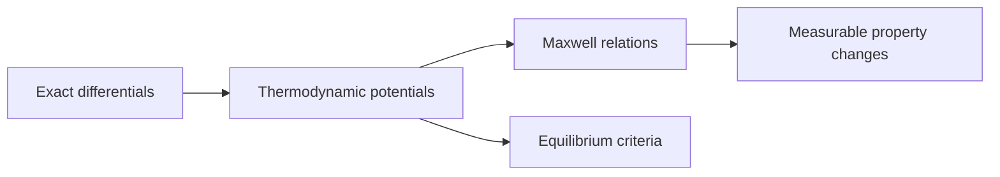

# Thermodynamic Property Relations

Thermodynamic property relations show that measurable properties are not independent facts in a table; they are linked by exact differentials, thermodynamic potentials, and stability constraints. These relations let engineers estimate hard-to-measure quantities from easier measurements and check the consistency of equations of state.

Cengel's treatment includes partial derivatives, Maxwell relations, the Clapeyron equation, the Joule-Thomson coefficient, internal-energy and enthalpy departure functions, and the generalized charts used for real gases. The mathematics is compact, but the payoff is large: from $P$-$v$-$T$ data one can infer entropy changes, enthalpy changes, phase-boundary slopes, and throttling temperature behavior.

## Definitions

- An **exact differential** represents a property change independent of path, such as $du$, $dh$, $ds$, or $dg$.
- An **inexact differential** represents a path interaction, such as $\delta Q$ or $\delta W$.
- The **Helmholtz function** is $a=u-Ts$. The **Gibbs function** is $g=h-Ts$.
- A **Maxwell relation** is an equality between cross partial derivatives derived from exact differentials of thermodynamic potentials.
- The **cyclic relation** for partial derivatives is $(\partial x/\partial y)_z(\partial y/\partial z)_x(\partial z/\partial x)_y=-1$.
- The **Clapeyron equation** gives the slope of a phase-equilibrium line from latent heat and volume change.
- The **Clausius-Clapeyron equation** is an approximate integrated form for vapor pressure when vapor behaves ideally and liquid volume is negligible.
- The **Joule-Thomson coefficient** is $\mu_{JT}=(\partial T/\partial P)_h$, describing temperature change during throttling.
- **Departure functions** measure how real-gas properties differ from ideal-gas values at the same temperature and pressure.
- The **compressibility factor** $Z=Pv/(RT)$ is the starting point for generalized departure charts.

The practical method is to select a thermodynamic potential whose natural variables match the measured data. For example, Gibbs free energy is naturally connected to $T$ and $P$, so it is central in phase and chemical equilibrium. Helmholtz free energy is naturally connected to $T$ and $v$, which is useful for equations of state.
For this topic, a complete engineering model should state the boundary, the time basis, the property model, and the sign convention before any numbers are substituted. In thermodynamic property relations, that habit is especially important because several formulas look similar while answering different physical questions. A closed-system expression, a steady-flow expression, an ideal-gas relation, and a property-table interpolation may all contain pressure, temperature, or enthalpy, but they do not have the same assumptions. The safest workflow is to write the general balance or defining relation first, cancel terms with a written reason, and only then insert table values or constants.

The second modeling habit is to keep the basis visible. Some calculations are per unit mass, some per mole, some per kg dry air, and some per unit time. A correct formula on the wrong basis is a common source of errors that look numerically plausible. When a table gives $\mathrm{kJ/kg}$, multiply by $\dot m$ to get $\mathrm{kW}$; when a reaction is balanced in kmol, convert to mass only after the element balance is complete; when a mixture property uses mole fraction, do not substitute mass fraction without conversion.

## Key results

The two $Tds$ equations are

$$
Tds=du+Pdv,
\qquad
Tds=dh-vdP.
$$

Thermodynamic potentials have differentials

$$
\begin{aligned}
da &= -s\,dT-P\,dv, \\
dg &= -s\,dT+v\,dP.
\end{aligned}
$$

From these exact differentials, Maxwell relations include

$$
\left(\frac{\partial s}{\partial v}\right)_T
=
\left(\frac{\partial P}{\partial T}\right)_v,
\qquad
\left(\frac{\partial s}{\partial P}\right)_T
=-
\left(\frac{\partial v}{\partial T}\right)_P.
$$

The Clapeyron equation is

$$
\frac{dP_{sat}}{dT}=\frac{h_{fg}}{T(v_g-v_f)}.
$$

For enthalpy changes of real gases,

$$
dh=c_p\,dT+\left[v-T\left(\frac{\partial v}{\partial T}\right)_P\right]dP.
$$

The Joule-Thomson coefficient follows as

$$
\mu_{JT}=\left(\frac{\partial T}{\partial P}\right)_h
=\frac{1}{c_p}\left[T\left(\frac{\partial v}{\partial T}\right)_P-v\right].
$$

An ideal gas has $v=RT/P$, so $T(\partial v/\partial T)_P-v=0$ and $\mu_{JT}=0$. Real gases cool or warm during throttling depending on the sign of $\mu_{JT}$ and the side of the inversion curve.
These results should be read as a hierarchy rather than a list of isolated equations. Conservation of mass and energy set the allowed accounting; property relations supply the missing state data; the second law or equilibrium criterion decides direction, limits, and losses. A numerical answer is not finished until it passes three checks: the units reduce to the requested quantity, the sign matches the stated energy or entropy transfer direction, and the magnitude is reasonable compared with a limiting case. Useful limiting cases include zero heat transfer, reversible operation, incompressible behavior, ideal-gas behavior, saturated-liquid or saturated-vapor endpoints, and equal reservoir temperatures.

Because the textbook often moves between exact laws and engineering approximations, the approximation should be named in the solution. Examples include constant specific heats, negligible kinetic energy, negligible pump work, adiabatic devices, isentropic turbomachinery, ideal-gas mixtures, dry-air approximations, and linear interpolation. Naming the approximation makes later refinement straightforward: replace the approximate property model or restore the neglected term without rebuilding the whole analysis.

## Visual

| Potential | Definition | Natural variables | Differential |
|---|---|---|---|
| Internal energy | $u$ | $s,v$ | $du=Tds-Pdv$ |
| Enthalpy | $h=u+Pv$ | $s,P$ | $dh=Tds+vdP$ |
| Helmholtz | $a=u-Ts$ | $T,v$ | $da=-s\,dT-P\,dv$ |
| Gibbs | $g=h-Ts$ | $T,P$ | $dg=-s\,dT+v\,dP$ |



## Worked example 1: Clapeyron slope near water boiling

**Problem.** Estimate the saturation-pressure slope of water near $100{}^{\circ}C$. Use $T=373.15\ \mathrm{K}$, $h_{fg}=2257\ \mathrm{kJ/kg}$, $v_g=1.694\ \mathrm{m^3/kg}$, and $v_f=0.001\ \mathrm{m^3/kg}$.

**Method.**

1. Use the Clapeyron equation:

$$
\frac{dP_{sat}}{dT}=\frac{h_{fg}}{T(v_g-v_f)}.
$$

2. Convert $h_{fg}$ to $\mathrm{J/kg}$:

$$
h_{fg}=2.257\times10^6\ \mathrm{J/kg}.
$$

3. Volume difference:

$$
v_g-v_f=1.694-0.001=1.693\ \mathrm{m^3/kg}.
$$

4. Substitute:

$$
\frac{dP_{sat}}{dT}
=\frac{2.257\times10^6}{(373.15)(1.693)}
=3570\ \mathrm{Pa/K}.
$$

**Checked answer.** The saturation pressure rises about $3.57\ \mathrm{kPa}$ per kelvin near $100{}^{\circ}C$, consistent with steam tables around atmospheric pressure.

## Worked example 2: Maxwell relation check for an ideal gas

**Problem.** Show that the Maxwell relation $(\partial s/\partial P)_T=-(\partial v/\partial T)_P$ gives the ideal-gas entropy pressure dependence.

**Method.**

1. For an ideal gas,

$$
v=\frac{RT}{P}.
$$

2. Differentiate at constant pressure:

$$
\left(\frac{\partial v}{\partial T}\right)_P=\frac{R}{P}.
$$

3. Apply the Maxwell relation:

$$
\left(\frac{\partial s}{\partial P}\right)_T=-\frac{R}{P}.
$$

4. Integrate at constant temperature from $P_1$ to $P_2$:

$$
s_2-s_1=\int_{P_1}^{P_2}-\frac{R}{P}\,dP
=-R\ln\left(\frac{P_2}{P_1}\right).
$$

**Checked answer.** This is exactly the pressure term in the ideal-gas entropy relation at constant temperature.

## Code

```python
import math

def clapeyron_slope(hfg_kJkg, T_K, vg, vf):
    return (hfg_kJkg * 1000.0) / (T_K * (vg - vf))  # Pa/K

def ideal_gas_entropy_pressure_term(P1, P2, R=0.287):
    return -R * math.log(P2 / P1)

print(clapeyron_slope(2257, 373.15, 1.694, 0.001) / 1000.0)
print(ideal_gas_entropy_pressure_term(100, 500))
```

## Common pitfalls

- Using Maxwell relations without holding the stated variable constant.
- Forgetting that $g$ and $a$ are specific properties here when using lowercase notation.
- Applying Clausius-Clapeyron where vapor is not ideal or liquid volume is not negligible.
- Interpreting a zero ideal-gas Joule-Thomson coefficient as true for real gases.
- Losing signs when switching between $du=Tds-Pdv$ and $dh=Tds+vdP$.
- Starting from a special-case equation before checking that its assumptions actually hold. Write the general balance or definition first, then reduce it.
- Leaving property-table values unlabeled. Record the substance, phase region, pressure or temperature row, interpolation fraction, and units so the result can be audited.
- Rounding intermediate states too aggressively. Keep extra digits through property lookup, quality calculation, and efficiency ratios, then round the final answer to justified precision.
- Skipping a limiting-case check. Test the result against reversible operation, zero pressure drop, saturated endpoints, ideal-gas behavior, or equal-temperature reservoirs when those limits are meaningful.
- Treating a numerical solver or chart as a substitute for physical reasoning. Software can return a precise-looking number even when the selected phase, reference state, or boundary model is wrong.
- Forgetting to state whether the reported answer is specific, total, or rate based.

## Connections

- [entropy and entropy balance](/physics/thermodynamics/entropy-and-entropy-balance)
- [chemical and phase equilibrium](/physics/thermodynamics/chemical-and-phase-equilibrium)
- [pure substances and property tables](/physics/thermodynamics/pure-substances-and-property-tables)
- [microscopic foundations](/physics/statistical-mechanics/)
- [basic thermal physics](/physics/general/)
- [thermochemistry](/chemistry/general/thermochemistry)
- [physical chemistry](/chemistry/physical-chemistry/)
- [engineering mathematics](/math/engineering-math/)
- [thermal systems control](/cs/control-engineering/)
