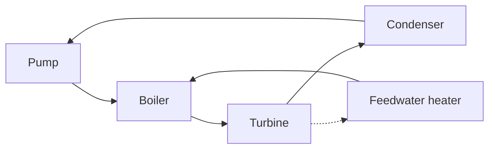

# Vapor and Combined Power Cycles

Vapor power cycles exploit phase change. A pump raises the pressure of liquid water with small work input, a boiler adds heat to produce high-pressure vapor, a turbine extracts work, and a condenser rejects heat to return the working fluid to liquid. The Rankine cycle is the practical alternative to the Carnot vapor cycle because it avoids compressing a wet mixture and accommodates real boilers and turbines.

Cengel develops the ideal Rankine cycle, actual deviations, reheat, regeneration, cogeneration, and combined gas-vapor cycles. The design logic is temperature management: raise the average temperature of heat addition, lower the average temperature of heat rejection, keep turbine moisture within limits, and recover heat where it has enough temperature to be useful.

## Definitions

- The **Rankine cycle** is the ideal vapor power cycle: pump, boiler, turbine, condenser.
- **Pump work** is small because liquid specific volume is small: $w_p\approx v(P_2-P_1)$.
- **Boiler heat input** raises compressed liquid to saturated liquid, vaporizes it, and often superheats it.
- **Turbine work** comes from vapor enthalpy drop. Moisture at turbine exit must be limited to avoid blade erosion.
- **Condenser heat rejection** condenses low-pressure vapor to saturated liquid, closing the cycle.
- **Reheat** expands steam in stages with reheating between turbines, increasing turbine exit quality and often increasing net work.
- **Regeneration** bleeds steam from the turbine to heat feedwater before the boiler, raising the average heat-addition temperature.
- An **open feedwater heater** mixes extracted steam with feedwater at the same pressure. A **closed feedwater heater** transfers heat across a surface without mixing.
- **Cogeneration** produces both useful work and useful process heat from the same fuel input.
- A **combined cycle** uses a gas turbine topping cycle and a steam Rankine bottoming cycle, recovering high-temperature exhaust heat in a heat recovery steam generator.

Real plants include pressure drops, non-isentropic pumps and turbines, heat losses, mechanical losses, and condenser limitations. The ideal cycle remains useful because it isolates the thermodynamic benefit of pressure, temperature, reheat, and regeneration changes before component details are added.
For this topic, a complete engineering model should state the boundary, the time basis, the property model, and the sign convention before any numbers are substituted. In vapor and combined power cycles, that habit is especially important because several formulas look similar while answering different physical questions. A closed-system expression, a steady-flow expression, an ideal-gas relation, and a property-table interpolation may all contain pressure, temperature, or enthalpy, but they do not have the same assumptions. The safest workflow is to write the general balance or defining relation first, cancel terms with a written reason, and only then insert table values or constants.

The second modeling habit is to keep the basis visible. Some calculations are per unit mass, some per mole, some per kg dry air, and some per unit time. A correct formula on the wrong basis is a common source of errors that look numerically plausible. When a table gives $\mathrm{kJ/kg}$, multiply by $\dot m$ to get $\mathrm{kW}$; when a reaction is balanced in kmol, convert to mass only after the element balance is complete; when a mixture property uses mole fraction, do not substitute mass fraction without conversion.

## Key results

For the ideal Rankine cycle,

$$
\begin{aligned}
w_t &= h_3-h_4, \\
w_p &= h_2-h_1 \approx v_1(P_2-P_1), \\
q_{in} &= h_3-h_2, \\
q_{out} &= h_4-h_1, \\
\eta_{th} &= \frac{w_t-w_p}{q_{in}}.
\end{aligned}
$$

The pump raises pressure nearly isentropically while the fluid remains liquid. The turbine is ideally isentropic, so $s_4=s_3$ and the exit quality at condenser pressure is found from

$$
x_4=\frac{s_4-s_f}{s_{fg}}.
$$

Ways to improve Rankine efficiency include lowering condenser pressure, superheating to higher turbine inlet temperature, increasing boiler pressure, reheating, and regenerating feedwater heating. Each has constraints. Lower condenser pressure can increase moisture; high boiler pressure may reduce exit quality; superheat is limited by materials; regeneration improves efficiency but reduces the mass flow through later turbine stages.

For a combined gas-vapor plant, the total thermal efficiency is

$$
\eta=\frac{\dot W_{gas}+\dot W_{steam}}{\dot Q_{fuel}}.
$$

The bottoming cycle uses energy that would otherwise leave with gas-turbine exhaust, but only the exergy above the steam-cycle temperature levels can be converted effectively.
These results should be read as a hierarchy rather than a list of isolated equations. Conservation of mass and energy set the allowed accounting; property relations supply the missing state data; the second law or equilibrium criterion decides direction, limits, and losses. A numerical answer is not finished until it passes three checks: the units reduce to the requested quantity, the sign matches the stated energy or entropy transfer direction, and the magnitude is reasonable compared with a limiting case. Useful limiting cases include zero heat transfer, reversible operation, incompressible behavior, ideal-gas behavior, saturated-liquid or saturated-vapor endpoints, and equal reservoir temperatures.

Because the textbook often moves between exact laws and engineering approximations, the approximation should be named in the solution. Examples include constant specific heats, negligible kinetic energy, negligible pump work, adiabatic devices, isentropic turbomachinery, ideal-gas mixtures, dry-air approximations, and linear interpolation. Naming the approximation makes later refinement straightforward: replace the approximate property model or restore the neglected term without rebuilding the whole analysis.

## Visual



| Modification | Main benefit | Main tradeoff |
|---|---|---|
| Lower condenser pressure | lowers heat-rejection temperature | may increase turbine moisture |
| Superheat | raises heat-addition temperature and exit quality | material temperature limit |
| Reheat | improves quality and work output | added equipment and controls |
| Regeneration | raises feedwater temperature | reduces low-pressure turbine flow |
| Combined cycle | recovers gas-turbine exhaust heat | integration complexity |

## Worked example 1: ideal Rankine-cycle efficiency

**Problem.** An ideal Rankine cycle operates with condenser pressure $10\ \mathrm{kPa}$ and boiler pressure $8\ \mathrm{MPa}$. Saturated liquid leaves the condenser. Steam enters the turbine at $8\ \mathrm{MPa}$ and $480{}^{\circ}C$ with $h_3\approx3335\ \mathrm{kJ/kg}$ and $s_3\approx6.82\ \mathrm{kJ/(kg\,K)}$. At $10\ \mathrm{kPa}$, use $h_f=191.8\ \mathrm{kJ/kg}$, $h_{fg}=2392\ \mathrm{kJ/kg}$, $s_f=0.649\ \mathrm{kJ/(kg\,K)}$, $s_{fg}=7.501\ \mathrm{kJ/(kg\,K)}$, and $v_f=0.00101\ \mathrm{m^3/kg}$. Estimate efficiency.

**Method.**

1. Pump work:

$$
w_p\approx v_f(P_2-P_1)=0.00101(8000-10)=8.07\ \mathrm{kJ/kg}.
$$

2. Pump exit enthalpy:

$$
h_2=h_1+w_p=191.8+8.07=199.9\ \mathrm{kJ/kg}.
$$

3. Turbine exit is isentropic, so $s_4=s_3$. Quality:

$$
x_4=\frac{6.82-0.649}{7.501}=0.823.
$$

4. Turbine exit enthalpy:

$$
h_4=191.8+0.823(2392)=2161\ \mathrm{kJ/kg}.
$$

5. Work and heat:

$$
w_t=3335-2161=1174\ \mathrm{kJ/kg},
$$

$$
q_{in}=3335-199.9=3135\ \mathrm{kJ/kg}.
$$

6. Efficiency:

$$
\eta=\frac{1174-8.07}{3135}=0.372.
$$

**Checked answer.** The ideal efficiency is about $37\%$. The turbine exit quality is $82\%$, low enough that reheat or altered pressure choices may be considered.

## Worked example 2: open feedwater heater extraction fraction

**Problem.** In an ideal regenerative Rankine cycle, feedwater enters an open feedwater heater at $h_2=200\ \mathrm{kJ/kg}$, extracted steam enters at $h_6=2700\ \mathrm{kJ/kg}$, and saturated liquid leaves at $h_3=640\ \mathrm{kJ/kg}$. Find the extraction fraction $y$ per kg of boiler flow.

**Method.**

1. Take the open feedwater heater as an adiabatic mixing chamber.
2. Let $y$ kg of extracted steam mix with $(1-y)$ kg of feedwater to produce $1$ kg leaving.
3. Energy balance:

$$
yh_6+(1-y)h_2=h_3.
$$

4. Solve:

$$
y(h_6-h_2)=h_3-h_2.
$$

5. Substitute:

$$
y=\frac{640-200}{2700-200}=\frac{440}{2500}=0.176.
$$

**Checked answer.** About $17.6\%$ of the main steam flow is extracted. This reduces low-pressure turbine work but raises the feedwater temperature and can increase cycle efficiency.

## Code

```python
def rankine_efficiency(h1, v1, P1, P2, h3, s3, sf, sfg, hfg):
    wp = v1 * (P2 - P1)
    h2 = h1 + wp
    x4 = (s3 - sf) / sfg
    h4 = h1 + x4 * hfg
    wt = h3 - h4
    qin = h3 - h2
    return x4, (wt - wp) / qin

def open_fwh_fraction(h_feed, h_bleed, h_exit):
    return (h_exit - h_feed) / (h_bleed - h_feed)

print(rankine_efficiency(191.8, 0.00101, 10, 8000, 3335, 6.82, 0.649, 7.501, 2392))
print(open_fwh_fraction(200, 2700, 640))
```

## Common pitfalls

- Forgetting that pump work is small but not always zero in high-pressure cycles.
- Using turbine exit enthalpy without first determining whether the exit is wet or superheated.
- Assuming lowering condenser pressure always helps without checking exit quality.
- Applying a single mass flow rate through all turbine stages in regenerative cycles despite bleed flows.
- Confusing heat recovery in a combined cycle with perfect conversion of exhaust energy to work.
- Starting from a special-case equation before checking that its assumptions actually hold. Write the general balance or definition first, then reduce it.
- Leaving property-table values unlabeled. Record the substance, phase region, pressure or temperature row, interpolation fraction, and units so the result can be audited.
- Rounding intermediate states too aggressively. Keep extra digits through property lookup, quality calculation, and efficiency ratios, then round the final answer to justified precision.
- Skipping a limiting-case check. Test the result against reversible operation, zero pressure drop, saturated endpoints, ideal-gas behavior, or equal-temperature reservoirs when those limits are meaningful.
- Treating a numerical solver or chart as a substitute for physical reasoning. Software can return a precise-looking number even when the selected phase, reference state, or boundary model is wrong.
- Forgetting to state whether the reported answer is specific, total, or rate based.

## Connections

- [pure substances and property tables](/physics/thermodynamics/pure-substances-and-property-tables)
- [exergy and second-law efficiency](/physics/thermodynamics/exergy-and-second-law-efficiency)
- [gas power cycles](/physics/thermodynamics/gas-power-cycles)
- [microscopic foundations](/physics/statistical-mechanics/)
- [basic thermal physics](/physics/general/)
- [thermochemistry](/chemistry/general/thermochemistry)
- [physical chemistry](/chemistry/physical-chemistry/)
- [engineering mathematics](/math/engineering-math/)
- [thermal systems control](/cs/control-engineering/)
