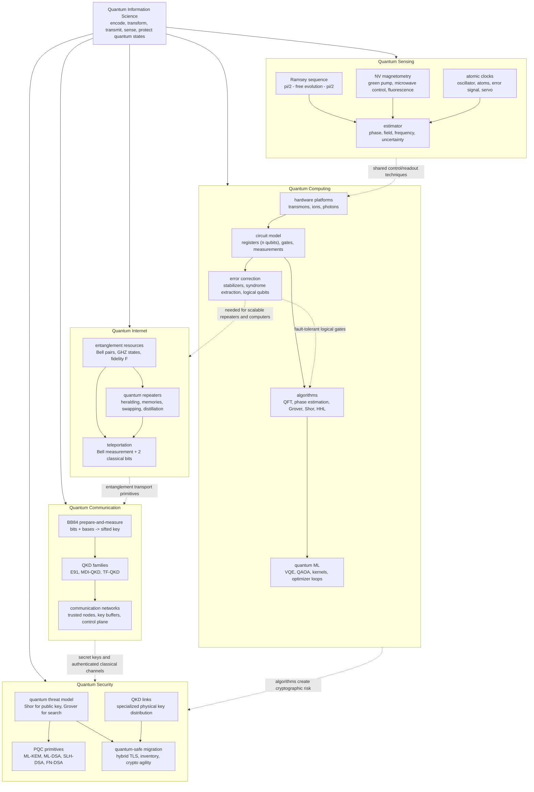

# Quantum Information Science

The discipline that studies how information is encoded, stored, transformed, transmitted, sensed, and protected using quantum-mechanical degrees of freedom. SJ Wiki organizes the field into five sister areas:

The map is an architecture overview of the QIS section rather than a directory tree. Each domain shows its internal building blocks and the labeled dotted arrows show the cross-domain contracts: computing supplies the algorithms that create security risk, communication supplies keys and authenticated channels, the quantum internet transports entanglement, and error correction supports scalable computing and repeaters. The diagram also makes the I/O style visible, from qubit registers and Bell pairs to sifted keys, estimator outputs, and migration targets.

## Areas

1. **[Quantum Computing](/quantum-information-science/quantum-computing/intro)** — hardware platforms, quantum algorithms, error correction, and quantum machine learning.
2. **[Quantum Communication](/quantum-information-science/quantum-communication/intro)** — BB84, QKD families, and quantum-network architectures.
3. **[Quantum Internet](/quantum-information-science/quantum-internet/intro)** — entanglement distribution, teleportation as a primitive, and quantum repeaters.
4. **[Quantum Sensing](/quantum-information-science/quantum-sensing/intro)** — quantum metrology, atomic clocks, magnetometry, gravimetry.
5. **[Quantum Security](/quantum-information-science/quantum-security/intro)** — post-quantum cryptography (PQC) and quantum-safe-crypto migration.

## Sister sections in this wiki

- **[Quantum Mechanics](/physics/quantum-mechanics/intro)** — the physical theory underneath everything in QIS.
- **[Linear Algebra](/math/linear-algebra/intro)** — Hilbert spaces, unitaries, and inner-product geometry.
- **[Cryptography](/cs/cryptography/intro)** — classical cryptography that PQC must replace under quantum threat.
- **[Reinforcement Learning](/cs/reinforcement-learning/intro)** and **[Deep Learning](/cs/deep-learning/intro)** — classical ML methods that quantum ML borrows from and competes with.

## How these notes are organized

Each area starts with an **intro** page and breaks into 2-4 sub-pages by major topic. Pages emphasize:

- **Dirac notation** with explicit matrix forms for small systems.
- **Worked circuits** computed by hand on 1-3 qubits.
- **Qiskit / Cirq snippets** for executable examples.
- **Connections** across the QIS areas (e.g., QKD security proofs rely on no-cloning; quantum repeaters connect Internet to communication; PQC sits at the QIS / cryptography boundary).

*Content is being populated incrementally. Drop textbooks or papers into `tmp/` and request an agent run.*
