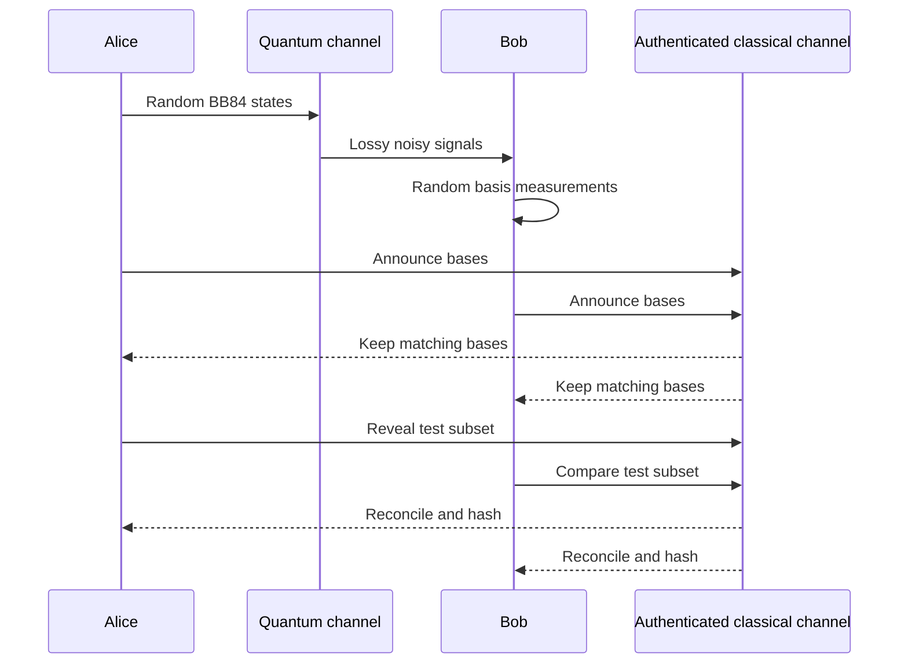

# BB84 Protocol

BB84, introduced by Bennett and Brassard in 1984, is the reference prepare-and-measure protocol for quantum key distribution. It is simple enough to compute by hand and rich enough to expose the main engineering issues of practical QKD: random basis choice, basis sifting, QBER estimation, error reconciliation, privacy amplification, authentication, imperfect photon sources, and detector assumptions.

The protocol's central trick is that Alice does not encode every bit in one known basis. She randomly alternates between the computational basis $\{\lvert 0\rangle,\lvert 1\rangle\}$ and the diagonal basis $\{\lvert +\rangle,\lvert -\rangle\}$. Bob also chooses a random basis before learning Alice's choice. After transmission, they publicly reveal only basis choices, not raw bit values except for a test sample. Matching-basis rounds can become key; mismatched-basis rounds are discarded.

## Definitions

The two BB84 bases are usually denoted $Z$ and $X$:

$$
Z=\{\lvert 0\rangle,\lvert 1\rangle\}, \qquad
X=\{\lvert +\rangle,\lvert -\rangle\}.
$$

The diagonal states are

$$
\lvert +\rangle = \frac{\lvert 0\rangle+\lvert 1\rangle}{\sqrt{2}},
\qquad
\lvert -\rangle = \frac{\lvert 0\rangle-\lvert 1\rangle}{\sqrt{2}}.
$$

A common bit convention is:

| Basis | Bit 0 | Bit 1 |
|---|---|---|
| $Z$ | $\lvert 0\rangle$ | $\lvert 1\rangle$ |
| $X$ | $\lvert +\rangle$ | $\lvert -\rangle$ |

**Raw key** is the sequence of Bob's measurement results before basis comparison.

**Sifted key** is the subsequence kept after Alice and Bob reveal bases and discard rounds where Bob measured in the wrong basis.

**Parameter-estimation sample** is a random subset of the sifted key revealed publicly to estimate QBER. Revealed sample bits are removed from the key.

**Information reconciliation** is classical error correction that makes Alice's and Bob's remaining strings identical with high probability. Cascade is an interactive parity-check method; LDPC and other modern codes can be more efficient and less chatty.

**Privacy amplification** applies a public universal hash function to the reconciled string, shortening it enough that Eve's residual information becomes negligible under the security proof.

**Decoy-state BB84** is the standard practical extension for weak coherent laser pulses. Alice randomly varies pulse intensity so that multi-photon and single-photon contributions can be statistically bounded, limiting photon-number-splitting attacks.

## Key results

The ideal BB84 workflow is:

1. Alice samples random bit values and random bases.
2. For each round, Alice prepares the corresponding BB84 state and sends it over the quantum channel.
3. Bob independently samples a random basis and measures the received state.
4. Alice and Bob use the authenticated classical channel to announce bases.
5. They keep only matching-basis rounds.
6. They reveal a random subset of the sifted bits to estimate QBER.
7. If the error estimate and finite-size bounds exceed the protocol's tolerance, they abort.
8. Otherwise they run reconciliation, verify equality with an authentication tag, and run privacy amplification.

The ideal sifting rate is about $1/2$ because two independent uniform basis choices match with probability

$$
\Pr(A_{\text{basis}}=B_{\text{basis}})=\frac{1}{2}.
$$

The wrong-basis measurement is unbiased. For example, if Alice sends $\lvert 0\rangle$ and Bob measures in the $X$ basis:

$$
\Pr(+\mid 0)=|\langle +\mid 0\rangle|^2=\frac{1}{2}, \qquad
\Pr(-\mid 0)=|\langle -\mid 0\rangle|^2=\frac{1}{2}.
$$

The intercept-resend QBER on sifted bits is $25\%$, as shown on the overview page. Security proofs handle more general attacks by relating bit errors, phase errors, and Eve's possible information. For an asymptotic idealized BB84 calculation with one-way error correction, a common secret fraction has the form

$$
r \approx 1 - 2h_2(Q),
$$

where

$$
h_2(Q) = -Q\log_2 Q - (1-Q)\log_2(1-Q)
$$

is the binary entropy. This formula is not a production key-rate formula; finite-size effects, detector behavior, basis biasing, decoy estimates, reconciliation leakage, and composable security parameters change the final expression. It does show the basic tradeoff: higher QBER means more reconciliation leakage and more privacy-amplification compression.

With weak coherent pulses, the photon number is often modeled as Poisson with mean $\mu$:

$$
\Pr(N=n)=e^{-\mu}\frac{\mu^n}{n!}.
$$

The multi-photon probability is

$$
\Pr(N\ge 2)=1-e^{-\mu}(1+\mu).
$$

Multi-photon pulses matter because Eve might keep one photon and forward another without introducing the same disturbance as intercept-resend. Decoy-state analysis estimates the single-photon yield and error rate by comparing detection statistics at several intensities, allowing secure key extraction from the single-photon component even when the source sometimes emits multiple photons.

## Visual



| Step | Public information | Secret information | Failure mode checked |
|---|---|---|---|
| State preparation | None | Alice's basis and bit | Source bias, multi-photon leakage |
| Measurement | None | Bob's basis and outcome | Detector efficiency mismatch |
| Sifting | Bases only | Matching-basis bit values | Basis-dependent loss |
| QBER estimation | Test bits | Untested sifted bits | Channel noise or eavesdropping |
| Reconciliation | Parities or syndromes | Corrected key | Leakage must be counted |
| Privacy amplification | Hash choice | Short final key | Eve's residual information |

## Worked example 1: Trace a 12-round BB84 run

**Problem.** Alice sends 12 BB84 signals. The table gives Alice's bits and bases, Bob's bases, and Bob's measurement results. Determine the sifted key, estimate QBER from the first four sifted positions, and write the remaining candidate key.

| Round | Alice bit | Alice basis | Bob basis | Bob bit |
|---:|---:|---|---|---:|
| 1 | 1 | Z | Z | 1 |
| 2 | 0 | X | Z | 1 |
| 3 | 1 | X | X | 1 |
| 4 | 0 | Z | X | 0 |
| 5 | 1 | Z | Z | 0 |
| 6 | 0 | X | X | 0 |
| 7 | 0 | Z | Z | 0 |
| 8 | 1 | X | Z | 0 |
| 9 | 1 | X | X | 1 |
| 10 | 0 | Z | Z | 0 |
| 11 | 0 | X | X | 1 |
| 12 | 1 | Z | X | 1 |

**Method.**

1. Keep only rounds with matching bases:

   - Round 1: $Z=Z$, keep Alice $1$, Bob $1$.
   - Round 3: $X=X$, keep Alice $1$, Bob $1$.
   - Round 5: $Z=Z$, keep Alice $1$, Bob $0$.
   - Round 6: $X=X$, keep Alice $0$, Bob $0$.
   - Round 7: $Z=Z$, keep Alice $0$, Bob $0$.
   - Round 9: $X=X$, keep Alice $1$, Bob $1$.
   - Round 10: $Z=Z$, keep Alice $0$, Bob $0$.
   - Round 11: $X=X$, keep Alice $0$, Bob $1$.

2. The sifted strings are therefore

$$
A_{\text{sift}} = 1\,1\,1\,0\,0\,1\,0\,0,
$$

$$
B_{\text{sift}} = 1\,1\,0\,0\,0\,1\,0\,1.
$$

3. Use the first four sifted positions as the public test sample:

   | Sift index | Alice | Bob | Error? |
   |---:|---:|---:|---|
   | 1 | 1 | 1 | no |
   | 2 | 1 | 1 | no |
   | 3 | 1 | 0 | yes |
   | 4 | 0 | 0 | no |

4. The sample QBER is

$$
Q_{\text{sample}} = \frac{1}{4}=25\%.
$$

5. Remove those revealed sample bits. The remaining candidate strings are

$$
A_{\text{remain}} = 0\,1\,0\,0,
\qquad
B_{\text{remain}} = 0\,1\,0\,1.
$$

**Checked answer.** The sample QBER is $25\%$, which is too high for this tiny toy run under normal assumptions, so Alice and Bob would abort rather than keep `0100` and `0101`. The remaining strings also differ in the last bit, confirming that reconciliation would be needed even if the test sample had not caused an abort.

## Worked example 2: Multi-photon probability for a weak coherent source

**Problem.** A practical BB84 transmitter uses phase-randomized weak coherent pulses with mean photon number $\mu=0.2$. Compute the probabilities of sending zero photons, one photon, and at least two photons. Explain why decoy states are needed.

**Method.**

1. Use the Poisson law:

$$
\Pr(N=n)=e^{-\mu}\frac{\mu^n}{n!}.
$$

2. Vacuum probability:

$$
\Pr(N=0)=e^{-0.2}\approx 0.8187.
$$

3. Single-photon probability:

$$
\Pr(N=1)=e^{-0.2}(0.2)\approx 0.8187\cdot 0.2=0.1637.
$$

4. Multi-photon probability:

$$
\Pr(N\ge 2)=1-\Pr(N=0)-\Pr(N=1)
$$

$$
=1-0.8187-0.1637=0.0176.
$$

5. Convert to percentages:

$$
\Pr(N=0)\approx 81.87\%,\quad
\Pr(N=1)\approx 16.37\%,\quad
\Pr(N\ge2)\approx 1.76\%.
$$

**Checked answer.** About $1.76\%$ of pulses contain multiple photons. That sounds small, but over billions of pulses it is a large population. Decoy-state BB84 randomly changes $\mu$ so Alice and Bob can estimate how detections depend on photon number and prevent Eve from hiding a photon-number-splitting attack inside ordinary channel loss.

## Code

```python
import hashlib
import math
import random

def binary_entropy(q):
    if q <= 0.0 or q >= 1.0:
        return 0.0
    return -q * math.log2(q) - (1 - q) * math.log2(1 - q)

def toy_bb84(n=10_000, intercept_probability=0.0):
    alice_bits = [random.randrange(2) for _ in range(n)]
    alice_bases = [random.choice("ZX") for _ in range(n)]
    bob_bases = [random.choice("ZX") for _ in range(n)]
    bob_bits = []

    for bit, basis, bob_basis in zip(alice_bits, alice_bases, bob_bases):
        sent_bit, sent_basis = bit, basis
        if random.random() < intercept_probability:
            eve_basis = random.choice("ZX")
            eve_bit = sent_bit if eve_basis == sent_basis else random.randrange(2)
            sent_bit, sent_basis = eve_bit, eve_basis
        bob_bits.append(sent_bit if bob_basis == sent_basis else random.randrange(2))

    sift = [i for i in range(n) if alice_bases[i] == bob_bases[i]]
    errors = sum(alice_bits[i] != bob_bits[i] for i in sift)
    qber = errors / len(sift)

    # Toy privacy amplification: hash Alice's sifted bits down according to
    # the asymptotic secret fraction max(0, 1 - 2 h2(Q)).
    secret_fraction = max(0.0, 1.0 - 2.0 * binary_entropy(qber))
    sifted_string = "".join(str(alice_bits[i]) for i in sift)
    digest = hashlib.sha256(sifted_string.encode()).hexdigest()
    return len(sift), qber, secret_fraction, digest[:16]

for p in [0.0, 0.25, 1.0]:
    kept, qber, fraction, tag = toy_bb84(intercept_probability=p)
    print(f"intercept={p:.2f} kept={kept} qber={qber:.3f} secret_fraction={fraction:.3f} tag={tag}")
```

This is not a security implementation. It has no finite-key analysis, no real reconciliation, no authenticated transcript, and no decoy-state estimation. It is useful for verifying the sifting rate, the intercept-resend QBER trend, and the entropy penalty intuition.

## Common pitfalls

- Keeping mismatched-basis bits. In BB84 those bits are random relative to Alice's values and should not enter the raw key.
- Revealing test bits and then using them. Once a bit is disclosed for QBER estimation, it is public and must be removed.
- Treating the asymptotic $1-2h_2(Q)$ expression as a full engineering key-rate formula. Real deployments need finite-size statistics, leakage accounting, and device models.
- Ignoring losses during sifting. Loss can be basis dependent, and that can create security issues if not modeled.
- Believing weak coherent pulses are single photons. Multi-photon pulses are rare but security-relevant; decoy states are not optional in most practical optical BB84 systems.
- Forgetting that reconciliation leaks information. Every public parity, syndrome, or interactive correction message must be counted before privacy amplification.
- Assuming detector attacks are solved by BB84 itself. Standard BB84 security statements depend on assumptions about measurement devices unless the protocol is modified, for example with MDI-QKD.

## Connections

- [Quantum Communication](/quantum-information-science/quantum-communication/intro) for the area overview and the no-cloning intuition.
- [Quantum Key Distribution](/quantum-information-science/quantum-communication/qkd) for B92, six-state, E91, decoy-state BB84, MDI-QKD, TF-QKD, and DI-QKD.
- [Quantum Network](/quantum-information-science/quantum-communication/quantum-network) for how BB84 links are composed into larger systems.
- [Quantum Internet](/quantum-information-science/quantum-internet/intro) and [Quantum Repeater](/quantum-information-science/quantum-internet/quantum-repeater) for architectures that move beyond direct lossy links.
- [Perfect Secrecy and One-Time Pad](/cs/cryptography/perfect-secrecy-one-time-pad) for how QKD-generated keys can be consumed.
- [Message Authentication Codes](/cs/cryptography/message-authentication-codes) for the authentication assumption behind the classical channel.
- [Measurement and Interpretation](/physics/quantum-mechanics/measurement-interpretation) for the measurement disturbance underlying the protocol.
