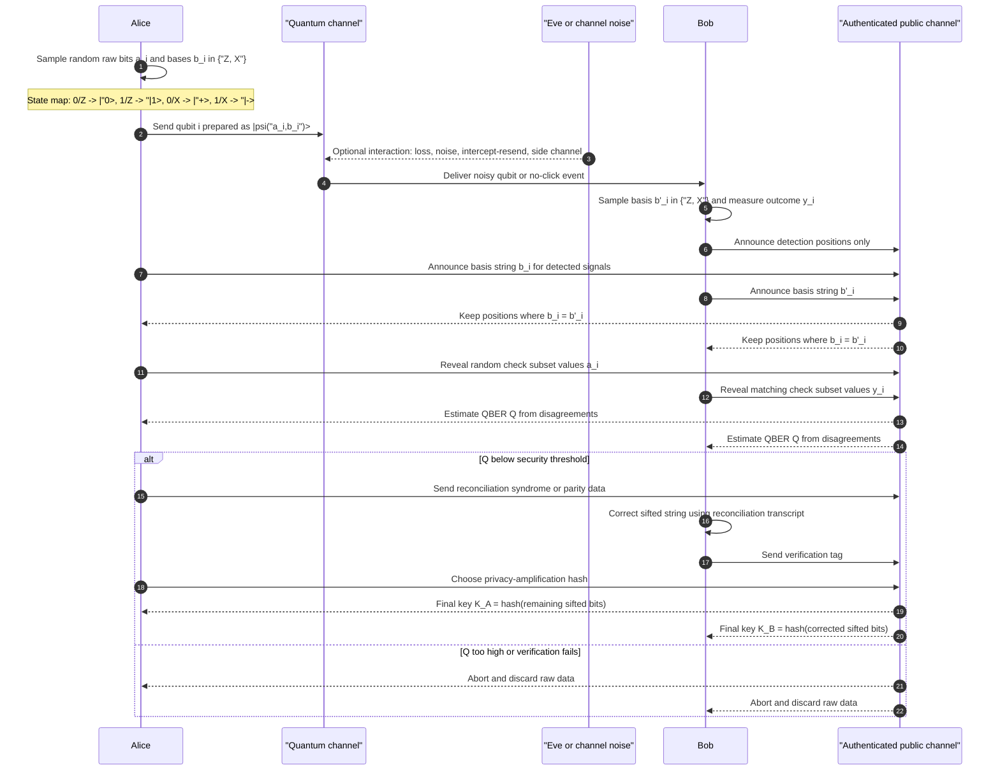

# BB84 Protocol

BB84, introduced by Bennett and Brassard in 1984, is the canonical prepare-and-measure protocol for quantum key distribution. It turns random choices of basis and bit into a shared secret key by exploiting a simple quantum fact: nonorthogonal states cannot be perfectly distinguished without risk of disturbance. In the quantum communication section of SJ Wiki, BB84 is the local reference point for [QKD](/quantum-information-science/quantum-communication/qkd), trusted-device security models, and the way physical quantum signals are converted into classical cryptographic key material.

This page is now combined with the treatment in Nielsen and Chuang, especially Chapter 12 of *Quantum Computation and Quantum Information*. That textbook gives the clean conceptual route from BB84 to security: first prove security for an entanglement-based protocol, use random sampling to bound errors, use CSS codes to handle bit and phase errors, then reduce the protocol until only BB84 state preparation and single-qubit measurement remain. The older engineering discussion is preserved where it clarifies practical QKD, but the notation and security framing here follow Nielsen and Chuang.


*Figure: The canonical BB84 story is a physical link: Alice prepares nonorthogonal states, Bob measures them, and Eve cannot learn them all without changing the statistics. Image: [Wikimedia Commons](https://commons.wikimedia.org/wiki/File:BB84-network_setup.svg), Andy Spencer, CC BY-SA 3.0.*

## Definitions

The two BB84 bases are the $Z$ basis and the $X$ basis:

$$
Z=\{\lvert 0\rangle,\lvert 1\rangle\}, \qquad
X=\{\lvert +\rangle,\lvert -\rangle\}.
$$

The diagonal states are

$$
\lvert +\rangle=\frac{\lvert 0\rangle+\lvert 1\rangle}{\sqrt{2}},
\qquad
\lvert -\rangle=\frac{\lvert 0\rangle-\lvert 1\rangle}{\sqrt{2}}.
$$

Nielsen and Chuang write Alice's random basis string as $b$. One common convention is $b_i=0$ for the $Z$ basis and $b_i=1$ for the $X$ basis. Alice also has random data bits $a_i$. She sends $\lvert a_i b_i\rangle$, meaning

| $b_i$ | Basis | $a_i=0$ | $a_i=1$ |
|---:|---|---|---|
| 0 | $Z$ | $\lvert 0\rangle$ | $\lvert 1\rangle$ |
| 1 | $X$ | $\lvert +\rangle$ | $\lvert -\rangle$ |

**Raw data** are the measurement outcomes before public basis comparison. Bob has his own random basis string $b'$ and measurement outcomes $a'$.

**Sifted key** is the subsequence kept after Alice announces $b$ and Alice and Bob discard all positions where $b_i\ne b'_i$. In an ideal noiseless channel, the kept positions satisfy $a_i=a'_i$.

**Check bits** are a random subset of the sifted positions revealed publicly to estimate the error rate. Revealed check bits are discarded.

**QBER** is the quantum bit error rate on compared sifted bits:

$$
Q=\frac{\text{number of disagreements}}{\text{number of compared sifted bits}}.
$$

**Information reconciliation** is public classical error correction. In Nielsen and Chuang's CSS-code proof, a classical code $C_1$ corrects the bit errors: Alice announces enough information, such as $x-v_k$, for Bob to correct his noisy string to the same codeword $v_k\in C_1$.

**Privacy amplification** compresses the reconciled string so that Eve's remaining information about the final key is negligible. In the same proof, a subcode $C_2\subset C_1$ implements this compression: Alice and Bob compute the coset $v_k+C_2$ in $C_1$ and use the coset label as the key.

**Holevo information** for an ensemble $\{p_x,\rho_x\}$ is

$$
\chi = S(\rho)-\sum_x p_x S(\rho_x),
\qquad
\rho=\sum_x p_x\rho_x,
$$

where $S(\rho)=-\mathrm{tr}(\rho\log_2\rho)$ is von Neumann entropy. Holevo's theorem says that for any measurement producing classical outcome $Y$ from Alice's classical variable $X$,

$$
I(X:Y)\le \chi.
$$

For BB84, this theorem is not the entire proof, but it supplies the information-theoretic language for bounding Eve's accessible information after Alice and Bob have certified that their state is close to ideal.

## Key results

The basic BB84 protocol can be written in the notation of Nielsen and Chuang as follows.

1. Alice chooses random data bits and a random basis string $b$.
2. She sends each bit as a $Z$-basis or $X$-basis qubit according to $b$.
3. Bob receives the qubits, announces reception, and measures each qubit in a random $Z$ or $X$ basis.
4. Alice announces $b$.
5. Alice and Bob discard positions where Bob used the wrong basis.
6. They keep a fixed-size sifted block if enough positions remain; otherwise they abort.
7. Alice randomly chooses check positions and announces them.
8. Alice and Bob compare the check bits. If more than the allowed threshold $t$ disagree, they abort.
9. On the remaining bits, they run information reconciliation and privacy amplification to obtain the final key.

The sifting rate is about $1/2$ with uniform basis choices because

$$
\Pr(b_i=b'_i)=\Pr(0,0)+\Pr(1,1)=\frac{1}{4}+\frac{1}{4}=\frac{1}{2}.
$$

The wrong-basis measurement is unbiased. If Alice sends $\lvert 0\rangle$ and Bob measures in the $X$ basis, then

$$
\Pr(+\mid 0)=|\langle +\mid 0\rangle|^2=\frac{1}{2},
\qquad
\Pr(-\mid 0)=|\langle -\mid 0\rangle|^2=\frac{1}{2}.
$$

This is the local calculation behind eavesdropping detection. In an intercept-resend attack, Eve guesses Alice's basis correctly half the time. In the other half, she resends a state in the wrong basis. Conditioned on Alice and Bob later keeping the round, Bob then disagrees with Alice with probability $1/2$. The expected QBER on sifted positions is therefore

$$
Q_{\text{intercept}}=\frac{1}{2}\cdot\frac{1}{2}=\frac{1}{4}.
$$

Nielsen and Chuang's security proof is stronger than this intercept-resend calculation. The proof starts from an EPR-based protocol where Alice and Bob would like to share states close to

$$
\lvert \Phi^+\rangle^{\otimes m}
=\left(\frac{\lvert 00\rangle+\lvert 11\rangle}{\sqrt{2}}\right)^{\otimes m}.
$$

If their actual joint state has fidelity close to this ideal Bell-pair state, then Eve's information about the outcomes of $Z$-basis measurements is small. The information bound is expressed using Holevo's theorem: Eve may hold the purification of the noisy process, but once the Alice-Bob state is certified close to ideal, the entropy available to Eve is small, and hence her accessible classical information is small.

The next step is random sampling. Alice and Bob sacrifice randomly selected check bits. If the check error count is at most $t$, then, with high probability for large blocks, the untested bits have no more than the tolerated number of errors. In the EPR proof, the same idea bounds bit-flip and phase-flip errors in the Bell basis.

CSS codes provide the bridge to ordinary BB84. Let $C_2\subset C_1$ be classical linear codes chosen so that the corresponding CSS code corrects the relevant error patterns. The code $C_1$ reconciles Alice and Bob's bit strings: Bob corrects his string to Alice's codeword. The subcode $C_2$ performs privacy amplification: the final key is the coset of the reconciled word modulo $C_2$. Because the proof reduces an explicitly secure entanglement-distillation protocol to this classical procedure without changing Eve's conditioned quantum state, BB84 inherits the security claim in the idealized model.

For a simplified one-way asymptotic analysis, the secret fraction has the classical advantage-distillation shape

$$
r\ge I(A:B)-I(A:E),
$$

where $A$ is Alice's remaining raw bit, $B$ is Bob's correlated bit, and $E$ denotes Eve's side information. In the symmetric ideal BB84 case, the common Shor-Preskill-style expression is

$$
r \approx 1-2h_2(Q),
$$

where

$$
h_2(Q)=-Q\log_2Q-(1-Q)\log_2(1-Q).
$$

The formula says that bit errors cost reconciliation information and phase-error uncertainty costs privacy amplification. It is not a full device key-rate formula. Finite-size statistics, detector behavior, source flaws, authentication costs, leakage during reconciliation, and decoy-state estimates all affect a deployed system.

Nielsen and Chuang explicitly mark the proof as idealized. It assumes the transmitted states are the BB84 qubit states in the model. Practical optical QKD often uses attenuated lasers, not deterministic single photons. For phase-randomized weak coherent pulses with mean photon number $\mu$,

$$
\Pr(N=n)=e^{-\mu}\frac{\mu^n}{n!},
\qquad
\Pr(N\ge 2)=1-e^{-\mu}(1+\mu).
$$

Multi-photon pulses motivate decoy-state BB84, where Alice varies $\mu$ to estimate the single-photon yield and error rate and to limit photon-number-splitting attacks.

## Visual



The sequence shows every BB84 phase from bit/basis sampling through final key extraction. The note gives the explicit bit-to-state mapping, and the public-channel messages are separated from the quantum transmission so the reader can see exactly when bases, check bits, reconciliation data, and privacy-amplification choices are revealed. The abort branch is driven by the estimated QBER and verification outcome.

| Proof stage in Nielsen and Chuang | Operational meaning in BB84 | Security role |
|---|---|---|
| EPR pair generation | Imaginary entanglement-based version of the protocol | Makes ideal secrecy transparent |
| Random sampling | Public comparison of check bits | Bounds bit and phase error rates |
| CSS code $C_1$ | Classical information reconciliation | Corrects Bob's noisy string |
| Subcode $C_2$ | Privacy amplification by cosets | Compresses away Eve's information |
| Reduction to prepare-and-measure | Alice sends $Z$ or $X$ states and Bob measures immediately | Removes quantum memory and quantum computation |
| Holevo bound | $I(X:Y)\le \chi$ for Eve's accessible measurement information | Converts closeness-to-ideal into an information bound |

## Worked example 1: Trace a secure BB84 block

**Problem.** Alice sends 12 BB84 signals. The table gives Alice's bits and bases, Bob's bases, and Bob's measurement results. Determine the sifted strings, estimate the QBER from the first four sifted positions, and decide whether this toy block should continue if the allowed check threshold is $t=0$ errors in four check bits.

| Round | Alice bit | Alice basis | Bob basis | Bob bit |
|---:|---:|---|---|---:|
| 1 | 1 | Z | Z | 1 |
| 2 | 0 | X | Z | 1 |
| 3 | 1 | X | X | 1 |
| 4 | 0 | Z | X | 0 |
| 5 | 1 | Z | Z | 0 |
| 6 | 0 | X | X | 0 |
| 7 | 0 | Z | Z | 0 |
| 8 | 1 | X | Z | 0 |
| 9 | 1 | X | X | 1 |
| 10 | 0 | Z | Z | 0 |
| 11 | 0 | X | X | 1 |
| 12 | 1 | Z | X | 1 |

**Method.**

1. Keep only positions where Alice's and Bob's bases match: rounds 1, 3, 5, 6, 7, 9, 10, and 11.

2. Read Alice's sifted string:

$$
A_{\text{sift}}=1\,1\,1\,0\,0\,1\,0\,0.
$$

3. Read Bob's sifted string:

$$
B_{\text{sift}}=1\,1\,0\,0\,0\,1\,0\,1.
$$

4. Use the first four sifted positions as check bits:

| Sift index | Alice | Bob | Disagree? |
|---:|---:|---:|---|
| 1 | 1 | 1 | no |
| 2 | 1 | 1 | no |
| 3 | 1 | 0 | yes |
| 4 | 0 | 0 | no |

5. Count check errors:

$$
\text{errors}=1.
$$

6. Estimate QBER on the check sample:

$$
Q_{\text{check}}=\frac{1}{4}=25\%.
$$

7. Compare against the threshold $t=0$. Since $1\gt 0$, the protocol aborts.

**Checked answer.** The sifted strings are $A_{\text{sift}}=11100100$ and $B_{\text{sift}}=11000101$. The check sample has one error in four compared bits, so this toy block fails the stated threshold and Alice and Bob do not run reconciliation or privacy amplification. The remaining unrevealed positions would have been $A=0100$ and $B=0101$, which also shows why reconciliation would be needed if the block had passed.

## Worked example 2: Compute a Holevo-style secret-fraction bound

**Problem.** In a simplified asymptotic BB84 analysis, suppose the observed QBER is $Q=2\%$. Treat Alice and Bob's post-sifting correlation as a binary symmetric channel, so

$$
I(A:B)=1-h_2(Q).
$$

Assume the security proof and parameter estimation bound Eve's accessible information by $I(A:E)\le 0.12$ bits per sifted bit. Use

$$
r\ge I(A:B)-I(A:E)
$$

to lower-bound the secret fraction.

**Method.**

1. Compute the binary entropy:

$$
h_2(0.02)=-0.02\log_2(0.02)-0.98\log_2(0.98).
$$

2. Approximate the logarithms:

$$
\log_2(0.02)\approx -5.6439,
\qquad
\log_2(0.98)\approx -0.0291.
$$

3. Substitute:

$$
h_2(0.02)\approx -0.02(-5.6439)-0.98(-0.0291).
$$

$$
h_2(0.02)\approx 0.1129+0.0285=0.1414.
$$

4. Compute Alice-Bob mutual information:

$$
I(A:B)=1-0.1414=0.8586.
$$

5. Subtract Eve's information bound:

$$
r\ge 0.8586-0.12=0.7386.
$$

6. Interpret the result for a block of $n=10^6$ sifted unrevealed bits:

$$
\ell \lesssim 0.7386\cdot 10^6=738600
$$

final bits before additional finite-size and authentication margins.

**Checked answer.** The simplified bound gives at least about $0.739$ secret bits per sifted bit. This is a Holevo/Csiszar-Korner style calculation, not a complete finite-key proof: in a real BB84 security analysis, the estimate of $I(A:E)$ is itself derived from the observed parameters, and public reconciliation leakage plus failure probabilities must be subtracted explicitly.

## Code

```python
import math
import random

def binary_entropy(q):
    if q <= 0.0 or q >= 1.0:
        return 0.0
    return -q * math.log2(q) - (1.0 - q) * math.log2(1.0 - q)

def bb84_trial(rounds=100_000, intercept_probability=0.0):
    alice_bits = [random.randrange(2) for _ in range(rounds)]
    alice_bases = [random.randrange(2) for _ in range(rounds)]  # 0=Z, 1=X
    bob_bases = [random.randrange(2) for _ in range(rounds)]
    bob_bits = []

    for bit, basis, bob_basis in zip(alice_bits, alice_bases, bob_bases):
        sent_bit = bit
        sent_basis = basis

        if random.random() < intercept_probability:
            eve_basis = random.randrange(2)
            eve_bit = sent_bit if eve_basis == sent_basis else random.randrange(2)
            sent_bit = eve_bit
            sent_basis = eve_basis

        bob_bit = sent_bit if bob_basis == sent_basis else random.randrange(2)
        bob_bits.append(bob_bit)

    sifted = [i for i in range(rounds) if alice_bases[i] == bob_bases[i]]
    errors = sum(alice_bits[i] != bob_bits[i] for i in sifted)
    qber = errors / len(sifted)

    # Shor-Preskill asymptotic idealization for symmetric BB84.
    secret_fraction = max(0.0, 1.0 - 2.0 * binary_entropy(qber))
    return len(sifted) / rounds, qber, secret_fraction

for p in [0.0, 0.25, 0.50, 1.0]:
    sift_rate, qber, secret = bb84_trial(intercept_probability=p)
    print(
        f"intercept={p:.2f} "
        f"sift_rate={sift_rate:.3f} "
        f"qber={qber:.3f} "
        f"ideal_secret_fraction={secret:.3f}"
    )
```

This is a protocol sketch, not a QKD implementation. It has no authenticated transcript, no finite-key confidence interval, no real reconciliation code, no decoy-state estimation, and no detector model. It is useful for checking the $1/2$ sifting rate, the $25\%$ full intercept-resend QBER, and the entropy penalty in the idealized $1-2h_2(Q)$ expression.

## Common pitfalls

- Keeping mismatched-basis bits. In BB84, those bits are random relative to Alice's values and must not enter the key.
- Revealing check bits and then reusing them. Once a bit is publicly compared, it is public.
- Treating intercept-resend as the only attack. Nielsen and Chuang's proof is valuable because it handles coherent attacks through the EPR/CSS reduction, not just one-qubit measurements by Eve.
- Treating the Holevo bound as a complete BB84 proof. Holevo bounds accessible information once the relevant quantum state has been constrained; sampling, reconciliation, and privacy amplification still do real work.
- Forgetting reconciliation leakage. Every public syndrome, parity, or interactive message must be accounted for before choosing the final key length.
- Reading $1-2h_2(Q)$ as a deployed product formula. Finite-size effects, inefficient reconciliation, decoy statistics, authentication, device assumptions, and composable security parameters change the final rate.
- Ignoring source assumptions. Attenuated lasers produce multi-photon pulses with nonzero probability; decoy-state analysis is the standard way to keep weak coherent BB84 secure.
- Assuming the classical channel can be unauthenticated. Without authentication, Eve can mount a man-in-the-middle attack and run separate sessions with Alice and Bob.

## Connections

- [Quantum Communication](/quantum-information-science/quantum-communication/intro) for the area overview and the no-cloning intuition.
- [Quantum Key Distribution](/quantum-information-science/quantum-communication/qkd) for Holevo information, secret-key-rate accounting, B92, E91, decoy BB84, MDI-QKD, TF-QKD, and DI-QKD.
- [Quantum Network](/quantum-information-science/quantum-communication/quantum-network) for how BB84 links are composed into trusted-node or access networks.
- [Quantum Internet](/quantum-information-science/quantum-internet/intro) and [Quantum Repeater](/quantum-information-science/quantum-internet/quantum-repeater) for architectures beyond direct lossy QKD links.
- [Quantum Algorithms](/quantum-information-science/quantum-computing/algorithms) for no-cloning and measurement language used in the security intuition.
- [Quantum Error Correction](/quantum-information-science/quantum-computing/error-correction) for the CSS-code machinery behind the Nielsen-Chuang security proof.
- [Classical Cryptography](/cs/cryptography/intro), [Perfect Secrecy and One-Time Pad](/cs/cryptography/perfect-secrecy-one-time-pad), and [Message Authentication Codes](/cs/cryptography/message-authentication-codes) for how QKD-generated keys are consumed and authenticated.
- Primary textbook reference: Nielsen and Chuang, *Quantum Computation and Quantum Information*, Chapter 12, especially the Holevo bound and the reduction of CSS-code QKD to secure BB84.
