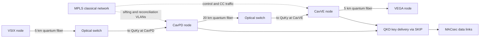

# Efficient-BB84 Metropolitan Network (2025)

Efficient-BB84 metropolitan networking is the step from a single laboratory QKD link to a managed key-producing utility: biased-basis BB84 variants reduce wasted detections, decoy statistics protect weak coherent sources, and optical switches let one QKD device serve several neighboring links over time. The 2025 VenQCI field report is useful because it describes a production four-node network rather than only a point-to-point rate experiment. Full citation: Alberto De Toni, Edoardo Bortolozzo, Alessandro Emanuele, Marco Venturini, Luca Calderaro, Marco Avesani, Giuseppe Vallone, and Paolo Villoresi, "Long-term analysis of efficient-BB84 4-node network with optical switches in metropolitan environment," arXiv:2510.16867v1, 2025.

The paper's central engineering message is conservative but important: a metropolitan QKD service can be run with ordinary network-management concerns in view. VenQCI connects VSIX, a Padova toll-booth node, a Mestre toll-booth node, and VEGA through 5 km, 20 km, and 5 km fiber spans. It uses ThinkQuantum QuKy devices, efficient-BB84 with three polarization states and one decoy level, iPOGNAC polarization encoding, Qubit4Sync synchronization, optical switches at intermediate nodes, MPLS for the classical network, MACsec on the data links, SKIP for key delivery, and ETSI-aligned QKD interfaces. The authors monitored two months of production operation from April to June 2025 and report stable low-percent QBER, raw and secret key generation sufficient for their rekeying workload, and no strong daily performance trend in their hourly grouping.

## Definitions

**Efficient-BB84** is a BB84-family prepare-and-measure protocol that avoids spending half of all detections on discarded basis choices. Standard textbook BB84 chooses the $Z$ and $X$ bases uniformly, so the probability that Alice and Bob choose the same basis is $1/2$. Efficient variants bias most signals toward the key-generating basis and reserve a smaller sample for the check basis. If Alice and Bob choose $Z$ with probability $p_Z$ and $X$ with probability $p_X=1-p_Z$, the asymptotic basis-match probability is

$$
p_{\mathrm{sift}}=p_Z^2+p_X^2.
$$

For $p_Z=0.9$, this gives $p_{\mathrm{sift}}=0.82$, which is much larger than $0.5$. The tradeoff is statistical: the check basis receives fewer samples, so finite-key confidence intervals must be handled carefully.

**Three-state efficient-BB84** uses a reduced set of polarization states compared with the four ideal BB84 states. The VenQCI paper states that the QuKy platform implements efficient-BB84 with three polarization states and one decoy level. The security point is not that fewer states are automatically safer, but that a loss-tolerant proof can use a carefully chosen reduced alphabet while preserving BB84-style key generation under the stated device assumptions.

**Decoy-state operation** is the standard practical response to weak coherent pulses. A phase-randomized coherent pulse with mean photon number $\mu$ has approximately Poisson photon-number statistics:

$$
\Pr(N=n)=e^{-\mu}\frac{\mu^n}{n!}.
$$

The multi-photon probability is

$$
\Pr(N\ge 2)=1-e^{-\mu}(1+\mu).
$$

Multi-photon pulses matter because Eve can try photon-number-splitting attacks. Decoy states vary the pulse intensity so Alice and Bob can estimate whether single-photon and multi-photon detections behave consistently with the channel model.

**Raw key rate (RKR)** in the VenQCI paper is the receiver detection rate before the final secret-key extraction. **Secret key rate (SKR)** is the secure-bit output rate after sifting, error correction, privacy amplification, and the protocol's security accounting. These rates should not be interchanged. A link can have a healthy raw detection rate and still produce little final key if QBER, finite-size uncertainty, or reconciliation leakage is too large.

**QBER** is the disagreement fraction between Alice's and Bob's corresponding sifted bits. In an efficient-BB84 deployment it is tracked by basis because the key basis and check basis have different statistical roles:

$$
Q_Z=\frac{\text{Z-basis errors}}{\text{Z-basis compared bits}},
\qquad
Q_X=\frac{\text{X-basis errors}}{\text{X-basis compared bits}}.
$$

**Optical link switching** means a node agent controls a local optical switch and selects which neighbor receives the quantum signal at a given time. VenQCI uses switches at intermediate nodes so a single QKD-capable device can be time-multiplexed across multiple adjacent links. This reduces initial hardware cost relative to installing one dedicated QKD pair per graph edge.

**Key balancing** and **coordinated switching** are the two switching policies described in the paper. Key balancing assigns switching resources according to key-buffer targets for each link. Coordinated switching advances when active links have generated a configured number of key blocks. The authors emphasize that the QKD devices can keep following local switching coordination if a central software-defined QKD controller is unavailable.

**Production integration** in the paper means the QKD-derived keys are consumed by classical security equipment, not merely printed as experimental output. VenQCI uses QKD-derived symmetric keys for periodic MACsec rekeying over a 100 Gbps MPLS backbone. The MACsec link initially boots from a pre-shared key, then refreshes with QKD-derived 32-byte keys each minute once QKD key material is available.

## Key results

The deployment has three layers of interest. At the quantum-link layer, the QuKy devices implement efficient-BB84 with one decoy level, phase randomization through laser gain switching, and a source-device-independent QRNG path for the qubit stream. The encoder is iPOGNAC, an all-fiber Sagnac-loop polarization modulator designed to passively cancel common-mode polarization drifts. Synchronization uses Qubit4Sync, which embeds a sparse known pattern in the quantum stream and estimates timing from single-photon timestamps, avoiding a bright synchronization pilot in the same optical path.

At the network layer, the production topology is a line of four active nodes:

| Segment | Reported fiber length | Role in the active topology |
|---|---:|---|
| VSIX to CavPD | 5 km | Short metro span into the Padova toll-booth node |
| CavPD to CavVE | 20 km | Longest active span in the reported four-node network |
| CavVE to VEGA | 5 km | Short metro span into the VEGA node |

The fifth physical node mentioned in the paper is excluded from the reported production analysis because it was used for research rather than active production service. The classical QKD channel for sifting, reconciliation, and key-management messages is carried by VLANs over the existing MPLS network. QKD keys are passed to Cisco NCS routers through SKIP, and those routers use the key material for MACsec on the data links.

At the orchestration layer, the optical switching mechanism is the main technique. Without switching, a degree-two intermediate node in a line topology would need a separate QKD receiver or transmitter relationship for each neighbor. With switching, a single QuKy can be scheduled across neighboring links. This does not remove the need to trust intermediate nodes in the classical key-management sense, and it does not create an end-to-end entanglement service. It is a practical trusted-node QKD network design that reduces hardware count and supports staged expansion.

The rate accounting can be summarized by a standard secret-key expression rather than by a single headline number. A simplified asymptotic decoy-state BB84 form is

$$
R \ge q\left[Q_1(1-h_2(e_1))-f_{\mathrm{EC}}Q_{\mu}h_2(E_{\mu})\right],
$$

where $q$ is the basis-sifting factor, $Q_1$ is the single-photon gain lower bound, $e_1$ is the single-photon error upper bound, $Q_{\mu}$ and $E_{\mu}$ are the observed gain and QBER for signal intensity $\mu$, and $f_{\mathrm{EC}}$ is the reconciliation inefficiency. VenQCI's actual implementation uses finite-key and device-specific post-processing, so this formula is a teaching model, not a reconstruction of the authors' internal key-rate engine.

The paper's measured results are best stated with their conditions attached. The authors collected RKR, SKR, QBER, and block-time data for two consecutive months from April to June 2025. Post-processing starts from 500 kB batches of sifted detections, taking roughly six minutes on average to accumulate and process. The QBER plots show low-percent behavior in both $X$ and $Z$ bases, with axes in the 0 to 2 percent range. The raw-rate plots sit around the high tens of kbps, while the secret-rate plots sit in the few-kbps range; the operational conclusion is that all links provided far more key material than the minute-scale 32-byte MACsec refresh required. The authors did not report a statistically significant daily trend after grouping by hour, although the CavVE-to-VEGA span showed higher variance and was flagged as requiring further investigation.

The main limitation is scope. Two months in spring 2025 is long enough to show operational stability but not long enough to prove seasonal robustness, maintenance-period resilience, or large heterogeneous scaling. The network is metropolitan and trusted-node oriented. It is a strong deployment case for QKD as a managed link-and-key service, not evidence that optical switching solves quantum repeaters, removes trusted relays, or gives device-independent security.

## Visual



| Quantity | Value or source statement | Conservative interpretation |
|---|---:|---|
| Active production nodes | 4 | VSIX, CavPD, CavVE, VEGA |
| Active fiber spans | 5 km, 20 km, 5 km | Metro-scale direct links, not repeater-scale links |
| QKD device family | ThinkQuantum QuKy | Efficient-BB84, one decoy level, polarization encoding |
| Key consumer | MACsec over MPLS | QKD supplies symmetric rekey material; MACsec encrypts traffic |
| MACsec refresh | 32 bytes per minute | Small demand compared with reported QKD production |
| Data-link capacity | up to 100 Gbps | Classical throughput, not QKD secret-key rate |
| Monitoring window | April to June 2025 | Two-month field observation, not seasonal proof |
| Sifted batch size | 500 kB | Used for post-processing blocks |
| Average block time | about 6 minutes | Includes operational switching and processing effects |

## Worked example 1: Basis bias and block throughput

**Problem.** Compare ordinary BB84 sifting with an efficient-BB84 basis bias, then estimate the average sifted-detection throughput implied by a 500 kB block produced in about six minutes. Finally compare that throughput with the 32-byte-per-minute MACsec rekey demand reported for VenQCI.

**Method.**

1. For ordinary BB84, Alice and Bob each choose $Z$ or $X$ uniformly. The probability of a basis match is

$$
p_{\mathrm{sift}}=(0.5)^2+(0.5)^2=0.25+0.25=0.50.
$$

2. For an efficient example with $p_Z=0.9$ and $p_X=0.1$, the match probability becomes

$$
p_{\mathrm{sift}}=(0.9)^2+(0.1)^2=0.81+0.01=0.82.
$$

3. The relative increase in retained detections is

$$
\frac{0.82}{0.50}=1.64.
$$

So the biased basis choice retains about $64\%$ more detections before finite-key penalties.

4. Convert the reported 500 kB sifted block into bits. Using $1\ \mathrm{kB}=1024\ \mathrm{bytes}$,

$$
500\ \mathrm{kB}=500\cdot1024\ \mathrm{bytes}=512000\ \mathrm{bytes}.
$$

$$
512000\ \mathrm{bytes}\cdot8=4096000\ \mathrm{bits}.
$$

5. Divide by the reported average block time of six minutes:

$$
6\ \mathrm{min}=360\ \mathrm{s}.
$$

$$
\frac{4096000\ \mathrm{bits}}{360\ \mathrm{s}}\approx11378\ \mathrm{bits/s}=11.38\ \mathrm{kbps}.
$$

6. A 32-byte MACsec key per minute corresponds to

$$
32\ \mathrm{bytes}\cdot8=256\ \mathrm{bits/min}.
$$

$$
\frac{256}{60}\approx4.27\ \mathrm{bits/s}.
$$

7. Compare the sifted-detection throughput with the rekey demand:

$$
\frac{11378}{4.27}\approx2665.
$$

**Checked answer.** The biased-basis example raises the ideal basis-match probability from $0.50$ to $0.82$. The reported 500 kB in six minutes corresponds to about $11.4$ kbps of sifted detections, roughly $2600$ times the bit rate needed for one 32-byte-per-minute MACsec refresh. This is not a final secret-key-rate proof; it only shows why the operational key demand in the paper is modest compared with the reported QKD block production.

## Worked example 2: Fiber attenuation across the reported spans

**Problem.** Use the standard teaching estimate $\alpha=0.2\ \mathrm{dB/km}$ for telecom fiber to compute the fiber-only loss and transmittance for the three reported VenQCI spans: 5 km, 20 km, and 5 km. This is not a measured loss budget from the paper; it is a sanity check for distance scale.

**Method.**

1. The dB loss over distance $L$ is

$$
\mathrm{loss}_{\mathrm{dB}}=\alpha L.
$$

2. For a 5 km span:

$$
\mathrm{loss}_{\mathrm{dB}}=0.2\cdot5=1\ \mathrm{dB}.
$$

The transmittance is

$$
\eta=10^{-1/10}\approx0.794.
$$

3. For the 20 km span:

$$
\mathrm{loss}_{\mathrm{dB}}=0.2\cdot20=4\ \mathrm{dB}.
$$

$$
\eta=10^{-4/10}=10^{-0.4}\approx0.398.
$$

4. For the full 30 km line if all three spans are viewed as a fiber-only chain:

$$
\mathrm{loss}_{\mathrm{dB}}=0.2\cdot30=6\ \mathrm{dB}.
$$

$$
\eta=10^{-6/10}=10^{-0.6}\approx0.251.
$$

5. If an optical switch contributes insertion loss $s$ dB at an intermediate node, the link budget is additive:

$$
\mathrm{loss}_{\mathrm{total}}=\alpha L+s.
$$

For example, a 20 km span plus $1$ dB of switching insertion loss would be

$$
4\ \mathrm{dB}+1\ \mathrm{dB}=5\ \mathrm{dB},
$$

with

$$
\eta=10^{-5/10}\approx0.316.
$$

**Checked answer.** The three reported spans are short metropolitan links under a standard fiber-loss estimate: about $1$ dB, $4$ dB, and $1$ dB before connector, splice, switch, and device losses. This explains why the paper can focus on orchestration, stability, and integration rather than extreme-distance loss. It also shows why any switch insertion loss must be budgeted explicitly rather than hidden inside a distance claim.

## Code

```python
import math
import random
from collections import defaultdict

def sift_probability(p_z):
    p_x = 1.0 - p_z
    return p_z * p_z + p_x * p_x

def fiber_transmittance(distance_km, loss_db_per_km=0.2, extra_loss_db=0.0):
    loss_db = loss_db_per_km * distance_km + extra_loss_db
    return loss_db, 10 ** (-loss_db / 10)

def simulate_efficient_bb84(rounds=100_000, p_z=0.9, qber=0.01):
    kept = errors = check_kept = 0
    for _ in range(rounds):
        alice_basis = "Z" if random.random() < p_z else "X"
        bob_basis = "Z" if random.random() < p_z else "X"
        if alice_basis != bob_basis:
            continue
        kept += 1
        if alice_basis == "X":
            check_kept += 1
        if random.random() < qber:
            errors += 1
    return {
        "kept_fraction": kept / rounds,
        "check_fraction": check_kept / max(kept, 1),
        "observed_qber": errors / max(kept, 1),
    }

def coordinated_switch_schedule(blocks_per_link):
    links = ["VSIX-CavPD", "CavPD-CavVE", "CavVE-VEGA"]
    generated = defaultdict(int)
    schedule = []
    for slot in range(12):
        link = links[slot % len(links)]
        generated[link] += blocks_per_link
        schedule.append((slot, link, generated[link]))
    return schedule

print("Sifting probabilities")
for p_z in [0.5, 0.8, 0.9, 0.95]:
    print(f"p_z={p_z:.2f} p_sift={sift_probability(p_z):.3f}")

print("\nFiber-only span estimates")
for span in [5, 20, 5, 30]:
    loss, eta = fiber_transmittance(span)
    print(f"{span:2d} km loss={loss:.1f} dB eta={eta:.3f}")

print("\nEfficient-BB84 Monte Carlo")
print(simulate_efficient_bb84(p_z=0.9, qber=0.012))

print("\nCoordinated switching sketch")
for slot, link, blocks in coordinated_switch_schedule(blocks_per_link=2):
    print(f"slot={slot:02d} active={link:11s} cumulative_blocks={blocks}")
```

This sketch deliberately separates three concerns: basis-bias sifting, fiber attenuation, and a toy round-robin switching policy. It does not implement decoy estimation, finite-key bounds, real reconciliation, optical-switch timing, SKIP, or MACsec integration.

## Common pitfalls

- Treating optical switching as a security proof. Switching is an orchestration and cost tool; it does not by itself remove detector assumptions, source assumptions, or trusted-node assumptions.
- Confusing data-link capacity with QKD rate. The paper's 100 Gbps figure is the classical MACsec/MPLS link capacity, not the secret-key generation rate.
- Comparing RKR and SKR directly. RKR counts receiver detections; SKR is what remains after protocol filtering, error correction, privacy amplification, and security margins.
- Ignoring finite-key statistics after biasing the bases. Efficient-BB84 keeps more detections, but the smaller check-basis sample must still bound phase errors with sufficient confidence.
- Reading the two-month run as a full lifetime study. It is an operationally meaningful field interval, but seasonal, maintenance, and expansion behavior still require more monitoring.
- Forgetting bootstrapping. The reported MACsec link starts with a pre-shared key until QKD key material is available, so initial authentication and key loading remain part of the security story.
- Assuming the intermediate nodes are untrusted. This is a metropolitan QKD network with key-management infrastructure, not a device-independent or repeater-based quantum internet.

## Connections

- [BB84 Protocol](/quantum-information-science/quantum-communication/bb84) for the prepare-and-measure basis logic behind efficient-BB84.
- [Quantum Key Distribution](/quantum-information-science/quantum-communication/qkd) for decoy states, secret-key formulas, MDI-QKD, TF-QKD, and DI-QKD.
- [Quantum Network](/quantum-information-science/quantum-communication/quantum-network) for trusted-node key relay, network-layer scheduling, and quantum-network stack vocabulary.
- [Quantum Internet](/quantum-information-science/quantum-internet/intro) for the distinction between QKD networks and entanglement-distribution networks.
- [Message Authentication Codes](/cs/cryptography/message-authentication-codes) and [TLS Protocol Overview](/cs/cryptography/tls-protocol-overview) for the classical authentication and encryption environment that still surrounds QKD.
- [Classical Cryptography](/cs/cryptography/intro) for key management, symmetric encryption, and the difference between key establishment and encrypted data transport.
- Further reading: De Toni et al. 2025 for the VenQCI deployment; Bennett and Brassard 1984 for BB84; Rusca et al. 2018 for one-decoy finite-key analysis; ETSI QKD GS 015 and GS 020 for orchestration and inter-domain key-management interfaces.
