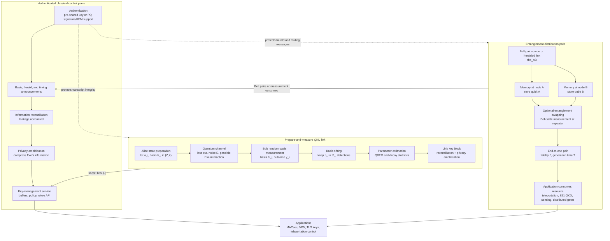

# Quantum Communication

Quantum communication studies how quantum states, classical authenticated discussion, and physical channels can be combined to move information with security or functionality that classical communication alone cannot provide. In this area of SJ Wiki, the first emphasis is quantum key distribution (QKD): Alice and Bob use quantum signals only to create shared random key material, then use ordinary symmetric cryptography to protect later data. The quantum channel does not magically encrypt arbitrary messages by itself; it supplies evidence about eavesdropping because unknown quantum states cannot be copied or measured without consequences.

The neighboring areas matter. [Quantum computing](/quantum-information-science/quantum-computing/intro) supplies the qubit, measurement, and no-cloning language. [Quantum security](/quantum-information-science/quantum-security/intro) covers the post-quantum-cryptography path, where algorithms are changed so that classical networks remain safe against quantum computers. [Quantum internet](/quantum-information-science/quantum-internet/intro) pushes beyond key distribution toward entanglement distribution, teleportation, repeaters, and networked quantum processors.

Primary textbook reference for this section: Nielsen and Chuang, *Quantum Computation and Quantum Information*, especially Chapter 12 for quantum information theory, Holevo's theorem, privacy amplification, and BB84 security, and Chapter 8 for quantum noise and channel modeling. The pages in this folder synthesize that textbook foundation with existing practical QKD and network material rather than duplicating separate textbook-specific pages.

## Definitions

**Quantum communication** is any communication protocol in which at least one transmitted system must be modeled as a quantum state. The payload may be a single photon polarization, a time-bin qubit, a phase-encoded weak optical pulse, an entangled pair shared between nodes, or a more complex encoded state.

**Classical authenticated channel** means an ordinary classical channel on which Alice and Bob can detect message forgery. QKD still needs this channel. If Eve can alter every classical message without detection, she can run two separate QKD sessions and mount a man-in-the-middle attack. Authentication can start from a short shared secret and be refreshed from the QKD output.

**Quantum channel** is the physical path for quantum states. In optical QKD it is usually fiber or free-space optical transmission. It has loss, noise, detector imperfections, finite timing resolution, and device side channels. Loss is not merely inconvenient: because qubits cannot be copied, ordinary optical amplification cannot repair unknown quantum states the way repeaters amplify classical light pulses.

**No-cloning theorem** says there is no physical operation that copies every unknown pure state:

$$
U\lvert \psi\rangle\lvert 0\rangle = \lvert \psi\rangle\lvert \psi\rangle
$$

for all $\lvert \psi\rangle$. The contradiction is immediate from preservation of inner products. If the operation copied both $\lvert \psi\rangle$ and $\lvert \phi\rangle$, then

$$
\langle \psi \mid \phi\rangle = \langle \psi \mid \phi\rangle^2,
$$

which is false for nonorthogonal states with overlap strictly between 0 and 1.

**Prepare-and-measure QKD** has Alice prepare one of several quantum states and Bob measure each received signal. [BB84](/quantum-information-science/quantum-communication/bb84) is the canonical example.

**Entanglement-based QKD** distributes entangled states and derives key from correlated measurements. E91 is the standard conceptual example, and it connects directly to [entanglement](/quantum-information-science/quantum-internet/entanglement) and Bell-test reasoning.

**QBER**, the quantum bit error rate, is the observed disagreement rate between Alice and Bob on a revealed sample of sifted bits:

$$
Q = \frac{\text{number of disagreements}}{\text{number of compared sifted bits}}.
$$

It mixes ordinary channel noise, device imperfections, and possible adversarial disturbance.

## Key results

The core result behind this area is not that quantum states are secret in every situation. Orthogonal states can be distinguished perfectly, and badly engineered devices can leak information. The useful result is narrower and stronger: if a protocol encodes key bits into nonorthogonal states, then an adversary cannot learn the full raw key while leaving all protocol statistics unchanged.

BB84 uses two mutually unbiased bases. In the computational basis, Alice sends $\lvert 0\rangle$ or $\lvert 1\rangle$. In the diagonal basis, she sends

$$
\lvert +\rangle = \frac{\lvert 0\rangle+\lvert 1\rangle}{\sqrt{2}},
\qquad
\lvert -\rangle = \frac{\lvert 0\rangle-\lvert 1\rangle}{\sqrt{2}}.
$$

A measurement in the wrong basis gives a random result. For example,

$$
\Pr(0\mid +) = |\langle 0 \mid +\rangle|^2 = \frac{1}{2}.
$$

This is the simple statistical fact behind eavesdropping detection.

In a basic intercept-resend attack against BB84, Eve chooses a random basis, measures the signal, and resends a state matching her outcome. On the half of transmitted signals where Bob later used Alice's basis, Eve chose the wrong basis half the time. Conditional on that wrong choice, Bob's final sifted bit disagrees with Alice's with probability $1/2$. Therefore the expected QBER on sifted bits is

$$
Q_{\text{intercept}} = \frac{1}{2}\cdot\frac{1}{2}=\frac{1}{4}.
$$

Real QKD does not simply reject every nonzero QBER. It estimates whether the observed error and finite-sample confidence bounds are compatible with a positive secret key after error correction and privacy amplification. Security proofs are more delicate than the intercept-resend calculation, but the operational workflow remains recognizable: distribute quantum signals, sift by basis or detection pattern, estimate parameters, reconcile errors, compress away Eve's possible information, and authenticate the transcript.

Quantum communication has three different scopes that should not be confused. First, **QKD links** create keys between two endpoints or between neighboring trusted nodes. Second, **QKD networks** route key material across multiple links, often with trusted intermediate nodes. Third, a **quantum internet** aims to distribute quantum states or entanglement between remote nodes; it may support QKD but is not limited to QKD.

## Visual



The diagram separates the two main communication architectures: prepare-and-measure QKD creates hop keys from transmitted states, while entanglement distribution creates Bell-pair resources for teleportation, E91-style QKD, and networked quantum operations. The shape labels identify where qubits become classical records, where QBER or fidelity is estimated, and where reconciliation and privacy amplification enter. Dotted arrows emphasize that authenticated classical communication is part of the protocol, not an optional management channel.

| Concept | Main resource | Classical channel needed? | Typical output | Main caveat |
|---|---:|---:|---|---|
| BB84 link | Nonorthogonal single-qubit states | Yes, authenticated | Shared symmetric key | Practical sources and detectors need countermeasures |
| General QKD | Quantum disturbance or Bell correlations | Yes, authenticated | Secret key with failure probability bound | Security model depends on devices |
| Trusted-node QKD network | Pairwise QKD links plus secure nodes | Yes | End-to-end key through relays | Intermediate nodes must be trusted |
| Quantum internet | Entanglement and qubit transmission | Yes, often heavy classical control | Keys, teleportation, distributed quantum tasks | Requires memories, repeaters, and network control |
| PQC over classical internet | Hard mathematical problems | Yes | Public-key encryption or signatures | Security is computational, not physical |

## Worked example 1: Why the wrong BB84 basis creates a random bit

**Problem.** Alice sends $\lvert +\rangle$. Bob measures in the computational basis $\{\lvert 0\rangle,\lvert 1\rangle\}$. Compute Bob's outcome probabilities and explain why this matters for QKD.

**Method.**

1. Write the transmitted state in Bob's measurement basis:

$$
\lvert +\rangle = \frac{\lvert 0\rangle+\lvert 1\rangle}{\sqrt{2}}.
$$

2. Use the Born rule. The probability of outcome $0$ is the squared magnitude of the amplitude on $\lvert 0\rangle$:

$$
\Pr(0) = \left|\frac{1}{\sqrt{2}}\right|^2=\frac{1}{2}.
$$

3. The probability of outcome $1$ is similarly

$$
\Pr(1) = \left|\frac{1}{\sqrt{2}}\right|^2=\frac{1}{2}.
$$

4. If Bob obtains $0$, the post-measurement state is $\lvert 0\rangle$; if he obtains $1$, it is $\lvert 1\rangle$. The original phase relation that defined $\lvert +\rangle$ has been lost.

**Checked answer.** Bob gets a uniformly random bit. The probabilities add to $1/2+1/2=1$, so the distribution is normalized. This is exactly why a wrong-basis measurement by Eve is visible statistically: after Eve's measurement, she cannot resend the original unknown state with certainty.

## Worked example 2: Expected QBER from intercept-resend

**Problem.** In ideal BB84, suppose Eve intercepts every photon, chooses the computational or diagonal basis uniformly at random, measures, and resends the state corresponding to her result. Alice and Bob keep only rounds where their bases match. What QBER do they expect in the sifted key?

**Method.**

1. Condition on a sifted round. Alice and Bob used the same basis, so without Eve they would agree with probability $1$.

2. Eve chooses Alice's basis with probability $1/2$. In those cases she learns the bit and resends the correct state. Bob's error probability is $0$.

3. Eve chooses the wrong basis with probability $1/2$. Her outcome is random and the state she resends is in the wrong basis relative to Alice's encoding.

4. Bob measures that resent wrong-basis state in Alice's original basis. The result is random, so his probability of disagreeing with Alice is $1/2$.

5. Multiply the branches:

$$
Q = \Pr(\text{Eve wrong basis})\Pr(\text{Bob error}\mid\text{Eve wrong basis})
= \frac{1}{2}\cdot\frac{1}{2}
= \frac{1}{4}.
$$

**Checked answer.** The expected QBER is $25\%$. If Alice and Bob publicly compare a sufficiently large random test sample and see an error rate near this value, they abort. If the rate is much lower, a security proof plus finite-size statistics decides whether privacy amplification can still produce a secret key.

## Code

```python
import random

def bb84_round(with_eve=False):
    alice_bit = random.randrange(2)
    alice_basis = random.choice(["Z", "X"])
    bob_basis = random.choice(["Z", "X"])

    # In this sketch, a state is represented only by the basis and bit that
    # would be deterministic if measured in the same basis.
    sent_basis, sent_bit = alice_basis, alice_bit

    if with_eve:
        eve_basis = random.choice(["Z", "X"])
        if eve_basis == sent_basis:
            eve_bit = sent_bit
        else:
            eve_bit = random.randrange(2)
        sent_basis, sent_bit = eve_basis, eve_bit

    if bob_basis == sent_basis:
        bob_bit = sent_bit
    else:
        bob_bit = random.randrange(2)

    sifted = alice_basis == bob_basis
    error = sifted and (alice_bit != bob_bit)
    return sifted, error

def estimate(trials=100_000, with_eve=False):
    sifted = errors = 0
    for _ in range(trials):
        keep, err = bb84_round(with_eve=with_eve)
        sifted += int(keep)
        errors += int(err)
    return sifted / trials, errors / sifted

for attacked in [False, True]:
    keep_rate, qber = estimate(with_eve=attacked)
    print(f"eve={attacked:5} sift_fraction={keep_rate:.3f} qber={qber:.3f}")
```

This deliberately omits loss, dark counts, finite-key confidence intervals, and reconciliation leakage. Its purpose is to isolate the basis-sifting logic and the $25\%$ intercept-resend signal.

## Common pitfalls

- Treating QKD as direct message encryption. QKD creates keys; messages are still encrypted with classical symmetric methods such as one-time pads or authenticated encryption.
- Forgetting authentication. An unauthenticated classical channel permits man-in-the-middle attacks even if the quantum optics are perfect.
- Overstating no-cloning. The theorem forbids copying arbitrary unknown quantum states, not copying known classical descriptions or orthogonal states.
- Confusing trusted-node QKD networks with a full quantum internet. Trusted-node networks can be useful but they do not provide end-to-end entanglement or remove trust from relays.
- Ignoring finite statistics. A small test sample can miss errors; real systems need confidence bounds and composable security parameters.
- Assuming hardware automatically matches the proof model. Source flaws, detector behavior, timing, and optical back-reflections can invalidate a naive proof.

## Connections

- [BB84 Protocol](/quantum-information-science/quantum-communication/bb84) for the step-by-step prepare-and-measure protocol.
- [Quantum Key Distribution](/quantum-information-science/quantum-communication/qkd) for protocol families, security models, side channels, and practical variants.
- [Quantum Network](/quantum-information-science/quantum-communication/quantum-network) for layer models, trusted nodes, and the path toward quantum internet architectures.
- [Quantum Internet](/quantum-information-science/quantum-internet/intro) for entanglement distribution, teleportation, and repeaters beyond ordinary QKD links.
- [Quantum-Safe Cryptography](/quantum-information-science/quantum-security/quantum-safe-crypto) and [Post-Quantum Cryptography](/quantum-information-science/quantum-security/pqc) for the classical migration path.
- [Classical Cryptography](/cs/cryptography/intro) for symmetric encryption, authentication, public-key assumptions, and protocol design baselines.
- [Postulates of Quantum Mechanics](/physics/quantum-mechanics/postulates-of-quantum-mechanics), [Measurement and Interpretation](/physics/quantum-mechanics/measurement-interpretation), and [Dirac Notation and Hilbert Spaces](/physics/quantum-mechanics/dirac-notation-hilbert-spaces) for the physics used by the security intuition.
- Nielsen and Chuang, *Quantum Computation and Quantum Information*, Chapters 8 and 12, for the canonical textbook treatment of quantum channels, accessible information, Holevo bounds, and BB84 security.
