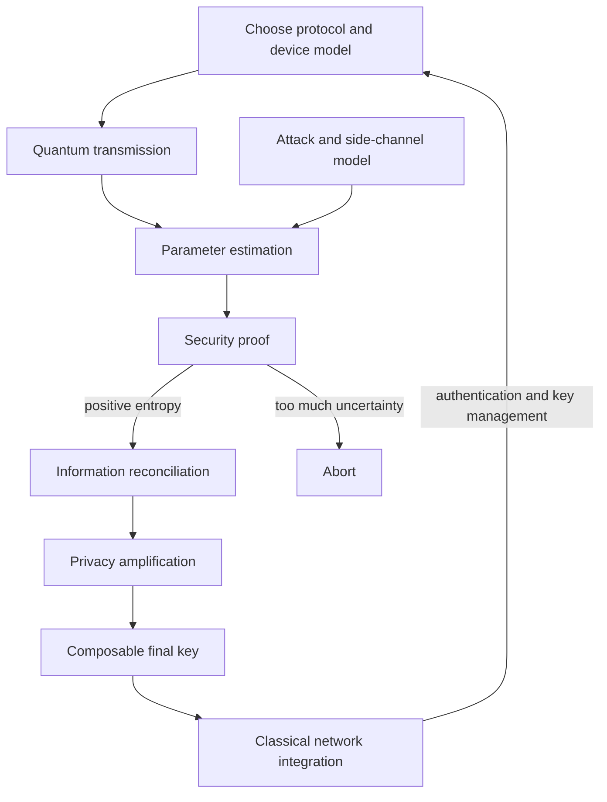

# QKD Security Proofs, Attacks, and Network Integration (2025)

QKD security is not a single slogan about no-cloning. It is an accounting discipline: define the devices and adversary model, observe channel statistics, bound Eve's information, subtract reconciliation leakage, and compress the remaining string into a composable key. This page synthesizes two 2025 review-style sources because their coverage overlaps. Full citations: Nitin Jha, Abhishek Parakh, and Mahadevan Subramaniam, "Quantum Key Distribution: Bridging Theoretical Security Proofs, Practical Attacks, and Error Correction for Quantum-Augmented Networks," arXiv:2511.20602v1, 2025; Vikram Nair, "Exploring Quantum Key Distribution (QKD) Protocols for Secure Communication Over Classical Networks," Journal of Recent Trends in Computer Science and Engineering 13(2), 20-29, 2025.

The two reviews differ in emphasis. Jha et al. organize QKD around protocol classes, practical attacks, security proofs, quantum error-correction codes, and quantum-augmented networks. Nair gives a shorter classical-network deployment survey, emphasizing BB84, E91, CV-QKD, side channels, repeaters, satellite QKD, and hybrid quantum-classical infrastructure. The useful synthesis is to treat Nair as deployment context and Jha as the deeper security-proof and attack taxonomy, while keeping the stricter modern terminology: plain E91 is entanglement-based, and fully device-independent QKD additionally requires loophole-free Bell testing, randomness, isolation, and finite-key proof.

## Definitions

**BB84 and B92** are prepare-and-measure protocols based on nonorthogonal states. BB84 uses two bases and four states; B92 uses two nonorthogonal states. In practical fiber systems, weak coherent pulses and decoy states replace ideal single photons.

**E91** is entanglement-based QKD. Alice and Bob measure entangled pairs and use correlation statistics, often including Bell-inequality tests, to certify the quality of the shared resource. E91 is the conceptual bridge toward device-independent security, but a deployed E91-like system is not automatically device independent unless the proof closes the relevant loopholes.

**CV-QKD** encodes information in field quadratures of coherent or squeezed optical states. Bob uses homodyne or heterodyne detection, and security is stated through covariance estimation, reconciliation, and bounds on Eve's Holevo information. CV-QKD is attractive because it can reuse telecom components, but it is sensitive to excess noise, calibration, local-oscillator handling, and post-processing efficiency.

**Twin-field QKD (TF-QKD)** sends phase-related weak coherent fields from Alice and Bob to an untrusted middle station, Charlie. In favorable high-loss regimes, the key-rate scaling can behave like $\sqrt{\eta}$ rather than the direct-transmission $\eta$ scaling. This is a scaling statement, not a guarantee that every TF-QKD implementation wins in every distance or finite-key regime.

**Device-independent QKD (DI-QKD)** tries to certify secrecy from observed Bell violation while treating devices as black boxes. It is the strongest side-channel-resistant goal in this list, but it is experimentally demanding because detection efficiency, isolation, random setting choices, timing assumptions, and finite statistics all matter.

**Three-stage or double-lock protocols** use commuting unitary transformations so Alice and Bob can apply and remove private transformations in sequence. Jha et al. discuss these in the context of multi-photon quantum secure direct communication as well as QKD-like settings. Their security and deployment assumptions differ from mainstream decoy-state BB84, so they should not be presented as a drop-in replacement for ordinary QKD.

**Photon-number-splitting (PNS) attack** targets multi-photon pulses. If a pulse contains two or more photons, Eve may try to keep one photon, forward the rest, wait for basis announcements, and measure later without causing the same disturbance as intercept-resend. Decoy states are the standard countermeasure.

**Trojan-horse attack** injects light into Alice's or Bob's device and analyzes back-reflections or side-channel leakage. Countermeasures include wavelength filters, optical isolators, monitoring detectors, randomized timing, limited modulator activation windows, attenuation, and security proofs that include leakage.

**Jamming attack** is denial of service rather than silent key theft. Eve injects noise, rotates polarization, blinds detectors, or attacks a free-space link so QBER rises or detection statistics become unusable. A successful jammer may force aborts even without learning the key.

**Composable security** means the generated key can be safely used inside a larger cryptographic system. A common finite-key accounting shape is

$$
\ell \le H_{\min}^{\epsilon}(X^n\mid E)-\mathrm{leak}_{\mathrm{EC}}-\mathrm{margins},
$$

where $\ell$ is final key length, $H_{\min}^{\epsilon}$ is smooth min-entropy conditioned on Eve, $\mathrm{leak}_{\mathrm{EC}}$ is public reconciliation leakage, and the margins cover verification, privacy amplification, and failure probabilities.

**Quantum error-correction code (QECC)** is written as $[[n,k,d]]$, meaning $k$ logical qubits are encoded into $n$ physical qubits with distance $d$. A distance-$d$ code can correct up to

$$
t=\left\lfloor\frac{d-1}{2}\right\rfloor
$$

arbitrary single-qubit errors under the usual code-distance model. In QKD, classical information reconciliation is already essential; full quantum error correction becomes most relevant for entanglement distribution, repeaters, DI-QKD testbeds, quantum memories, and hybrid quantum-augmented networks.

## Key results

The first key result is that security proofs are model-specific. Shor-Preskill-style BB84 security relates the prepare-and-measure protocol to an entanglement-distillation picture using CSS codes. In a simplified asymptotic form, if bit and phase error rates are $e_b$ and $e_p$, a secret fraction can be written as

$$
r=1-h_2(e_b)-h_2(e_p),
$$

where

$$
h_2(x)=-x\log_2 x-(1-x)\log_2(1-x).
$$

If symmetry lets one use $e_b=e_p=Q$, this becomes $r=1-2h_2(Q)$. Production systems add reconciliation inefficiency, finite-key confidence terms, authentication costs, detector models, source models, decoy estimates, and composable failure parameters.

The second key result is that attacks often exploit the gap between proof model and hardware. PNS attacks exploit weak coherent sources. Trojan-horse attacks exploit optical leakage out of the device. Detector blinding, timing attacks, wavelength-dependent behavior, and local-oscillator manipulation exploit measurement hardware. Jamming attacks exploit availability and error budgets. None of these contradicts the mathematical security of ideal BB84; they show why the device model must be honest.

The third key result is that protocol families move the trust boundary in different ways:

| Family | What it protects well | Trust still needed | Main deployment cost |
|---|---|---|---|
| Decoy BB84 | PNS risk from weak coherent pulses | Source intensity, detectors, timing, isolation | Decoy statistics and finite-key analysis |
| CV-QKD | Telecom-component integration | Excess-noise calibration, local oscillator handling | Reconciliation at low SNR |
| MDI-QKD | Detector side channels | Alice and Bob source preparation | Two-photon interference and lower rates |
| TF-QKD | High-loss scaling | Phase reference, decoys, proof variant | Phase stabilization and finite-key blocks |
| DI-QKD | Internal device side channels | Secure labs, random settings, no leakage, Bell loopholes closed | Very high experimental demands |

The fourth key result is that network integration does not weaken the need for classical cryptography. QKD requires an authenticated classical channel. It produces symmetric key material; it does not replace endpoint security, traffic encryption, MACs, certificates, access control, logging, or key lifecycle management. Nair's review is strongest on this point: practical QKD must live inside classical networks, often with trusted relays, dedicated quantum channels, and ordinary encrypted transport.

The fifth key result is that quantum error correction is a bridge topic rather than a universal fix. Jha et al. review three-qubit repetition codes, stabilizer codes, five-qubit and seven-qubit codes, Shor's nine-qubit code, CSS codes, bosonic binomial codes, surface-code demonstrations, GKP-style bosonic encoding, and fault-tolerant syndrome extraction. These tools can preserve quantum states and entanglement, but they do not magically repair an already leaked key. In QKD links, error correction during reconciliation is classical leakage that must be subtracted. In repeater and quantum-internet settings, QECCs protect quantum information before measurement and key extraction.

Jamming can be modeled by mixing the intended state $\rho$ with an injected state $\rho_E$:

$$
\rho_{\mathrm{channel}}=(1-p)\rho+p\rho_E.
$$

For a pure transmitted state $\lvert\psi\rangle$, the fidelity with the jammed state is

$$
F=\langle\psi\rvert\rho_{\mathrm{channel}}\lvert\psi\rangle
=(1-p)+p\langle\psi\rvert\rho_E\lvert\psi\rangle.
$$

If the injected state is orthogonal to the intended state, the fidelity becomes $F=1-p$. For a Faraday-rotation jamming example, a polarization rotation $\theta$ can induce

$$
Q_{\mathrm{ind}}=1-\cos^2\theta=\sin^2\theta.
$$

That formula captures why availability attacks are visible as QBER increases, even if they do not give Eve a clean copy of the key.

## Visual



| Attack class | Typical symptom | Why it matters | Representative countermeasures |
|---|---|---|---|
| PNS | Eve exploits multi-photon pulses without large QBER | Weak coherent sources are not ideal single photons | Decoy states, photon-number statistics, finite-key tests |
| Trojan horse | Back-reflected probe light leaks settings | Device internals become a side channel | Isolators, filters, monitors, attenuation, timing randomization |
| Detector attack | Click behavior no longer matches proof model | Bob's measurement device may be controlled | MDI-QKD, detector monitoring, calibrated gating |
| CV local-oscillator attack | Shot-noise or phase reference is manipulated | Excess-noise estimate becomes unreliable | Local LO, shot-noise monitoring, pilot checks |
| Jamming | QBER rises or detections are suppressed | Availability failure can halt key generation | Spatial filtering, SPAD arrays, adaptive routing, robust coding |
| Classical control attack | Transcript is forged or replayed | Man-in-the-middle defeats QKD | Message authentication, sequence checks, key lifecycle controls |

## Worked example 1: Multi-photon exposure and a decoy sanity check

**Problem.** A weak coherent BB84 transmitter uses signal intensity $\mu=0.2$. Compute the probability that a pulse has at least two photons. Then estimate how many multi-photon pulses occur in $10^9$ emitted pulses. Finally compare two simple observed gain values for signal and decoy intensities under a channel transmittance $\eta=0.1$ and dark/background yield $Y_0=10^{-6}$.

**Method.**

1. Use the Poisson law:

$$
\Pr(N=n)=e^{-\mu}\frac{\mu^n}{n!}.
$$

2. The probability of zero photons is

$$
\Pr(N=0)=e^{-0.2}\approx0.8187.
$$

3. The probability of one photon is

$$
\Pr(N=1)=e^{-0.2}(0.2)\approx0.1637.
$$

4. Therefore the multi-photon probability is

$$
\Pr(N\ge2)=1-0.8187-0.1637=0.0176.
$$

5. In $10^9$ emitted pulses, the expected number of multi-photon pulses is

$$
10^9\cdot0.0176=1.76\cdot10^7.
$$

So even a small multi-photon fraction corresponds to about $17.6$ million pulses.

6. A simple gain approximation for intensity $x$ is

$$
Q_x\approx Y_0+1-e^{-\eta x}.
$$

For $x=\mu=0.2$:

$$
Q_{0.2}\approx10^{-6}+1-e^{-0.1\cdot0.2}.
$$

$$
Q_{0.2}\approx10^{-6}+1-e^{-0.02}.
$$

Since $e^{-0.02}\approx0.9802$,

$$
Q_{0.2}\approx0.0198.
$$

7. For a weaker decoy $x=0.05$:

$$
Q_{0.05}\approx10^{-6}+1-e^{-0.1\cdot0.05}.
$$

$$
Q_{0.05}\approx10^{-6}+1-e^{-0.005}.
$$

Since $e^{-0.005}\approx0.9950$,

$$
Q_{0.05}\approx0.0050.
$$

8. The signal-to-decoy gain ratio is roughly

$$
\frac{Q_{0.2}}{Q_{0.05}}\approx\frac{0.0198}{0.0050}\approx3.96.
$$

**Checked answer.** At $\mu=0.2$, about $1.76\%$ of pulses are multi-photon, which is large over long runs. A decoy sanity check expects gains to change predictably with intensity and channel transmittance. If observed signal and decoy gains no longer fit the model within finite-key bounds, Alice and Bob should not treat the channel as an ordinary lossy channel. This is the intuition behind decoy-state PNS defenses; real decoy estimation uses rigorous bounds, not only this ratio.

## Worked example 2: Secret fraction under bit and phase errors

**Problem.** A simplified BB84 security calculation estimates bit error $e_b=2\%$ and phase error $e_p=3\%$. Reconciliation leaks $f_{\mathrm{EC}}h_2(e_b)$ bits per raw bit with $f_{\mathrm{EC}}=1.16$. Estimate

$$
r=1-h_2(e_p)-f_{\mathrm{EC}}h_2(e_b).
$$

Then compute the induced QBER from a Faraday jamming rotation of $\theta=16^\circ$ using $Q_{\mathrm{ind}}=\sin^2\theta$.

**Method.**

1. Compute the binary entropy for $e_b=0.02$:

$$
h_2(0.02)=-0.02\log_2(0.02)-0.98\log_2(0.98).
$$

Using $\log_2(0.02)\approx-5.6439$ and $\log_2(0.98)\approx-0.0291$,

$$
h_2(0.02)\approx0.1129+0.0285=0.1414.
$$

2. Compute the binary entropy for $e_p=0.03$:

$$
h_2(0.03)=-0.03\log_2(0.03)-0.97\log_2(0.97).
$$

Using $\log_2(0.03)\approx-5.0589$ and $\log_2(0.97)\approx-0.0439$,

$$
h_2(0.03)\approx0.1518+0.0426=0.1944.
$$

3. Compute reconciliation leakage:

$$
f_{\mathrm{EC}}h_2(e_b)=1.16\cdot0.1414=0.1640.
$$

4. Compute the simplified secret fraction:

$$
r=1-0.1944-0.1640=0.6416.
$$

5. For the jamming rotation, convert the angle:

$$
16^\circ=\frac{16\pi}{180}\approx0.2793\ \mathrm{rad}.
$$

6. Compute the induced QBER:

$$
Q_{\mathrm{ind}}=\sin^2(0.2793).
$$

Since $\sin(0.2793)\approx0.2756$,

$$
Q_{\mathrm{ind}}\approx0.2756^2\approx0.076.
$$

**Checked answer.** The simplified security calculation gives about $0.642$ secret bits per raw bit before finite-key and verification margins. A $16^\circ$ polarization rotation can contribute about $7.6\%$ QBER in the teaching model, which is large enough to threaten key generation even if the attacker learns no key. This separates confidentiality attacks from denial-of-service attacks.

## Code

```python
import math

def h2(x):
    if x <= 0.0 or x >= 1.0:
        return 0.0
    return -x * math.log2(x) - (1 - x) * math.log2(1 - x)

def poisson_multi_photon(mu):
    return 1 - math.exp(-mu) * (1 + mu)

def simple_gain(intensity, eta, background_yield=1e-6):
    return background_yield + 1 - math.exp(-eta * intensity)

def bb84_fraction(bit_error, phase_error=None, ec_efficiency=1.16):
    if phase_error is None:
        phase_error = bit_error
    return max(0.0, 1 - h2(phase_error) - ec_efficiency * h2(bit_error))

def induced_qber_from_rotation(degrees):
    theta = math.radians(degrees)
    return math.sin(theta) ** 2

def fiber_eta(distance_km, loss_db_per_km=0.2):
    return 10 ** (-(loss_db_per_km * distance_km) / 10)

print("PNS exposure")
for mu in [0.05, 0.1, 0.2, 0.5]:
    print(f"mu={mu:.2f} P(N>=2)={poisson_multi_photon(mu):.5f}")

print("\nDecoy gain sketch")
for intensity in [0.05, 0.2]:
    print(f"x={intensity:.2f} Q_x={simple_gain(intensity, eta=0.1):.5f}")

print("\nSecret fractions")
for q in [0.01, 0.03, 0.08, 0.11]:
    print(f"Q={q:.1%} symmetric_r={bb84_fraction(q, ec_efficiency=1.0):.3f}")

print("\nJamming and twin-field scaling sketches")
for degrees in [5, 10, 16]:
    print(f"rotation={degrees:2d} deg induced_qber={induced_qber_from_rotation(degrees):.3f}")
for distance in [100, 200, 300]:
    eta = fiber_eta(distance)
    print(f"{distance} km direct~{eta:.2e} twin_field_scaling~{math.sqrt(eta):.2e}")
```

This code is a teaching calculator. It does not implement a secure QKD stack, a decoy linear program, CV covariance estimation, entropy accumulation, or finite-key composable parameter accounting.

## Common pitfalls

- Saying "QKD is unconditionally secure" without stating the device model. Ideal proofs do not automatically cover source leakage, detector control, timing side channels, or Trojan-horse reflections.
- Treating decoy states as optional with weak coherent pulses. Without decoys or an equivalent countermeasure, multi-photon pulses create a PNS opening.
- Equating E91 with fully device-independent QKD. Entanglement helps, but DI-QKD additionally needs loophole-free Bell violation and a proof that handles finite data and leakage assumptions.
- Confusing quantum error correction with information reconciliation. Reconciliation corrects Alice's and Bob's classical strings and leaks information that must be subtracted; QECCs protect quantum states before measurement.
- Comparing CV-QKD and DV-QKD by headline key rate alone. Excess noise, distance, reconciliation efficiency, trusted components, and finite-key terms can dominate.
- Overreading twin-field scaling. The $\sqrt{\eta}$ advantage is a loss-scaling result under specific assumptions, not a universal deployment-rate guarantee.
- Ignoring availability. Jamming may not reveal a key, but it can force aborts and disrupt a service-level agreement.
- Forgetting classical authentication. An unauthenticated public channel permits man-in-the-middle attacks regardless of the quantum protocol.

## Connections

- [Quantum Key Distribution](/quantum-information-science/quantum-communication/qkd) for protocol families, side-channel language, and the high-level security workflow.
- [BB84 Protocol](/quantum-information-science/quantum-communication/bb84) for basis sifting, QBER estimation, decoy-state motivation, and intercept-resend calculations.
- [Efficient-BB84 Metropolitan Network](/quantum-information-science/quantum-communication/efficient-bb84-metropolitan-network) for a 2025 deployment case using efficient-BB84, optical switches, MPLS, MACsec, and SKIP.
- [Quantum Network](/quantum-information-science/quantum-communication/quantum-network) for trusted nodes, routing, and the difference between QKD networks and a quantum internet.
- [Quantum Internet](/quantum-information-science/quantum-internet/intro), [Entanglement](/quantum-information-science/quantum-internet/entanglement), and [Quantum Repeater](/quantum-information-science/quantum-internet/quantum-repeater) for entanglement distribution, memories, repeaters, and where QECCs become central.
- [Post-Quantum Cryptography](/quantum-information-science/quantum-security/pqc) and [Quantum-Safe Cryptography](/quantum-information-science/quantum-security/quantum-safe-crypto) for the classical algorithmic alternative and complement to QKD.
- [Classical Cryptography](/cs/cryptography/intro), [Message Authentication Codes](/cs/cryptography/message-authentication-codes), and [Computational Security Definitions](/cs/cryptography/computational-security-definitions) for authentication, composability, and protocol-security vocabulary.
- Further reading: Shor and Preskill 2000 for BB84 security; Lo and Chau 1999 for entanglement-distillation security; Leverrier 2015 for composable CV-QKD; Xu et al. 2020 for realistic-device QKD; Jha et al. 2025 for the attack and QECC review; Nair 2025 for classical-network integration context.
