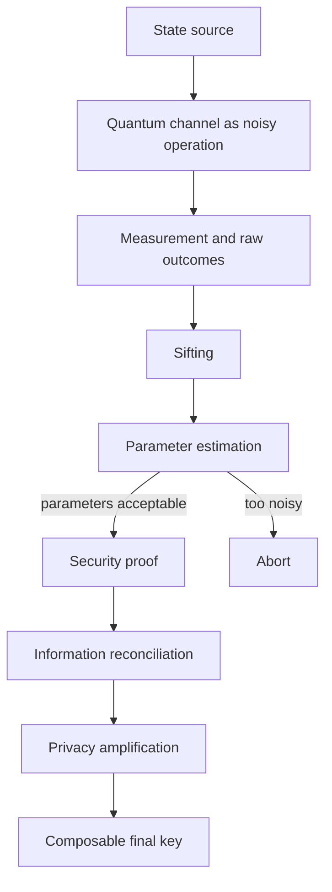

# Quantum Key Distribution

Quantum key distribution is a protocol family for generating shared secret key material from quantum signals and authenticated public discussion. It is not a direct replacement for encryption, signatures, endpoint security, or network operations. Its job is narrower: Alice and Bob either abort or output a shared random key whose secrecy is certified by observed quantum-channel statistics and a stated device model.

This page combines the existing SJ Wiki overview with Nielsen and Chuang's Chapter 12 treatment. Nielsen and Chuang emphasize three linked ideas: nonorthogonal states cannot be distinguished without disturbance, Holevo's theorem bounds accessible classical information from quantum states, and BB84 security can be proved by reducing an entanglement-distillation protocol based on CSS codes to ordinary prepare-and-measure BB84. The modern engineering variants below extend that foundation to weak coherent sources, side channels, finite-key security, and network deployment.

## Definitions

**QKD protocol** means the full key-generation procedure: quantum transmission, public sifting, parameter estimation, information reconciliation, verification, privacy amplification, and transcript authentication.

**Authenticated classical channel** is mandatory. Alice and Bob may discuss bases, check bits, syndromes, hash choices, and abort decisions publicly, but Eve must not be able to forge or rewrite those messages undetected. Without authentication, Eve can run two separate QKD sessions and impersonate each endpoint.

**Accessible information** is the maximum classical mutual information obtainable by measuring a quantum ensemble. If Alice chooses $X=x$ with probability $p_x$ and sends $\rho_x$, Bob or Eve chooses a POVM and receives a classical outcome $Y$. The accessible information is the maximum of $I(X:Y)$ over all measurements.

**Holevo information** for the ensemble $\{p_x,\rho_x\}$ is

$$
\chi(X:Q)=S(\rho)-\sum_x p_xS(\rho_x),
\qquad
\rho=\sum_x p_x\rho_x.
$$

Holevo's theorem gives the upper bound

$$
I(X:Y)\le \chi(X:Q)
$$

for every measurement outcome $Y$. Nielsen and Chuang use this as the quantitative expression of the "hidden" nature of quantum information: nonorthogonal quantum states can carry a classical label, but a measurement need not reveal the full label.

**Security criterion** in the N&C presentation says, informally, that for chosen security parameters, a QKD protocol either aborts or succeeds with high probability and leaves Eve with exponentially small mutual information about an essentially random final key. Modern composable security usually states this with a trace-distance parameter $\epsilon$, but the operational demand is the same: the real key should be substitutable for an ideal secret key in later cryptographic use.

**Information reconciliation** is classical error correction between Alice's and Bob's correlated strings. It leaks public information and must be charged against the final key length.

**Privacy amplification** is public randomized compression, usually implemented with a universal hash family, that maps the reconciled string to a shorter key about which Eve has negligible information.

**Bit errors and phase errors** are the two error types separated by CSS-code analyses. In prepare-and-measure BB84, bit errors are directly sampled by comparing check bits. Phase errors are not directly observed in the same run, but the proof relates them to measurements in the conjugate basis.

**Collective attack** means Eve interacts with signals individually but may store quantum side information and measure it jointly later. **Coherent attack** means Eve may attack many signals jointly. Security claims must state which attack model and finite-key reduction are being used.

## Key results

The foundational proposition is information gain implies disturbance. If Eve could distinguish two nonorthogonal states without disturbing them, she could learn the encoded information while leaving Alice and Bob's statistics unchanged. Nielsen and Chuang prove the contrapositive by modeling Eve's operation as a unitary interaction with an ancilla. If the operation leaves both nonorthogonal input states unchanged, preservation of inner products forces the corresponding ancilla states to be identical, so Eve has gained no distinguishing information.

Holevo's theorem gives the information-theoretic ceiling behind this intuition. For Bob's received ensemble $\{p_k,\rho_k^B\}$,

$$
I_{\text{Bob:Alice}}\le
\chi_B
=S(\rho^B)-\sum_kp_kS(\rho_k^B),
$$

and for Eve's ensemble $\{p_k,\rho_k^E\}$,

$$
I_{\text{Eve:Alice}}\le
\chi_E
=S(\rho^E)-\sum_kp_kS(\rho_k^E).
$$

When Alice and Bob have an advantage over Eve, reconciliation and privacy amplification can convert correlated data into a secret key. A classical one-way expression with the right shape is the Csiszar-Korner bound

$$
r\ge I(A:B)-I(A:E).
$$

In a quantum proof, $I(A:E)$ is replaced or bounded by an appropriate quantum side-information quantity, often passing through Holevo information, entropic uncertainty, or smooth min-entropy. A modern finite-key expression is commonly written schematically as

$$
\ell \le H_{\min}^{\epsilon}(X^n\mid E)
-\mathrm{leak}_{\mathrm{EC}}
-\mathrm{security\ margins},
$$

where $\ell$ is the final key length. This formula expresses the same accounting principle as the N&C discussion: certified uncertainty for Eve minus public leakage and proof margins.

For ideal asymptotic BB84 with one-way postprocessing and symmetric bit and phase error rate $Q$, the familiar secret fraction is

$$
r\approx 1-2h_2(Q),
$$

where

$$
h_2(Q)=-Q\log_2Q-(1-Q)\log_2(1-Q).
$$

The first entropy term corresponds to information reconciliation for bit errors; the second corresponds to privacy amplification against phase-error information. This is the clean textbook expression, not a deployed rate formula.

Nielsen and Chuang's secure-BB84 proof proceeds by reduction. First, an EPR-based protocol is manifestly secure if Alice and Bob can distill high-fidelity Bell pairs. Second, random sampling bounds the number of errors. Third, CSS codes correct bit and phase errors. Fourth, the CSS protocol is simplified: Bob can measure immediately, $C_1$ becomes an ordinary classical reconciliation code, and the coset $v_k+C_2$ becomes the privacy-amplified key. The final protocol is BB84 up to cosmetic differences.

The major QKD protocol families can be read as variations on which quantum states are sent, what parameters are estimated, and what device assumptions are trusted.

| Protocol family | Quantum resource | Security emphasis | Main advantage | Main limitation |
|---|---|---|---|---|
| [BB84](/quantum-information-science/quantum-communication/bb84) | Four states in two mutually unbiased bases | Nonorthogonality, sampling, CSS reduction | Canonical and simple | Source and detector assumptions matter |
| B92 | Two nonorthogonal states | Impossibility of perfect state discrimination | Minimal state alphabet | Lower conclusive rate and loss sensitivity |
| Six-state | Eigenstates of $X$, $Y$, and $Z$ | More complete qubit error sampling | Better symmetry for some analyses | More basis settings |
| E91 | Entangled pairs | Bell correlations and entanglement | Connects QKD to entanglement tests | Requires high-quality entanglement distribution |
| Decoy-state BB84 | Weak coherent pulses with varied intensity | Bounds single-photon contribution | Practical laser-source security | Requires statistical intensity analysis |
| MDI-QKD | Two sources and untrusted Bell measurement | Removes detector side channels | Measurement device can be untrusted | Lower rate and demanding interference |
| TF-QKD | Phase-coherent fields at middle station | High-loss scaling improvements | Can scale like $\sqrt{\eta}$ in favorable regimes | Phase stabilization and finite-key complexity |
| DI-QKD | Bell violation | Minimal internal device trust | Strongest conceptual side-channel resistance | Extremely demanding efficiency and statistics |

Nielsen and Chuang's Chapter 8 noise model is also relevant. Real QKD channels are quantum operations: loss, depolarization, phase damping, detector dark counts, and source imperfections change the ensemble reaching Bob and Eve. The proof must connect observed classical statistics back to a bounded family of quantum states or channels. That bridge is where ideal textbook protocols become engineering security analyses.

### Comprehensive security proofs and practical attacks

Recent review work is useful as a checklist for the gap between theorem and device. Jha, Parakh, and Subramaniam [1] organize QKD around protocol families, security-proof styles, practical attacks, error correction, and quantum-augmented networks. Nair [2] gives the deployment-facing companion view: QKD is inserted into classical networks with authenticated control channels, trusted relays or special-purpose quantum links, and ordinary key-management policy rather than replacing the rest of cryptography.

A compact security workflow is:

```text
choose protocol family and device model
collect quantum-channel statistics
bound single-photon, phase-error, or covariance parameters
subtract public reconciliation leakage
privacy-amplify to a composable key length
abort if the finite-key lower bound is nonpositive
```

For weak coherent BB84, the first hardware-specific issue is photon-number statistics. With phase-randomized mean photon number $\mu$,

$$
\Pr(N=n)=e^{-\mu}\frac{\mu^n}{n!},
\qquad
\Pr(N\ge2)=1-e^{-\mu}(1+\mu).
$$

At $\mu=0.2$, $\Pr(N\ge2)\approx0.0176$, so $10^9$ emitted pulses contain about $1.76\times10^7$ multi-photon pulses in expectation. That is why photon-number-splitting attacks are not a corner case and why decoy states are part of the proof model, not a performance tweak.

Side-channel attacks are best classified by which assumption they break. A Trojan-horse attack probes device settings through back-reflections; detector blinding and timing attacks make Bob's click model false; local-oscillator manipulation corrupts CV-QKD shot-noise calibration; jamming raises QBER or suppresses detections without necessarily learning the key. A simple availability model mixes the intended state $\rho$ with injected noise:

$$
\rho_{\mathrm{channel}}=(1-p)\rho+p\rho_E.
$$

For a polarization rotation $\theta$, a teaching estimate of induced error is

$$
Q_{\mathrm{ind}}=\sin^2\theta.
$$

A $16^\circ$ rotation gives $Q_{\mathrm{ind}}\approx0.076$, which can force aborts even if Eve gains no clean key information. This separates confidentiality failures from service availability failures.

The error-correction language also needs care. In link-level QKD, information reconciliation corrects Alice's and Bob's classical strings and leaks public information that must be subtracted. Quantum error-correcting codes, including CSS and stabilizer codes reviewed in [1], become central when the network is preserving quantum states or entanglement before measurement, as in repeaters, DI-QKD testbeds, and quantum memories. They do not retroactively protect a key that has already leaked through a bad device model.

## Visual



| Quantity | Formula | What it controls in QKD |
|---|---|---|
| Shannon mutual information | $I(A:B)=H(A)-H(A\mid B)$ | Alice-Bob correlation after the quantum stage |
| Holevo information | $\chi=S(\rho)-\sum_xp_xS(\rho_x)$ | Upper bound on accessible information from a quantum ensemble |
| Binary entropy | $h_2(Q)=-Q\log_2Q-(1-Q)\log_2(1-Q)$ | Error-correction and phase-error penalties |
| Reconciliation leakage | $\mathrm{leak}_{\mathrm{EC}}$ | Public information revealed to align strings |
| Final key length | $\ell \le H_{\min}^{\epsilon}(X^n\mid E)-\mathrm{leak}_{\mathrm{EC}}-\cdots$ | How many secret bits remain after proof margins |

## Worked example 1: Holevo bound for two nonorthogonal states

**Problem.** Alice chooses one of two pure qubit states with equal probability:

$$
\lvert \psi_0\rangle=\lvert 0\rangle,
\qquad
\lvert \psi_1\rangle=\cos\theta\lvert 0\rangle+\sin\theta\lvert 1\rangle.
$$

Let $\theta=\pi/3$, so the overlap is $\langle\psi_0\mid\psi_1\rangle=\cos\theta=1/2$. Compute the Holevo upper bound on Bob's accessible information about Alice's bit.

**Method.**

1. Because both signal states are pure,

$$
S(\lvert\psi_0\rangle\langle\psi_0\rvert)=
S(\lvert\psi_1\rangle\langle\psi_1\rvert)=0.
$$

2. The average density operator is

$$
\rho=\frac{1}{2}\lvert\psi_0\rangle\langle\psi_0\rvert
+\frac{1}{2}\lvert\psi_1\rangle\langle\psi_1\rvert.
$$

3. For two equally likely pure states with real overlap $c=\vert \langle\psi_0\mid\psi_1\rangle\vert $, the eigenvalues of $\rho$ are

$$
\lambda_{\pm}=\frac{1\pm c}{2}.
$$

4. Substitute $c=1/2$:

$$
\lambda_+=\frac{1+1/2}{2}=0.75,
\qquad
\lambda_-=\frac{1-1/2}{2}=0.25.
$$

5. Since the signal entropies are zero, the Holevo quantity is

$$
\chi=S(\rho)=h_2(0.75).
$$

6. Compute

$$
h_2(0.75)=-0.75\log_2(0.75)-0.25\log_2(0.25).
$$

Using $\log_2(0.75)\approx -0.4150$ and $\log_2(0.25)=-2$,

$$
h_2(0.75)\approx 0.3113+0.5000=0.8113.
$$

**Checked answer.** Bob's accessible information is at most about $0.811$ bits. It is less than one bit because the two states are nonorthogonal. If $\theta=\pi/2$, the states are orthogonal, $c=0$, the eigenvalues are $1/2,1/2$, and the Holevo bound becomes one bit.

## Worked example 2: Key-length accounting after reconciliation

**Problem.** A simplified asymptotic BB84 postprocessing block has $n=1{,}000{,}000$ sifted unrevealed bits and observed QBER $Q=3\%$. Use the phase-error estimate $e_{\mathrm{ph}}=Q$, reconciliation leakage

$$
\mathrm{leak}_{\mathrm{EC}}=1.15\,n\,h_2(Q),
$$

and a fixed proof margin of $10{,}000$ bits. Estimate

$$
\ell=n\bigl(1-h_2(e_{\mathrm{ph}})\bigr)
-\mathrm{leak}_{\mathrm{EC}}
-10{,}000.
$$

**Method.**

1. Compute the binary entropy:

$$
h_2(0.03)=-0.03\log_2(0.03)-0.97\log_2(0.97).
$$

2. Approximate the logarithms:

$$
\log_2(0.03)\approx -5.0589,
\qquad
\log_2(0.97)\approx -0.0439.
$$

3. Substitute:

$$
h_2(0.03)\approx -0.03(-5.0589)-0.97(-0.0439)
$$

$$
\approx 0.1518+0.0426=0.1944.
$$

4. Compute the phase-uncertainty term:

$$
n(1-h_2(Q))=1{,}000{,}000(1-0.1944)=805{,}600.
$$

5. Compute reconciliation leakage:

$$
\mathrm{leak}_{\mathrm{EC}}
=1.15(1{,}000{,}000)(0.1944)
=223{,}560.
$$

6. Subtract leakage and the fixed margin:

$$
\ell=805{,}600-223{,}560-10{,}000=572{,}040.
$$

**Checked answer.** The simplified block yields about $572{,}040$ final secret bits. The result is lower than $n(1-2h_2(Q))=611{,}200$ because the reconciliation efficiency factor is larger than one and because we subtracted an explicit margin. A real finite-key calculation would derive the phase-error bound and margin from confidence parameters rather than inserting them by hand.

## Code

```python
import math
import numpy as np

def entropy_from_eigenvalues(values):
    total = 0.0
    for value in values:
        if value > 1e-12:
            total -= float(value) * math.log2(float(value))
    return total

def binary_entropy(q):
    if q <= 0.0 or q >= 1.0:
        return 0.0
    return -q * math.log2(q) - (1.0 - q) * math.log2(1.0 - q)

def holevo_two_pure_states(theta):
    ket0 = np.array([[1.0], [0.0]])
    ket1 = np.array([[math.cos(theta)], [math.sin(theta)]])
    rho0 = ket0 @ ket0.T
    rho1 = ket1 @ ket1.T
    rho = 0.5 * rho0 + 0.5 * rho1
    eigenvalues = np.linalg.eigvalsh(rho)
    return entropy_from_eigenvalues(eigenvalues), eigenvalues

def bb84_key_length(n, qber, reconciliation_efficiency=1.15, margin=10_000):
    h = binary_entropy(qber)
    leak_ec = reconciliation_efficiency * n * h
    length = n * (1.0 - h) - leak_ec - margin
    return max(0, int(length)), leak_ec

chi, eigs = holevo_two_pure_states(math.pi / 3)
print(f"Holevo chi={chi:.4f} bits, eigenvalues={eigs}")

for qber in [0.01, 0.03, 0.08, 0.11]:
    length, leak = bb84_key_length(1_000_000, qber)
    print(f"QBER={qber:.1%} leak={leak:,.0f} final_length={length:,}")
```

This NumPy sketch computes the Holevo quantity for two pure qubit states and a simplified BB84 key length. It deliberately avoids pretending to be a full QKD stack: it has no random sampling bound, no detector model, no decoy-state estimation, and no composable security proof object.

## Common pitfalls

- Treating QKD as message encryption. QKD generates shared random keys; messages are still protected by one-time pads, authenticated encryption, or other classical mechanisms.
- Forgetting the authenticated channel. Public discussion is safe only against listening, not against undetected rewriting.
- Assuming every QKD claim is device independent. Most practical protocols trust some source, detector, timing, isolation, and random-number-generator assumptions.
- Equating Holevo information with the final key rate. Holevo bounds accessible information for an ensemble; a security proof must still connect observed data to Eve's possible quantum state and subtract public leakage.
- Comparing protocols without units. Secret bits per pulse, per detected signal, per second, and per finite block are different quantities.
- Ignoring weak coherent pulse statistics. Multi-photon emissions enable photon-number-splitting attacks unless decoy-state analysis or another countermeasure is used.
- Over-reading asymptotic thresholds. The often cited BB84 threshold near 11% comes from an ideal proof setting; practical finite-key and device assumptions can be stricter.
- Calling a trusted-node network end-to-end quantum-secure. Trusted relays can be useful, but relay compromise is a trust assumption.
- Treating TF-QKD or DI-QKD as drop-in upgrades. Their theoretical advantages come with demanding phase, loss, efficiency, and finite-statistics requirements.

## Connections

- [BB84 Protocol](/quantum-information-science/quantum-communication/bb84) for the detailed prepare-and-measure protocol and Nielsen-Chuang CSS-code security reduction.
- [Quantum Communication](/quantum-information-science/quantum-communication/intro) for the no-cloning, wrong-basis, and QBER intuition.
- [Quantum Network](/quantum-information-science/quantum-communication/quantum-network) for trusted-node networks and stack-level integration.
- [Quantum Internet](/quantum-information-science/quantum-internet/intro), [Entanglement](/quantum-information-science/quantum-internet/entanglement), and [Quantum Repeater](/quantum-information-science/quantum-internet/quantum-repeater) for entanglement distribution beyond direct QKD links.
- [Quantum Error Correction](/quantum-information-science/quantum-computing/error-correction) for CSS codes, bit/phase error separation, and the link between QKD security and coding.
- [Classical Cryptography](/cs/cryptography/intro), [Computational Security Definitions](/cs/cryptography/computational-security-definitions), and [Message Authentication Codes](/cs/cryptography/message-authentication-codes) for protocol-security language and authentication.
- [Post-Quantum Cryptography](/quantum-information-science/quantum-security/pqc) and [Quantum-Safe Cryptography](/quantum-information-science/quantum-security/quantum-safe-crypto) for the classical alternative to deploying QKD.
- Primary textbook reference: Nielsen and Chuang, *Quantum Computation and Quantum Information*, Chapters 8 and 12, especially quantum operations, Holevo's theorem, privacy amplification, and the BB84 security proof.

## References

[1] N. Jha, A. Parakh, M. Subramaniam. *Quantum Key Distribution: Bridging Theoretical Security Proofs, Practical Attacks, and Error Correction for Quantum-Augmented Networks*. arXiv:2511.20602v1, 2025.
[2] V. Nair. *Exploring Quantum Key Distribution (QKD) Protocols for Secure Communication Over Classical Networks*. Journal of Recent Trends in Computer Science and Engineering 13(2), 20-29, 2025.
