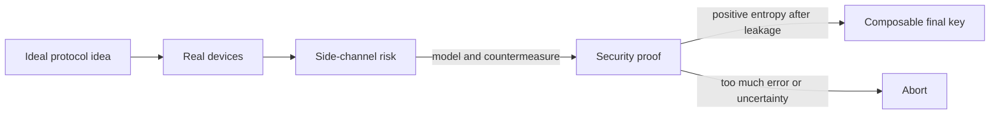

# Quantum Key Distribution

Quantum key distribution is a family of protocols for producing shared secret keys between distant parties using quantum signals plus authenticated classical communication. It is best understood as a key-establishment layer, not as a replacement for all cryptography. A QKD system still needs authentication, key management, endpoint security, traffic engineering, and ordinary encryption or one-time-pad use after the key has been produced.

The field has two parallel stories. The conceptual story starts with BB84 and E91: nonorthogonal states or entanglement make undetected eavesdropping statistically impossible under the protocol assumptions. The engineering story starts when ideal single photons and ideal detectors are replaced by weak lasers, lossy fiber, imperfect timing, finite sample sizes, and hardware side channels. Most modern QKD variants can be read as responses to one of those engineering pressures.

## Definitions

**QKD protocol** means the full process that produces a final key or aborts: quantum transmission, public sifting, parameter estimation, reconciliation, verification, privacy amplification, and authentication of the transcript.

**Security model** is the set of assumptions under which the final key is claimed secure. A model may assume trusted and characterized source devices, trusted and characterized detectors, an untrusted measurement node, or almost untrusted devices certified by Bell inequality violation.

**Composable security** means the generated key is close to an ideal uniformly random key in a way that remains meaningful when the key is used inside a larger cryptographic system. Informally, if the failure probability is $\epsilon$, then the real system behaves like the ideal system except with probability at most $\epsilon$.

**Collective, coherent, and general attacks** describe Eve's allowed operations. In a collective attack, Eve interacts with each signal similarly but may store quantum side information for a later joint measurement. In a coherent attack, Eve can attack many signals jointly. Modern proof statements should say which attack class is covered and under what finite-key assumptions.

**Secret-key rate** is the final secret bits per transmitted pulse, per detected signal, or per second, depending on context. Always check the unit. In theoretical loss-scaling discussions, rate is often compared as a function of channel transmittance $\eta$.

**Repeaterless bound** refers to fundamental limits on point-to-point secret-key generation over a lossy channel without quantum repeaters. For pure-loss channels, the key rate of direct transmission scales roughly linearly in $\eta$ at high loss.

**Trusted-node QKD network** links adjacent nodes with QKD and forwards end-to-end keys through nodes that must be trusted not to leak the hop keys. This can be operationally useful but is not the same as end-to-end quantum security.

## Key results

**BB84** is the baseline prepare-and-measure protocol. Its security intuition is measurement disturbance in mutually unbiased bases. Practical BB84 usually needs decoy states because weak coherent pulses sometimes contain multiple photons.

**B92** uses only two nonorthogonal states. It is conceptually elegant because nonorthogonality alone is enough to prevent perfect discrimination, but its sifting and loss behavior are less favorable than BB84 in many settings.

**Six-state QKD** uses three mutually unbiased qubit bases, often associated with the eigenstates of $X$, $Y$, and $Z$. It samples more error information than BB84 and can tolerate or estimate certain attacks differently, but it consumes more basis choices and can be more demanding experimentally.

**E91** is entanglement-based. An entangled source distributes pairs to Alice and Bob; correlations and Bell-test statistics certify the resource. Entanglement-based protocols make the connection between QKD and [entanglement distribution](/quantum-information-science/quantum-internet/entanglement) explicit.

**Decoy-state BB84** addresses photon-number-splitting attacks against weak coherent sources. Alice varies intensity among signal and decoy levels, then Alice and Bob use detection rates and error rates at different intensities to bound the single-photon contribution. This is one of the most important bridges from ideal BB84 to practical fiber and free-space systems.

**MDI-QKD**, measurement-device-independent QKD, removes detector side channels from the trust boundary. Alice and Bob each prepare states and send them to an untrusted middle station, often called Charlie, which attempts a Bell-state measurement. The measurement device may be adversarial; the proof relies on the observed statistics and on assumptions about Alice's and Bob's prepared states. The tradeoff is lower rate and more demanding interference requirements than simple point-to-point BB84.

**TF-QKD**, twin-field QKD, uses single-photon interference at an untrusted middle station. Its headline theoretical feature is key-rate scaling like $\sqrt{\eta}$ in favorable regimes, rather than the direct-transmission $\eta$ scaling. That does not mean every TF-QKD implementation beats every ordinary QKD system; phase stabilization, finite-key effects, detector noise, and proof variant matter.

**DI-QKD**, device-independent QKD, aims to certify security from Bell inequality violation with minimal trust in internal device behavior. It is the strongest conceptual answer to side channels, but it is experimentally severe: high detection efficiency, low noise, space-like or carefully modeled separation assumptions, and large finite-key data requirements are hard.

Security has a standard shape. Alice and Bob estimate observable parameters, especially bit error and sometimes phase error or Bell violation. A proof lower-bounds the conditional min-entropy of Alice's raw key given Eve's information. Reconciliation leaks some information, and privacy amplification extracts a shorter key. A simplified finite-key expression looks like

$$
\ell \le H_{\min}^{\epsilon}(X^n\mid E) - \mathrm{leak}_{\mathrm{EC}} - \mathrm{security\ margins},
$$

where $\ell$ is the final key length. This formula is schematic, but it captures the accounting principle: final key equals certified uncertainty minus public leakage and margins.

## Visual

| Protocol family | Quantum resource | Security model | Main advantage | Main limitation | Typical loss scaling idea |
|---|---|---|---|---|---|
| BB84 | Four nonorthogonal states in two bases | Trusted source and detector model | Simple, foundational, widely implemented | Detector and source side channels | Direct, roughly $O(\eta)$ |
| B92 | Two nonorthogonal states | Trusted devices | Minimal state alphabet | Lower conclusive rate, sensitive to loss | Direct, roughly $O(\eta)$ |
| Six-state | Three mutually unbiased bases | Trusted devices | More complete qubit error sampling | More basis settings | Direct, roughly $O(\eta)$ |
| E91 | Entangled pairs | Source may be untrusted in some variants; measurement assumptions vary | Bell-correlation view of secrecy | Entanglement distribution quality | Direct unless repeaters are used |
| Decoy BB84 | Weak coherent pulses with intensity variation | Trusted source characterization and detectors | Defends against PNS attacks | Requires intensity control and statistics | Direct, roughly $O(\eta)$ |
| MDI-QKD | Two prepared states plus untrusted Bell measurement | Detectors untrusted; sources characterized | Removes detector side channels | Lower rate, two-photon interference | Often effectively direct-loss limited |
| TF-QKD | Phase-coherent fields interfering at middle node | Measurement node untrusted; proof variant matters | Can improve high-loss scaling | Difficult phase stabilization and finite-key analysis | Can scale like $O(\sqrt{\eta})$ |
| DI-QKD | Bell violation | Minimal device trust, strong assumptions on test conditions | Best conceptual side-channel resistance | Very demanding experimentally | Not summarized by simple practical scaling |



## Worked example 1: Estimate an asymptotic BB84 secret fraction

**Problem.** In a simplified asymptotic BB84 model, suppose the observed QBER is $Q=3\%$ and reconciliation leaks $f h_2(Q)$ bits per raw bit with efficiency factor $f=1.15$. Approximate the final secret fraction as

$$
r = 1 - h_2(Q) - f h_2(Q).
$$

Compute $r$ and interpret it.

**Method.**

1. Compute the binary entropy:

$$
h_2(0.03)=-0.03\log_2(0.03)-0.97\log_2(0.97).
$$

2. Approximate the two terms:

$$
\log_2(0.03)\approx -5.0589,
\qquad
\log_2(0.97)\approx -0.0439.
$$

3. Substitute:

$$
h_2(0.03)\approx -0.03(-5.0589)-0.97(-0.0439).
$$

$$
h_2(0.03)\approx 0.1518+0.0426=0.1944.
$$

4. Compute the reconciliation leakage term:

$$
f h_2(Q)=1.15(0.1944)=0.2236.
$$

5. Compute the secret fraction:

$$
r=1-0.1944-0.2236=0.5820.
$$

**Checked answer.** The simplified model gives about $0.58$ final secret bits per reconciled raw bit. The result is plausible because low QBER leaves a positive margin. A production finite-key calculation would subtract additional confidence and verification terms and would use protocol-specific phase-error estimates.

## Worked example 2: Compare direct and twin-field loss scaling

**Problem.** A fiber link has attenuation $\alpha=0.2$ dB/km and total Alice-to-Bob distance $L=300$ km. Compute the channel transmittance

$$
\eta = 10^{-\alpha L/10}.
$$

Compare the rough scaling factors $\eta$ for direct QKD and $\sqrt{\eta}$ for a TF-QKD-style scaling discussion. Do not include implementation constants.

**Method.**

1. Compute total loss in dB:

$$
\alpha L = 0.2 \cdot 300 = 60 \text{ dB}.
$$

2. Convert dB loss to transmittance:

$$
\eta = 10^{-60/10}=10^{-6}.
$$

3. Direct point-to-point high-loss scaling is proportional to $\eta$:

$$
R_{\text{direct}}\propto 10^{-6}.
$$

4. Twin-field-style scaling is proportional to the square root:

$$
R_{\text{TF}}\propto \sqrt{10^{-6}}=10^{-3}.
$$

5. Compare the scaling factors:

$$
\frac{10^{-3}}{10^{-6}} = 10^3.
$$

**Checked answer.** The scaling-only comparison favors the square-root behavior by a factor of $1000$ at 300 km and 0.2 dB/km. This is not a guaranteed deployed-rate advantage: detector dark counts, phase reference distribution, finite-key block size, duty cycle, and proof constants can dominate.

## Code

```python
import math

def binary_entropy(q):
    if q == 0.0 or q == 1.0:
        return 0.0
    return -q * math.log2(q) - (1 - q) * math.log2(1 - q)

def bb84_secret_fraction(qber, reconciliation_efficiency=1.15):
    return max(0.0, 1 - binary_entropy(qber) - reconciliation_efficiency * binary_entropy(qber))

def fiber_eta(distance_km, loss_db_per_km=0.2):
    return 10 ** (-(loss_db_per_km * distance_km) / 10)

distances = [50, 100, 200, 300, 400]
qbers = [0.01, 0.03, 0.08]

print("Simplified BB84 secret fractions")
for q in qbers:
    print(f"QBER={q:.2%}: r={bb84_secret_fraction(q):.3f}")

print("\nLoss scaling comparison")
for d in distances:
    eta = fiber_eta(d)
    print(
        f"{d:3d} km  eta={eta:.3e}  direct~{eta:.3e}  twin_field~{math.sqrt(eta):.3e}"
    )
```

This code computes only high-level estimates. It is useful for checking how quickly fiber loss overwhelms direct links and why high-loss protocols, satellites, trusted nodes, or repeaters enter the discussion.

## Common pitfalls

- Comparing key rates without units. Bits per pulse, bits per second, secure bits after finite-key analysis, and raw detections are different quantities.
- Treating every QKD security statement as device independent. Most practical systems assume characterized sources, detectors, timing behavior, and optical isolation.
- Ignoring photon-number-splitting attacks. Weak coherent sources have multi-photon pulses, and decoy states are the usual countermeasure.
- Assuming detector blinding, time-shift attacks, or Trojan-horse probes are theoretical trivia. They are exactly the kinds of implementation gaps that motivated MDI-QKD and careful device certification.
- Forgetting authentication and endpoint security. QKD does not stop malware, stolen keys after generation, compromised random-number generators, or unauthenticated classical transcripts.
- Calling a trusted-node network an end-to-end quantum internet. The China backbone and satellite-integrated demonstrations, the Tokyo QKD network, SECOQC, DARPA, and related field tests are important, but trusted nodes remain trust assumptions.
- Over-reading TF-QKD. Square-root scaling is a major theoretical and experimental direction, not a blanket claim that every TF-QKD system is operationally superior.
- Treating DI-QKD as a near-term drop-in replacement. It is powerful in principle but demanding in loss, efficiency, noise, and finite statistics.

## Connections

- [BB84 Protocol](/quantum-information-science/quantum-communication/bb84) for the foundational prepare-and-measure protocol and decoy-state motivation.
- [Quantum Communication](/quantum-information-science/quantum-communication/intro) for the no-cloning, basis, and QBER intuition.
- [Quantum Network](/quantum-information-science/quantum-communication/quantum-network) for trusted-node networks and stack-level integration.
- [Quantum Internet](/quantum-information-science/quantum-internet/intro), [Entanglement](/quantum-information-science/quantum-internet/entanglement), and [Quantum Repeater](/quantum-information-science/quantum-internet/quantum-repeater) for approaches beyond direct QKD links.
- [Post-Quantum Cryptography](/quantum-information-science/quantum-security/pqc) and [Quantum-Safe Cryptography](/quantum-information-science/quantum-security/quantum-safe-crypto) for the classical cryptographic alternative to QKD deployment.
- [Classical Cryptography](/cs/cryptography/intro), [Computational Security Definitions](/cs/cryptography/computational-security-definitions), and [Message Authentication Codes](/cs/cryptography/message-authentication-codes) for protocol-security language and authentication.
- [Probability Basics](/math/statistics/probability-basics) and [Entropy and Coding](/math/probability-and-random-variables/entropy-and-coding) for the statistics and entropy formulas used in parameter estimation.
