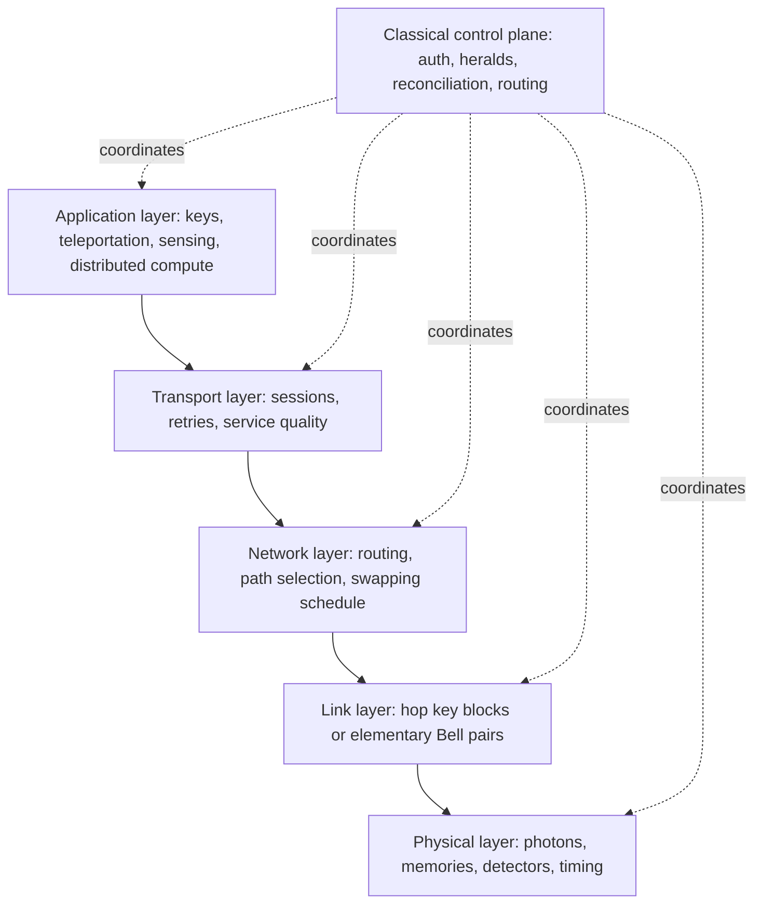

# Quantum Network

A quantum network connects quantum-capable nodes through physical channels, classical control, and protocols for producing keys, distributing entanglement, teleporting states, or coordinating distributed quantum tasks. In the quantum communication area, the near-term network usually means QKD links and trusted-node key relay. In the quantum internet area, the long-term network means entanglement distribution with memories, repeaters, and eventually networked quantum processors.

The distinction matters because "network" can hide very different trust assumptions. A metropolitan QKD network can be valuable even if every relay is trusted. A quantum internet aims for stronger primitives: Alice and Bob should be able to share entanglement or transmit unknown qubits without trusting every intermediate station with their final secret. That stronger goal is exactly why [quantum repeaters](/quantum-information-science/quantum-internet/quantum-repeater), memories, and entanglement swapping are central.

Nielsen and Chuang are not primarily a quantum-networking reference, but their channel and cryptography chapters fix the foundations used here: quantum noise is modeled by quantum operations, unknown states cannot be amplified by copying, and QKD security depends on authenticated classical communication plus postprocessing. The networking layer below should therefore be read as a system-level extension of the [BB84](/quantum-information-science/quantum-communication/bb84) and [QKD](/quantum-information-science/quantum-communication/qkd) pages, not as a separate security proof.

## Definitions

**Quantum node** is a device that can prepare, measure, store, or process quantum states. A simple QKD transmitter or receiver is a node. A more advanced repeater node may contain quantum memories, Bell-state measurement hardware, and local gates.

**Quantum link** is a physical channel between adjacent nodes. In optical networks this is often fiber or free space. The link may distribute BB84 states, weak coherent pulses, entangled photon pairs, or memory-compatible photons.

**Classical control plane** is the ordinary network used for basis announcements, timing, authentication, routing decisions, heralding messages, reconciliation, and application-level control. Quantum networking is never "quantum only"; it is a hybrid system.

**Trusted-node network** is a network in which intermediate nodes learn hop-by-hop keys and must be trusted. If Alice wants a key with Bob through relay $R$, Alice shares $K_{AR}$ with $R$, $R$ shares $K_{RB}$ with Bob, and $R$ helps transfer or derive an end-to-end key. Relay compromise can expose the key.

**Entanglement distribution network** tries to create Bell pairs or larger entangled states between remote endpoints. Once Alice and Bob share a high-quality Bell pair, they can use it for teleportation, entanglement-based QKD, clock synchronization protocols, or distributed quantum computation primitives.

**Entanglement swapping** connects two shorter entangled links. If Alice is entangled with relay $R_1$ and $R_1$ is entangled with Bob, a Bell-state measurement at $R_1$ can project Alice and Bob into an entangled state, up to a Pauli correction known from the classical measurement result.

**Quantum repeater** is a system that extends entanglement over long distances using combinations of heralded entanglement generation, memory, swapping, purification or error correction. It is not a classical optical amplifier; no-cloning forbids copying unknown qubits.

**Network stack** is the separation of responsibilities into layers. Quantum networks are still an active research area, so the exact stack is not as settled as TCP/IP, but the analogy is useful for engineering.

## Key results

A practical quantum network needs both a physical quantum service and a classical network service. The physical layer handles photons, wavelengths, timing, coupling, attenuation, detector noise, and calibration. The link layer decides whether adjacent nodes successfully produced a raw key block or an elementary entangled pair. The network layer chooses paths, schedules resources, and composes links. The transport layer hides loss, retries, buffering, and service quality from applications. The application layer asks for keys, Bell pairs, remote-state preparation, secure identification, or distributed quantum-computing operations.

Loss is the central scaling obstacle. In fiber with attenuation $\alpha$ dB/km, transmittance over length $L$ is

$$
\eta(L)=10^{-\alpha L/10}.
$$

Direct point-to-point QKD and direct entanglement distribution are therefore punished exponentially in distance when expressed in kilometers. Satellites reduce some fiber loss by moving much of the path through free space, but they introduce pointing, weather, scheduling, and ground-station constraints. Trusted relays avoid the quantum repeater problem by using shorter QKD hops, but they introduce trust assumptions. Quantum repeaters aim to remove that trust assumption, but practical repeater deployment remains technologically demanding.

The Wehner-Elkouss-Hanson roadmap organizes quantum internet maturity into stages:

| Stage | Informal name | Functionality | Example applications |
|---:|---|---|---|
| 0 | Trusted-node networks | End-to-end service through trusted relays | QKD backbone with trusted sites |
| 1 | Prepare-and-measure networks | End nodes prepare and measure qubits | BB84-like QKD without entanglement service |
| 2 | Entanglement-distribution networks | End nodes receive heralded entanglement | E91-style QKD, simple quantum sensing links |
| 3 | Quantum-memory networks | Nodes can store qubits long enough for coordination | Entanglement swapping, elementary repeaters |
| 4 | Few-qubit fault-tolerant networks | Small protected quantum operations | Higher-depth distributed protocols |
| 5 | Quantum-computing networks | Quantum computers exchange quantum data | Distributed quantum computation |

This roadmap is not a product timeline. It is a vocabulary for capabilities. A deployed QKD service can be useful at stage 0 or 1, while a research testbed may demonstrate one stage-2 or stage-3 primitive on a small number of nodes. Claims about distance and rate should always say which capability was demonstrated, under what trust model, and with what key or entanglement quality.

The best-known fielded QKD networks are not all the same. The Tokyo QKD network was an early metropolitan field test integrating several vendors and protocols. China's reported backbone and satellite-integrated network demonstrated large-scale trusted-relay QKD with fiber links and satellite-to-ground free-space links. These are important milestones, but the trust and operational assumptions remain different from an end-to-end entanglement-based quantum internet.

### Field-deployed metropolitan networks with optical switches

A near-term QKD network can be engineered as a managed key utility rather than as a single point-to-point rate experiment. De Toni et al. [1] report a four-node VenQCI metropolitan deployment in which efficient-BB84 devices, one-decoy weak coherent pulses, intermediate optical switches, MPLS classical networking, SKIP key delivery, and MACsec rekeying were operated for two months. The contribution is not a new security proof; it is a production-style systems result showing how QKD key generation, switching policy, key buffering, and classical network integration interact.

The protocol layer is still ordinary QKD accounting. If Alice and Bob choose the key basis with probability $p_Z$ and the check basis with probability $p_X=1-p_Z$, the efficient-BB84 basis-match probability is

$$
p_{\mathrm{sift}}=p_Z^2+p_X^2.
$$

For $p_Z=0.9$, $p_{\mathrm{sift}}=0.82$, compared with $0.50$ for unbiased BB84. The practical tradeoff is that the smaller check-basis sample must still support a finite-key phase-error bound. For weak coherent pulses, decoy analysis is needed because the photon-number distribution is approximately

$$
\Pr(N=n)=e^{-\mu}\frac{\mu^n}{n!},
\qquad
\Pr(N\ge 2)=1-e^{-\mu}(1+\mu),
$$

so multi-photon pulses are not negligible over long runs. A teaching form of the decoy-state secret-key rate is

$$
R \ge q\left[Q_1(1-h_2(e_1))-f_{\mathrm{EC}}Q_{\mu}h_2(E_{\mu})\right],
$$

where $Q_1$ and $e_1$ bound the single-photon contribution, $Q_{\mu}$ and $E_{\mu}$ are observed signal-intensity gain and QBER, and $f_{\mathrm{EC}}$ charges reconciliation leakage.

The network layer adds scheduling. In the reported line topology, optical switches at intermediate nodes let one QKD device serve neighboring spans over time rather than dedicating a separate device pair to every graph edge. A simple key-balancing controller captures the idea:

```text
for each switching epoch:
    choose the adjacent link with the lowest key_buffer / target_buffer
    connect the optical switch to that link
    run QKD until a block target or time limit is reached
    deliver fresh key blocks to the key-management layer
    keep local scheduling rules usable if the central controller is unavailable
```

As a scale check, a 500 kB sifted block accumulated in about six minutes corresponds to roughly $500\cdot1024\cdot8/360\approx11.4$ kbps of sifted detections. A 32-byte MACsec rekey each minute needs only $256/60\approx4.3$ bits/s of key material before accounting for reserves and policy overhead. The deployment result in [1] is therefore best read as evidence that, on short metropolitan spans, orchestration and integration can dominate the engineering story once the raw optical link is stable.

## Visual



| Architecture | Intermediate node learns final key? | Needs quantum memory? | Main use today | Main limitation |
|---|---:|---:|---|---|
| Direct BB84 link | No intermediate node | No | Point-to-point key generation | Distance and detector/source assumptions |
| Trusted-node QKD chain | Yes, if relays construct end-to-end keys | No | Metro and backbone QKD services | Relay trust and key-management complexity |
| MDI-QKD star | Measurement node need not be trusted | No long-lived memory | Detector-side-channel-resistant access network | Interference, rate, source assumptions |
| Entanglement-swapping network | No, if implemented correctly | Usually yes for scalability | Research testbeds, future repeaters | Memory quality and heralding rates |
| Fault-tolerant quantum internet | No by design goal | Yes, encoded | Long-term distributed quantum computing | Far beyond ordinary QKD deployment |

## Worked example 1: Trusted-node key relay on a three-hop chain

**Problem.** Alice wants an 8-bit session key with Bob through two trusted relays $R_1$ and $R_2$. Neighboring QKD links have already produced hop keys:

$$
K_{A1}=10110100,\quad
K_{12}=01101110,\quad
K_{2B}=11001001.
$$

Alice chooses final key

$$
K=00111101.
$$

Show how the key can be relayed using one-time-pad wrapping on each hop, and state who learns $K$.

**Method.**

1. Alice encrypts $K$ to $R_1$ with the hop key $K_{A1}$:

$$
C_1 = K \oplus K_{A1}.
$$

   Bit by bit:

$$
00111101 \oplus 10110100 = 10001001.
$$

2. Alice sends $C_1=10001001$ to $R_1$ over the classical channel. $R_1$ decrypts:

$$
C_1 \oplus K_{A1}=10001001\oplus10110100=00111101.
$$

3. $R_1$ re-encrypts $K$ for $R_2$:

$$
C_2 = K \oplus K_{12}
=00111101\oplus01101110=01010011.
$$

4. $R_2$ decrypts $C_2$ and re-encrypts for Bob:

$$
C_3 = K \oplus K_{2B}
=00111101\oplus11001001=11110100.
$$

5. Bob decrypts:

$$
C_3\oplus K_{2B}=11110100\oplus11001001=00111101.
$$

**Checked answer.** Bob obtains $K=00111101$. The relays $R_1$ and $R_2$ also learned $K$ while decrypting and re-encrypting. This is why the architecture is called trusted-node networking. It can extend QKD service across a backbone, but it is not end-to-end secrecy against relay compromise.

## Worked example 2: Expected entanglement-swapping rate

**Problem.** Alice and Bob are connected through one repeater node $R$. In each attempt, Alice-$R$ entanglement succeeds with probability $p_1=0.20$, $R$-Bob entanglement succeeds with probability $p_2=0.30$, and the Bell-state measurement at $R$ succeeds with probability $p_{\mathrm{BSM}}=0.50$ once both links are ready. If attempts run at $1000$ per second and memories are ideal for this toy calculation, estimate the end-to-end Bell-pair rate.

**Method.**

1. For a single synchronized attempt, require the first elementary link:

$$
p_1=0.20.
$$

2. Also require the second elementary link:

$$
p_2=0.30.
$$

3. Also require successful Bell-state measurement:

$$
p_{\mathrm{BSM}}=0.50.
$$

4. Assuming independence in this simplified model:

$$
p_{\mathrm{end}}=p_1p_2p_{\mathrm{BSM}}
=0.20\cdot0.30\cdot0.50=0.030.
$$

5. Multiply by attempt rate:

$$
R=1000\cdot0.030=30
$$

   end-to-end Bell pairs per second.

**Checked answer.** The toy rate is 30 Bell pairs per second. Real repeaters need memory waiting time, decoherence, purification or error correction overhead, classical signal delays, multiplexing, and scheduling. The simple multiplication is still useful because it shows why every elementary-link probability and swapping probability matters.

## Code

```python
import heapq
import math

graph = {
    "Alice": [("R1", 0.60, True), ("M", 0.20, False)],
    "R1": [("Alice", 0.60, True), ("R2", 0.55, True)],
    "R2": [("R1", 0.55, True), ("Bob", 0.50, True)],
    "M": [("Alice", 0.20, False), ("Bob", 0.18, False)],
    "Bob": [("R2", 0.50, True), ("M", 0.18, False)],
}

def best_path(start, goal, require_trusted=False):
    # Maximize product of link success probabilities by minimizing
    # the sum of negative logarithms.
    pq = [(0.0, start, [])]
    seen = set()
    while pq:
        score, node, path = heapq.heappop(pq)
        if node in seen:
            continue
        seen.add(node)
        path = path + [node]
        if node == goal:
            return math.exp(-score), path
        for nxt, success, trusted in graph[node]:
            if require_trusted and not trusted:
                continue
            heapq.heappush(pq, (score - math.log(success), nxt, path))
    return 0.0, []

for trusted_only in [False, True]:
    probability, path = best_path("Alice", "Bob", require_trusted=trusted_only)
    print(f"trusted_only={trusted_only} path={path} success_product={probability:.4f}")
```

The graph marks whether an edge is acceptable for a trusted-node QKD service. A real network scheduler would also track key-buffer inventory, wavelength availability, memory lifetimes, fidelity, and policy constraints.

## Common pitfalls

- Calling every QKD deployment a quantum internet. A trusted-node QKD backbone is a quantum communication network, but it does not provide arbitrary qubit transmission or end-to-end entanglement.
- Ignoring the classical control plane. Quantum links need authenticated messages, timing, heralding, routing, reconciliation, and application signaling.
- Assuming repeaters are optical amplifiers. Unknown quantum states cannot be copied and amplified; repeaters need entanglement, memory, swapping, and error management.
- Comparing distances without trust models. A long trusted-relay QKD network and a shorter entanglement-distribution testbed demonstrate different capabilities.
- Forgetting that entanglement rate is not enough. Fidelity, heralding latency, memory lifetime, and application requirements determine whether the entanglement is useful.
- Treating the roadmap stages as strict calendar predictions. They are capability classes, not guaranteed deployment dates.
- Neglecting key management. QKD links generate key material, but applications need buffering, access control, auditing, expiration, and integration with classical cryptographic protocols.

## Connections

- [Quantum Communication](/quantum-information-science/quantum-communication/intro) for the area overview and distinction between QKD networks and quantum internet goals.
- [BB84 Protocol](/quantum-information-science/quantum-communication/bb84) and [Quantum Key Distribution](/quantum-information-science/quantum-communication/qkd) for the link-layer protocols used in many near-term networks.
- [Quantum Internet](/quantum-information-science/quantum-internet/intro) for the primary home of end-to-end entanglement, teleportation, and repeater-based networking.
- [Entanglement](/quantum-information-science/quantum-internet/entanglement), [Quantum Teleportation](/quantum-information-science/quantum-internet/teleportation), and [Quantum Repeater](/quantum-information-science/quantum-internet/quantum-repeater) for the core primitives beyond trusted-node QKD.
- [Quantum Computing Hardware](/quantum-information-science/quantum-computing/hardware) and [Quantum Error Correction](/quantum-information-science/quantum-computing/error-correction) for memories, gates, and fault-tolerant ingredients.
- [TLS Protocol Overview](/cs/cryptography/tls-protocol-overview), [Authenticated Encryption GCM](/cs/cryptography/authenticated-encryption-gcm), and [Message Authentication Codes](/cs/cryptography/message-authentication-codes) for the classical network-security mechanisms that still surround QKD.
- Nielsen and Chuang, *Quantum Computation and Quantum Information*, Chapters 8 and 12, for the quantum-channel and QKD foundations behind the network abstractions.

## References

[1] A. De Toni, E. Bortolozzo, A. Emanuele, M. Venturini, L. Calderaro, M. Avesani, G. Vallone, P. Villoresi. *Long-term analysis of efficient-BB84 4-node network with optical switches in metropolitan environment*. arXiv:2510.16867v1, 2025.
