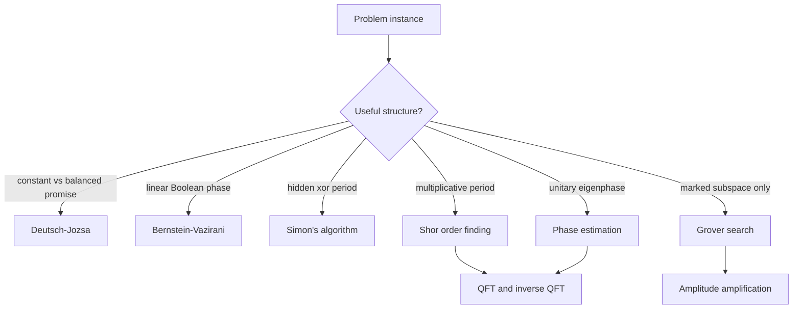

# Algorithms

Quantum algorithms are not faster because they "try all answers" and then reveal the right one. They are faster when a circuit arranges amplitudes so that measurement samples information about hidden structure: a period, an eigenphase, a marked subspace, or a useful expectation value. This page gives the foundational circuit-model algorithms and uses Nielsen and Chuang's notation for oracles, quantum Fourier transforms, phase estimation, Shor's order-finding reduction, and Grover search.

*This page synthesizes the wiki's earlier algorithm overview with Chapters 1, 5, and 6 of Nielsen and Chuang. The N&C emphasis is that QFT and search are the two canonical algorithmic engines: QFT exposes algebraic periodicity, while Grover's iterate performs an optimal two-dimensional amplitude rotation.*


*Figure: Circuit-level sketch of Grover's search algorithm. Image: [Wikimedia Commons](https://commons.wikimedia.org/wiki/File:Grover%27s_algorithm_circuit.svg), Fawly, CC BY-SA 4.0.*

## Definitions

A **quantum algorithm** is a uniform family of circuits followed by classical post-processing. Inputs may be classical bit strings, quantum states, or oracle access to a function. Costs may count gates, circuit depth, qubits, oracle calls, precision, or fault-tolerant logical resources. A speedup claim is meaningful only after the input model and output model are fixed.

A common bit oracle for $f:\{0,1\}^n\to\{0,1\}$ is

$$
U_f|x\rangle|y\rangle=|x\rangle|y\oplus f(x)\rangle.
$$

If the second register is prepared as

$$
|-\rangle=\frac{|0\rangle-|1\rangle}{\sqrt{2}},
$$

then phase kickback gives

$$
U_f|x\rangle|-\rangle=(-1)^{f(x)}|x\rangle|-\rangle.
$$

This phase-oracle form underlies Deutsch-Jozsa, Bernstein-Vazirani, Simon's algorithm, and Grover search.

The **quantum Fourier transform** over $N=2^n$ basis states is the unitary

$$
QFT_N|j\rangle=\frac{1}{\sqrt{N}}\sum_{k=0}^{N-1}e^{2\pi i jk/N}|k\rangle.
$$

N&C stress that this is a Fourier transform of amplitudes, not a direct replacement for the classical fast Fourier transform on explicitly stored data. The efficient circuit comes from writing $j=j_1j_2\cdots j_n$ in binary and using the product representation

$$
QFT_{2^n}|j_1\cdots j_n\rangle=
\frac{(|0\rangle+e^{2\pi i0.j_n}|1\rangle)\cdots(|0\rangle+e^{2\pi i0.j_1\cdots j_n}|1\rangle)}
{2^{n/2}},
$$

up to the final reversal of qubit order.

**Phase estimation** estimates $\phi$ when

$$
U|u\rangle=e^{2\pi i\phi}|u\rangle.
$$

It uses a phase register, controlled powers $U^{2^j}$, the inverse QFT, and computational-basis measurement. If the input is a superposition of eigenvectors, measurement samples one eigenphase with probability equal to the squared overlap with its eigenvector.

For a positive integer $a\lt N$ with $\gcd(a,N)=1$, the **order** of $a$ modulo $N$ is the least $r\gt 0$ such that

$$
a^r\equiv 1 \pmod N.
$$

Shor's algorithm reduces factoring to finding this order.

**Amplitude amplification** starts with

$$
|\psi\rangle=\sqrt{a}\,|\psi_{\mathrm{good}}\rangle+\sqrt{1-a}\,|\psi_{\mathrm{bad}}\rangle
$$

and uses a phase oracle plus a reflection about $\vert \psi\rangle$ to rotate amplitude toward the good subspace.

## Key results

Deutsch-Jozsa gives an exact oracle separation for a promise problem. Given $f:\{0,1\}^n\to\{0,1\}$ promised constant or balanced, the amplitude of $\vert 0^n\rangle$ after the final Hadamards is

$$
\frac{1}{2^n}\sum_x(-1)^{f(x)}.
$$

It is $\pm 1$ for constant functions and $0$ for balanced functions. N&C introduce this early because it demonstrates phase kickback and interference before the more substantial algorithms.

Phase estimation is the core QFT subroutine. With $t$ phase qubits, Hadamards prepare $2^{-t/2}\sum_{j=0}^{2^t-1}\vert j\rangle$. Controlled powers transform this into

$$
\frac{1}{2^{t/2}}\sum_{j=0}^{2^t-1}e^{2\pi i j\phi}|j\rangle|u\rangle.
$$

The inverse QFT maps the phase pattern to a computational-basis estimate. If $\phi$ has an exact $t$-bit binary expansion, the estimate is exact. Otherwise, extra phase bits raise the success probability of obtaining a close approximation.

Shor's factoring algorithm proceeds as follows.

1. Choose a random $a$ with $1\lt a\lt N$. If $\gcd(a,N)\gt 1$, a factor has already been found.
2. Define the modular multiplication unitary

$$
U_a|y\rangle=|ay\bmod N\rangle
$$

on the subspace $0\le y\lt N$, with a reversible convention on unused basis states.
3. Use phase estimation on $U_a$. The eigenstates associated with the cyclic orbit of $1$ are

$$
|u_s\rangle=\frac{1}{\sqrt{r}}\sum_{k=0}^{r-1}e^{-2\pi i sk/r}|a^k\bmod N\rangle,
$$

with eigenvalue $e^{2\pi i s/r}$. Preparing $\vert 1\rangle$ gives a uniform superposition of these eigenstates, so phase estimation samples an approximation to $s/r$.
4. Use continued fractions to recover a candidate denominator $r$ from the measured rational approximation.
5. Check whether $a^r\equiv 1\pmod N$. If not, repeat or refine.
6. If $r$ is even and $a^{r/2}\not\equiv -1\pmod N$, compute

$$
\gcd(a^{r/2}-1,N),
\qquad
\gcd(a^{r/2}+1,N).
$$

These are nontrivial factors. The success probability is constant after accounting for random $a$, useful Fourier samples, and the coprimality of $s$ and $r$, so repetition boosts success.

Grover search solves an unstructured marked-item problem with a quadratic query improvement. Let $N$ be the number of items and $M$ the number of marked items. Define

$$
|g\rangle=\frac{1}{\sqrt{M}}\sum_{f(x)=1}|x\rangle,
\qquad
|b\rangle=\frac{1}{\sqrt{N-M}}\sum_{f(x)=0}|x\rangle.
$$

The initial uniform state is

$$
|\psi\rangle=\sqrt{\frac{M}{N}}|g\rangle+\sqrt{\frac{N-M}{N}}|b\rangle.
$$

Set $\sin\theta=\sqrt{M/N}$. The Grover iterate

$$
G=(2|\psi\rangle\langle\psi|-I)O_f
$$

is the product of two reflections and rotates the state by $2\theta$ in the plane spanned by $\vert g\rangle$ and $\vert b\rangle$. After $k$ iterations, the success probability is

$$
\sin^2((2k+1)\theta).
$$

A near-optimal choice is

$$
k\approx \left\lfloor \frac{\pi}{4\theta}-\frac{1}{2}\right\rceil,
$$

which gives $O(\sqrt{N/M})$ oracle calls. N&C also emphasize two limits: quantum counting combines Grover with phase estimation to estimate $M$, and Grover search is optimal in the black-box model, so unstructured search cannot be improved to logarithmic query complexity.

## Visual



| Algorithmic pattern | N&C representative | Quantum operation | Classical post-processing | Main caveat |
|---|---|---|---|---|
| Phase kickback | Deutsch-Jozsa, Bernstein-Vazirani | Convert function values into phases | Interpret final bit string | Promise or hidden linearity is special |
| Fourier sampling | Phase estimation, Shor | Inverse QFT turns phases into estimates | Continued fractions, gcd checks | Needs coherent controlled powers |
| Order finding | Shor | Modular exponentiation plus phase estimation | Recover $r$, then factors | Fault-tolerant depth dominates practical factoring |
| Amplitude amplification | Grover | Product of two reflections | Verify sampled solution | Oracle construction can dominate |
| Quantum counting | Grover plus phase estimation | Estimate eigenphase of Grover iterate | Convert angle to $M$ | Still needs oracle access |
| State-output linear algebra | HHL-style later algorithms | Prepare amplitude-encoded answer state | Estimate observables | Data loading and readout can erase speedup |

## Worked example 1: Shor post-processing for factoring 15

**Problem.** Factor $N=15$ using the order-finding branch of Shor's algorithm with $a=2$. Show the order and the classical gcd step.

**Method.**

1. Check that $a$ is usable:

$$
\gcd(2,15)=1.
$$

So no factor is found immediately, and order finding is needed.

2. Compute powers of $2$ modulo $15$:

$$
2^1\equiv 2\pmod{15},
$$

$$
2^2=4\equiv 4\pmod{15},
$$

$$
2^3=8\equiv 8\pmod{15},
$$

$$
2^4=16\equiv 1\pmod{15}.
$$

No earlier positive exponent gives $1$, so the order is

$$
r=4.
$$

3. Check the factoring conditions. The order is even. Also

$$
2^{r/2}=2^2=4\not\equiv -1\pmod{15},
$$

because $-1\equiv 14\pmod{15}$.

4. Compute the gcds:

$$
\gcd(2^{r/2}-1,15)=\gcd(3,15)=3,
$$

$$
\gcd(2^{r/2}+1,15)=\gcd(5,15)=5.
$$

5. Connect this to the quantum measurement. If a phase register of size $q=256$ measured $64$, the rational estimate is

$$
\frac{64}{256}=\frac{1}{4}.
$$

Continued fractions recover denominator $4$, matching the order. A measurement of $192$ would give $192/256=3/4$, also revealing denominator $4$.

**Answer.** The order of $2$ modulo $15$ is $4$, and the classical post-processing returns factors $3$ and $5$. The checked point is that the quantum subroutine is not "factoring directly"; it estimates a phase whose denominator is the period needed by the number-theoretic reduction.

## Worked example 2: Grover iteration count and success check

**Problem.** A search space has $N=64$ items and $M=1$ marked item. Estimate the number of Grover iterations and check the success probability formula.

**Method.**

1. Compute the initial good amplitude:

$$
\sin\theta=\sqrt{\frac{M}{N}}=\sqrt{\frac{1}{64}}=\frac{1}{8}.
$$

2. Find the angle:

$$
\theta=\arcsin(1/8)\approx 0.1253.
$$

3. Use the near-optimal iteration estimate:

$$
k\approx \frac{\pi}{4\theta}-\frac{1}{2}
=\frac{3.1416}{4(0.1253)}-\frac{1}{2}
\approx 5.77.
$$

So choose $k=6$ iterations.

4. Check the success probability:

$$
P_{\mathrm{success}}=\sin^2((2k+1)\theta)
=\sin^2(13\times 0.1253).
$$

5. Multiply the angle:

$$
13\times 0.1253=1.6289.
$$

This is close to $\pi/2\approx 1.5708$, so the sine squared is close to $1$.

**Answer.** Use about $6$ Grover iterations. The state has rotated very near the marked subspace, so measurement returns the marked item with high probability. The check also shows why over-iteration is a mistake: after passing the marked subspace, further rotations decrease success probability.

## Code

This snippet implements the classical post-processing part of Shor's algorithm for small examples. It assumes the quantum phase-estimation stage has supplied a candidate rational approximation.

```python
from fractions import Fraction
from math import gcd

def recover_order_from_phase(measured, q, n):
    """Recover a candidate order r from measured/q using continued fractions."""
    frac = Fraction(measured, q).limit_denominator(n)
    return frac.denominator

def shor_postprocess(n, a, measured, q):
    g = gcd(a, n)
    if g > 1:
        return g, n // g

    r = recover_order_from_phase(measured, q, n)
    if pow(a, r, n) != 1:
        return None
    if r % 2 != 0:
        return None

    half = pow(a, r // 2, n)
    if half == n - 1:
        return None

    p = gcd(half - 1, n)
    q_factor = gcd(half + 1, n)
    if 1 < p < n and 1 < q_factor < n:
        return tuple(sorted((p, q_factor)))
    return None

print(shor_postprocess(n=15, a=2, measured=64, q=256))
print(shor_postprocess(n=15, a=2, measured=192, q=256))
```

## Common pitfalls

- Saying "quantum parallelism" without explaining interference. Superposition alone does not make all branch results readable.
- Treating QFT as a faster classical FFT. It transforms amplitudes of a quantum state; extracting all transformed amplitudes would require many measurements.
- Hiding modular exponentiation in Shor's algorithm. It is the large reversible arithmetic block and dominates resource estimates.
- Forgetting continued fractions and gcd checks. The quantum measurement gives a rational approximation, not factors by itself.
- Assuming every choice of $a$ works in Shor. Random choices can fail if the order is odd or $a^{r/2}\equiv -1\pmod N$.
- Over-iterating Grover search. The good amplitude rotates up and then back down.
- Ignoring oracle construction. Query complexity can hide a real circuit whose cost is comparable to the classical verifier.
- Concluding that Grover solves NP-complete problems efficiently. It gives a quadratic speedup for unstructured search, and N&C discuss optimality bounds against better black-box scaling.
- Claiming NISQ devices can run useful Shor factoring at cryptographic sizes. Shor requires deep, fault-tolerant modular arithmetic.
- Forgetting input and output models in later algorithms such as HHL. Preparing $\vert b\rangle$ and reading useful observables are part of the algorithm.

## Connections

- [Quantum hardware](/quantum-information-science/quantum-computing/hardware) determines whether controlled powers, modular arithmetic, or Grover oracles can be run before noise dominates.
- [Quantum error correction](/quantum-information-science/quantum-computing/error-correction) is required for deep algorithms such as Shor and high-precision phase estimation.
- [Quantum machine learning](/quantum-information-science/quantum-computing/quantum-ml) borrows amplitude estimation, phase estimation, kernels, and variational circuits, but often changes the input-output model.
- [Cryptography](/cs/cryptography/) connects directly to factoring, discrete logarithms, and post-quantum security.
- [Linear algebra](/math/linear-algebra/) supplies eigenvectors, unitaries, tensor products, projections, and Fourier transforms.
- [Quantum mechanics](/physics/quantum-mechanics/) supplies measurement, unitary evolution, phase, and interference.
- [Quantum communication](/quantum-information-science/quantum-communication/) uses many of the same primitive circuits, including teleportation and phase-sensitive measurements.

## Further reading

- Michael A. Nielsen and Isaac L. Chuang, *Quantum Computation and Quantum Information*, Chapters 1, 5, and 6.
- Peter Shor, polynomial-time algorithms for prime factorization and discrete logarithms.
- Lov Grover, a fast quantum mechanical algorithm for database search.
- Daniel Simon, on the power of quantum computation.
- Ethan Bernstein and Umesh Vazirani, quantum complexity theory.
- Aram Harrow, Avinatan Hassidim, and Seth Lloyd, quantum algorithm for linear systems.
