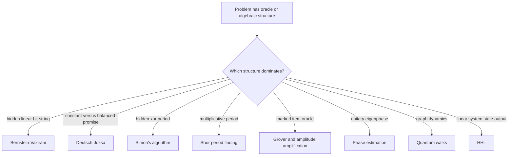

# Algorithms

Quantum algorithms are not faster because they try all answers and then read them out. They are faster when a circuit creates phases whose interference reveals a hidden algebraic, geometric, or probabilistic structure with fewer queries or lower asymptotic cost than known classical methods. This page covers the foundational algorithms that define the field: Deutsch-Jozsa, Bernstein-Vazirani, Simon's algorithm, Shor's factoring algorithm, Grover search and amplitude amplification, quantum phase estimation, quantum walks, and HHL for linear systems.

## Definitions

A **quantum algorithm** is a family of circuits, usually uniform in the input size, followed by classical post-processing. The basic circuit operations are unitary gates and measurements; the cost model may count gates, oracle queries, circuit depth, qubits, or fault-tolerant logical resources.

A **query algorithm** accesses a function $f$ through an oracle. A common bit oracle is

$$
U_f |x\rangle |y\rangle = |x\rangle |y \oplus f(x)\rangle.
$$

With the second register prepared as $\vert -\rangle = (\vert 0\rangle - \vert 1\rangle)/\sqrt{2}$, phase kickback gives

$$
U_f |x\rangle |-\rangle = (-1)^{f(x)} |x\rangle |-\rangle.
$$

That phase form is central to Deutsch-Jozsa, Bernstein-Vazirani, Simon's algorithm, and Grover search.

The **quantum Fourier transform** over $N=2^n$ basis states is

$$
QFT_N |x\rangle
= \frac{1}{\sqrt{N}}\sum_{k=0}^{N-1} e^{2\pi i xk/N}|k\rangle.
$$

It is the key transform in phase estimation and Shor's period finding.

**Amplitude amplification** starts with a state

$$
|\psi\rangle = \sqrt{a}|\psi_{\mathrm{good}}\rangle
+ \sqrt{1-a}|\psi_{\mathrm{bad}}\rangle,
$$

and repeatedly rotates amplitude toward the good subspace using a phase oracle and a reflection about the initial state.

**Hamiltonian simulation** approximates $e^{-iHt}$ for a Hermitian matrix $H$. Phase estimation, quantum walks, and HHL all rely on controlled unitary evolution or a closely related block-encoding.

## Key results

Deutsch-Jozsa separates deterministic classical and exact quantum query complexity for a promise problem. Given $f:\{0,1\}^n \to \{0,1\}$ promised to be constant or balanced, the circuit prepares a uniform superposition, applies phase kickback, then applies Hadamards:

$$
H^{\otimes n} U_f H^{\otimes n}|0^n\rangle |-\rangle.
$$

The amplitude of $\vert 0^n\rangle$ in the input register is

$$
\frac{1}{2^n}\sum_x (-1)^{f(x)}.
$$

It equals $\pm 1$ for constant functions and $0$ for balanced functions.

Bernstein-Vazirani finds a hidden string $s \in \{0,1\}^n$ with one query when

$$
f_s(x) = s \cdot x \pmod 2.
$$

The phase oracle maps the uniform state to

$$
\frac{1}{\sqrt{2^n}}\sum_x (-1)^{s\cdot x}|x\rangle,
$$

and a final Hadamard transform returns $\vert s\rangle$.

Simon's algorithm finds a hidden xor mask $s$ for a two-to-one function satisfying

$$
f(x) = f(y) \quad \text{iff} \quad y = x \oplus s.
$$

After querying and measuring the output register, the input register is proportional to $\vert x\rangle + \vert x\oplus s\rangle$. Applying Hadamards and measuring gives a random $y$ such that

$$
y \cdot s = 0 \pmod 2.
$$

Repeating gives linear equations over $\mathbb{F}_2$ that determine $s$.

Shor's factoring algorithm reduces factoring an odd composite $N$ to period finding. Choose $a$ coprime to $N$ and define

$$
f(x) = a^x \bmod N.
$$

If the period $r$ is even and $a^{r/2} \not\equiv -1 \pmod N$, then

$$
\gcd(a^{r/2}-1,N)
\quad \text{and} \quad
\gcd(a^{r/2}+1,N)
$$

give nontrivial factors with good probability. The quantum part uses modular exponentiation and QFT-based phase estimation to estimate $k/r$.

Grover search finds a marked item among $N$ possibilities using $O(\sqrt{N})$ oracle queries. Let $\sin^2\theta = M/N$ where $M$ is the number of marked items. Each Grover iterate rotates by $2\theta$ in the span of good and bad states:

$$
G = (2|\psi\rangle\langle\psi| - I)O_f.
$$

After about $\pi/(4\theta)$ iterations, measuring returns a marked item with high probability.

Quantum phase estimation estimates an eigenphase. If

$$
U|u\rangle = e^{2\pi i \phi}|u\rangle,
$$

then controlled powers $U^{2^j}$ and inverse QFT estimate $\phi$ to $m$ bits using an $m$-qubit phase register.

Quantum walks generalize random walks by unitary evolution. Discrete-time walks use a coin and shift operator, while continuous-time walks evolve as

$$
|\psi(t)\rangle = e^{-i\gamma A t}|\psi(0)\rangle
$$

for graph adjacency matrix $A$. They support search, element distinctness, and graph traversal speedups in specific settings.

HHL solves linear systems in a restricted output model. For a sparse, well-conditioned Hermitian matrix $A$ and state $\vert b\rangle$, the goal is to prepare a state proportional to $A^{-1}\vert b\rangle$. Phase estimation on $e^{iAt}$ extracts eigenvalues $\lambda_j$, a controlled rotation applies a factor proportional to $1/\lambda_j$, and uncomputation leaves amplitudes scaled by the inverse eigenvalues. The caveats are essential: data loading, condition number, sparsity, precision, and output readout determine whether an application gains anything.

These algorithms also illustrate three recurring design patterns. First, many speedups are really **Fourier sampling** arguments: a hidden subgroup, period, or character is transformed into a measurable computational-basis label. Second, many search speedups are **two-dimensional rotation** arguments: the circuit preserves the span of good and bad components and rotates inside it. Third, many linear-algebra speedups are **state-output** arguments: the quantum computer prepares a state whose amplitudes encode an answer, but extracting all entries would require too many measurements. Keeping those patterns separate prevents a common overgeneralization: Shor, Grover, and HHL are not three interchangeable examples of the same kind of advantage.

## Visual



| Algorithm | Core unitary idea | Speedup type | Main caveat |
|---|---|---|---|
| Deutsch-Jozsa | Global phase sum after Hadamards | Exact oracle separation | Promise problem, not broad application |
| Bernstein-Vazirani | Phase kickback of linear Boolean function | Query reduction | Hidden linear structure is special |
| Simon | Samples equations orthogonal to hidden xor mask | Exponential oracle separation | Requires promise and oracle access |
| Shor | Modular exponentiation plus QFT period finding | Exponential over best known classical factoring algorithms | Needs fault-tolerant depth and many logical gates |
| Grover | Reflections rotate amplitude toward marked states | Quadratic | Oracle construction can dominate |
| Phase estimation | Controlled powers plus inverse QFT | Foundational subroutine | Requires eigenstate preparation or overlap |
| Quantum walks | Unitary graph propagation | Problem-specific | Speedup depends on graph and hitting structure |
| HHL | Phase estimation plus eigenvalue inversion | Potential exponential in output-state model | Data loading and readout limitations are severe |

## Worked example 1: Bernstein-Vazirani for a three-bit string

**Problem.** Suppose $f_s(x)=s\cdot x \pmod 2$ with hidden string $s=101$. Show that one quantum query recovers $s$.

**Method.**

1. Start the input register in $\vert 000\rangle$ and apply Hadamards:

$$
H^{\otimes 3}|000\rangle
= \frac{1}{\sqrt{8}}\sum_{x\in\{0,1\}^3}|x\rangle.
$$

2. Use the phase oracle:

$$
|x\rangle \mapsto (-1)^{s\cdot x}|x\rangle.
$$

For $s=101$, the exponent is $x_1 \oplus x_3$ if bits are ordered left to right. The state becomes

$$
\frac{1}{\sqrt{8}}\sum_x (-1)^{x_1\oplus x_3}|x\rangle.
$$

3. Use the identity

$$
H^{\otimes n}\left(\frac{1}{\sqrt{2^n}}\sum_x (-1)^{s\cdot x}|x\rangle\right)=|s\rangle.
$$

For $n=3$, the final state is $\vert 101\rangle$.

4. Measure in the computational basis.

**Answer.** The measurement returns $101$ with probability $1$. The check is that the final Hadamards undo the character of the Boolean group $\mathbb{F}_2^3$ and convert the phase label into a basis label.

## Worked example 2: Grover iteration count for one marked item

**Problem.** A database has $N=64$ items and exactly one marked item. Estimate how many Grover iterations should be used.

**Method.**

1. With one marked item, $M=1$ and

$$
\sin^2\theta = \frac{M}{N} = \frac{1}{64}.
$$

2. Therefore

$$
\sin\theta = \frac{1}{8},
\qquad
\theta = \arcsin(1/8).
$$

For small angles this is about $0.125$ radians; using the arcsine gives about $0.1253$ radians.

3. The near-optimal iteration count is

$$
k \approx \left\lfloor \frac{\pi}{4\theta} \right\rfloor
= \left\lfloor \frac{3.1416}{4(0.1253)} \right\rfloor
= \lfloor 6.27 \rfloor
= 6.
$$

4. Check the success angle after $k$ iterations. The success probability is

$$
\sin^2((2k+1)\theta)
= \sin^2(13 \times 0.1253)
= \sin^2(1.6289).
$$

Since $1.6289$ is close to $\pi/2$, the probability is close to $1$.

**Answer.** Use about $6$ Grover iterations. More iterations are not always better; after the amplitude rotates past the marked subspace, the success probability decreases.

## Code

This small state-vector simulation implements Grover search for $N=8$ with one marked item. It uses only NumPy and explicit matrices so the reflections are visible.

```python
import numpy as np

def grover_search(num_qubits, marked):
    n = 2 ** num_qubits
    state = np.ones(n, dtype=complex) / np.sqrt(n)

    oracle = np.eye(n, dtype=complex)
    oracle[marked, marked] = -1

    psi = np.ones((n, 1), dtype=complex) / np.sqrt(n)
    diffusion = 2 * (psi @ psi.conj().T) - np.eye(n)

    iterations = round(np.pi / 4 * np.sqrt(n))
    for _ in range(iterations):
        state = diffusion @ (oracle @ state)

    probabilities = np.abs(state) ** 2
    return probabilities

probs = grover_search(num_qubits=3, marked=5)
for index, probability in enumerate(probs):
    print(f"{index:03b}: {probability:.3f}")
```

## Common pitfalls

- Saying "quantum parallelism" without explaining interference. Superposition alone does not give readable answers.
- Ignoring oracle construction. Query complexity can hide the real cost of building $U_f$.
- Treating Shor as a NISQ algorithm. Useful large-number factoring requires fault-tolerant resources.
- Treating HHL as a drop-in replacement for classical linear solvers. It prepares a quantum state, not a printed vector.
- Forgetting input and output models. State preparation and measurement can erase theoretical speedups.
- Over-iterating Grover search. The state rotates through the good subspace and then away from it.
- Assuming phase estimation works without eigenstate overlap. If the input has little overlap with the target eigenstate, success probability is small.
- Calling every variational circuit an algorithmic speedup. Many variational methods are heuristics; see [quantum machine learning](/quantum-information-science/quantum-computing/quantum-ml).
- Forgetting precision dependence. A polylogarithmic dimension dependence can still be offset by condition number, inverse success probability, or high accuracy requirements.
- Ignoring classical post-processing. Simon's algorithm needs linear algebra over $\mathbb{F}_2$, and Shor's algorithm needs continued fractions and gcd computations after measurement.

## Connections

- [Quantum hardware](/quantum-information-science/quantum-computing/hardware) determines native gates, depth limits, and whether circuits can be run before decoherence.
- [Quantum error correction](/quantum-information-science/quantum-computing/error-correction) is required for deep algorithms such as Shor and high-precision phase estimation.
- [Quantum machine learning](/quantum-information-science/quantum-computing/quantum-ml) uses amplitude estimation, kernels, parametrized circuits, and QAOA-adjacent methods.
- [Cryptography](/cs/cryptography/) connects to Shor's algorithm through RSA and discrete-log systems.
- [Linear algebra](/math/linear-algebra/) is the language of unitary matrices, eigenspaces, singular values, and condition numbers.
- [Machine learning](/cs/machine-learning/) and [deep learning](/cs/deep-learning/) are needed to judge QML baselines honestly.
- [Quantum security](/quantum-information-science/quantum-security/) covers quantum-safe cryptography and protocol implications.

## Further reading

- Peter Shor, polynomial-time algorithms for prime factorization and discrete logarithms.
- Lov Grover, a fast quantum mechanical algorithm for database search.
- Daniel Simon, on the power of quantum computation.
- Ethan Bernstein and Umesh Vazirani, quantum complexity theory.
- Dorit Aharonov, Andris Ambainis, Julia Kempe, and others on quantum walks.
- Aram Harrow, Avinatan Hassidim, and Seth Lloyd, quantum algorithm for linear systems.
- Michael A. Nielsen and Isaac L. Chuang, *Quantum Computation and Quantum Information*.
