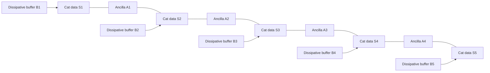

# Concatenated Bosonic Cat Qubits

"Hardware-efficient quantum error correction via concatenated bosonic qubits," *Nature* 638, 927-933 (2025), https://doi.org/10.1038/s41586-025-08642-7, demonstrates a logical memory built from stabilized bosonic cat qubits concatenated with an outer repetition code. The technique uses a superconducting oscillator to make each data qubit strongly biased against bit flips, then uses a small repetition code and transmon ancillas to correct the remaining phase flips.

## Problem & motivation

The standard surface-code route to fault tolerance protects against both bit-flip and phase-flip errors using a two-dimensional array of physical qubits. It is powerful, but it has high overhead. Bosonic encodings try to reduce that overhead by first encoding a qubit inside a single harmonic oscillator. If the oscillator dynamics can make one error type rare, an outer code can focus on the dominant residual error.

Cat qubits are an example of this layered idea. The computational states are approximately coherent states $\vert \alpha\rangle$ and $\vert -\alpha\rangle$ in a storage resonator. Their separation in phase space makes direct bit flips exponentially unlikely as the mean photon number $\vert \alpha\vert ^2$ increases. Single-photon loss and heating, however, still cause phase flips whose rate grows roughly with $\vert \alpha\vert ^2$. The architecture therefore converts a balanced-noise problem into a biased-noise problem: suppress $X$ errors in hardware, then correct $Z$ errors with a repetition code.

The paper's contribution is not that a repetition code alone is new. Its contribution is an integrated hardware-efficient memory: five stabilized cat data qubits, four transmon ancillas, noise-biased cat-transmon controlled gates, erasure-aware decoding, and a measured comparison between distance-3 sections and a distance-5 repetition-cat code.

## Method

Each data qubit is stored in a bosonic mode with approximate computational basis

$$
|0\rangle_c \approx |\alpha\rangle,
\qquad
|1\rangle_c \approx |-\alpha\rangle.
$$

The complementary cat states are even and odd parity superpositions. In this basis, a bit flip maps the two coherent states into each other, while a phase flip changes the relative parity. The device uses engineered two-photon dissipation to stabilize the manifold spanned by $\vert \pm \alpha\rangle$. In a simplified effective model, the bias scales as

$$
\frac{\Gamma_Z}{\Gamma_X} \gg 1,
\qquad
\Gamma_X \propto e^{-c|\alpha|^2},
\qquad
\Gamma_Z \propto |\alpha|^2\kappa_1,
$$

where $\Gamma_X$ is the cat-qubit bit-flip rate, $\Gamma_Z$ is the phase-flip rate, $\kappa_1$ is a single-photon loss scale, and $c$ depends on the stabilization and device details.

The outer code is a one-dimensional repetition code over $d$ cat qubits. Its measured stabilizers are

$$
S_i=X_iX_{i+1},
\qquad i=1,\ldots,d-1.
$$

These checks detect phase flips on the cat qubits. A syndrome measurement uses a transmon ancilla initialized, coupled through two controlled-$X$ interactions to neighboring storage modes, measured, and reset. Consecutive syndrome outcomes are compared to form detection events, and minimum-weight perfect matching decodes likely phase-flip histories.

The subtle hardware piece is the cat-transmon controlled-$X$ gate. The transmon ancilla uses states $\vert g\rangle$ and $\vert f\rangle$ as the logical ancilla states, and the storage mode undergoes an approximately $180^\circ$ phase-space rotation conditioned on the ancilla. The device is engineered so that the dominant $\vert f\rangle\to\vert e\rangle$ decay does not immediately become a cat bit flip. The experiment also resolves erasure information from three-state transmon readout, improving decoding when ancilla decay affects a syndrome.

## Visual



| Layer | Protected object | Dominant job | Failure mode to watch |
|---|---|---|---|
| Cat encoding | One oscillator mode | Suppress cat bit flips by phase-space separation | Phase flips increase with photon number |
| Two-photon dissipation | Cat manifold | Keep the oscillator near $\vert \pm\alpha\rangle$ | Stabilization can add engineering complexity |
| Cat-transmon CX | Syndrome extraction | Preserve noise bias while measuring checks | Ancilla decay and heating |
| Repetition code | String of cat qubits | Correct phase flips using $X_iX_{i+1}$ checks | Uncorrected bit flips accumulate across all cats |
| Erasure-aware decoder | Syndrome history | Use detected ancilla leakage/decay information | Requires reliable three-state readout |

## Hyperparameters / system details

The demonstrated distance-5 repetition-cat memory used five storage modes as cat data qubits and four transmon ancillas for syndrome measurement. Each storage mode had an associated buffer mode for two-photon dissipation. The storage modes were coplanar waveguide resonators in a flip-chip superconducting circuit.

Under simultaneous stabilization, the paper reports effective storage lifetimes in the range $57$-$68\,\mu\mathrm{s}$ for the cat modes. At mean photon number $\vert \alpha\vert ^2=2$, the individual cat qubits had bit-flip times greater than $1\,\mathrm{ms}$ and phase-flip times around $27$-$33\,\mu\mathrm{s}$, giving a noise bias greater than $30$ in the idle stabilized setting. During repeated CX-style cycles at $\vert \alpha\vert ^2=2$, the reported bit- and phase-flip error probabilities per cycle were about $3.5\times10^{-3}$ and $9.6\times10^{-2}$, corresponding to a bias greater than $25$.

The syndrome extraction cycle was conservatively chosen as $2.8\,\mu\mathrm{s}$. The decoder used minimum-weight perfect matching and improved performance by incorporating erasure information from the ancilla readout. The distance-5 code contains two minimally overlapping distance-3 sections, allowing an in-device comparison between code distances under similar hardware conditions.

## Headline results

The headline result is that the phase-flip correcting repetition code operated below threshold in the tested range: as distance increased from 3 to 5, the logical phase-flip rate showed stronger suppression as a function of photon number. With erasure information included, fitted scaling exponents increased from roughly $1.63$ and $1.86$ in the two distance-3 subsections to about $2.31$ in the full distance-5 section, below the ideal $(d+1)/2$ but consistent with simulations including measured imperfections.

The overall logical error per cycle combined phase-flip and bit-flip contributions:

$$
\epsilon_L=\frac{\epsilon_{L,\mathrm{phase}}+\epsilon_{L,\mathrm{bit}}}{2}.
$$

The paper reports a best measured distance-5 overall logical error per cycle of $1.65\pm0.03\%$ at $\vert \alpha\vert ^2=1.5$. The two distance-3 sections had best average performance of $1.75\pm0.02\%$. The result is deliberately phrased as comparable performance at larger distance, not a full asymptotic threshold for the complete biased-noise architecture, because uncorrected bit flips eventually set a floor.

## Worked example 1: Counting syndrome operations in one distance-5 cycle

**Problem.** In a distance-5 repetition-cat memory with five data cats and four neighboring checks $X_iX_{i+1}$, count the number of cat-transmon CX interactions in one full syndrome cycle.

**Method.**

1. The stabilizer checks are

$$
X_1X_2,\quad X_2X_3,\quad X_3X_4,\quad X_4X_5.
$$

2. Each check couples one ancilla to two neighboring cat data qubits.

3. One check therefore uses two controlled operations:

$$
N_{\mathrm{CX/check}}=2.
$$

4. There are $d-1=4$ checks for $d=5$.

5. The total number of CX interactions per full syndrome cycle is

$$
N_{\mathrm{CX}}=(d-1)\times2=4\times2=8.
$$

**Checked answer.** A full distance-5 repetition-cat syndrome cycle uses eight cat-transmon CX interactions, plus four ancilla measurements and resets. This is why preserving cat noise bias during the CX gate is crucial: even a small gate-induced bit-flip probability is multiplied across several fault locations.

## Worked example 2: Finding the photon-number trade-off

**Problem.** A simplified repetition-cat model has a logical bit-flip contribution $\epsilon_X(n)=0.050e^{-0.7n}$ and a logical phase-flip contribution $\epsilon_Z(n)=0.004n^2$, where $n=\vert \alpha\vert ^2$. Find the best $n$ among $1.0$, $1.5$, $2.0$, and $2.5$ using $\epsilon_L=(\epsilon_X+\epsilon_Z)/2$.

**Method.**

1. Evaluate $n=1.0$:

$$
\epsilon_X=0.050e^{-0.7}=0.0248,\qquad
\epsilon_Z=0.004,
$$

so

$$
\epsilon_L=\frac{0.0248+0.004}{2}=0.0144.
$$

2. Evaluate $n=1.5$:

$$
\epsilon_X=0.050e^{-1.05}=0.0175,\qquad
\epsilon_Z=0.004(2.25)=0.0090,
$$

so

$$
\epsilon_L=0.01325.
$$

3. Evaluate $n=2.0$:

$$
\epsilon_X=0.050e^{-1.4}=0.0123,\qquad
\epsilon_Z=0.0160,
$$

so

$$
\epsilon_L=0.01415.
$$

4. Evaluate $n=2.5$:

$$
\epsilon_X=0.050e^{-1.75}=0.00869,\qquad
\epsilon_Z=0.0250,
$$

so

$$
\epsilon_L=0.01685.
$$

**Checked answer.** The best tested photon number in this toy model is $n=1.5$, with $\epsilon_L\approx1.33\%$. The lesson matches the experiment qualitatively: increasing cat size suppresses bit flips but increases phase flips, so the best operating point balances both.

## Connections

- [Quantum error correction](/quantum-information-science/quantum-computing/error-correction) explains stabilizer checks, repetition codes, thresholds, and logical errors.
- [Quantum hardware](/quantum-information-science/quantum-computing/hardware) covers superconducting resonators, transmons, readout, and control.
- [Willow surface code below threshold](/quantum-information-science/quantum-computing/willow-surface-code-below-threshold) is the natural surface-code comparison point.
- [GKP qudit error correction](/quantum-information-science/quantum-computing/gkp-qudit-error-correction) uses a different bosonic encoding in a harmonic oscillator.
- [Failure mechanisms of EC gates](/quantum-information-science/quantum-computing/failure-mechanisms-of-ec-gates) is relevant because measurement and idling errors also limit this architecture.
- [Quantum internet](/quantum-information-science/quantum-internet/) is a neighboring area where bosonic memories may matter for repeaters and transduction.
- [Quantum mechanics](/physics/quantum-mechanics/) supplies the oscillator, coherent-state, and measurement background.

## PyTorch/Qiskit sketch

This pure-Python sketch estimates a biased repetition-code logical failure probability by summing over uncorrectable phase-flip patterns and adding a first-order bit-flip floor.

```python
import math

def binom(n, k):
    return math.comb(n, k)

def repetition_phase_failure(distance, p_phase):
    threshold = (distance + 1) // 2
    return sum(
        binom(distance, k) * (p_phase ** k) * ((1 - p_phase) ** (distance - k))
        for k in range(threshold, distance + 1)
    )

def cat_bit_floor(distance, p_bit):
    return 1.0 - (1.0 - p_bit) ** distance

for photons in [1.0, 1.5, 2.0, 2.5]:
    p_phase = 0.015 * photons
    p_bit = 0.08 * math.exp(-1.5 * photons)
    phase_fail = repetition_phase_failure(5, p_phase)
    bit_floor = cat_bit_floor(5, p_bit)
    logical = 0.5 * (phase_fail + bit_floor)
    print(photons, phase_fail, bit_floor, logical)
```

## Common pitfalls / reproduction notes

- Do not call the full biased architecture thresholded in the same sense as a surface code. The repetition code corrects phase flips, but physical bit flips remain a direct logical hazard.
- Cat size is not monotonically good. Larger $\vert \alpha\vert ^2$ improves bit-flip protection but increases phase-flip exposure.
- The CX gate must preserve the bias. A low average gate error is not enough if the gate converts ancilla faults into cat bit flips.
- Erasure information is part of the reported performance. Ignoring detected ancilla erasures changes the effective syndrome measurement error.
- The distance-5 and distance-3 comparison is in one device, but not an arbitrarily large-distance scaling law.
- The reported logical error per cycle is still percent-level, so the result is a hardware-efficiency direction rather than an algorithm-ready logical qubit.

## Further reading

- J. Guillaud and M. Mirrahimi, "Repetition cat qubits for fault-tolerant quantum computation," *Physical Review X* 9, 041053 (2019).
- S. Puri et al., "Bias-preserving gates with stabilized cat qubits," *Science Advances* 6, eaay5901 (2020).
- R. Lescanne et al., "Exponential suppression of bit-flips in a qubit encoded in an oscillator," *Nature Physics* 16, 509-513 (2020).
- C. Berdou et al., "One hundred second bit-flip time in a two-photon dissipative oscillator," *PRX Quantum* 4, 020350 (2023).
- D. K. Tuckett, S. D. Bartlett, and S. T. Flammia, "Ultrahigh error threshold for surface codes with biased noise," *Physical Review Letters* 120, 050505 (2018).
