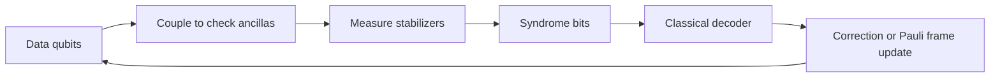

# Quantum Error Correction

Quantum error correction is the mechanism that makes large quantum computations plausible despite fragile physical qubits. It replaces one physical qubit by a protected logical subspace spread across many physical qubits, repeatedly measures error information without measuring the encoded data itself, and uses classical decoding to decide how to correct or track faults. It is the bridge between noisy [hardware](/quantum-information-science/quantum-computing/hardware) and deep [algorithms](/quantum-information-science/quantum-computing/algorithms) such as Shor's algorithm.

## Definitions

A **quantum error-correcting code** embeds a $k$-qubit logical Hilbert space into $n$ physical qubits. It is commonly denoted $[[n,k,d]]$, where $d$ is the code distance. A code of distance $d$ can detect up to $d-1$ arbitrary single-qubit errors and correct up to $\lfloor(d-1)/2\rfloor$ arbitrary single-qubit errors, under the usual independent-error interpretation.

The **Pauli group** on $n$ qubits consists of tensor products of $I,X,Y,Z$ with phases $\pm 1,\pm i$. Stabilizer codes define the codespace as the simultaneous $+1$ eigenspace of a commuting subgroup $S$ of the Pauli group:

$$
\mathcal{C} = \{|\psi\rangle : g|\psi\rangle = |\psi\rangle \text{ for all } g \in S\}.
$$

If $S$ has $r$ independent generators and does not contain $-I$, then it encodes

$$
k = n-r
$$

logical qubits.

The **normalizer** $N(S)$ is the set of Pauli operators that commute with every stabilizer. Operators in $N(S)$ preserve the codespace. Stabilizers act trivially on encoded states, while non-stabilizer elements of $N(S)$ act as logical Pauli operators.

A **syndrome** is the list of measurement outcomes for stabilizer generators. If an error anticommutes with a generator, that generator reports a $-1$ outcome. The syndrome reveals information about the error without revealing the logical quantum state.

The **Knill-Laflamme conditions** state that a code with projector $P$ corrects errors $\{E_a\}$ if and only if

$$
P E_a^\dagger E_b P = c_{ab}P
$$

for all $a,b$. Intuitively, errors must either move the codespace into distinguishable syndrome subspaces or act identically on all logical states.

## Key results

The 3-qubit bit-flip code protects against one $X$ error:

$$
|0_L\rangle = |000\rangle,
\qquad
|1_L\rangle = |111\rangle.
$$

Its stabilizers are

$$
Z_1Z_2,\qquad Z_2Z_3.
$$

The syndrome distinguishes $X_1$, $X_2$, and $X_3$, but it does not protect against phase errors.

The 3-qubit phase-flip code applies the same idea in the Hadamard basis:

$$
|0_L\rangle = |+++\rangle,
\qquad
|1_L\rangle = |---\rangle.
$$

It protects against one $Z$ error but not arbitrary single-qubit errors.

The Shor 9-qubit code concatenates phase-flip and bit-flip protection:

$$
|0_L\rangle =
\frac{(|000\rangle+|111\rangle)(|000\rangle+|111\rangle)(|000\rangle+|111\rangle)}
{2\sqrt{2}},
$$

$$
|1_L\rangle =
\frac{(|000\rangle-|111\rangle)(|000\rangle-|111\rangle)(|000\rangle-|111\rangle)}
{2\sqrt{2}}.
$$

It corrects any single-qubit error because arbitrary single-qubit errors are linear combinations of $I,X,Y,Z$, and correcting Pauli errors corrects their linear combinations by the Knill-Laflamme conditions.

The Steane code is a $[[7,1,3]]$ CSS code built from the classical $[7,4,3]$ Hamming code and its dual. CSS codes use separate $X$-type and $Z$-type stabilizers, so bit and phase information can be decoded using related classical parity checks. A common stabilizer presentation has three $X$-type and three $Z$-type generators derived from the Hamming parity-check matrix.

Surface codes encode logical qubits in global degrees of freedom of a two-dimensional lattice. Stabilizers are local star and plaquette checks, often written in a simplified toric-code form as

$$
A_s = \prod_{i\in s} X_i,
\qquad
B_p = \prod_{i\in p} Z_i.
$$

Error chains create pairs of syndrome defects at their endpoints. Decoding asks for a likely set of error chains consistent with the observed syndrome. The surface code is attractive because checks are geometrically local and thresholds are relatively high compared with many alternatives, but logical qubits require many physical qubits and repeated measurement rounds.

The threshold theorem states that, under suitable assumptions about noise locality, fresh ancilla preparation, measurement, and classical processing, if the physical error rate is below a threshold, then arbitrarily long quantum computations can be performed with overhead that grows polylogarithmically in the computation size. The proof intuition is recursive suppression: encode data, make gadgets fault-tolerant so one physical fault causes at most one correctable error per block, then concatenate or increase code distance so logical error drops rapidly.

Fault-tolerant gates must prevent a single fault from spreading into too many errors in one code block. Transversal gates are valuable because they apply one physical operation per qubit across blocks and limit propagation. No stabilizer code has a universal set of transversal gates, so architectures supplement transversal Clifford operations with magic state distillation, code switching, lattice surgery, or other protected non-Clifford methods.

Magic state distillation consumes many noisy non-stabilizer resource states and Clifford operations to produce fewer high-fidelity magic states, enabling gates such as $T$. This is often a dominant resource cost in fault-tolerant algorithms.

## Visual



| Code | Parameters | Stabilizer idea | Corrects | Main role |
|---|---|---|---|---|
| Bit-flip repetition | $[[3,1,1]]$ for full Pauli distance, but corrects one $X$ under restricted noise | Measure $Z_iZ_j$ parity | One bit flip only | First syndrome example |
| Phase-flip repetition | Basis-changed repetition | Measure $X_iX_j$ parity | One phase flip only | Shows phase errors are bit flips in another basis |
| Shor code | $[[9,1,3]]$ | Concatenate repetition ideas | Any one-qubit error | First explicit all-Pauli correction model |
| Steane code | $[[7,1,3]]$ | CSS from Hamming code | Any one-qubit error | Links classical coding and stabilizers |
| Surface code | Roughly $[[O(d^2),1,d]]$ per patch | Local lattice checks | Up to about $(d-1)/2$ errors along logical path | Leading architecture for local 2D hardware |

## Worked example 1: Syndrome table for the 3-qubit bit-flip code

**Problem.** For the code $\vert 0_L\rangle=\vert 000\rangle$, $\vert 1_L\rangle=\vert 111\rangle$, compute the syndrome for no error and for $X_1$, $X_2$, and $X_3$ using stabilizers $g_1=Z_1Z_2$ and $g_2=Z_2Z_3$.

**Method.**

1. No error. Both $\vert 000\rangle$ and $\vert 111\rangle$ have equal $Z$ parity on adjacent pairs, so

$$
g_1 = +1,\qquad g_2 = +1.
$$

2. Error $X_1$ flips the first bit. The codewords become $\vert 100\rangle$ or $\vert 011\rangle$. Qubits 1 and 2 now differ, while qubits 2 and 3 match:

$$
g_1 = -1,\qquad g_2 = +1.
$$

3. Error $X_2$ flips the middle bit. The adjacent parities both change:

$$
g_1 = -1,\qquad g_2 = -1.
$$

4. Error $X_3$ flips the last bit. Qubits 1 and 2 match, while qubits 2 and 3 differ:

$$
g_1 = +1,\qquad g_2 = -1.
$$

**Answer.**

| Error | $Z_1Z_2$ | $Z_2Z_3$ | Correction |
|---|---:|---:|---|
| $I$ | $+1$ | $+1$ | Do nothing |
| $X_1$ | $-1$ | $+1$ | Apply $X_1$ |
| $X_2$ | $-1$ | $-1$ | Apply $X_2$ |
| $X_3$ | $+1$ | $-1$ | Apply $X_3$ |

The check is that each allowed single-bit-flip error has a unique syndrome.

## Worked example 2: Counting logical qubits in a stabilizer code

**Problem.** A stabilizer code uses $n=7$ physical qubits and has $6$ independent commuting stabilizer generators. How many logical qubits does it encode? What is the dimension of the codespace?

**Method.**

1. Each independent stabilizer generator halves the dimension of the allowed subspace by imposing one binary eigenvalue constraint.
2. The full Hilbert space dimension is

$$
2^7 = 128.
$$

3. Six independent generators reduce the dimension by a factor of $2^6$:

$$
\dim(\mathcal{C}) = \frac{2^7}{2^6} = 2.
$$

4. A $k$-qubit logical space has dimension $2^k$, so

$$
2^k = 2
\quad\Rightarrow\quad
k=1.
$$

Equivalently,

$$
k = n-r = 7-6 = 1.
$$

**Answer.** The code encodes one logical qubit and has a two-dimensional codespace. This matches the Steane-code pattern $[[7,1,3]]$.

## Code

This snippet computes the bit-flip-code syndrome for a classical bit string representing which physical bits were flipped. It mirrors the stabilizer parity logic without simulating amplitudes.

```python
def bit_flip_syndrome(error_bits):
    if len(error_bits) != 3:
        raise ValueError("Need three physical qubits")

    z1z2 = 1 if error_bits[0] == error_bits[1] else -1
    z2z3 = 1 if error_bits[1] == error_bits[2] else -1
    return z1z2, z2z3

corrections = {
    (1, 1): "I",
    (-1, 1): "X1",
    (-1, -1): "X2",
    (1, -1): "X3",
}

patterns = {
    "no error": [0, 0, 0],
    "X1": [1, 0, 0],
    "X2": [0, 1, 0],
    "X3": [0, 0, 1],
}

for name, bits in patterns.items():
    syndrome = bit_flip_syndrome(bits)
    print(f"{name:8s} syndrome={syndrome} correction={corrections[syndrome]}")
```

## Common pitfalls

- Measuring the data instead of the syndrome. Stabilizer checks must reveal error information without revealing the logical state.
- Assuming the 3-qubit repetition code corrects arbitrary quantum errors. It only corrects one Pauli type unless combined with phase protection.
- Confusing detection and correction. A code can detect more errors than it can uniquely correct.
- Forgetting measurement errors. Surface-code decoding uses repeated rounds because syndrome bits themselves can be faulty.
- Treating the threshold theorem as a practical qubit-count estimate. It is an asymptotic statement; constants and architecture matter.
- Assuming physical correction must be applied immediately. Many systems track a Pauli frame classically and update later operations instead.
- Ignoring leakage and correlated noise. Stabilizer theory often starts with Pauli errors, but hardware may leave the computational subspace or produce correlated faults.
- Thinking transversal gates are universal for one fixed stabilizer code. Extra machinery is needed for non-Clifford gates.

## Connections

- [Quantum hardware](/quantum-information-science/quantum-computing/hardware) determines the physical noise model, measurement cycle, and geometry for QEC.
- [Quantum algorithms](/quantum-information-science/quantum-computing/algorithms) determines the logical gate counts that QEC must support.
- [Quantum machine learning](/quantum-information-science/quantum-computing/quantum-ml) mostly studies NISQ circuits today, but fault-tolerant QML would need these tools.
- [Quantum communication](/quantum-information-science/quantum-communication/) shares ideas with entanglement purification and quantum repeaters.
- [Quantum internet](/quantum-information-science/quantum-internet/) uses error correction and purification to protect distributed entanglement.
- [Linear algebra](/math/linear-algebra/) supplies projectors, eigenspaces, tensor products, and operator algebra.
- [Quantum mechanics](/physics/quantum-mechanics/) supplies measurement, spin operators, and open-system intuition.

## Further reading

- Peter Shor, scheme for reducing decoherence in quantum computer memory.
- Andrew Steane, multiple-particle interference and quantum error correction.
- Daniel Gottesman, stabilizer codes and fault-tolerant quantum computation.
- A. Robert Calderbank and Peter Shor; Andrew Steane, CSS code constructions.
- Alexei Kitaev, toric code and fault-tolerant quantum computation by anyons.
- Austin Fowler, Matteo Mariantoni, John Martinis, and Andrew Cleland, surface-code review.
- John Preskill, lecture notes on fault-tolerant quantum computation.
