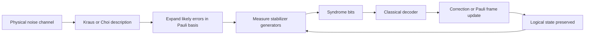

# Quantum Error Correction

Quantum error correction is the mechanism that makes large quantum computations plausible despite fragile physical qubits. It encodes a small logical Hilbert space into a larger physical Hilbert space, repeatedly extracts error syndromes without measuring the protected quantum data, and uses classical decoding to choose a correction or Pauli-frame update. It is the bridge between noisy [hardware](/quantum-information-science/quantum-computing/hardware) and deep [algorithms](/quantum-information-science/quantum-computing/algorithms) such as Shor's algorithm.

*This page synthesizes the wiki's earlier QEC draft with Chapters 8 and 10 of Nielsen and Chuang. The N&C treatment is canonical for the operator-sum model of noise, the Knill-Laflamme error-correction conditions, Pauli error discretization, stabilizer codes, normalizers, encoded operations, and the threshold theorem.*

## Definitions

A **quantum operation** or **channel** maps density operators to density operators. In N&C notation, a trace-preserving channel has an operator-sum representation

$$
\mathcal{E}(\rho)=\sum_k E_k\rho E_k^\dagger,
\qquad
\sum_k E_k^\dagger E_k=I.
$$

The operators $E_k$ are operation elements, often called Kraus operators. This language is essential because realistic noise is not a unitary on the data alone; it is a unitary interaction with an environment followed by discarding unobserved degrees of freedom.

The **Choi-Jamiolkowski representation** is another channel representation. With the unnormalized maximally entangled vector

$$
|\Omega\rangle=\sum_i |i\rangle|i\rangle,
$$

the Choi operator of $\mathcal{E}$ is

$$
J(\mathcal{E})=(I\otimes\mathcal{E})(|\Omega\rangle\langle\Omega|).
$$

Complete positivity is equivalent to $J(\mathcal{E})\ge 0$, and trace preservation is equivalent to $\mathrm{Tr}_{\mathrm{out}}J(\mathcal{E})=I$ under this unnormalized convention. N&C discuss closely related process-tomography and $\chi$-matrix representations in Chapter 8; modern QEC and benchmarking literature often uses the Choi form.

A **quantum error-correcting code** embeds $k$ logical qubits into $n$ physical qubits. It is commonly denoted $[[n,k,d]]$, where $d$ is the distance. A distance-$d$ code detects arbitrary errors on up to $d-1$ qubits and corrects arbitrary errors on up to

$$
t=\left\lfloor\frac{d-1}{2}\right\rfloor
$$

qubits, under the usual located-independent-error interpretation.

The **code projector** $P$ projects onto the codespace $\mathcal{C}$. The **Knill-Laflamme conditions** say that a code corrects a set of error operators $\{E_a\}$ if and only if

$$
P E_a^\dagger E_b P = c_{ab}P
$$

for all $a,b$, where $c_{ab}$ is a Hermitian matrix. Intuitively, errors must either move the codespace into distinguishable syndrome subspaces or act identically on all encoded states.

The **Pauli group** $G_n$ on $n$ qubits consists of tensor products of $I,X,Y,Z$ with phases $\pm 1,\pm i$. Pauli operators are central because arbitrary one-qubit errors can be expanded in the Pauli basis. Correcting $I,X,Y,Z$ on a qubit corrects any linear combination of them, which is N&C's discretization of quantum errors.

A **stabilizer code** is specified by an abelian subgroup $S\subset G_n$ that does not contain $-I$. The codespace is

$$
\mathcal{C}(S)=\{|\psi\rangle:g|\psi\rangle=|\psi\rangle\text{ for all }g\in S\}.
$$

If $S$ has $r$ independent generators, then the codespace dimension is $2^{n-r}$ and the code encodes

$$
k=n-r
$$

logical qubits.

The **normalizer** $N(S)$ is the set of Pauli operators that map $S$ to itself by conjugation. For the Pauli stabilizers used here, this equals the centralizer: the Pauli operators commuting with every element of $S$. Operators in $S$ act trivially on the codespace; elements of $N(S)\setminus S$ act as logical Pauli operators. A **syndrome** is the list of $\pm 1$ outcomes obtained by measuring stabilizer generators.

## Key results

The first lesson of N&C's QEC chapter is that the apparent obstacles are real but surmountable. Quantum states cannot be cloned, errors are continuous, and measurement can destroy superpositions. The solution is not to copy the state or learn the amplitudes; it is to measure only operators whose eigenvalues reveal the error class while preserving the encoded logical subspace.

The 3-qubit bit-flip code protects against one $X$ error:

$$
|0_L\rangle=|000\rangle,
\qquad
|1_L\rangle=|111\rangle.
$$

Its stabilizer generators are $Z_1Z_2$ and $Z_2Z_3$. Measuring them compares parities without distinguishing $\alpha\vert 000\rangle+\beta\vert 111\rangle$ inside the codespace.

The 3-qubit phase-flip code is the same idea in the Hadamard basis:

$$
|0_L\rangle=|+++\rangle,
\qquad
|1_L\rangle=|---\rangle.
$$

Its stabilizer generators are $X_1X_2$ and $X_2X_3$, so it corrects one $Z$ error.

The Shor 9-qubit code combines phase-flip and bit-flip protection:

$$
|0_L\rangle=
\frac{(|000\rangle+|111\rangle)(|000\rangle+|111\rangle)(|000\rangle+|111\rangle)}
{2\sqrt{2}},
$$

$$
|1_L\rangle=
\frac{(|000\rangle-|111\rangle)(|000\rangle-|111\rangle)(|000\rangle-|111\rangle)}
{2\sqrt{2}}.
$$

It corrects an arbitrary single-qubit error because any one-qubit operation element can be expanded as

$$
E=aI+bX+cY+dZ.
$$

The syndrome measurement collapses the error component into a discrete Pauli error class, and the recovery inverts that class. This is the key digital feature of quantum error correction.

The stabilizer formalism makes larger codes manageable. If $S=\langle g_1,\dots,g_{n-k}\rangle$, error detection measures the generators. If an error $E$ anticommutes with a generator $g_j$, the corresponding syndrome bit flips sign. If $E\in S$, it does not harm the logical information. If $E\in N(S)\setminus S$, it is a logical Pauli error and cannot be detected by the stabilizers. Therefore the distance of a stabilizer code is the minimum weight of an operator in $N(S)\setminus S$.

N&C's stabilizer error-correction condition can be stated compactly: a Pauli error set $\{E_j\}$ is correctable if for every pair $j,k$, either $E_j^\dagger E_k\in S$ or $E_j^\dagger E_k\notin N(S)$. If the product is in $S$, the two errors act the same on the code. If the product is outside the normalizer, some stabilizer generator distinguishes them. The dangerous case is $E_j^\dagger E_k\in N(S)\setminus S$, because then the difference between the errors is a nontrivial logical operator.

CSS codes build quantum codes from classical linear codes so that $X$-type and $Z$-type checks are separated. The Steane code is the standard $[[7,1,3]]$ example built from the classical Hamming code; it has three $X$-type and three $Z$-type stabilizer generators and corrects an arbitrary one-qubit error. The five-qubit code is the smallest code that encodes one logical qubit and corrects any one-qubit error, while the Shor code is larger but more transparent.

Encoded operations are Pauli operators in the normalizer modulo stabilizers. For example, in a stabilizer code a logical $\overline{X}$ and $\overline{Z}$ must commute with every stabilizer generator, be independent of $S$, and anticommute with each other. Multiplying a logical operator by a stabilizer gives an equivalent logical operator on the codespace, which is why the same logical Pauli can have many physical representatives with different weights.

Fault tolerance adds a propagation constraint. A recovery circuit is not enough if a single component fault can spread into several data errors in one code block. Transversal gates, verified ancillas, repeated syndrome measurement, magic-state injection, lattice surgery, and code switching are techniques for keeping the effective logical failure probability low. N&C present the threshold theorem in this spirit: under physically reasonable locality and independence assumptions, if the physical error rate is below a threshold, arbitrarily long computations can be made reliable with overhead that grows moderately with computation size.

Surface codes are a modern stabilizer-family continuation of this story. Local star and plaquette checks on a two-dimensional lattice make them attractive for hardware with local connectivity. They are not the main code family developed in N&C, but they use the same stabilizer and syndrome logic.

## Visual



| Object | N&C notation | Role in QEC | Common mistake |
|---|---|---|---|
| Density operator | $\rho$ | Represents pure, mixed, and encoded states | Treating all states as state vectors |
| Quantum operation | $\mathcal{E}(\rho)=\sum_k E_k\rho E_k^\dagger$ | Models noise and recovery | Assuming every process is unitary on data |
| Code projector | $P$ | Defines the protected subspace | Forgetting to restrict equations to the codespace |
| Stabilizer | $S$ | Operators with eigenvalue $+1$ on code states | Measuring logical information instead of syndrome |
| Normalizer | $N(S)$ | Pauli operators preserving the codespace | Confusing stabilizers with logical Paulis |
| Syndrome | $\pm 1$ outcomes | Identifies an error class | Assuming syndrome reveals amplitudes |

## Worked example 1: Syndrome table for the 3-qubit bit-flip code

**Problem.** For the code $\vert 0_L\rangle=\vert 000\rangle$, $\vert 1_L\rangle=\vert 111\rangle$, compute the syndrome for no error and for $X_1$, $X_2$, and $X_3$ using stabilizers $g_1=Z_1Z_2$ and $g_2=Z_2Z_3$.

**Method.**

1. No error. Both $\vert 000\rangle$ and $\vert 111\rangle$ have equal $Z$ parity on adjacent pairs:

$$
g_1=+1,
\qquad
g_2=+1.
$$

2. Error $X_1$ flips the first bit. The basis states become $\vert 100\rangle$ and $\vert 011\rangle$. Qubits 1 and 2 now differ, while qubits 2 and 3 match:

$$
g_1=-1,
\qquad
g_2=+1.
$$

3. Error $X_2$ flips the middle bit. Both adjacent parities change:

$$
g_1=-1,
\qquad
g_2=-1.
$$

4. Error $X_3$ flips the last bit. Qubits 1 and 2 match, while qubits 2 and 3 differ:

$$
g_1=+1,
\qquad
g_2=-1.
$$

**Answer.**

| Error | $Z_1Z_2$ | $Z_2Z_3$ | Recovery |
|---|---:|---:|---|
| $I$ | $+1$ | $+1$ | Do nothing |
| $X_1$ | $-1$ | $+1$ | Apply $X_1$ |
| $X_2$ | $-1$ | $-1$ | Apply $X_2$ |
| $X_3$ | $+1$ | $-1$ | Apply $X_3$ |

Each allowed single-bit-flip error has a unique syndrome, and the syndrome measurement does not distinguish $\alpha\vert 000\rangle+\beta\vert 111\rangle$ from another state in the same logical qubit.

## Worked example 2: Checking Knill-Laflamme for the bit-flip error set

**Problem.** Let $P=\vert 000\rangle\langle000\vert +\vert 111\rangle\langle111\vert $ be the projector for the 3-qubit bit-flip code. Verify the Knill-Laflamme condition for the restricted error set $\{I,X_1,X_2,X_3\}$.

**Method.**

1. Start with identical errors. For $E_a=E_b=X_i$,

$$
P X_i^\dagger X_i P = P I P=P.
$$

The same is true for $E_a=E_b=I$.

2. Compare $I$ with a single flip. For example,

$$
X_1|000\rangle=|100\rangle,
\qquad
X_1|111\rangle=|011\rangle.
$$

Both $\vert 100\rangle$ and $\vert 011\rangle$ are orthogonal to the codespace, so

$$
P X_1 P=0.
$$

The same argument gives $P X_i P=0$ for $i=1,2,3$.

3. Compare two distinct flips. For example,

$$
X_1X_2|000\rangle=|110\rangle,
\qquad
X_1X_2|111\rangle=|001\rangle.
$$

Again these states are orthogonal to $\vert 000\rangle$ and $\vert 111\rangle$, so

$$
P X_1^\dagger X_2 P=P X_1X_2 P=0.
$$

The same holds for any $i\ne j$.

4. Assemble the matrix $c_{ab}$. The diagonal entries are $1$ and the off-diagonal entries are $0$, so

$$
P E_a^\dagger E_b P=\delta_{ab}P
$$

for $E_a,E_b\in\{I,X_1,X_2,X_3\}$.

**Answer.** The restricted bit-flip code satisfies the Knill-Laflamme conditions for no error and one $X$ error. The check also explains what the code does not do: $Z_1$ commutes with the $Z$-parity stabilizers and acts as a logical phase error, so this 3-qubit code is not a full arbitrary-error code.

## Code

This small script computes stabilizer syndromes for Pauli-string errors. It mirrors N&C's stabilizer rule: a syndrome bit is $-1$ exactly when the error anticommutes with the measured generator.

```python
ANTI = {
    ("X", "Z"), ("Z", "X"),
    ("X", "Y"), ("Y", "X"),
    ("Y", "Z"), ("Z", "Y"),
}

def anticommutes(pauli_a, pauli_b):
    count = 0
    for a, b in zip(pauli_a, pauli_b):
        if a == "I" or b == "I" or a == b:
            continue
        if (a, b) in ANTI:
            count += 1
    return count % 2 == 1

def syndrome(error, generators):
    return tuple(-1 if anticommutes(error, g) else 1 for g in generators)

generators = ["ZZI", "IZZ"]
errors = {
    "I": "III",
    "X1": "XII",
    "X2": "IXI",
    "X3": "IIX",
    "Z1": "ZII",
}

for name, pauli in errors.items():
    print(f"{name:2s} {pauli} syndrome={syndrome(pauli, generators)}")
```

## Common pitfalls

- Measuring the data instead of the syndrome. Stabilizer checks must reveal error information without revealing the logical amplitudes.
- Assuming the 3-qubit repetition code corrects arbitrary quantum errors. It corrects one Pauli type unless combined with phase protection.
- Forgetting the density-operator viewpoint. QEC corrects channels and operation elements, not just state-vector mistakes.
- Confusing stabilizers with logical operators. Stabilizers act as identity on the codespace; normalizer elements outside the stabilizer are logical Paulis.
- Treating every distinct physical error as needing a distinct syndrome. Degenerate codes allow different errors to act identically on the codespace.
- Ignoring measurement errors. Surface-code and fault-tolerant protocols require repeated syndrome rounds because the syndrome record is noisy.
- Applying a correction physically when a Pauli-frame update would suffice. Tracking corrections classically often avoids extra gates.
- Treating the threshold theorem as a practical qubit-count estimate. It is an asymptotic statement whose constants depend on architecture and noise.
- Ignoring leakage and correlated noise. Pauli error models are analytically powerful, but hardware can leave the computational subspace or produce correlated faults.
- Assuming transversal gates are universal for one fixed stabilizer code. Non-Clifford operations require additional machinery such as magic states or code switching.

## Connections

- [Quantum hardware](/quantum-information-science/quantum-computing/hardware) determines the physical noise channel, measurement cycle, reset method, and geometry.
- [Quantum algorithms](/quantum-information-science/quantum-computing/algorithms) determines the logical gate counts and target failure probabilities that QEC must support.
- [Quantum machine learning](/quantum-information-science/quantum-computing/quantum-ml) mostly studies NISQ circuits today, but fault-tolerant QML would need these tools.
- [Quantum communication](/quantum-information-science/quantum-communication/) shares ideas with entanglement purification, quantum repeaters, and channel correction.
- [Quantum internet](/quantum-information-science/quantum-internet/) uses error correction and purification to protect distributed entanglement.
- [Linear algebra](/math/linear-algebra/) supplies projectors, eigenspaces, tensor products, matrix algebras, and operator decompositions.
- [Quantum mechanics](/physics/quantum-mechanics/) supplies measurement, spin operators, open systems, and the density-operator formalism.

## Further reading

- Michael A. Nielsen and Isaac L. Chuang, *Quantum Computation and Quantum Information*, Chapters 8 and 10.
- Peter Shor, scheme for reducing decoherence in quantum computer memory.
- Andrew Steane, multiple-particle interference and quantum error correction.
- Daniel Gottesman, stabilizer codes and fault-tolerant quantum computation.
- A. Robert Calderbank and Peter Shor; Andrew Steane, CSS code constructions.
- Alexei Kitaev, toric code and fault-tolerant quantum computation by anyons.
- John Preskill, lecture notes on fault-tolerant quantum computation.
