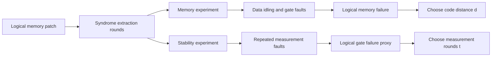

# Failure Mechanisms of Error-Corrected Gates

Robin Harper, Constance Laine, Evan T. Hockings, Campbell McLauchlan, Georgia M. Nixon, Benjamin J. Brown, and Stephen D. Bartlett, "Characterising the failure mechanisms of error-corrected quantum logic gates," *Nature Communications* article in press (2026), https://doi.org/10.1038/s41467-026-71773-6, studies how memory decay and measurement failures affect fault-tolerant logical operations. The technique page centers on heavy-hex memory and stability experiments as diagnostics for lattice-surgery-style logic gates.

## Problem & motivation

Logical gates in a fault-tolerant processor are not just unitary pulses applied to protected qubits. Many are driven by mid-circuit stabilizer measurements. Lattice surgery, for example, measures joint logical observables by repeatedly measuring a merged set of checks. If those measurement outcomes are wrong, the logical gate can fail even if the stored logical states would otherwise survive.

This creates a trade-off. Repeating stabilizer measurements more times improves confidence in the logical-gate measurement, but it also keeps the logical data idling for longer, which gives memory errors more time to accumulate. A useful hardware benchmark must therefore measure both sides: how well the code stores information in time, and how reliably the measurement process supports a logical operation.

The paper investigates this trade-off on IBM's Marrakesh, a 156-qubit Heron-class superconducting processor with a heavy-hex layout. It implements a distance-3 heavy-hex subsystem code, improves the syndrome-extraction circuit, and introduces a stability experiment designed to isolate gate-like failures caused by repeated measurement errors.

## Method

The heavy-hex code is a subsystem code. It directly measures gauge checks rather than all stabilizers. In the distance-3 patch discussed in the paper, $X$-type and $Z$-type checks combine into stabilizers, and logical operators are strings across the patch. The original syndrome-extraction implementation measured $X$ and $Z$ check information in separate time steps and reset measurement qubits after readout.

The paper makes two circuit-level improvements:

1. It redesigns syndrome extraction so that $X$ and $Z$ checks can be measured in the same round.
2. It removes post-measurement reset where possible and tracks the effect as a Pauli-frame update, modifying detector definitions accordingly.

The original syndrome-extraction circuit took about $11.1\,\mu\mathrm{s}$ per round. The improved no-reset circuit took about $3.2\,\mu\mathrm{s}$, and the improved circuit with reset took about $5.4\,\mu\mathrm{s}$. Since measurement and reset periods dominate idling exposure, shortening the round directly improves memory survival.

For memory, the experiment fits the logical success probability after $t$ rounds to a form equivalent to

$$
P_{\mathrm{success}}(t)=A p^t+\frac{1}{2},
$$

where $A$ absorbs state-preparation and measurement effects and $p$ is a decay factor. The logical fidelity per syndrome-extraction round is

$$
F_{\mathrm{round}}=\frac{1+p}{2}.
$$

For stability, the code patch is arranged with an overcomplete set of stabilizer checks whose product should be constrained. Measurement errors are detected by comparing repeated stabilizer outcomes. A stability failure occurs when a pattern of measurement faults flips the inferred product without creating detectable endpoints. This mimics the time-like failure mode of a lattice-surgery measurement.

## Visual



| Experiment | What it probes | Typical failure direction | Improvement lever |
|---|---|---|---|
| Memory | Logical information stored across syndrome rounds | Space-like chains across the patch | Better gates, less idle time, better placement |
| Stability | Reliability of repeated stabilizer products | Time-like chains across repeated measurements | Better measurement, suitable number of rounds |
| Lattice surgery | Logical operation driven by measurements | Combination of memory and stability failure | Balance code distance $d$ and surgery rounds $t$ |
| Noise-model sweep | Which physical errors matter most | Depends on fitted hardware parameters | Target measurement, idle, reset, or two-qubit errors |

## Hyperparameters / system details

The experiments used a distance-3 heavy-hex code patch on IBM Quantum Marrakesh, a 156-qubit Heron-class processor. The paper reports that Heron-class devices improved two-qubit error rates relative to older heavy-hex demonstrations, while mid-circuit measurement times became a major cost. In the fitted circuit-level noise model, representative parameters included about $p_{1Q}=0.02\%$, $p_{2Q}=0.41\%$, quantum measurement noise $p_{q,\mathrm{meas}}=1.2\%$, classical measurement noise $p_{c,\mathrm{meas}}=4.2\%$, idle noise $p_{\mathrm{idle}}=1.2\%$, and reset noise $p_{\mathrm{reset}}=7.5\%$.

The improved syndrome-extraction design increased the fitted memory performance from less than $90\%$ logical fidelity per round with the original circuit to about $96\%$ or better per round with the improved circuits. The stability experiment showed decreasing logical error with additional stabilizer readout rounds, indicating below-threshold behavior for the measurement-failure class probed by that experiment.

The simulation sweeps found measurement noise to be especially important for stability performance. This makes sense: stability failures are built from repeated wrong measurement outcomes. Idling and two-qubit errors affect both memory and stability, while reset helped less than one might expect because reset itself was implemented through noisy measurement and conditional action.

## Headline results

The conservative headline is that low-depth syndrome extraction and reset removal substantially improved a distance-3 heavy-hex logical memory on Marrakesh, reaching roughly $96\%$ survival per syndrome-extraction round, while a stability experiment identified measurement noise as a dominant limitation for fault-tolerant logic gates.

The paper's broader lesson is architectural. Logical-gate performance cannot be inferred from memory experiments alone. A processor can store a logical qubit reasonably well but still fail lattice-surgery-style operations if mid-circuit measurement outcomes are too noisy or too slow. Conversely, adding more measurement rounds can reduce gate-readout uncertainty while increasing memory exposure. Real systems must optimize both $d$, the space-like code distance, and $t$, the time-like number of measurement rounds.

## Worked example 1: Converting a fitted decay factor to per-round fidelity

**Problem.** A memory experiment fits the decay factor as $p=0.92$. What is the corresponding logical fidelity per syndrome-extraction round under the paper's convention?

**Method.**

1. Use the conversion

$$
F_{\mathrm{round}}=\frac{1+p}{2}.
$$

2. Substitute $p=0.92$:

$$
F_{\mathrm{round}}=\frac{1+0.92}{2}.
$$

3. Add:

$$
1+0.92=1.92.
$$

4. Divide by two:

$$
F_{\mathrm{round}}=0.96.
$$

5. Express as a percentage:

$$
0.96=96\%.
$$

**Checked answer.** A fitted decay factor of $0.92$ corresponds to a $96\%$ logical fidelity per round. This matches the scale of the improved heavy-hex memory result, though the actual paper obtains parameters from fitted experimental curves rather than this single plug-in calculation.

## Worked example 2: Quantifying syndrome-circuit speedup

**Problem.** Compare the original heavy-hex syndrome-extraction duration $11.1\,\mu\mathrm{s}$ with the improved no-reset duration $3.2\,\mu\mathrm{s}$ and the improved-with-reset duration $5.4\,\mu\mathrm{s}$.

**Method.**

1. The no-reset speedup is

$$
S_{\mathrm{no\ reset}}=\frac{11.1}{3.2}=3.46875.
$$

2. So the no-reset circuit is about

$$
3.47\times
$$

faster per syndrome round.

3. The improved-with-reset speedup is

$$
S_{\mathrm{reset}}=\frac{11.1}{5.4}=2.0556.
$$

4. The added cost of reset in the improved circuit is

$$
5.4-3.2=2.2\,\mu\mathrm{s}.
$$

5. The reset version is therefore

$$
\frac{5.4}{3.2}=1.6875
$$

times as long as the no-reset version.

**Checked answer.** The improved no-reset circuit cuts syndrome-round duration by about $3.47\times$ relative to the original implementation. The reset version is still about $2.06\times$ faster than the original but costs $2.2\,\mu\mathrm{s}$ per round beyond the no-reset circuit.

## Connections

- [Quantum error correction](/quantum-information-science/quantum-computing/error-correction) defines stabilizers, subsystem codes, decoders, and logical failure.
- [Quantum hardware](/quantum-information-science/quantum-computing/hardware) explains mid-circuit measurement, reset, idling, and superconducting qubit noise.
- [Willow surface code below threshold](/quantum-information-science/quantum-computing/willow-surface-code-below-threshold) is the memory-scaling comparison point.
- [Quantum decoder circuit](/quantum-information-science/quantum-computing/quantum-decoder-circuit) addresses decoder latency, another real-time part of the same stack.
- [Silicon spin logical qubits](/quantum-information-science/quantum-computing/silicon-spin-logical-qubits) gives a contrasting logical-operation demonstration in spin hardware.
- [Quantum internet](/quantum-information-science/quantum-internet/) will need reliable logical memories and measurements for distributed operations.
- [Quantum mechanics](/physics/quantum-mechanics/) supplies the measurement and decoherence background.

## PyTorch/Qiskit sketch

This toy code models a lattice-surgery trade-off: memory failure increases with the number of rounds, while stability failure decreases with more repeated measurement rounds. The best $t$ balances the two.

```python
import math

def total_failure(rounds, memory_per_round, stability_base):
    memory_fail = 1.0 - (1.0 - memory_per_round) ** rounds
    stability_fail = stability_base ** rounds
    return memory_fail + stability_fail - memory_fail * stability_fail

memory_per_round = 0.04
stability_base = 0.72

best = None
for t in range(1, 21):
    fail = total_failure(t, memory_per_round, stability_base)
    print(f"rounds={t:2d} total_failure={fail:.4f}")
    if best is None or fail < best[1]:
        best = (t, fail)

print(f"best repeated-measurement count: t={best[0]}, failure={best[1]:.4f}")
```

## Common pitfalls / reproduction notes

- Do not infer logical-gate quality from memory survival alone. Measurement-driven gates need stability against time-like measurement failures.
- Reset is not automatically helpful. If reset is implemented with a noisy measurement and conditional operation, it can add more error than it removes.
- A stability experiment is a gate proxy, not a full algorithmic logical gate benchmark.
- The heavy-hex code is a subsystem code. Measured gauge checks and inferred stabilizers should not be conflated.
- The reported distance is $d=3$; the paper diagnoses mechanisms rather than claiming a large-distance threshold for the full heavy-hex architecture.
- Measurement time matters as much as measurement assignment error because data qubits idle while measurement circuits run.

## Further reading

- N. Sundaresan et al., "Demonstrating multi-round subsystem quantum error correction using matching and maximum likelihood decoders," *Nature Communications* 14, 2852 (2023).
- H. Bombin and M. A. Martin-Delgado, "Quantum measurements and gates by code deformation," *Journal of Physics A* 42, 095302 (2009).
- C. Horsman, A. G. Fowler, S. Devitt, and R. Van Meter, "Surface code quantum computing by lattice surgery," *New Journal of Physics* 14, 123011 (2012).
- B. J. Brown, K. Laubscher, M. S. Kesselring, and J. R. Wootton, "Poking holes and cutting corners to achieve Clifford gates with the surface code," *Physical Review X* 7, 021029 (2017).
- C. Gidney, "Stim: a fast stabilizer circuit simulator," *Quantum* 5, 497 (2021).
