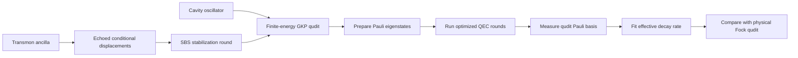

# GKP Qudit Error Correction

Benjamin L. Brock, Shraddha Singh, Alec Eickbusch, Volodymyr V. Sivak, Andy Z. Ding, Luigi Frunzio, Steven M. Girvin, and Michel H. Devoret, "Quantum error correction of qudits beyond break-even," *Nature* 641, 612-617 (2025), https://doi.org/10.1038/s41586-025-08899-y, demonstrates error-corrected logical qutrits and ququarts using finite-energy Gottesman-Kitaev-Preskill, or GKP, grid states in a superconducting cavity. The technique treats a harmonic oscillator as a high-dimensional logical system rather than only as a qubit.

## Problem & motivation

Most quantum-computing hardware has more than two physical levels, but most fault-tolerance stacks reduce everything to qubits. Qudits ask whether a $d$-level logical unit can sometimes be more efficient for gates, compilation, simulation, or magic-state distillation. The difficulty is that qudits need error correction too, and experimentally demonstrating break-even correction for $d\gt 2$ is harder than renaming extra levels as computational states.

The GKP code is a natural bosonic candidate because it stores information in the phase space of an oscillator. Instead of choosing two coherent-state lobes as in a cat code, GKP states are grids. Small displacement errors in position or momentum can be diagnosed modulo the grid spacing, while large displacements become logical errors. Generalizing this grid from qubits to qudits increases the number of logical states per oscillator but shrinks their separation in phase space.

The Brock-Devoret experiment uses one superconducting microwave cavity as the logical oscillator and a dispersively coupled transmon as the control and entropy-removal ancilla. The paper reports beyond-break-even quantum memories for a logical qutrit and a logical ququart, optimized by a reinforcement-learning agent that tunes finite-energy stabilization circuits.

## Method

Let $D(\alpha)=\exp(\alpha a^\dagger-\alpha^*a)$ be the oscillator displacement operator. Two displacements commute up to a geometric phase determined by their enclosed phase-space area. A square GKP qudit chooses stabilizer displacements

$$
S_X = D(\ell_d),
\qquad
S_Z = D(i\ell_d),
\qquad
\ell_d=\sqrt{\pi d},
$$

up to the paper's phase-space convention. The encoded dimension is $d$, and the generalized logical Pauli displacements are

$$
X_d=D\left(\sqrt{\frac{\pi}{d}}\right),
\qquad
Z_d=D\left(i\sqrt{\frac{\pi}{d}}\right).
$$

They obey the qudit Pauli relation

$$
Z_dX_d=\omega_d X_dZ_d,
\qquad
\omega_d=e^{2\pi i/d}.
$$

For $d=2$, these reduce to a logical qubit relation with $ZX=-XZ$. For $d=3$ and $d=4$, the logical operators are unitary but not Hermitian in the same simple way as qubit Paulis.

Ideal GKP grid states have infinite energy, so experiments use finite-energy approximate states. The paper stabilizes them with a generalized small-big-small, or SBS, protocol. Each SBS round uses echoed conditional displacement gates and ancilla rotations to implement engineered dissipation back toward the finite-energy GKP manifold. The reference phase of cavity operations is updated between rounds so that both quadratures are stabilized. The optimal protocol is not guessed analytically; it is tuned by model-free reinforcement learning over dozens of pulse parameters.

The performance metric is average channel fidelity to the identity. At short times, the channel fidelity can be expanded as

$$
F_d(\mathcal{E},I)\approx 1-\frac{d-1}{d}\gamma t,
$$

where $\gamma$ is an effective decay rate for the $d$-dimensional memory. The QEC gain is

$$
G_d=\frac{\gamma_{\mathrm{physical}}}{\gamma_{\mathrm{logical}}}
=\frac{T_{\mathrm{logical}}}{T_{\mathrm{physical}}}
$$

when lifetimes are represented by inverse decay rates. Break-even is $G_d\gt 1$.

## Visual



| Dimension | Logical object | Stabilizer length trend | Reported gain | Main cost |
|---:|---|---|---:|---|
| 2 | GKP qubit | Baseline grid spacing | About $1.81\pm0.02$ under same comparison conditions | Maturest measurement protocol |
| 3 | GKP qutrit | Larger stabilizer, closer logical spacing | $1.82\pm0.03$ | More Pauli bases to prepare and measure |
| 4 | GKP ququart | Larger stabilizer, closer logical spacing | $1.87\pm0.03$ | Needs Pauli and parity-basis measurements |

## Hyperparameters / system details

The experimental device was a tantalum transmon dispersively coupled to a three-dimensional superconducting microwave cavity. The cavity stored the GKP states; the transmon served as ancilla for control, measurement, and stabilization. The paper reports cavity lifetimes of $T_{1,c}=631\,\mu\mathrm{s}$ and Ramsey coherence time $T_{2R,c}=1030\,\mu\mathrm{s}$, with transmon lifetime $T_{1,q}=295\,\mu\mathrm{s}$ and Hahn-echo lifetime $T_{2E,q}=286\,\mu\mathrm{s}$.

The generalized SBS stabilization was optimized with 45 free parameters. The SBS round duration was fixed at $7\,\mu\mathrm{s}$ for the qudit experiments, longer than in the earlier GKP-qubit work because larger conditional displacements are required. The qutrit optimization used 80 SBS rounds in the reward circuit and 200 training epochs; the ququart used 80 SBS rounds and 300 training epochs, according to the methods text.

For the qutrit, the experiment prepared and measured eigenstates of generalized Pauli operators such as $X_3$, $Z_3$, $X_3Z_3$, and $X_3^2Z_3$. For the ququart, the representative state set included Pauli bases and an additional parity basis formed from simultaneous eigenstates of $X_4^2$ and $Z_4^2$. This measurement overhead is one reason qudit benchmarking is more complex than qubit benchmarking.

## Headline results

The conservative headline is that the experiment realized logical GKP qutrit and ququart memories whose fitted effective lifetimes exceeded the best comparable physical Fock-state qudits in the same system. The reported gains were

$$
G_3=1.82\pm0.03,
\qquad
G_4=1.87\pm0.03.
$$

The paper also reports a same-condition GKP-qubit gain of $G_2=1.81\pm0.02$. The roughly constant gain from dimension 2 to 4 is important: the logical GKP qudits become more demanding as $d$ increases, but the corresponding physical Fock qudits also become more fragile. The result is beyond break-even for memory, not yet a full high-dimensional fault-tolerant processor with entangling logical gates and large algorithms.

The discussion identifies transmon bit flips, cavity photon loss, and cavity dephasing as major logical-error sources, with cavity dephasing becoming increasingly important at higher dimension. The authors attribute much of that dephasing to residual thermal population of the transmon, suggesting that better ancilla isolation or lower thermal population could improve lifetimes.

## Worked example 1: Checking the qudit Pauli phase

**Problem.** For a GKP qutrit with $d=3$, verify the generalized Pauli commutation phase $\omega_3=e^{2\pi i/3}$ and compare it with the qubit case.

**Method.**

1. The generalized relation is

$$
Z_dX_d=\omega_d X_dZ_d,
\qquad
\omega_d=e^{2\pi i/d}.
$$

2. For a qubit, $d=2$:

$$
\omega_2=e^{2\pi i/2}=e^{i\pi}=-1.
$$

Thus

$$
Z_2X_2=-X_2Z_2.
$$

3. For a qutrit, $d=3$:

$$
\omega_3=e^{2\pi i/3}
=\cos\left(\frac{2\pi}{3}\right)
i\sin\left(\frac{2\pi}{3}\right)
=-\frac{1}{2}+i\frac{\sqrt{3}}{2}.
$$

4. Therefore

$$
Z_3X_3=\left(-\frac{1}{2}+i\frac{\sqrt{3}}{2}\right)X_3Z_3.
$$

**Checked answer.** Qutrit Paulis do not anticommute with a sign; they commute up to a non-real cube root of unity. This is why qudit Pauli measurement and benchmarking need more care than simply reusing qubit stabilizer intuition.

## Worked example 2: Translating QEC gain into a physical lifetime

**Problem.** The paper reports an effective logical GKP qutrit lifetime of about $886\,\mu\mathrm{s}$ and gain $G_3=1.82$. Estimate the effective lifetime of the best physical qutrit comparator.

**Method.**

1. Use the lifetime form of gain:

$$
G_3=\frac{T_{\mathrm{logical}}}{T_{\mathrm{physical}}}.
$$

2. Solve for the physical comparator lifetime:

$$
T_{\mathrm{physical}}=\frac{T_{\mathrm{logical}}}{G_3}.
$$

3. Substitute values:

$$
T_{\mathrm{physical}}=\frac{886\,\mu\mathrm{s}}{1.82}
\approx 486.8\,\mu\mathrm{s}.
$$

4. Check the interpretation:

$$
886\,\mu\mathrm{s} > 486.8\,\mu\mathrm{s},
$$

so the gain is beyond break-even.

**Checked answer.** The physical qutrit comparator lifetime is approximately $487\,\mu\mathrm{s}$ under the same effective-decay-rate metric. The calculation also shows why "break-even" is metric-dependent: it compares matched logical and physical channels, not arbitrary coherence numbers.

## Connections

- [Quantum error correction](/quantum-information-science/quantum-computing/error-correction) explains stabilizer logic and break-even criteria.
- [Quantum hardware](/quantum-information-science/quantum-computing/hardware) covers superconducting cavities, transmons, readout, and control pulses.
- [Concatenated bosonic cat qubits](/quantum-information-science/quantum-computing/concatenated-bosonic-cat-qubits) is the closest bosonic-memory comparison.
- [Willow surface code below threshold](/quantum-information-science/quantum-computing/willow-surface-code-below-threshold) is the multi-qubit-code comparison point.
- [Quantum decoder circuit](/quantum-information-science/quantum-computing/quantum-decoder-circuit) connects to learned decoders and model-free optimization.
- [Quantum internet](/quantum-information-science/quantum-internet/) may eventually use GKP-style bosonic encodings for repeaters and transduction.
- [Quantum mechanics](/physics/quantum-mechanics/) supplies oscillator phase space, displacement operators, and measurement theory.

## PyTorch/Qiskit sketch

This snippet builds finite-dimensional generalized Pauli matrices for a qudit and checks the commutation phase. It is a matrix sketch, not an oscillator-level GKP simulation.

```python
import cmath

def matmul(a, b):
    n = len(a)
    return [[sum(a[i][k] * b[k][j] for k in range(n)) for j in range(n)] for i in range(n)]

def max_abs_diff(a, b):
    return max(abs(a[i][j] - b[i][j]) for i in range(len(a)) for j in range(len(a)))

def qudit_paulis(d):
    omega = cmath.exp(2j * cmath.pi / d)
    x = [[0j for _ in range(d)] for _ in range(d)]
    z = [[0j for _ in range(d)] for _ in range(d)]
    for n in range(d):
        x[(n + 1) % d][n] = 1.0
        z[n][n] = omega ** n
    return x, z, omega

for d in [2, 3, 4]:
    x, z, omega = qudit_paulis(d)
    zx = matmul(z, x)
    xz = matmul(x, z)
    omega_xz = [[omega * entry for entry in row] for row in xz]
    print(d, max_abs_diff(zx, omega_xz))
```

## Common pitfalls / reproduction notes

- Do not confuse a qudit with several qubits. A qutrit is one three-level logical system, not two qubits with one unused state.
- Ideal GKP states have infinite energy. All experimental claims are about finite-energy approximations with envelopes, not perfect grid states.
- The gain compares logical GKP qudits with physical Fock qudits under a specified average-channel-fidelity metric.
- A beyond-break-even memory is not yet a universal qudit processor. Logical entangling gates and scalable concatenation remain future work.
- Qudit Pauli operators are generally non-Hermitian for $d\gt 2$, so measurement circuits use binary ancilla measurements to distinguish multi-outcome bases indirectly.
- Reinforcement-learning optimization improves the pulse protocol but can make reproduction hardware-specific; pulse parameters are not universal constants.

## Further reading

- D. Gottesman, A. Kitaev, and J. Preskill, "Encoding a qubit in an oscillator," *Physical Review A* 64, 012310 (2001).
- V. V. Sivak et al., "Real-time quantum error correction beyond break-even," *Nature* 616, 50-55 (2023).
- B. Royer, S. Singh, and S. M. Girvin, "Stabilization of finite-energy Gottesman-Kitaev-Preskill states," *Physical Review Letters* 125, 260509 (2020).
- A. L. Grimsmo and S. Puri, "Quantum error correction with the Gottesman-Kitaev-Preskill code," *PRX Quantum* 2, 020101 (2021).
- F. Schmidt and P. van Loock, "Quantum error correction with higher Gottesman-Kitaev-Preskill codes," *Physical Review A* 105, 042427 (2022).
