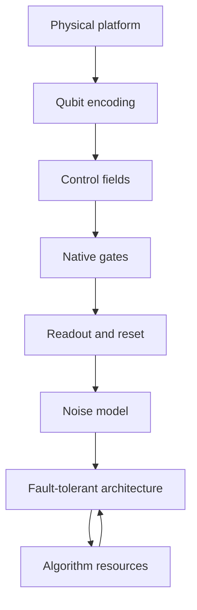

# Hardware

Quantum hardware is the engineering layer that turns abstract qubits, gates, and measurements into controlled physical systems. The same circuit drawn in [algorithms](/quantum-information-science/quantum-computing/algorithms) looks very different in a dilution refrigerator, an ion trap, an optical table, a tweezer array, or a proposed topological device, so hardware comparisons must track coherence, gate mechanisms, connectivity, measurement, fabrication, and how naturally each platform supports [error correction](/quantum-information-science/quantum-computing/error-correction).

## Definitions

A **physical qubit** is a two-level subsystem chosen inside a real device. It may be the two lowest levels of a superconducting circuit, two hyperfine states of an ion, polarization or path modes of a photon, two atomic clock states in a neutral atom, or a nonlocal parity state in a topological proposal. The physical qubit is never perfectly isolated; it couples to controls, measurement apparatus, neighboring qubits, and the environment.

The essential hardware metrics are:

| Metric | Meaning | Why it matters |
|---|---|---|
| $T_1$ | Energy relaxation time | Limits how long an excited state survives |
| $T_2$ | Dephasing time | Limits phase coherence in superpositions |
| Single-qubit fidelity | Accuracy of local rotations | Affects all circuits and calibration loops |
| Two-qubit fidelity | Accuracy of entangling gates | Usually the bottleneck for algorithms and QEC |
| Connectivity | Which qubits can interact directly | Determines routing overhead |
| Measurement fidelity | Accuracy of readout | Critical for mid-circuit syndrome extraction |
| Reset speed | Time to prepare a fresh state | Important for repeated QEC cycles |
| Crosstalk | Unwanted influence among controls | Becomes harder at scale |

**Superconducting transmons** are nonlinear microwave oscillators made from Josephson junctions and capacitors. A Josephson junction contributes an energy $E_J$ and the capacitor contributes a charging energy $E_C$. The transmon regime $E_J/E_C \gg 1$ reduces sensitivity to charge noise at the cost of weaker anharmonicity. Gates are driven by microwave pulses, and readout usually uses resonators dispersively coupled to qubits. Related superconducting designs include fluxonium, which uses a large inductance to improve protection against some noise channels, and tunable coupler designs such as gmon-style architectures.

**Trapped ions** store qubits in internal electronic or hyperfine states of charged atoms confined by electromagnetic fields. Paul traps use radio-frequency fields to confine ions, and shared motional modes mediate entangling gates. The Molmer-Sorensen gate is a standard entangling operation that couples spin states through collective motion.

**Photonic quantum computing** encodes qubits in photons, such as polarization, time bins, frequency bins, or spatial modes. Photons travel well and are natural for [quantum communication](/quantum-information-science/quantum-communication/), but photon-photon interactions are weak. The KLM scheme showed that linear optics, single-photon sources, measurements, and feed-forward can in principle implement universal quantum computation probabilistically. Measurement-based photonic computation builds large entangled cluster states and computes by adaptive measurements.

**Neutral atoms** use optically trapped atoms in tweezer arrays or optical lattices. Rydberg excitation creates strong, controllable interactions: an atom excited to a Rydberg state shifts nearby atoms so that simultaneous excitation can be blocked. This Rydberg blockade enables entangling gates and analog Hamiltonian simulation on flexible geometries.

**Topological proposals** encode information nonlocally, often using Majorana zero modes in engineered superconducting systems. The appeal is hardware-level protection from some local noise processes. The status should be stated conservatively: topological qubits remain an active research program, and unambiguous, scalable Majorana-based quantum computing has not become an established production platform.

## Key results

The hardware abstraction starts with a two-level Hamiltonian. A driven qubit is often modeled in a rotating frame by

$$
H(t) = \frac{\hbar}{2}\left(\Delta(t) Z + \Omega_x(t) X + \Omega_y(t) Y\right),
$$

where $\Delta$ is detuning and $\Omega_x,\Omega_y$ are control amplitudes. A pulse implements

$$
U = \mathcal{T}\exp\left(-\frac{i}{\hbar}\int_0^\tau H(t)\,dt\right),
$$

with $\mathcal{T}$ indicating time ordering. The ideal gate is the target unitary; the real gate includes calibration error, leakage, decoherence, and crosstalk.

The transmon Hamiltonian is commonly approximated as

$$
H = 4E_C(n-n_g)^2 - E_J\cos\phi.
$$

When $E_J/E_C$ is large, the transition frequency becomes less sensitive to charge offset $n_g$. The price is that the oscillator becomes more harmonic, so pulses must avoid leakage into $\vert 2\rangle$ and higher states.

For trapped ions, entanglement comes from spin-motion coupling. An ideal two-qubit Molmer-Sorensen gate can be written as

$$
U_{\mathrm{MS}}(\theta)
= \exp\left(-i\frac{\theta}{2} X_i X_j\right),
$$

up to single-qubit rotations and convention choices. In practice the motional mode spectrum, laser phase stability, heating, and spectator ions matter.

For neutral atoms, Rydberg blockade is captured by a simple energy-scale condition. If the interaction shift $V$ is much larger than the Rabi frequency $\Omega$, double excitation is suppressed:

$$
V \gg \hbar \Omega.
$$

The blockade radius is the distance inside which that condition holds. Arrays can be rearranged into useful graph geometries, making the platform attractive for simulation and some combinatorial optimization experiments.

For photonics, the key result is that linear optics alone does not provide deterministic two-photon entangling gates. KLM avoids this by using ancilla photons, measurement, and feed-forward to make nondeterministic gates that can be boosted through encoding and teleportation. Measurement-based photonic computing shifts the burden from direct gates to preparing large cluster states and measuring adaptively.

For scalable systems, a hardware platform must support repeated cycles:

$$
\text{prepare} \rightarrow \text{entangle} \rightarrow \text{measure syndrome} \rightarrow \text{classical decode} \rightarrow \text{correct or track}.
$$

That loop links hardware directly to [surface codes](/quantum-information-science/quantum-computing/error-correction): fast mid-circuit measurement, reset, low crosstalk, and high two-qubit fidelity often matter more than isolated headline coherence times.

## Visual



| Platform | Typical coherence profile | Gate fidelity profile | Connectivity | Scaling outlook |
|---|---|---|---|---|
| Superconducting transmons | Shorter coherence than ions or atoms, but fast gates | Very strong single-qubit gates; two-qubit gates are mature but calibration-heavy | Usually local on chip, tunable couplers improve layout | Strong fabrication ecosystem; cryogenic wiring, crosstalk, yield, and QEC overhead are central |
| Trapped ions | Long coherence for internal states | High-fidelity gates demonstrated; gates are slower than superconducting gates | Effective all-to-all within a chain, harder across large modules | Modular photonic interconnects and trap engineering are key scaling routes |
| Photonics | Excellent transmission coherence, weak storage without memories | Linear optics is precise; entangling gates are measurement-driven and probabilistic unless encoded | Natural flying-qubit connectivity | Attractive for networking; source quality, loss, detectors, cluster generation, and feed-forward dominate |
| Neutral atoms | Long-lived internal states; Rydberg states are more fragile | Rapid progress; Rydberg gates and analog operations depend on control uniformity | Flexible geometry in tweezer arrays, often local by blockade radius | Large arrays are promising; loading, rearrangement, loss, and gate uniformity matter |
| Topological proposals | Intended nonlocal protection | Goal is protected operations; experimental maturity is lower | Depends on braiding or measurement-only architecture | Potentially powerful if realized; status remains research-stage |

## Worked example 1: Estimating a decoherence-limited error

**Problem.** A superconducting two-qubit gate takes $\tau = 200$ ns. A simple model assumes energy relaxation time $T_1 = 100$ microseconds and estimates the relaxation contribution to error as $p \approx \tau/T_1$ for $\tau \ll T_1$. What is the estimated relaxation error per gate?

**Method.**

1. Convert both times to seconds:

$$
\tau = 200 \text{ ns} = 200 \times 10^{-9}\text{ s} = 2.0 \times 10^{-7}\text{ s},
$$

$$
T_1 = 100 \text{ microseconds} = 100 \times 10^{-6}\text{ s} = 1.0 \times 10^{-4}\text{ s}.
$$

2. Use the small-time approximation:

$$
p \approx \frac{\tau}{T_1}
= \frac{2.0 \times 10^{-7}}{1.0 \times 10^{-4}}
= 2.0 \times 10^{-3}.
$$

3. Convert to a percentage:

$$
2.0 \times 10^{-3} = 0.2\%.
$$

**Answer.** The rough relaxation-limited contribution is $0.2\%$, or a fidelity ceiling near $99.8\%$ from this single mechanism. The checked interpretation is important: real gate error may be higher or lower depending on dephasing, leakage, pulse shaping, crosstalk, and error cancellation, so this is not a full fidelity estimate.

## Worked example 2: Checking a Rydberg blockade condition

**Problem.** A neutral-atom gate uses Rabi frequency $\Omega/2\pi = 2$ MHz. The interaction shift between two atoms at the chosen spacing is $V/h = 60$ MHz. Check whether the blockade condition $V \gg \hbar\Omega$ is plausibly satisfied by comparing frequencies.

**Method.**

1. Express both quantities as frequencies. Since $V = h(60\text{ MHz})$ and $\hbar\Omega = h(\Omega/2\pi)$, the comparison is

$$
60\text{ MHz} \quad \text{versus} \quad 2\text{ MHz}.
$$

2. Compute the ratio:

$$
\frac{V/h}{\Omega/2\pi}
= \frac{60}{2}
= 30.
$$

3. Interpret the ratio. A factor of $30$ is much larger than $1$, so simultaneous double excitation is strongly off-resonant in this simplified check.

**Answer.** The blockade condition is plausibly satisfied, with an interaction shift about $30$ times the drive scale. The answer is checked only at the order-of-magnitude level; a real gate also depends on finite lifetime of the Rydberg state, Doppler effects, laser noise, atomic motion, and pulse shape.

## Code

The following snippet compares platforms by a simple weighted score. It is intentionally transparent: changing the weights changes the conclusion, which is exactly the point of hardware tradeoff analysis.

```python
platforms = {
    "superconducting": {"gate_speed": 5, "connectivity": 3, "fabrication": 5, "memory": 2},
    "trapped_ions": {"gate_speed": 2, "connectivity": 5, "fabrication": 3, "memory": 5},
    "photonics": {"gate_speed": 4, "connectivity": 5, "fabrication": 3, "memory": 1},
    "neutral_atoms": {"gate_speed": 3, "connectivity": 4, "fabrication": 4, "memory": 4},
    "topological": {"gate_speed": 1, "connectivity": 2, "fabrication": 1, "memory": 4},
}

weights = {
    "gate_speed": 0.25,
    "connectivity": 0.25,
    "fabrication": 0.25,
    "memory": 0.25,
}

scores = {}
for name, metrics in platforms.items():
    scores[name] = sum(weights[k] * metrics[k] for k in weights)

for name, score in sorted(scores.items(), key=lambda item: item[1], reverse=True):
    print(f"{name:16s} {score:.2f}")
```

## Common pitfalls

- Comparing platforms by qubit count alone. A large array with weak gates may be less useful than a smaller array with excellent control.
- Treating coherence time as independent of gate speed. A short-lived qubit with very fast gates may still perform many operations per coherence window.
- Ignoring connectivity. Limited connectivity creates swap overhead, which increases circuit depth and error.
- Assuming a native entangling gate is the same as a logical gate. Logical operations require encoding, syndrome extraction, decoding, and fault-tolerant scheduling.
- Overstating topological hardware maturity. Majorana-based approaches are important research directions, but claims should distinguish evidence for modes from scalable protected computation.
- Forgetting measurement and reset. Many algorithms measure only at the end, but error correction needs fast, repeated, high-fidelity mid-circuit measurement.
- Treating analog simulators and gate-model processors as interchangeable. They answer different kinds of questions and have different validation burdens.

## Connections

- [Quantum algorithms](/quantum-information-science/quantum-computing/algorithms) translates hardware constraints into depth, gate set, connectivity, and oracle costs.
- [Quantum error correction](/quantum-information-science/quantum-computing/error-correction) explains why physical error rates and measurement cycles dominate scaling.
- [Quantum machine learning](/quantum-information-science/quantum-computing/quantum-ml) often targets NISQ devices, so hardware noise and circuit depth are central.
- [Quantum communication](/quantum-information-science/quantum-communication/) is especially close to photonic hardware and quantum memories.
- [Quantum internet](/quantum-information-science/quantum-internet/) connects trapped-ion, neutral-atom, solid-state, and photonic modules through entanglement distribution.
- [Linear algebra](/math/linear-algebra/) supplies the unitary and tensor-product language used to model gates.
- [Quantum mechanics](/physics/quantum-mechanics/) supplies Hamiltonians, measurement theory, perturbation ideas, and angular momentum tools.

## Further reading

- Michel H. Devoret and Robert J. Schoelkopf, reviews on superconducting circuits and circuit QED.
- John Clarke and Frank K. Wilhelm, review articles on superconducting quantum bits.
- Rainer Blatt and David Wineland, reviews on trapped-ion quantum information.
- Emanuel Knill, Raymond Laflamme, and Gerald Milburn, linear-optics quantum computation.
- Mikhail D. Lukin and collaborators, work on Rydberg blockade and neutral-atom arrays.
- Chetan Nayak, Steven Simon, Ady Stern, Michael Freedman, and Sankar Das Sarma, review on non-Abelian anyons and topological quantum computation.
