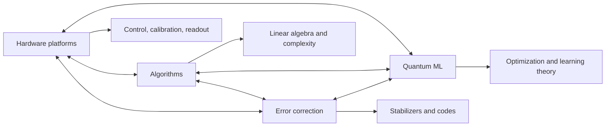

# Quantum Computing

Quantum computing studies information processing in systems whose states are vectors in complex Hilbert space and whose allowed operations are physical quantum evolutions, measurements, and controlled noise processes. This area sits between [quantum mechanics](/physics/quantum-mechanics/), [linear algebra](/math/linear-algebra/), [cryptography](/cs/cryptography/), and computer architecture: the central question is not whether quantum theory is strange, but which computational tasks become different when superposition, interference, entanglement, and measurement are engineered deliberately.

The pages in this section are written as a clean foundation for later combine-mode additions from textbooks and papers. The current split is practical: [hardware](/quantum-information-science/quantum-computing/hardware) asks how qubits are physically made; [algorithms](/quantum-information-science/quantum-computing/algorithms) asks where coherent quantum evolution changes complexity; [quantum error correction](/quantum-information-science/quantum-computing/error-correction) asks how fragile states can be protected; and [quantum machine learning](/quantum-information-science/quantum-computing/quantum-ml) asks which learning or optimization workflows may benefit from quantum subroutines without overstating speculative claims.

## Definitions

A **qubit** is a normalized vector in a two-dimensional complex Hilbert space:

$$
|\psi\rangle = \alpha |0\rangle + \beta |1\rangle,
\qquad
|\alpha|^2 + |\beta|^2 = 1.
$$

An $n$-qubit pure state belongs to a $2^n$-dimensional tensor-product space. The basis states are bit strings $\vert x\rangle$ for $x \in \{0,1\}^n$, and a general pure state is

$$
|\psi\rangle = \sum_{x \in \{0,1\}^n} \alpha_x |x\rangle,
\qquad
\sum_x |\alpha_x|^2 = 1.
$$

A **quantum gate** is usually modeled as a unitary matrix $U$ with $U^\dagger U = I$. A **quantum circuit** is a sequence of such gates, followed by measurements in some basis. Real devices also include state preparation, calibration, crosstalk, leakage outside the computational subspace, control pulses, readout errors, and classical feedback.

A **measurement** converts quantum amplitudes into classical outcomes. For a projective computational-basis measurement, the probability of observing bit string $x$ is $\vert \alpha_x\vert ^2$, and the post-measurement state collapses to the observed subspace. General measurement is described by positive operator-valued measures, but the circuit model often compiles final readout into computational-basis measurements plus preceding unitaries.

An **oracle** is a black-box unitary used to define query complexity. Many early algorithms, including Deutsch-Jozsa, Bernstein-Vazirani, Simon's algorithm, and Grover search, are clearest in the oracle model. An oracle result is not automatically an end-to-end application speedup because real workloads also need data loading, oracle construction, fault-tolerant compilation, and error budgets.

A **NISQ** device is a noisy intermediate-scale quantum processor: it has enough qubits to be scientifically interesting, but not enough low-error logical qubits for large fault-tolerant algorithms. A **fault-tolerant** quantum computer uses [quantum error correction](/quantum-information-science/quantum-computing/error-correction) so that encoded logical operations fail much less often than physical operations.

The main pages in this area are:

| Page | Main question | Typical neighbors |
|---|---|---|
| [Hardware](/quantum-information-science/quantum-computing/hardware) | What physical systems implement qubits and gates? | Quantum mechanics, controls, materials, cryogenics, optics |
| [Algorithms](/quantum-information-science/quantum-computing/algorithms) | Which computational problems admit quantum speedups? | Complexity, number theory, linear algebra |
| [Quantum Error Correction](/quantum-information-science/quantum-computing/error-correction) | How can noisy qubits form reliable logical qubits? | Coding theory, stabilizers, many-body physics |
| [Quantum Machine Learning](/quantum-information-science/quantum-computing/quantum-ml) | How do parametrized circuits, kernels, and quantum subroutines interact with learning? | Machine learning, optimization, kernels |

## Key results

The first structural result is that quantum information is linear. If an algorithm maps basis states by a unitary $U$, then it also maps superpositions by linearity:

$$
U\left(\sum_x \alpha_x |x\rangle\right)
= \sum_x \alpha_x U|x\rangle.
$$

This is the source of both power and constraint. A circuit can evaluate branches coherently, but measurement only samples from the final distribution. Useful algorithms arrange **interference** so that wrong answers cancel and right answers receive amplified probability.

The second structural result is that arbitrary quantum states cannot be copied. The no-cloning theorem follows from linearity. If a unitary copied two arbitrary states,

$$
U|\psi\rangle|0\rangle = |\psi\rangle|\psi\rangle,
\qquad
U|\phi\rangle|0\rangle = |\phi\rangle|\phi\rangle,
$$

then inner products would be preserved by unitarity:

$$
\langle \psi|\phi\rangle
= \left(\langle \psi|\phi\rangle\right)^2.
$$

This only holds for identical or orthogonal states. Since arbitrary quantum states can have any inner product, universal copying is impossible. This fact links computing to [quantum communication](/quantum-information-science/quantum-communication/) and [quantum security](/quantum-information-science/quantum-security/).

The third structural result is that entanglement changes representation cost. A product state has the form

$$
|\psi\rangle = |\psi_1\rangle \otimes \cdots \otimes |\psi_n\rangle,
$$

but a generic $n$-qubit state requires $2^n$ complex amplitudes. This exponential state space is not itself an exponential computer, because amplitudes are not directly readable. It becomes useful only when a circuit has a problem-specific interference pattern.

The fourth structural result is computational: known exponential speedups, such as Shor's factoring algorithm, use algebraic structure and phase estimation; quadratic speedups, such as Grover search, use amplitude amplification; and many NISQ methods are heuristic rather than complexity-theoretic. This is why this wiki separates the mature algorithmic core from the more experimental [quantum machine learning](/quantum-information-science/quantum-computing/quantum-ml) literature.

Finally, scalable quantum computing appears to require error correction. Physical qubits decohere and gates are imperfect. The threshold theorem states, roughly, that if physical noise is sufficiently weak and local, arbitrarily long quantum computations can be performed with polylogarithmic overhead by encoding information and using fault-tolerant operations. The theorem is a statement about asymptotic possibility, not a promise that any particular hardware platform is already practical.

## Visual



The diagram is bidirectional because progress is coupled. Algorithms determine the required logical gates; error correction turns logical requirements into physical overhead; hardware determines which native gates, connectivity, and noise models are realistic; and QML often lives at the boundary where hardware constraints and classical optimization meet.

## Worked example 1: Classifying a quantum-computing claim

**Problem.** A paper claims: "Our quantum processor samples from a distribution that is hard for classical computers; therefore quantum computers can now break RSA." Decide which part of the quantum-computing map this claim belongs to, and whether the conclusion follows.

**Method.**

1. Identify the task. Sampling from a hard distribution is an algorithms-and-complexity claim, usually related to quantum advantage experiments.
2. Identify the output type. A sampling experiment produces bit strings from a distribution. It does not necessarily solve a decision, search, optimization, or factoring problem.
3. Compare with the RSA threat. Breaking RSA by Shor's algorithm requires coherent modular exponentiation, quantum phase estimation, enough logical qubits, and fault-tolerant gates.
4. Check whether the hardware statement includes error correction. If the processor is NISQ, the experiment may be scientifically important but does not imply large-scale fault-tolerant factoring.
5. State the conclusion conservatively.

**Answer.** The sampling result belongs mainly to [algorithms](/quantum-information-science/quantum-computing/algorithms) and [hardware](/quantum-information-science/quantum-computing/hardware). It may demonstrate a separation for a specialized sampling problem under assumptions, but it does not by itself imply that RSA can be broken. The RSA conclusion would require the resource path in [quantum error correction](/quantum-information-science/quantum-computing/error-correction): physical qubits to logical qubits, logical gates to modular exponentiation, and phase estimation with a low total failure probability. The checked answer is: the first claim may be about quantum sampling advantage; the RSA conclusion does not follow.

## Worked example 2: Estimating state-vector storage

**Problem.** Estimate the classical memory required to store an arbitrary pure state of $30$ qubits using double-precision complex amplitudes. Assume each complex amplitude uses two 64-bit floating-point numbers.

**Method.**

1. Count amplitudes. An $n$-qubit state has $2^n$ complex amplitudes.

$$
2^{30} = 1,073,741,824.
$$

2. Count bytes per amplitude. A 64-bit float is $8$ bytes, so a complex number with real and imaginary parts uses

$$
2 \times 8 = 16 \text{ bytes}.
$$

3. Multiply:

$$
1,073,741,824 \times 16
= 17,179,869,184 \text{ bytes}.
$$

4. Convert to gibibytes:

$$
\frac{17,179,869,184}{2^{30}} = 16 \text{ GiB}.
$$

**Answer.** A dense state-vector simulation of $30$ qubits requires about $16$ GiB just for the state vector. This does not include temporary arrays, gate matrices, memory alignment, or simulation overhead. The result checks the intuition that each additional qubit doubles the state-vector memory.

## Code

The following pure-Python snippet builds a small dependency graph for this section and prints a topological reading order for one possible learning path. It is not a simulator; it is a compact way to keep the conceptual prerequisites explicit.

```python
from collections import defaultdict, deque

prerequisites = {
    "hardware": ["qubits", "measurement"],
    "algorithms": ["qubits", "unitaries", "measurement"],
    "error correction": ["qubits", "measurement", "pauli operators"],
    "quantum machine learning": ["algorithms", "hardware", "optimization"],
    "fault tolerance": ["error correction", "hardware"],
}

graph = defaultdict(list)
indegree = defaultdict(int)

for topic, deps in prerequisites.items():
    indegree.setdefault(topic, 0)
    for dep in deps:
        graph[dep].append(topic)
        indegree[topic] += 1
        indegree.setdefault(dep, 0)

queue = deque(sorted(node for node, deg in indegree.items() if deg == 0))
order = []

while queue:
    node = queue.popleft()
    order.append(node)
    for child in sorted(graph[node]):
        indegree[child] -= 1
        if indegree[child] == 0:
            queue.append(child)

print("Suggested dependency order:")
for i, topic in enumerate(order, start=1):
    print(f"{i}. {topic}")
```

## Common pitfalls

- Treating a large Hilbert space as automatically useful computation. Useful quantum algorithms need an interference pattern and a readout strategy.
- Confusing a qubit count with computational capability. Coherence, gate fidelity, connectivity, measurement quality, and error-correction overhead matter.
- Assuming all quantum speedups are exponential. Grover search is quadratic, many quantum-walk results are problem-specific, and many NISQ methods are heuristic.
- Ignoring data loading. A claimed quantum advantage can disappear if preparing the input quantum state costs as much as solving the classical problem.
- Equating "quantum advantage" with broad practical usefulness. A demonstration can be scientifically valid while solving a narrow sampling task.
- Treating QML claims as established because the circuit is quantum. Generalization, trainability, noise, and classical baselines must be checked.

## Connections

- [Quantum hardware](/quantum-information-science/quantum-computing/hardware) gives the physical constraints behind qubits, gates, and readout.
- [Quantum algorithms](/quantum-information-science/quantum-computing/algorithms) explains Shor, Grover, phase estimation, HHL, and oracle algorithms.
- [Quantum error correction](/quantum-information-science/quantum-computing/error-correction) explains how logical qubits are built from noisy physical qubits.
- [Quantum machine learning](/quantum-information-science/quantum-computing/quantum-ml) covers variational circuits, quantum kernels, QAOA, and trainability.
- [Quantum communication](/quantum-information-science/quantum-communication/) uses the same measurement and no-cloning principles for protocols.
- [Quantum internet](/quantum-information-science/quantum-internet/) connects entanglement distribution, repeaters, teleportation, and networked processors.
- [Quantum security](/quantum-information-science/quantum-security/) studies QKD, quantum-safe cryptography, and security implications.
- [Cryptography](/cs/cryptography/) is the classical neighbor most directly affected by Shor's algorithm.
- [Linear algebra](/math/linear-algebra/) supplies the language of vector spaces, tensor products, unitary matrices, and eigenvectors.

## Further reading

- Michael A. Nielsen and Isaac L. Chuang, *Quantum Computation and Quantum Information*.
- John Preskill, *Lecture Notes for Physics 219/Computer Science 219: Quantum Computation*.
- Eleanor Rieffel and Wolfgang Polak, *Quantum Computing: A Gentle Introduction*.
- Phillip Kaye, Raymond Laflamme, and Michele Mosca, *An Introduction to Quantum Computing*.
- Scott Aaronson, *Quantum Computing Since Democritus*.
