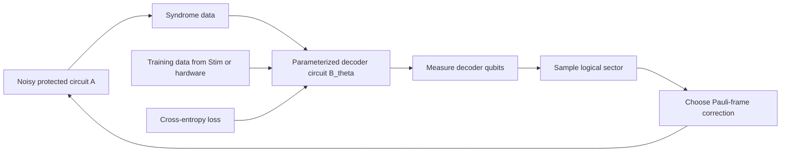

# Quantum Decoder Circuit

Pan Zhang, "Correcting a noisy quantum computer using a quantum computer," arXiv:2506.08331v1 (2025), proposes a learned variational quantum circuit as a decoder for quantum error-correcting codes. The technique replaces the usual classical mapping from syndrome bits to logical correction with a quantum circuit $B$ trained to sample the logical sector for a noisy quantum circuit $A$.

## Problem & motivation

Real-time decoding is a bottleneck for superconducting fault tolerance. Syndrome measurements can arrive every microsecond, but high-accuracy decoders may require classical graph algorithms, neural networks, memory traffic, and electronics latency. Classical decoders have improved rapidly, yet the scaling problem remains: a large code produces a large syndrome stream, and some logical operations need corrections or Pauli-frame decisions before the computation can proceed.

The quantum decoder circuit idea asks whether decoding must be classical. A quantum computer already performs fast single- and two-qubit gates. If a small auxiliary quantum circuit could be trained to map a syndrome into a logical correction, then the decoding operation might run at hardware speed and, in a more speculative form, might be coherently connected to the protected computation without measuring ancillas into a classical controller.

This is a theory and numerical-simulation paper, not an experimental hardware demonstration. Its main value is conceptual: it turns decoding into a trainable quantum-circuit sampling problem and tests the idea on surface-code memories up to distance 7 under circuit-level noise, comparing against minimum-weight perfect matching.

## Method

Let a code have syndrome vector

$$
s=(s_1,\ldots,s_m)\in \{0,1\}^m
$$

and $k$ logical qubits. A Pauli error belongs to one of $4^k$ logical sectors, which can be represented by

$$
\ell=(\ell_1,\ldots,\ell_{2k})\in \{0,1\}^{2k}.
$$

Classical maximum-likelihood decoding estimates

$$
\ell^*(s)=\arg\max_\ell P(\ell\mid s).
$$

The proposed method builds a variational decoding circuit $B_\theta(s)$ whose gates depend on the syndrome bits. In the paper's schematic, syndrome bits multiply rotation angles, so a gate may be identity when $s_i=0$ and a learned rotation when $s_i=1$. The output measurement of the decoding circuit samples from

$$
q_\theta(\ell\mid s),
$$

which is trained to approximate $P(\ell\mid s)$.

Training resembles a neural decoder. Generate or collect pairs $(s,\ell)$ from an error model or hardware data. Simulate the decoder circuit, compute the probability assigned to the labeled logical sector, and minimize cross-entropy:

$$
\mathcal{L}(\theta)
=-\frac{1}{N}\sum_{j=1}^N \log q_\theta(\ell^{(j)}\mid s^{(j)}).
$$

The paper uses tensor-network simulation for training and an optimizer such as Adam to update parameters. Once trained, the decoder circuit could be run on quantum hardware. Repeated runs sample candidate logical sectors; taking the most frequent sector approximates maximum-likelihood decoding.

The more speculative extension is a self-correcting circuit. Instead of measuring ancillas to produce classical syndrome bits, the syndrome-carrying ancilla states could directly control the decoder gates. The decoder output could then control a logical correction on the data. That architecture would blur the boundary between syndrome extraction, decoding, and correction.

## Visual



| Decoder family | Input | Output | Strength | Main limitation |
|---|---|---|---|---|
| MWPM | Detection events and graph weights | Minimum-weight correction | Fast and mature for surface-code-like graphs | Can miss degeneracy and hardware-specific correlations |
| Neural decoder | Syndrome vector | Logical sector probabilities | Flexible, learns nonlocal features | Classical latency and deployment complexity |
| Quantum decoder circuit | Syndrome-conditioned gates | Sampled logical sector | Runs as a quantum circuit after training | Assumes reliable decoder hardware and good ansatz |
| Self-correcting circuit | Coherent ancilla state | Controlled logical correction | Reduces classical feedback path in principle | Speculative; decoder noise must be handled |

## Hyperparameters / system details

The numerical experiments tested surface-code quantum memories in the $Z$ basis under depolarizing circuit-level noise. The code distances were $3$, $5$, and $7$. The physical error rate was fixed at $0.001$ in the reported comparison figure, chosen as a representative superconducting-device scale.

For each plotted setting, the training data contained 200,000 syndromes and the test data contained 100,000 syndromes generated with a different random seed using Stim. The decoding circuit in the proof of concept used 3 decoding qubits and 10 blocks of operations. The paper treated the decoding circuit as noiseless in the main numerical comparison.

The reported trend is that the learned circuit decoder improves with training epochs. For distance 3 with 4 rounds of measurements, the test logical performance after 10,000 epochs was better than MWPM but still not below the chosen break-even reference. For distances 5 and 7, the test logical rate exceeded the break-even value after $10^4$ epochs in the paper's plotted convention. The paper describes the accuracy as comparable to MWPM for surface codes under circuit-level noise.

These details matter because the proposal is not yet a resource estimate for a full logical computer. The decoder circuit size, noise, training cost, and connectivity all need to be studied for practical hardware deployment.

## Headline results

The conservative headline is: in numerical experiments with noiseless 3-qubit, 10-block decoder circuits trained on Stim-generated surface-code data, the quantum decoder circuit achieved performance comparable to classical minimum-weight perfect matching for distances up to 7 under a $0.001$ circuit-level noise rate.

The conceptual headline is broader but less settled: decoding can be formulated as a quantum sampling task. If the syndrome-conditioned decoder circuit can be made reliable and fast, then parts of a quantum computer could assist in correcting the rest of the quantum computer. The paper explicitly leaves noisy decoder circuits, larger ansatz design, and real-device training as future work.

## Worked example 1: Counting logical sectors

**Problem.** A code encodes $k=3$ logical qubits. How many Pauli logical sectors can a maximum-likelihood decoder distinguish, and how many binary output bits are needed to label them?

**Method.**

1. Each logical qubit has four Pauli sectors:

$$
I,\quad X,\quad Z,\quad Y.
$$

2. For $k$ logical qubits, the number of sectors is

$$
4^k.
$$

3. Substitute $k=3$:

$$
4^3=64.
$$

4. Since $4^k=2^{2k}$, the number of binary bits needed is

$$
2k=2(3)=6.
$$

**Checked answer.** A 3-logical-qubit code has 64 logical sectors, labelable by 6 bits. This is why sampling a joint logical-sector distribution can become difficult for high-rate codes: the output space grows exponentially in the number of encoded logical qubits.

## Worked example 2: Computing a cross-entropy update signal

**Problem.** For one syndrome $s$, a decoder circuit assigns probabilities $q_\theta(\ell\mid s)=(0.10,0.70,0.15,0.05)$ to four logical sectors. The training label is sector 2, using zero-based indexing. What is the one-sample cross-entropy loss?

**Method.**

1. The labeled sector probability is

$$
q_\theta(\ell=2\mid s)=0.15.
$$

2. The one-sample cross-entropy is

$$
\mathcal{L}=-\log q_\theta(\ell=2\mid s).
$$

3. Substitute the probability:

$$
\mathcal{L}=-\log(0.15).
$$

4. Numerically,

$$
\log(0.15)\approx -1.897,
$$

so

$$
\mathcal{L}\approx 1.897.
$$

5. If training changes the circuit so the labeled sector probability rises to $0.60$, the loss becomes

$$
-\log(0.60)\approx 0.511.
$$

**Checked answer.** The initial loss is about $1.897$, and raising probability on the correct logical sector lowers it to about $0.511$. This is the same statistical pressure used in neural decoders, but the probability model is a quantum circuit.

## Connections

- [Quantum error correction](/quantum-information-science/quantum-computing/error-correction) defines syndromes, decoders, and logical sectors.
- [Willow surface code below threshold](/quantum-information-science/quantum-computing/willow-surface-code-below-threshold) shows why real-time decoding latency matters in superconducting surface codes.
- [Failure mechanisms of EC gates](/quantum-information-science/quantum-computing/failure-mechanisms-of-ec-gates) shows how measurement failures and logic-gate stability interact.
- [Quantum algorithms](/quantum-information-science/quantum-computing/algorithms) provides the circuit-model background for trainable quantum circuits.
- [Quantum machine learning](/quantum-information-science/quantum-computing/quantum-ml) covers variational circuits and training caveats.
- [Quantum hardware](/quantum-information-science/quantum-computing/hardware) explains why gate times and measurement latency constrain real-time feedback.
- [Quantum internet](/quantum-information-science/quantum-internet/) is relevant when networked logical processors eventually need distributed decoding and feedback.
- [Quantum mechanics](/physics/quantum-mechanics/) supplies the Born-rule sampling and measurement formalism behind the decoder circuit.

## PyTorch/Qiskit sketch

This PyTorch sketch is a classical surrogate for the training objective: syndrome-conditioned features feed a small classifier over logical sectors. A real quantum decoder circuit would replace the linear model with Born probabilities from $B_\theta(s)$.

```python
import torch
import torch.nn as nn
import torch.optim as optim

torch.manual_seed(7)

num_syndrome_bits = 12
num_logical_sectors = 4
num_samples = 256

syndrome = torch.randint(0, 2, (num_samples, num_syndrome_bits)).float()
labels = ((syndrome[:, 0] + syndrome[:, 3] + syndrome[:, 9]) % 4).long()

model = nn.Sequential(
    nn.Linear(num_syndrome_bits, 16),
    nn.Tanh(),
    nn.Linear(16, num_logical_sectors),
)

optimizer = optim.Adam(model.parameters(), lr=0.03)
loss_fn = nn.CrossEntropyLoss()

for epoch in range(200):
    optimizer.zero_grad()
    logits = model(syndrome)
    loss = loss_fn(logits, labels)
    loss.backward()
    optimizer.step()

with torch.no_grad():
    pred = model(syndrome).argmax(dim=1)
    accuracy = (pred == labels).float().mean().item()

print(f"training accuracy: {accuracy:.3f}")
```

## Common pitfalls / reproduction notes

- Do not treat the proposal as an experimental demonstration. The paper's main evidence is numerical simulation.
- The main comparison assumes a noiseless decoder circuit. A practical decoder circuit will have its own errors, leakage, crosstalk, and calibration drift.
- Matching MWPM on small surface-code tasks does not prove advantage for all codes. The strongest possible use case may be high-rate or highly correlated decoding problems.
- Training cost is not the same as deployment latency. The circuit may run fast after training, but data generation and optimization still matter.
- Syndrome-conditioned rotations are only useful if syndrome data can reach the decoder circuit with low latency or remain coherent in a self-correcting design.
- A self-correcting circuit is not the same as a self-correcting quantum memory in the many-body physics sense.

## Further reading

- E. Dennis, A. Kitaev, A. Landahl, and J. Preskill, "Topological quantum memory," *Journal of Mathematical Physics* 43, 4452 (2002).
- O. Higgott, "PyMatching: A Python package for decoding quantum codes with minimum-weight perfect matching," *ACM Transactions on Quantum Computing* 3, 1 (2022).
- C. Gidney, "Stim: a fast stabilizer circuit simulator," *Quantum* 5, 497 (2021).
- J. Bausch et al., "Learning high-accuracy error decoding for quantum processors," *Nature* 635, 834-840 (2024).
- H. Cao, F. Pan, D. Feng, Y. Wang, and P. Zhang, "Generative decoding for quantum error-correcting codes," arXiv:2503.21374.
