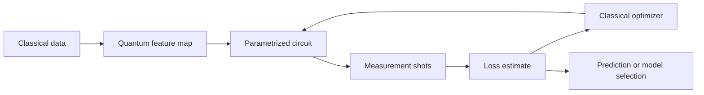

# Quantum Machine Learning

Quantum machine learning studies whether quantum circuits can improve learning, inference, optimization, or data analysis. The honest view is mixed: quantum kernels, parametrized circuits, QAOA, and quantum linear-algebra subroutines are mathematically rich, but broad practical advantage over strong classical [machine learning](/cs/machine-learning/) and [deep learning](/cs/deep-learning/) baselines is not established. The field is best read as a set of precise models and hypotheses, not as a guarantee that adding qubits improves a learning pipeline.

## Definitions

A **parametrized quantum circuit** is a unitary family $U(x,\theta)$ depending on input data $x$ and trainable parameters $\theta$. A common supervised-learning model prepares

$$
|\psi(x,\theta)\rangle = U(x,\theta)|0^n\rangle
$$

and predicts from an expectation value:

$$
\hat{y}(x,\theta) = \langle \psi(x,\theta)|M|\psi(x,\theta)\rangle
$$

for some observable $M$.

A **variational quantum classifier** combines a feature map $U_\phi(x)$, a trainable ansatz $U_\theta$, measurement, and a classical loss function. Training is usually hybrid: a quantum device estimates expectation values, while a classical optimizer updates $\theta$.

A **quantum kernel** maps data to quantum states and defines

$$
K(x,x') = |\langle \phi(x)|\phi(x')\rangle|^2,
$$

where $\vert \phi(x)\rangle = U_\phi(x)\vert 0^n\rangle$. A classical kernel method, such as a support vector machine, can then use estimated kernel entries.

**QAOA**, the quantum approximate optimization algorithm, alternates cost and mixer unitaries. For a combinatorial objective encoded as Hamiltonian $C$, and mixer $B$, a depth-$p$ QAOA state is

$$
|\gamma,\beta\rangle
= \prod_{\ell=1}^{p} e^{-i\beta_\ell B}e^{-i\gamma_\ell C}|+\rangle^{\otimes n}.
$$

It is not machine learning by itself, but it sits near QML because it uses parametrized circuits and classical optimization, and it can appear inside learning or inference workflows.

A **quantum neural network** is an informal term for a parametrized circuit used like a neural model. The analogy should be handled carefully: layers are unitary, measurement is probabilistic, gradients come from expectation values, and expressivity is constrained by qubit count, data encoding, and noise.

An **ansatz** is the circuit architecture chosen for training. **Expressibility** measures how broadly the ansatz explores Hilbert space. **Entangling capability** measures how much entanglement it can create. More expressibility is not automatically better because highly expressive random circuits can become hard to train.

A **barren plateau** is a training regime where gradients concentrate near zero, often exponentially in the number of qubits for global cost functions or sufficiently random deep circuits:

$$
\mathrm{Var}\left(\frac{\partial C}{\partial \theta_j}\right)
\sim O\left(\frac{1}{2^n}\right)
$$

in common idealized settings.

A useful QML benchmark must specify the whole pipeline: data representation, circuit family, number of measurement shots, optimizer budget, hardware or simulator noise, train/test split, and classical competitors. Without those details, "quantum model beats classical model" is not a scientific statement; it may only mean that the chosen classical baseline was weak or that resource accounting was incomplete.

## Key results

The parameter-shift rule gives exact gradients for many gates. If a parameter appears in a gate

$$
U_j(\theta_j)=e^{-i\theta_j P/2}
$$

where $P$ has eigenvalues $\pm 1$, then for an expectation-value loss component $f(\theta)$,

$$
\frac{\partial f}{\partial \theta_j}
= \frac{1}{2}\left[
f\left(\theta_j+\frac{\pi}{2}\right)
- f\left(\theta_j-\frac{\pi}{2}\right)
\right],
$$

with other parameters held fixed. This makes gradients measurable on hardware, but it doubles circuit evaluations per parameter per observable before shot noise and batching.

Quantum kernels are valid kernels because they are inner products in a Hilbert space. The kernel matrix $K_{ij}=\vert \langle \phi(x_i)\vert \phi(x_j)\rangle\vert ^2$ is positive semidefinite under the corresponding feature representation. A possible advantage requires a feature map whose kernel is hard to estimate classically and useful for the learning task. Both parts matter.

QAOA optimizes the expected cost

$$
F_p(\gamma,\beta)
= \langle \gamma,\beta|C|\gamma,\beta\rangle.
$$

At $p=1$ it can often be analyzed directly for simple graphs. As $p$ increases, QAOA can approximate adiabatic evolution in some settings, but optimization landscapes, noise, and circuit depth become limiting.

Barren plateaus are not merely an optimizer inconvenience. If gradient variance shrinks exponentially, estimating a reliable descent direction may require exponentially many measurement shots. Strategies that can help include problem-inspired ansatz design, local cost functions, careful initialization, layerwise training, symmetry constraints, and error-aware compilation.

NISQ QML and fault-tolerant QML should be separated. NISQ QML uses shallow circuits and accepts noise as part of the training environment. Fault-tolerant QML could use deeper subroutines such as amplitude estimation, phase estimation, HHL-like linear algebra, or quantum Gibbs sampling, but those require logical qubits and substantial overhead. Claims about near-term advantage should be judged against strong classical baselines, data-loading costs, hyperparameter tuning, and total wall-clock time.

Generalization is the second major issue. A quantum feature map can make data separable in a high-dimensional Hilbert space, but high-dimensional separability alone is not enough. The induced kernel or model class must align with the task distribution, and the training set must be large enough to support the chosen hypothesis class. This is the same statistical discipline used in classical learning, with the added burden that quantum measurements introduce sampling noise.

Speculative versus established status:

| Claim type | Status | How to read it |
|---|---|---|
| Parameter-shift gradients for suitable gates | Established | Exact mathematical identity, subject to sampling noise |
| Quantum kernels as valid kernels | Established | Advantage depends on feature map and task |
| QAOA as a variational optimizer | Established model | Performance advantage is instance- and depth-dependent |
| Barren plateaus in broad random-circuit settings | Established theory | Details depend on ansatz, cost, noise, and initialization |
| Broad practical QML advantage on ordinary datasets | Not established | Requires careful benchmarks against classical methods |
| Fault-tolerant quantum speedups for some linear-algebra subroutines | Conditional | Depends on input model, condition number, sparsity, and readout |

## Visual



| Approach | Quantum object | Classical partner | Main risk |
|---|---|---|---|
| Variational classifier | Trainable circuit expectation | Optimizer and loss | Noise, barren plateaus, weak baselines |
| Quantum kernel | State overlap kernel | SVM or kernel ridge regression | Kernel may be classically easy or uninformative |
| QAOA | Alternating cost and mixer unitaries | Parameter optimizer | Depth and landscape limits |
| Quantum neural network | Layered parametrized circuit | Training loop and data pipeline | Name can hide unclear inductive bias |
| Fault-tolerant QML subroutine | Phase estimation, amplitude estimation, block-encoding | Classical pre/post-processing | Input/output assumptions dominate |

## Worked example 1: Parameter-shift gradient for one qubit

**Problem.** Let

$$
f(\theta)=\langle 0|R_y(\theta)^\dagger Z R_y(\theta)|0\rangle.
$$

Compute $f(\theta)$ and verify the parameter-shift gradient at $\theta=\pi/3$.

**Method.**

1. The rotation produces

$$
R_y(\theta)|0\rangle
= \cos(\theta/2)|0\rangle + \sin(\theta/2)|1\rangle.
$$

2. The $Z$ expectation is probability of $0$ minus probability of $1$:

$$
f(\theta)
= \cos^2(\theta/2)-\sin^2(\theta/2)
= \cos\theta.
$$

3. The analytic derivative is

$$
f'(\theta) = -\sin\theta.
$$

At $\theta=\pi/3$,

$$
f'(\pi/3) = -\sin(\pi/3) = -\frac{\sqrt{3}}{2}.
$$

4. The parameter-shift rule gives

$$
\frac{1}{2}\left[
f\left(\frac{\pi}{3}+\frac{\pi}{2}\right)
- f\left(\frac{\pi}{3}-\frac{\pi}{2}\right)
\right].
$$

5. Evaluate the two terms:

$$
f(5\pi/6)=\cos(5\pi/6)=-\frac{\sqrt{3}}{2},
$$

$$
f(-\pi/6)=\cos(-\pi/6)=\frac{\sqrt{3}}{2}.
$$

6. Subtract and divide by $2$:

$$
\frac{1}{2}\left(-\frac{\sqrt{3}}{2}-\frac{\sqrt{3}}{2}\right)
= -\frac{\sqrt{3}}{2}.
$$

**Answer.** The parameter-shift estimate equals the analytic derivative, $-\sqrt{3}/2$. The check works because $R_y$ has a Pauli generator with two eigenvalues separated in the required way.

## Worked example 2: A two-point quantum kernel

**Problem.** Use the one-qubit feature map

$$
|\phi(x)\rangle = R_y(x)|0\rangle
$$

and compute the kernel value $K(0,\pi/2)$.

**Method.**

1. For $x=0$,

$$
|\phi(0)\rangle = |0\rangle.
$$

2. For $x=\pi/2$,

$$
|\phi(\pi/2)\rangle
= \cos(\pi/4)|0\rangle + \sin(\pi/4)|1\rangle
= \frac{1}{\sqrt{2}}|0\rangle + \frac{1}{\sqrt{2}}|1\rangle.
$$

3. Compute the inner product:

$$
\langle \phi(0)|\phi(\pi/2)\rangle
= \langle 0|\left(\frac{1}{\sqrt{2}}|0\rangle + \frac{1}{\sqrt{2}}|1\rangle\right)
= \frac{1}{\sqrt{2}}.
$$

4. Square the magnitude:

$$
K(0,\pi/2)
= \left|\frac{1}{\sqrt{2}}\right|^2
= \frac{1}{2}.
$$

**Answer.** The kernel value is $1/2$. This checks the geometric interpretation: the two encoded states are neither identical nor orthogonal, so their kernel lies strictly between $0$ and $1$.

## Code

This pure-Python NumPy example trains a one-qubit variational classifier with parameter-shift gradients. It classifies points on the line by fitting the sign of a sine-like label.

```python
import numpy as np

def ry(theta):
    c = np.cos(theta / 2)
    s = np.sin(theta / 2)
    return np.array([[c, -s], [s, c]], dtype=float)

z = np.array([[1, 0], [0, -1]], dtype=float)
zero = np.array([1, 0], dtype=float)

def prediction(x, theta):
    state = ry(theta) @ ry(x) @ zero
    return float(state.T @ z @ state)

def loss(xs, ys, theta):
    errors = [(prediction(x, theta) - y) ** 2 for x, y in zip(xs, ys)]
    return sum(errors) / len(errors)

def gradient(xs, ys, theta):
    plus = loss(xs, ys, theta + np.pi / 2)
    minus = loss(xs, ys, theta - np.pi / 2)
    return 0.5 * (plus - minus)

xs = np.linspace(-1.0, 1.0, 9)
ys = np.where(xs >= 0, 1.0, -1.0)
theta = 0.0
learning_rate = 0.2

for step in range(40):
    theta -= learning_rate * gradient(xs, ys, theta)

print(f"theta={theta:.3f} loss={loss(xs, ys, theta):.3f}")
for x in xs:
    print(f"x={x:+.2f} prediction={prediction(x, theta):+.3f}")
```

## Common pitfalls

- Assuming QML means automatic speedup. A quantum model must beat classical baselines under the same data, tuning, and resource accounting.
- Ignoring data encoding. Loading a large classical dataset into amplitudes can cost more than the intended speedup saves.
- Reporting training accuracy without generalization. A circuit can fit a small dataset without providing useful inductive bias.
- Overusing the phrase "quantum neural network." The circuit architecture, loss, observables, and data map matter more than the analogy.
- Neglecting shot noise. Gradients and losses estimated from finite measurements have variance.
- Choosing overly expressive ansatzes. Random deep circuits may suffer barren plateaus and become trainability failures.
- Treating QAOA performance as monotonic and easy with depth. Higher depth can increase expressivity while making optimization and noise worse.
- Comparing against weak classical baselines. Kernel methods, tensor networks, randomized features, and modern neural networks are serious competitors.
- Treating separability as generalization. A feature map that separates the training set may still fail on unseen data.
- Hiding optimizer cost. Many QML experiments spend substantial classical time tuning parameters, restarts, and learning rates.

## Connections

- [Quantum algorithms](/quantum-information-science/quantum-computing/algorithms) supplies phase estimation, amplitude amplification, HHL, and quantum walks.
- [Quantum hardware](/quantum-information-science/quantum-computing/hardware) determines circuit depth, noise, measurement budget, and connectivity.
- [Quantum error correction](/quantum-information-science/quantum-computing/error-correction) separates NISQ QML from future fault-tolerant QML.
- [Machine learning](/cs/machine-learning/) provides kernels, generalization, optimization, and model-selection baselines.
- [Deep learning](/cs/deep-learning/) is the natural benchmark for claims involving high-dimensional data and learned representations.
- [Linear algebra](/math/linear-algebra/) supplies Hilbert spaces, kernels, eigensystems, and matrix conditioning.
- [Quantum security](/quantum-information-science/quantum-security/) is a neighbor when QML is applied to cryptanalysis or secure protocols, but such claims need strong evidence.

## Further reading

- Maria Schuld and Francesco Petruccione, *Supervised Learning with Quantum Computers*.
- Jacob Biamonte and collaborators, review on quantum machine learning.
- Edward Farhi, Jeffrey Goldstone, and Sam Gutmann, QAOA.
- Jarrod McClean and collaborators, barren plateaus in quantum neural network training landscapes.
- Maria Schuld, Ryan Sweke, and Johannes Meyer, effect of data encoding on expressive power.
- Vojtech Havlicek and collaborators, supervised learning with quantum-enhanced feature spaces.
- John Preskill, writing on NISQ computing and near-term quantum devices.
