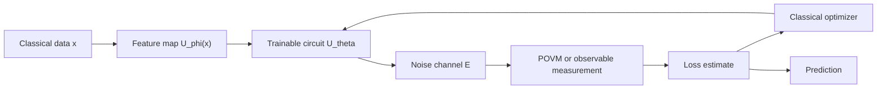

# Quantum Machine Learning

Quantum machine learning studies whether quantum circuits can improve learning, inference, optimization, or data analysis. The honest view is mixed: quantum kernels, parametrized circuits, QAOA-style optimization, and fault-tolerant quantum linear-algebra subroutines are mathematically rich, but broad practical advantage over strong classical [machine learning](/cs/machine-learning/) and [deep learning](/cs/deep-learning/) baselines is not established.

*Nielsen and Chuang do not cover QML as a separate topic. This page keeps the wiki's modern QML treatment and uses N&C-style notation from Chapters 2, 8, 11, and 12: density operators $\rho$, channels $\mathcal{E}$, POVMs, trace distance, fidelity, von Neumann entropy, and quantum information-processing resource accounting.*

## Definitions

A **parametrized quantum circuit** is a unitary family $U(x,\theta)$ depending on input data $x$ and trainable parameters $\theta$. A common supervised model prepares

$$
|\psi(x,\theta)\rangle=U(x,\theta)|0^n\rangle
$$

and predicts from an expectation value

$$
\hat{y}(x,\theta)=\langle\psi(x,\theta)|M|\psi(x,\theta)\rangle
$$

for some observable $M$. In N&C density-operator notation, this becomes

$$
\hat{y}(x,\theta)=\mathrm{Tr}\!\left[M\rho(x,\theta)\right],
\qquad
\rho(x,\theta)=U(x,\theta)|0^n\rangle\langle0^n|U(x,\theta)^\dagger.
$$

With noise, the prediction is better written as

$$
\hat{y}(x,\theta)=\mathrm{Tr}\!\left[M\mathcal{E}(\rho(x,\theta))\right],
$$

where $\mathcal{E}(\rho)=\sum_k E_k\rho E_k^\dagger$ is a quantum operation. This notation matters: many QML claims change substantially when the ideal pure state is replaced by the noisy state actually measured on hardware.

A **variational quantum classifier** combines a feature map $U_\phi(x)$, a trainable ansatz $U_\theta$, measurement, and a classical loss. Training is hybrid: a quantum device estimates expectation values, while a classical optimizer updates $\theta$.

A **quantum kernel** maps data to quantum states and defines

$$
K(x,x')=|\langle\phi(x)|\phi(x')\rangle|^2,
\qquad
|\phi(x)\rangle=U_\phi(x)|0^n\rangle.
$$

Equivalently, using density operators,

$$
K(x,x')=\mathrm{Tr}\!\left[\rho(x)\rho(x')\right]
$$

for pure feature states. A classical kernel method such as an SVM or kernel ridge regressor can then use the estimated kernel matrix.

**QAOA**, the quantum approximate optimization algorithm, alternates cost and mixer unitaries. For a combinatorial objective encoded as Hamiltonian $C$ and a mixer $B$, a depth-$p$ QAOA state is

$$
|\gamma,\beta\rangle=
\prod_{\ell=1}^p e^{-i\beta_\ell B}e^{-i\gamma_\ell C}|+\rangle^{\otimes n}.
$$

QAOA is not machine learning by itself, but it sits near QML because it uses parametrized circuits, measurement estimates, and classical optimization.

A **POVM measurement** is a collection of positive operators $\{M_y\}$ with $\sum_y M_y=I$. In classification, one can interpret

$$
p(y|x,\theta)=\mathrm{Tr}\!\left[M_y\rho(x,\theta)\right]
$$

as the model's predicted class probabilities.

A **barren plateau** is a training regime where gradients concentrate near zero, often exponentially in the number of qubits for global costs or sufficiently random deep ansatzes:

$$
\mathrm{Var}\left(\frac{\partial C}{\partial\theta_j}\right)\sim O(2^{-n})
$$

in common idealized settings.

The **von Neumann entropy**

$$
S(\rho)=-\mathrm{Tr}(\rho\log\rho)
$$

is not a training loss by default, but it is the N&C language for mixedness, compression, and information flow. It becomes relevant when evaluating noisy encodings, learned quantum channels, privacy leakage, or information bottleneck analogues.

## Key results

The parameter-shift rule gives exact gradients for many gates. If a parameter appears in

$$
U_j(\theta_j)=e^{-i\theta_j P/2}
$$

where $P$ has eigenvalues $\pm1$, then for an expectation-value component $f(\theta)$,

$$
\frac{\partial f}{\partial\theta_j}
=\frac{1}{2}\left[
f\left(\theta_j+\frac{\pi}{2}\right)
-f\left(\theta_j-\frac{\pi}{2}\right)
\right],
$$

with other parameters held fixed. The identity is exact in the circuit model, but estimating the two shifted values on hardware introduces shot noise.

Quantum kernels are valid positive semidefinite kernels because they are Hilbert-space inner products. For any coefficients $c_i$,

$$
\sum_{i,j}c_i^*c_j\langle\phi(x_i)|\phi(x_j)\rangle
=\left\|\sum_i c_i|\phi(x_i)\rangle\right\|^2\ge 0.
$$

For the squared-overlap kernel, positive semidefiniteness follows by viewing $\rho(x)$ as the feature vector in Hilbert-Schmidt space. A possible advantage requires both a feature map whose kernel is hard to estimate classically and a learning task that benefits from that kernel. Either condition alone is insufficient.

Noisy QML should be expressed with channels. If the intended model is

$$
\rho_\theta=U_\theta\rho_0U_\theta^\dagger,
$$

but the actual hardware implements

$$
\widetilde{\rho}_\theta=\mathcal{E}_L\circ\mathcal{U}_L\circ\cdots\circ\mathcal{E}_1\circ\mathcal{U}_1(\rho_0),
$$

then the learned function is not the ideal circuit plus small after-the-fact noise; it is a noisy quantum operation interleaved with the computation. N&C's Chapter 8 operator-sum language is the right notation for this.

The trace distance and fidelity supply evaluation tools beyond accuracy. For two states $\rho,\sigma$, trace distance measures distinguishability, while fidelity measures overlap. A QML embedding that maps nearby classical examples to nearly indistinguishable states may be hard to classify; an embedding that maps every training example to nearly orthogonal states may overfit and be expensive to estimate.

Generalization is a statistical question, not a quantum slogan. A high-dimensional Hilbert space can make training data separable, but useful learning requires an inductive bias aligned with the data distribution. The same discipline used in classical learning still applies: train/test splits, hyperparameter control, baseline strength, sample complexity, and uncertainty estimates.

NISQ QML and fault-tolerant QML should be separated. NISQ QML uses shallow circuits and accepts device noise as part of the training environment. Fault-tolerant QML could use deeper subroutines such as amplitude estimation, phase estimation, block-encoding, Hamiltonian simulation, or HHL-like linear algebra. Those subroutines are closer to [quantum algorithms](/quantum-information-science/quantum-computing/algorithms) and require the logical qubits supplied by [quantum error correction](/quantum-information-science/quantum-computing/error-correction).

## Visual



| QML approach | Quantum object | N&C notation that clarifies it | Main risk |
|---|---|---|---|
| Variational classifier | $\rho(x,\theta)$ and observables | $\mathrm{Tr}(M\rho)$, POVMs | Noise, barren plateaus, weak baselines |
| Quantum kernel | State overlaps | Fidelity and Hilbert-Schmidt inner product | Kernel may be classically easy or uninformative |
| QAOA-style optimizer | Alternating unitaries | Hamiltonian evolution and expectation values | Depth, landscape, and shot cost |
| Noisy training | Interleaved channels | Kraus maps and process tomography | Learned model differs from ideal circuit |
| Fault-tolerant QML | Algorithmic subroutines | Phase estimation, amplitude estimation, entropy | Input/output assumptions dominate |

## Worked example 1: Parameter-shift gradient for one qubit

**Problem.** Let

$$
f(\theta)=\langle0|R_y(\theta)^\dagger Z R_y(\theta)|0\rangle.
$$

Compute $f(\theta)$ and verify the parameter-shift gradient at $\theta=\pi/3$.

**Method.**

1. Apply the rotation:

$$
R_y(\theta)|0\rangle
=\cos(\theta/2)|0\rangle+\sin(\theta/2)|1\rangle.
$$

2. The $Z$ expectation is probability of $0$ minus probability of $1$:

$$
f(\theta)=\cos^2(\theta/2)-\sin^2(\theta/2)=\cos\theta.
$$

3. Differentiate analytically:

$$
f'(\theta)=-\sin\theta.
$$

At $\theta=\pi/3$,

$$
f'(\pi/3)=-\sin(\pi/3)=-\frac{\sqrt{3}}{2}.
$$

4. Apply the parameter-shift rule:

$$
\frac{1}{2}\left[
f\left(\frac{\pi}{3}+\frac{\pi}{2}\right)
-f\left(\frac{\pi}{3}-\frac{\pi}{2}\right)
\right].
$$

5. Evaluate the two shifted terms:

$$
f(5\pi/6)=\cos(5\pi/6)=-\frac{\sqrt{3}}{2},
$$

$$
f(-\pi/6)=\cos(-\pi/6)=\frac{\sqrt{3}}{2}.
$$

6. Subtract and divide by $2$:

$$
\frac{1}{2}\left(-\frac{\sqrt{3}}{2}-\frac{\sqrt{3}}{2}\right)
=-\frac{\sqrt{3}}{2}.
$$

**Answer.** The parameter-shift estimate equals the analytic derivative, $-\sqrt{3}/2$. The checked condition is that $R_y(\theta)$ has a Pauli generator with the required two-eigenvalue spectrum.

## Worked example 2: A two-point quantum kernel

**Problem.** Use the one-qubit feature map

$$
|\phi(x)\rangle=R_y(x)|0\rangle
$$

and compute the kernel value $K(0,\pi/2)$.

**Method.**

1. For $x=0$,

$$
|\phi(0)\rangle=|0\rangle.
$$

2. For $x=\pi/2$,

$$
|\phi(\pi/2)\rangle
=\cos(\pi/4)|0\rangle+\sin(\pi/4)|1\rangle
=\frac{1}{\sqrt{2}}|0\rangle+\frac{1}{\sqrt{2}}|1\rangle.
$$

3. Compute the inner product:

$$
\langle\phi(0)|\phi(\pi/2)\rangle
=\langle0|\left(\frac{1}{\sqrt{2}}|0\rangle+\frac{1}{\sqrt{2}}|1\rangle\right)
=\frac{1}{\sqrt{2}}.
$$

4. Square the magnitude:

$$
K(0,\pi/2)=\left|\frac{1}{\sqrt{2}}\right|^2=\frac{1}{2}.
$$

5. Check with density operators. Since $\rho_0=\vert 0\rangle\langle0\vert $ and $\rho_{\pi/2}=\vert \phi(\pi/2)\rangle\langle\phi(\pi/2)\vert $,

$$
\mathrm{Tr}(\rho_0\rho_{\pi/2})=|\langle0|\phi(\pi/2)\rangle|^2=\frac{1}{2}.
$$

**Answer.** The kernel value is $1/2$. The states are neither identical nor orthogonal, so the kernel lies strictly between $0$ and $1$.

## Code

This NumPy example trains a one-qubit variational classifier with parameter-shift gradients and evaluates the noisy prediction using a simple depolarizing channel in density-matrix notation.

```python
import numpy as np

I = np.eye(2)
X = np.array([[0, 1], [1, 0]], dtype=complex)
Y = np.array([[0, -1j], [1j, 0]], dtype=complex)
Z = np.array([[1, 0], [0, -1]], dtype=complex)
ZERO = np.array([[1.0], [0.0]], dtype=complex)
RHO0 = ZERO @ ZERO.conj().T

def ry(theta):
    c = np.cos(theta / 2)
    s = np.sin(theta / 2)
    return np.array([[c, -s], [s, c]], dtype=complex)

def depolarize(rho, p):
    return (1 - p) * rho + p * I / 2

def prediction(x, theta, noise=0.0):
    u = ry(theta) @ ry(x)
    rho = u @ RHO0 @ u.conj().T
    rho = depolarize(rho, noise)
    return float(np.real(np.trace(Z @ rho)))

def loss(xs, ys, theta, noise=0.0):
    return np.mean([(prediction(x, theta, noise) - y) ** 2 for x, y in zip(xs, ys)])

def gradient(xs, ys, theta, noise=0.0):
    plus = loss(xs, ys, theta + np.pi / 2, noise)
    minus = loss(xs, ys, theta - np.pi / 2, noise)
    return 0.5 * (plus - minus)

xs = np.linspace(-1.0, 1.0, 9)
ys = np.where(xs >= 0, 1.0, -1.0)
theta = 0.0

for _ in range(50):
    theta -= 0.2 * gradient(xs, ys, theta, noise=0.03)

print(f"theta={theta:.3f} noisy_loss={loss(xs, ys, theta, noise=0.03):.3f}")
for x in xs:
    print(f"x={x:+.2f} prediction={prediction(x, theta, noise=0.03):+.3f}")
```

## Common pitfalls

- Assuming QML means automatic speedup. A quantum model must beat classical baselines under the same data, tuning, and resource accounting.
- Ignoring data encoding. Loading a large classical dataset into amplitudes can cost more than the intended speedup saves.
- Treating an ideal circuit as the implemented model. Hardware realizes noisy channels, not exact unitaries.
- Reporting training accuracy without generalization. A circuit can fit a small dataset without providing useful inductive bias.
- Overusing the phrase "quantum neural network." The circuit architecture, loss, observables, and data map matter more than the analogy.
- Neglecting shot noise. Gradients and losses estimated from finite measurements have variance.
- Choosing overly expressive ansatzes. Random deep circuits can suffer barren plateaus and become trainability failures.
- Treating separability as generalization. A feature map that separates the training set may still fail on unseen data.
- Comparing against weak classical baselines. Kernel methods, tensor networks, randomized features, and modern neural networks are serious competitors.
- Hiding optimizer cost. Many QML experiments spend substantial classical time on tuning, restarts, and learning-rate choices.

## Connections

- [Quantum algorithms](/quantum-information-science/quantum-computing/algorithms) supplies phase estimation, amplitude amplification, HHL-style linear algebra, and oracle models.
- [Quantum hardware](/quantum-information-science/quantum-computing/hardware) determines circuit depth, noise channels, measurement budget, and connectivity.
- [Quantum error correction](/quantum-information-science/quantum-computing/error-correction) separates NISQ QML from future fault-tolerant QML.
- [Machine learning](/cs/machine-learning/) provides kernels, generalization, optimization, model selection, and baseline discipline.
- [Deep learning](/cs/deep-learning/) is the natural benchmark for claims involving high-dimensional data and learned representations.
- [Linear algebra](/math/linear-algebra/) supplies Hilbert spaces, kernels, eigensystems, matrix conditioning, and tensor products.
- [Quantum communication](/quantum-information-science/quantum-communication/) connects when QML models process distributed quantum states or learned channels.
- [Quantum mechanics](/physics/quantum-mechanics/) supplies density operators, observables, measurement, and open-system language.

## Further reading

- Michael A. Nielsen and Isaac L. Chuang, *Quantum Computation and Quantum Information*, Chapters 2, 8, 11, and 12 for the notation used here.
- Maria Schuld and Francesco Petruccione, *Supervised Learning with Quantum Computers*.
- Jacob Biamonte and collaborators, review on quantum machine learning.
- Edward Farhi, Jeffrey Goldstone, and Sam Gutmann, QAOA.
- Jarrod McClean and collaborators, barren plateaus in quantum neural network training landscapes.
- Maria Schuld, Ryan Sweke, and Johannes Meyer, effect of data encoding on expressive power.
- Vojtech Havlicek and collaborators, supervised learning with quantum-enhanced feature spaces.
- John Preskill, writing on NISQ computing and near-term quantum devices.
