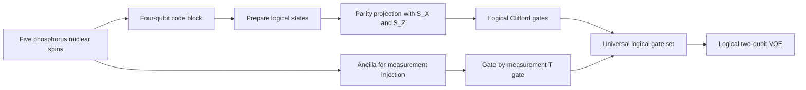

# Silicon Spin Logical Qubits

Chunhui Zhang, Feng Xu, Shihang Zhang, Mingchao Duan, and collaborators, "Universal logical operations in a silicon quantum processor," *Nature Nanotechnology* (2026), https://doi.org/10.1038/s41565-026-02140-1, reports logical-state preparation, a universal logical gate set, magic-state preparation, and a two-logical-qubit VQE demonstration using a phosphorus donor cluster in silicon. The technique centers on implementing the small $[[4,2,2]]$ detection code with nuclear spin qubits.

## Problem & motivation

Silicon spin qubits are attractive because silicon fabrication is industrially mature, isotopically purified $^{28}\mathrm{Si}$ can give long spin coherence times, and donor or quantum-dot approaches can be densely integrated. The challenge is that logical operations require more than isolated high-fidelity physical gates. A platform must prepare encoded states, manipulate them inside a code space, detect leakage out of that code space, and implement a non-Clifford resource for universality.

The $[[4,2,2]]$ code is a compact way to demonstrate many of those ingredients. It encodes two logical qubits into four data qubits with distance 2, detecting but not correcting arbitrary single-qubit errors. A fifth qubit can serve as an ancilla for gate-by-measurement operations. Because the code is small, it is not an algorithm-ready fault-tolerant architecture by itself. Its value is as a minimal logical layer for testing encoding, parity projection, logical Clifford operations, non-Clifford injection, and error-mitigated application circuits.

The paper is therefore a silicon logical-operations milestone. It does not show long-distance error correction, but it moves silicon spin hardware from physical-qubit demonstrations toward encoded logical workflows.

## Method

The $[[4,2,2]]$ detection code used in the paper has stabilizers

$$
S_X=X_1X_2X_3X_4,
\qquad
S_Z=Z_1Z_2Z_3Z_4.
$$

One convenient logical computational basis is

$$
\begin{aligned}
|00\rangle_L &= \frac{|0000\rangle+|1111\rangle}{\sqrt{2}},\\
|01\rangle_L &= \frac{|0011\rangle+|1100\rangle}{\sqrt{2}},\\
|10\rangle_L &= \frac{|0101\rangle+|1010\rangle}{\sqrt{2}},\\
|11\rangle_L &= \frac{|0110\rangle+|1001\rangle}{\sqrt{2}}.
\end{aligned}
$$

Each basis state is in the $+1$ eigenspace of both stabilizers. A single physical $X$ or $Z$ error flips at least one stabilizer parity, so postprocessing can project reconstructed states into the logical subspace.

The logical Pauli operators used in the paper include mappings such as

$$
X_LI_L \leftrightarrow X_1X_3,
\qquad
I_LX_L \leftrightarrow X_1X_2,
$$

and

$$
Z_LI_L \leftrightarrow Z_1Z_2,
\qquad
I_LZ_L \leftrightarrow Z_1Z_3.
$$

The physical system is a donor cluster in isotopically enriched silicon. Five phosphorus nuclear spins implement the logical circuits, while electron-spin-resonance and nuclear-magnetic-resonance controls provide native gates. High-connectivity multiqubit controlled-phase operations are enabled by the shared donor-cluster electron.

The logical Clifford gates are compiled from native physical operations. The non-Clifford logical $T$ gate is implemented by gate-by-measurement using an extra ancillary nuclear spin. The ancilla readout selects whether the target logical qubit receives a $T$ or inverse-$T$ rotation, and postselection is used for the reported process characterization.

## Visual



| Component | Role in the experiment | Reported scale |
|---|---|---|
| Four code qubits | Encode two logical qubits in $[[4,2,2]]$ | Nuclear spins in a donor cluster |
| Fifth nuclear spin | Ancilla for logical $T$ injection | Used in gate-by-measurement circuits |
| Stabilizers | Detect errors through parity projection | $S_X=X_1X_2X_3X_4$, $S_Z=Z_1Z_2Z_3Z_4$ |
| Logical state prep | Prepare $\vert 00\rangle_L$ and Bell-like $\vert +\rangle_L$ states | Postprocessed fidelities $96.5(6)\%$ and $95.5(9)\%$ |
| Logical gates | Clifford plus non-Clifford operations | $T$ process fidelity $82.6(23)\%$ for one postselected branch |
| Application demo | Two-logical-qubit VQE for water active-space model | Ground-state energy near $-74.940(6)$ Ha under stated truncation and mitigation |

## Hyperparameters / system details

The device was fabricated by scanning tunnelling microscopy lithography on a silicon surface, followed by phosphorus donor incorporation and epitaxial overgrowth. The experiment used one donor cluster containing five $^{31}\mathrm{P}$ nuclei in a $^{28}\mathrm{Si}$ lattice. The paper reports hyperfine interactions for the five nuclei ranging from hundreds of kilohertz to hundreds of megahertz, enabling distinct addressability and high-connectivity gates. The average electron spin readout fidelity for the used dot was reported around $81.45\%$.

Logical state preparation used four physical qubits for the code block. Since the system did not perform mid-circuit stabilizer measurements in the same way as a surface-code processor, stabilizer parity projection was applied in postprocessing. After projection onto both $S_X$ and $S_Z$, the reported logical state fidelities were $F_{\vert 00\rangle_L}=96.5(6)\%$ and $F_{\vert +\rangle_L}=95.5(9)\%$, with acceptance ratios around $83.9(13)\%$ and $82.9(17)\%$.

The logical Clifford operations included examples such as $X_LI_L$, $H_LH_L$, $S_LI_L$, and logical CNOT. Reported population transfer fidelities included $88.3(5)\%$ for $X_LI_L$, $88.6(4)\%$ for CNOT, and $75.6(4)\%$ for $H_LH_L$. The $S_LI_L$ process tomography fidelity was $87.0(16)\%$. The logical $T_LI_L$ gate-by-measurement branch conditioned on one ancilla outcome had reported process fidelity $82.6(23)\%$, while the inverse branch was reported at $91.5(24)\%$.

The VQE demonstration used two logical qubits and an active-space Hamiltonian for the water molecule with fixed bond length. The Hamiltonian was written in terms of logical observables:

$$
H=g_0+g_1Z_LI_L+g_2I_LZ_L+g_3Z_LZ_L+g_4X_LX_L+g_5Y_LY_L.
$$

The experiment used parity checks, Clifford fitting, and symmetry verification as error mitigation.

## Headline results

The conservative headline is that the paper demonstrates a universal logical gate set in a silicon donor nuclear-spin processor using the $[[4,2,2]]$ detection code, including logical state preparation, logical Clifford gates, a gate-by-measurement non-Clifford $T$ gate, and magic-state generation.

The VQE demonstration found an optimal water bond angle around $110^\circ$ and a reported ground-state energy of $-74.940(6)$ Ha for the stated active-space and truncation setup, with an average experimental deviation of $22.7$ mHa from the theoretical values after the reported error-mitigation workflow. This should be read as a logical-control demonstration, not as a claim that the device solves quantum chemistry beyond classical methods.

The main limitation is that $[[4,2,2]]$ detects but does not correct arbitrary single-qubit errors, and much of the reported improvement comes through postselection or postprocessing. Scaling to fault-tolerant computation requires larger codes, repeated stabilizer measurement, better readout, and donor-cluster arrays.

## Worked example 1: Verifying a codeword stabilizer

**Problem.** Show that

$$
|10\rangle_L=\frac{|0101\rangle+|1010\rangle}{\sqrt{2}}
$$

is stabilized by $S_Z=Z_1Z_2Z_3Z_4$ and $S_X=X_1X_2X_3X_4$.

**Method.**

1. Apply $S_Z$ to $\vert 0101\rangle$. The bit string has two ones, so the product of $Z$ eigenvalues is

$$
(+1)(-1)(+1)(-1)=+1.
$$

Thus

$$
S_Z|0101\rangle=|0101\rangle.
$$

2. Apply $S_Z$ to $\vert 1010\rangle$:

$$
(-1)(+1)(-1)(+1)=+1,
$$

so

$$
S_Z|1010\rangle=|1010\rangle.
$$

3. By linearity,

$$
S_Z|10\rangle_L=|10\rangle_L.
$$

4. Apply $S_X$ to each computational basis state. It flips all four bits:

$$
S_X|0101\rangle=|1010\rangle,
\qquad
S_X|1010\rangle=|0101\rangle.
$$

5. Therefore

$$
S_X|10\rangle_L
=\frac{|1010\rangle+|0101\rangle}{\sqrt{2}}
=|10\rangle_L.
$$

**Checked answer.** The state is a $+1$ eigenstate of both stabilizers, so it lies in the $[[4,2,2]]$ code space.

## Worked example 2: Evaluating a two-logical-qubit VQE energy

**Problem.** For a toy two-logical-qubit Hamiltonian

$$
H=g_0+g_1Z_LI_L+g_2I_LZ_L+g_3Z_LZ_L+g_4X_LX_L+g_5Y_LY_L,
$$

use coefficients $(-75.0,0.15,-0.05,0.02,0.03,0.01)$ and measured expectations $(0.80,-0.60,-0.50,0.20,-0.10)$ for the five nonidentity observables. Compute the energy.

**Method.**

1. Write the expectation value:

$$
E=g_0+g_1\langle ZI\rangle+g_2\langle IZ\rangle+g_3\langle ZZ\rangle+g_4\langle XX\rangle+g_5\langle YY\rangle.
$$

2. Substitute values:

$$
E=-75.0+0.15(0.80)+(-0.05)(-0.60)+0.02(-0.50)+0.03(0.20)+0.01(-0.10).
$$

3. Compute each term:

$$
0.15(0.80)=0.120,
$$

$$
(-0.05)(-0.60)=0.030,
$$

$$
0.02(-0.50)=-0.010,
$$

$$
0.03(0.20)=0.006,
$$

$$
0.01(-0.10)=-0.001.
$$

4. Add corrections:

$$
0.120+0.030-0.010+0.006-0.001=0.145.
$$

5. Add $g_0$:

$$
E=-75.0+0.145=-74.855.
$$

**Checked answer.** The toy energy is $-74.855$ Ha. The real experiment uses angle-dependent coefficients, repeated measurements, and error mitigation, but the arithmetic follows this same expectation-value structure.

## Connections

- [Quantum error correction](/quantum-information-science/quantum-computing/error-correction) explains stabilizer codes, distance, detection, and logical gates.
- [Quantum hardware](/quantum-information-science/quantum-computing/hardware) covers spin qubits, donor systems, readout, and control.
- [Failure mechanisms of EC gates](/quantum-information-science/quantum-computing/failure-mechanisms-of-ec-gates) gives a superconducting comparison for logical-gate benchmarking.
- [Quantum algorithms](/quantum-information-science/quantum-computing/algorithms) connects the VQE demonstration to hybrid quantum-classical algorithms.
- [Quantum machine learning](/quantum-information-science/quantum-computing/quantum-ml) includes variational-circuit training and error-mitigation cautions.
- [Quantum internet](/quantum-information-science/quantum-internet/) is a neighboring direction for future networked logical processors and spin-photon interfaces.
- [Quantum mechanics](/physics/quantum-mechanics/) supplies the spin, measurement, and tensor-product formalism.

## PyTorch/Qiskit sketch

This dependency-light Python sketch constructs the four $[[4,2,2]]$ logical basis states and checks their stabilizer eigenvalues using state vectors.

```python
import numpy as np

def basis(index, n=4):
    v = np.zeros(2 ** n, dtype=complex)
    v[index] = 1.0
    return v

def bit_index(bits):
    return int(bits, 2)

def codeword(a, b):
    table = {
        (0, 0): ("0000", "1111"),
        (0, 1): ("0011", "1100"),
        (1, 0): ("0101", "1010"),
        (1, 1): ("0110", "1001"),
    }
    u, v = table[(a, b)]
    return (basis(bit_index(u)) + basis(bit_index(v))) / np.sqrt(2)

def apply_zzzz(state):
    out = state.copy()
    for i in range(16):
        ones = bin(i).count("1")
        out[i] *= (-1) ** ones
    return out

def apply_xxxx(state):
    out = np.zeros_like(state)
    for i, amp in enumerate(state):
        flipped = i ^ 0b1111
        out[flipped] += amp
    return out

for label in [(0, 0), (0, 1), (1, 0), (1, 1)]:
    psi = codeword(*label)
    print(label, np.allclose(apply_zzzz(psi), psi), np.allclose(apply_xxxx(psi), psi))
```

## Common pitfalls / reproduction notes

- The $[[4,2,2]]$ code is an error-detecting code, not a full single-error-correcting memory.
- Postprocessed parity projection is not the same as real-time repeated stabilizer correction.
- Logical gate fidelities include state-preparation and measurement contributions unless explicitly subtracted.
- The VQE result is an active-space demonstration with error mitigation, not a quantum advantage claim.
- Donor-cluster high connectivity is useful, but scaling requires precise donor placement and inter-cluster integration.
- A universal logical gate set at distance 2 is an important control milestone, but large-scale FTQC requires concatenation or larger codes.

## Further reading

- D. Gottesman, "The Heisenberg representation of quantum computers," arXiv:quant-ph/9807006.
- S. Bravyi and A. Kitaev, "Universal quantum computation with ideal Clifford gates and noisy ancillas," *Physical Review A* 71, 022316 (2005).
- A. Morello, J. J. Pla, P. Bertet, and D. N. Jamieson, "Donor spins in silicon for quantum technologies," *Advanced Quantum Technologies* 3, 2000005 (2020).
- K. Takeda et al., "Quantum error correction with silicon spin qubits," *Nature* 608, 682-686 (2022).
- S. McArdle et al., "Quantum computational chemistry," *Reviews of Modern Physics* 92, 015003 (2020).
