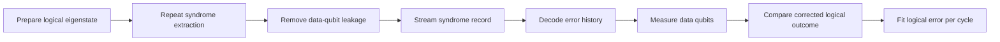

# Willow Surface Code Below Threshold

Google Quantum AI and Collaborators, "Quantum error correction below the surface code threshold," *Nature* 638, 920-926 (published online 2024; print volume 2025), https://doi.org/10.1038/s41586-024-08449-y, reports surface-code memories on the superconducting Willow processors. The page is about the technique and system result: a ZXXZ-style rotated surface-code memory whose logical error per cycle decreases as distance increases, including a distance-7 memory with real device data and a separate distance-5 memory coupled to a real-time decoder.

## Problem & motivation

The central scaling promise of [quantum error correction](/quantum-information-science/quantum-computing/error-correction) is not merely that one can detect errors. It is that, below a threshold, increasing the code distance suppresses logical failure faster than it adds new physical fault locations. Before this experiment, several platforms had demonstrated repeated syndrome extraction, logical memories, or break-even behavior, but the hard benchmark for a two-dimensional superconducting surface code was to show the distance trend itself on one hardware generation.

For the surface code, the idealized story is simple: a logical operator must cross the code patch, so a distance-$d$ code needs at least $(d+1)/2$ independent faults to fail under a matching decoder. The practical story is harder. Real transmons leak out of the computational subspace, idle during measurement, couple parasitically, drift over hours, and produce syndrome data faster than many classical decoders can process. A below-threshold result therefore has to combine hardware, calibration, leakage management, syndrome extraction, and decoding into one system benchmark.

The Willow result is best read as a memory-system demonstration, not as a full logical processor. It does not yet show a universal set of fault-tolerant logical gates, nor does it make large algorithms inexpensive. Its importance is narrower and more concrete: in the tested regime, the larger distance-7 surface-code memory had a smaller fitted logical error per cycle than smaller distance-3 and distance-5 patches, and the distance-5 setup could be decoded in real time with below-threshold scaling preserved.

## Method

The surface code encodes one logical qubit into a two-dimensional patch of data and measurement qubits. In a rotated distance-$d$ layout, the data qubits form a $d \times d$ array, while neighboring measurement qubits repeatedly extract parity checks. For the ZXXZ surface-code variant used in this line of work, stabilizers are locally equivalent to surface-code checks but chosen to better match biased or correlated noise in the processor.

The asymptotic scaling is often summarized by

$$
\epsilon_L(d) \approx A \left(\frac{p}{p_{\mathrm{thr}}}\right)^{(d+1)/2},
$$

where $p$ is a physical error proxy, $p_{\mathrm{thr}}$ is the threshold, $A$ collects constants and boundary effects, and $\epsilon_L(d)$ is the logical error per cycle. The paper reports an error-suppression factor

$$
\Lambda_{d,d+2}=\frac{\epsilon_L(d)}{\epsilon_L(d+2)}.
$$

Below threshold, $\Lambda_{d,d+2}\gt 1$; the larger code is better. The Willow distance-7 memory used $49$ data qubits, $48$ measurement qubits, and $4$ additional leakage-removal qubits. The usual rotated-code count $2d^2-1$ gives $97$ qubits for distance $7$ before the leakage-removal additions, and the reported memory therefore used $101$ qubits in the code experiment on a 105-qubit processor.

Each memory experiment has the same high-level loop. First, prepare data qubits in a product state corresponding to a logical $X_L$ or $Z_L$ eigenstate. Second, repeat syndrome-extraction cycles. Third, remove leakage from data qubits with data-qubit leakage removal, abbreviated DQLR, so that population in higher transmon levels does not persist. Fourth, measure the data qubits and let the decoder infer whether the logical outcome matches the prepared logical state.

No physical correction has to be applied during a memory experiment. A Pauli frame can be updated in software: the decoder maps the syndrome history to a correction class, and the final logical measurement is reinterpreted accordingly. That distinction matters for experiments because a strong memory result can be obtained before the hardware supports every form of low-latency feedback required by a universal logical processor.

## Visual



| Quantity | Distance 5 real-time run | Distance 7 memory run | Why it matters |
|---|---:|---:|---|
| Processor family | Willow superconducting | Willow superconducting | Same architecture family for scaling comparison |
| Main code role | Real-time decoded memory | Largest below-threshold memory | Separates latency and distance-scaling questions |
| Physical qubits in code | 72-qubit processor context | 49 data, 48 measure, 4 leakage-removal | Shows overhead of one logical memory |
| Cycle time | $1.1\,\mu\mathrm{s}$ | Same order in the Willow system | Sets decoder-throughput requirement |
| Decoder result | Average latency about $63\,\mu\mathrm{s}$ up to $10^6$ cycles | Offline neural-network and matching-synthesis decoders | Shows accuracy and timing trade-offs |
| Headline logical error | $\epsilon_5 \approx 0.35\%$ with real-time decoding | $\epsilon_7=(1.43\pm0.03)\times 10^{-3}$ with neural-network decoding | Conservative benchmark under stated conditions |

## Hyperparameters / system details

The distance-7 memory was implemented on a 105-qubit Willow processor. Its code layout used $49$ data qubits, $48$ measurement qubits, and $4$ leakage-removal qubits. The paper reports mean coherence times around $T_1=68\,\mu\mathrm{s}$ and $T_{2,\mathrm{CPMG}}=89\,\mu\mathrm{s}$ for that device generation, with logical experiments run for up to 250 cycles in the distance-scaling analysis.

The measured bulk detection probabilities for the surface-code data were reported as about $7.7\%$, $8.5\%$, and $8.7\%$ for distances $3$, $5$, and $7$. Detection probability is not a logical error rate; it is a syndrome-level error proxy. It is useful because it summarizes how often local parity comparisons fire, but it can miss the difference between uncorrelated faults and correlated leakage or crosstalk.

Two high-accuracy offline decoders were used for the distance-7 analysis: a neural-network decoder fine-tuned with processor data, and an ensemble of correlated minimum-weight perfect-matching decoders with matching synthesis. The real-time distance-5 demonstration used a streaming sparse-blossom-style matching decoder. The paper reports that the real-time decoder had lower accuracy than the offline neural-network decoder, which is expected because it was constrained by low latency.

The experiment also ran long repetition codes, up to distance $29$, to expose rare correlated events at very low error rates. Those experiments are important because a surface code can look healthy at small distances while rare correlated bursts create a logical error floor at larger scales.

## Headline results

The conservative headline is: under the reported Willow operating conditions and decoder choices, the surface-code logical error per cycle decreased when the code distance increased. With neural-network decoding, the paper reports an average error-suppression factor $\Lambda=2.14\pm0.02$ when increasing distance by two, and a distance-7 logical error per cycle of $(1.43\pm0.03)\times10^{-3}$.

The distance-7 logical memory was also reported beyond break-even relative to its best constituent physical qubit under the paper's lifetime metric: the logical lifetime was $291\pm6\,\mu\mathrm{s}$, compared with a best physical-qubit lifetime of $119\pm13\,\mu\mathrm{s}$, giving a factor of $2.4\pm0.3$. That comparison is meaningful but subtle because physical and logical noise channels are not identical.

For real-time decoding, the distance-5 memory maintained below-threshold behavior with a reported real-time logical error per cycle of about $0.35\%\pm0.01\%$ and $\Lambda=2.0\pm0.1$, while the offline neural-network decoder on the same style of data reached about $0.269\%\pm0.008\%$ and $\Lambda=2.18\pm0.09$. The result is therefore a system milestone, not a claim that real-time decoding is already solved for arbitrarily large codes.

## Worked example 1: Counting the distance-7 memory qubits

**Problem.** Check why a distance-7 rotated surface-code memory needs $97$ qubits before leakage-removal additions, and why the reported Willow experiment used $101$ code-related qubits.

**Method.**

1. Use the rotated surface-code count:

$$
N_{\mathrm{surface}}=2d^2-1.
$$

2. Substitute $d=7$:

$$
N_{\mathrm{surface}}=2(7^2)-1=2(49)-1=98-1=97.
$$

3. Split this into data and measurement qubits. The data patch has

$$
N_{\mathrm{data}}=d^2=49.
$$

The remaining qubits are measurement qubits:

$$
N_{\mathrm{measure}}=97-49=48.
$$

4. Add the reported leakage-removal qubits:

$$
N_{\mathrm{total}}=49+48+4=101.
$$

**Checked answer.** The code memory uses $49$ data qubits, $48$ measurement qubits, and $4$ extra leakage-removal qubits, for $101$ code-related qubits on a 105-qubit processor. The arithmetic also shows why adding distance is expensive: the physical footprint grows approximately as $2d^2$ per logical memory.

## Worked example 2: Estimating survival from a per-cycle logical error

**Problem.** Suppose a distance-7 logical memory has independent per-cycle logical error probability $\epsilon_L=1.43\times10^{-3}$. Estimate the probability of at least one logical failure over $250$ cycles under the simplifying independent-cycle model.

**Method.**

1. The probability of no failure in one cycle is

$$
1-\epsilon_L=1-0.00143=0.99857.
$$

2. Under the independent-cycle approximation, the probability of no failure over $250$ cycles is

$$
P_{\mathrm{survive}}=(0.99857)^{250}.
$$

3. Use $\ln(1-x)\approx -x$ for small $x$:

$$
\ln P_{\mathrm{survive}}=250\ln(0.99857)\approx 250(-0.001431)=-0.35775.
$$

4. Exponentiate:

$$
P_{\mathrm{survive}}\approx e^{-0.35775}\approx 0.699.
$$

5. The probability of at least one logical failure is

$$
P_{\mathrm{fail}}\approx 1-0.699=0.301.
$$

**Checked answer.** The simple independent-cycle model gives about $30\%$ failure over $250$ cycles. This is only a back-of-the-envelope translation of the fitted per-cycle rate; the paper's analysis fits logical error probabilities over experiment duration and decoder outputs, so this calculation should not be used as a replacement for the reported fit.

## Connections

- [Quantum error correction](/quantum-information-science/quantum-computing/error-correction) gives the stabilizer-code and threshold background.
- [Quantum hardware](/quantum-information-science/quantum-computing/hardware) explains superconducting qubits, gates, readout, leakage, and coherence.
- [Concatenated bosonic cat qubits](/quantum-information-science/quantum-computing/concatenated-bosonic-cat-qubits) compares surface-code overhead against biased bosonic encodings.
- [GKP qudit error correction](/quantum-information-science/quantum-computing/gkp-qudit-error-correction) is another bosonic route to break-even memories.
- [Quantum decoder circuit](/quantum-information-science/quantum-computing/quantum-decoder-circuit) addresses the same real-time decoding bottleneck from a different angle.
- [Failure mechanisms of EC gates](/quantum-information-science/quantum-computing/failure-mechanisms-of-ec-gates) connects memory errors to logical-gate stability.
- [Quantum internet](/quantum-information-science/quantum-internet/) is a neighboring area where logical memories and entanglement distribution eventually meet.
- [Quantum mechanics](/physics/quantum-mechanics/) supplies the Hilbert-space and measurement language behind all of these pages.

## PyTorch/Qiskit sketch

This toy code is not a surface-code simulator. It models the scaling law and lets you vary the suppression factor to see how much distance matters.

```python
import math

def logical_error_from_reference(eps_ref, d_ref, d, suppression_per_two):
    """Scale a logical error rate between odd code distances."""
    steps = (d - d_ref) // 2
    return eps_ref / (suppression_per_two ** steps)

eps7 = 1.43e-3
suppression = 2.14

for d in [7, 9, 11, 13]:
    eps = logical_error_from_reference(eps7, 7, d, suppression)
    survival_1000 = (1.0 - eps) ** 1000
    print(f"d={d:2d} eps_per_cycle={eps:.3e} survival_1000={survival_1000:.3f}")

target = 1e-6
d = 7
eps = eps7
while eps > target:
    d += 2
    eps /= suppression

print(f"first odd distance below {target:g} in this extrapolation: d={d}")
```

## Common pitfalls / reproduction notes

- Do not equate below-threshold memory with a complete fault-tolerant computer. Logical gates, routing, magic-state preparation, and large-scale control remain separate requirements.
- Do not compare logical and physical lifetimes without checking the metric. A physical $T_1$ experiment and a decoded logical memory channel are different noise processes.
- Detection probability is a proxy, not a full noise model. Correlated leakage or bursts can be more damaging than their contribution to local detection rates suggests.
- The real-time decoder result is distance-5, not distance-7. The distance-7 benchmark used high-accuracy offline decoders.
- A suppression factor measured from small distances should not be extrapolated blindly. The paper itself reports rare correlated events in long repetition-code experiments.
- The code footprint is quadratic in distance. A better logical error rate is purchased with many more physical qubits and much more syndrome bandwidth.

## Further reading

- A. G. Fowler, M. Mariantoni, J. M. Martinis, and A. N. Cleland, "Surface codes: Towards practical large-scale quantum computation," *Physical Review A* 86, 032324 (2012).
- C. Horsman, A. G. Fowler, S. Devitt, and R. Van Meter, "Surface code quantum computing by lattice surgery," *New Journal of Physics* 14, 123011 (2012).
- Google Quantum AI, "Suppressing quantum errors by scaling a surface code logical qubit," *Nature* 614, 676-681 (2023).
- O. Higgott and C. Gidney, "Sparse blossom: correcting a million errors per core second with minimum-weight matching," arXiv:2303.15933.
- K. C. Miao et al., "Overcoming leakage in quantum error correction," *Nature Physics* 19, 1780-1786 (2023).
