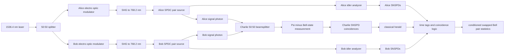

# Entanglement Swapping with Time-Bin Telecom Qubits (Davis et al., 2025)

Davis et al. (2025, arXiv:2503.18906) demonstrate conditional [entanglement swapping](/quantum-information-science/quantum-internet/entanglement) between time-bin photonic qubits at the telecom wavelength of 1536.4 nm. The experiment is best read as a technique page rather than only a paper summary: it shows how a deployable, modular, fiber-coupled system can prepare entangled photon pairs, interfere one photon from each pair in a Bell-state measurement, and herald entanglement between the two remaining photons that never interacted.

The motivation is practical quantum networking. A [quantum repeater](/quantum-information-science/quantum-internet/quantum-repeater) needs high-quality elementary entanglement, Bell-state measurements, detectors, synchronization, and classical heralding that can plausibly leave an optics table and become network hardware. Time-bin qubits at telecom wavelengths fit fiber infrastructure; electro-optic modulators, PPLN waveguides, filters, SNSPDs, and time-tagging electronics are closer to deployable components than delicate free-space laboratory assemblies. The paper reports an average swapped-state fidelity near 87% under its measurement conditions and uses directly measured time- and phase-basis error rates to estimate a source-independent QKD secret fraction of about 0.5 bits per sifted bit.

## Definitions

A **time-bin qubit** stores the logical basis in arrival time rather than polarization or spatial path:

$$
\lvert\psi\rangle=\alpha\lvert\text{early}\rangle+\beta\lvert\text{late}\rangle,\qquad
\lvert\alpha\rvert^2+\lvert\beta\rvert^2=1.
$$

This encoding is attractive in fiber because both logical states use the same spatial mode and optical polarization if the experiment is well controlled. That reduces unwanted mode-dependent transformations. It also makes the qubit naturally compatible with interferometric phase-basis measurements: an unbalanced interferometer delays the early component along one arm so it overlaps the late component from the other arm, converting relative phase into detector-port statistics.

In the Davis et al. system, each source begins with a continuous-wave laser at 1536.4 nm. Lithium-niobate electro-optic intensity modulators, driven by an arbitrary waveform generator, carve pairs of optical pulses separated by 346 ps at a 200 MHz repetition rate. The pulses are amplified, upconverted to 768.2 nm by second-harmonic generation in periodically poled lithium niobate, and used to pump type-II spontaneous parametric down-conversion. After filtering, each source ideally produces an entangled time-bin pair close to

$$
\lvert\Phi^+\rangle
=\frac{\lvert ee\rangle+\lvert \ell\ell\rangle}{\sqrt{2}},
$$

where $e$ and $\ell$ denote early and late time bins. One photon from Alice's pair and one photon from Bob's pair are sent to Charlie. The remaining idler photons stay at Alice and Bob for analysis of the heralded swapped state.

A **Bell-state measurement** (BSM) is the middle operation. Charlie interferes Alice's and Bob's signal photons on a 50:50 beamsplitter after spectral filtering and timing alignment. A coincidence pattern in different output ports and appropriate time bins projects the two signal photons onto the antisymmetric Bell state

$$
\lvert\Psi^-\rangle
=\frac{\lvert e\ell\rangle-\lvert \ell e\rangle}{\sqrt{2}}.
$$

Conditioned on that heralding event, the idler photons at Alice and Bob are projected into a Bell state up to the experiment's phase convention. This is why entanglement swapping is often described as "teleportation of entanglement": the middle measurement consumes the two photons that met at Charlie and transfers entanglement to the remote photons.

Superconducting nanowire single-photon detectors (SNSPDs) are essential here because the detector timing must resolve the time-bin structure. The paper reports six SNSPD channels in a rack-mount cryogenic system operating at 2.5 K, with detection efficiencies in the 89-93% range, dark counts of 60-135 Hz, timing jitter of 38-59 ps, and dead times around 30 ns. Since the bin spacing is 346 ps, tens-of-picoseconds timing jitter is small enough to identify early, middle, and late detection windows with usable separation.

The modeling is not just curve fitting. The sources are SPDC sources, so multi-pair emission matters even when the mean photon number is small. Davis et al. use a Gaussian characteristic-function model. A two-mode squeezed vacuum source has a Gaussian characteristic function; beamsplitters, phase shifters, loss, and interferometers act as symplectic transformations on covariance matrices; threshold detector POVMs can also be handled in the same phase-space framework. In outline,

$$
\chi(\xi)=\exp\left(-\frac{1}{4}\xi^T\Gamma\xi-i d^T\xi\right),
$$

where $\Gamma$ is a covariance matrix and $d$ is a displacement vector. The experiment maps the input covariance matrix through linear optical transformations, then computes coincidence probabilities for SNSPD threshold detections. This lets the model include loss, partial photon distinguishability, dark counts, imperfect interferometers, and undesired photon-number components without truncating to a hand-written few-photon basis at every step.

## Key results

The central result is conditional entanglement swapping with telecom-band time-bin qubits using mostly modular, fiber-coupled, electrically controlled hardware. The reported wavelength is 1536.4 nm, inside the telecom band relevant to fiber networks and near wavelengths of interest for erbium-based emitters, memories, and transducers. The system used a 346 ps time-bin separation, a 200 MHz clock, PPLN nonlinear waveguides, electro-optic intensity modulators, narrowband optical filters, Michelson interferometers for phase-basis measurements, SNSPDs, and a time-to-digital converter controlled by custom acquisition software.

Before swapping, the individual entangled pair sources were characterized with phase-basis visibility measurements. The paper reports average source entanglement visibilities of 94.7% for Alice's source and 95.1% for Bob's source, corresponding through $F=(3V+1)/4$ to source fidelities near 96% with respect to the intended Bell state. The HOM interference test at Charlie measured how indistinguishable the signal photons were at the BSM beamsplitter. The fourfold HOM visibility was 86.7%, which the authors interpret through their model as high photon indistinguishability in the heralded configuration.

For the swap itself, Alice's and Bob's idler photons were measured in interferometers while conditioning on Charlie's successful Bell-state measurement. The average swapping visibility was reported as

$$
V_{\mathrm{swap}}=83.1\%\pm 5.5\%.
$$

Using the same Bell-state visibility-to-fidelity relation gives

$$
F_{\mathrm{swap}}=\frac{3V_{\mathrm{swap}}+1}{4}=87.3\%\pm 4.1\%,
$$

with respect to the target swapped Bell state under the paper's phase convention. This is above the nonclassical 50% Bell-fidelity threshold and above the approximate 78% fidelity associated with CHSH-inequality violation in the discussion, but it is still far from the very high fidelities needed for distributed quantum computing. The paper also notes that previous photonic time-bin swapping demonstrations had reached average fidelities up to about 83%, so this system improves the reported fidelity while emphasizing deployability.

The source-independent QKD analysis should be read carefully. The paper cites a fidelity threshold around 89% for some entanglement-based or source-independent QKD settings, while the measured swapped fidelity is 87.3% with uncertainty. Rather than claiming a universal security guarantee from that single fidelity number, the experiment directly measures time- and phase-basis error rates for its source-independent QKD configuration. With $e_t=0.011\pm0.011$, $e_p=0.079\pm0.020$, and error-correction efficiency $f=1.22$, the Koashi-Preskill-style secret fraction calculation gives an estimated nonzero rate close to $0.50$ bits per sifted bit under the paper's assumptions.

The current system is not a fast repeater node yet. The reported swapping rate was about 0.01 Hz at a 200 MHz clock. The authors identify loss, coupling efficiency, finite photon indistinguishability, multi-photon emission, and interferometric stability as the main bottlenecks. Their model predicts that, for the same broad architecture, completely indistinguishable photons could raise the swapping fidelity to about 97% under the characterized experimental parameters. They also discuss improvements from lower-loss packaging, WDM filters instead of lossy tunable filters, integrated thin-film lithium niobate, faster-recovery SNSPDs, smaller time-bin separation, higher clock rates, multiplexing, and better spectral control.

## Visual



| Quantity | Reported value or role | Why it matters |
|---|---:|---|
| Photon wavelength | 1536.4 nm | Telecom-band operation for fiber quantum networking |
| Time-bin separation | 346 ps | Large compared with 38-59 ps SNSPD jitter |
| Clock rate | 200 MHz | Sets attempt rate in this implementation |
| Source mean photon numbers for swapping | about $4.7\times10^{-3}$ and $4.2\times10^{-3}$ per bin | Balances pair rate against multi-pair errors |
| Source entanglement fidelities | about 96% | Input links must be high quality before swapping |
| Swap visibility | $83.1\%\pm5.5\%$ | Phase-basis contrast of the heralded remote pair |
| Swap fidelity | $87.3\%\pm4.1\%$ | Bell-state fidelity under the reported phase convention |
| QKD error rates | $e_t=0.011$, $e_p=0.079$ | Inputs to the source-independent QKD secret fraction |
| Secret fraction estimate | about 0.5 bits per sifted bit | Conditional on the paper's model and measured errors |
| Reported swap rate | about 0.01 Hz | Shows deployability but also the remaining rate bottleneck |

## Worked example 1: Bell-state projection in time-bin swapping

**Problem.** Suppose Alice's idler $A$ and signal $C$ are in $\lvert\Phi^+\rangle_{AC}$, and Bob's signal $D$ and idler $B$ are in $\lvert\Phi^+\rangle_{DB}$. Charlie performs a BSM on $C,D$ and obtains $\lvert\Psi^-\rangle_{CD}$. What state is heralded on the remote idlers $A,B$?

**Method.**

1. Write the two input Bell pairs:

$$
\lvert\Phi^+\rangle_{AC}\lvert\Phi^+\rangle_{DB}
=\frac{1}{2}
(\lvert e_Ae_Ce_D e_B\rangle
+\lvert e_Ae_C\ell_D\ell_B\rangle
+\lvert \ell_A\ell_Ce_D e_B\rangle
+\lvert \ell_A\ell_C\ell_D\ell_B\rangle).
$$

2. Write Charlie's projection bra:

$$
{}_{CD}\langle\Psi^-|
=\frac{{}_{CD}\langle e\ell|-{}_{CD}\langle \ell e|}{\sqrt{2}}.
$$

3. Apply the projection to the $C,D$ systems. Only two terms survive: the term with $C=e,D=\ell$ and the term with $C=\ell,D=e$:

$$
{}_{CD}\langle\Psi^-|
\lvert\Phi^+\rangle_{AC}\lvert\Phi^+\rangle_{DB}
=\frac{1}{2\sqrt{2}}
(\lvert e_A\ell_B\rangle-\lvert \ell_Ae_B\rangle).
$$

4. Normalize the remote state. The squared norm is

$$
\left\|\frac{1}{2\sqrt{2}}
(\lvert e\ell\rangle-\lvert \ell e\rangle)\right\|^2
=\frac{1}{8}(1+1)=\frac{1}{4}.
$$

Dividing by $\sqrt{1/4}=1/2$ gives

$$
\lvert\Psi^-\rangle_{AB}
=\frac{\lvert e_A\ell_B\rangle-\lvert \ell_Ae_B\rangle}{\sqrt{2}}.
$$

5. Connect this ideal identity to the measured visibility. If the experiment reports $V_{\mathrm{swap}}=0.831$, then the Bell-state fidelity estimate used in the paper is

$$
F_{\mathrm{swap}}=\frac{3V_{\mathrm{swap}}+1}{4}
=\frac{3(0.831)+1}{4}
=0.87325.
$$

**Checked answer.** In the ideal convention used above, a $\Psi^-$ BSM on the two signal photons heralds $\lvert\Psi^-\rangle$ on the remote idlers. The measured visibility $0.831$ corresponds to a fidelity of about $0.873$, matching the reported 87.3% value up to rounding and uncertainty.

## Worked example 2: Secret fraction from measured QKD errors

**Problem.** Use the paper's measured source-independent QKD error rates $e_t=0.011$ and $e_p=0.079$, with error-correction efficiency $f=1.22$, to compute the secret fraction per sifted bit:

$$
\frac{R}{R_s}=1-fH_2(e_t)-H_2(e_p),
$$

where

$$
H_2(x)=-x\log_2 x-(1-x)\log_2(1-x).
$$

**Method.**

1. Compute the time-basis entropy:

$$
\begin{aligned}
H_2(0.011)
&=-0.011\log_2(0.011)-0.989\log_2(0.989)\\
&\approx 0.0874.
\end{aligned}
$$

2. Apply the error-correction efficiency to the time-basis term:

$$
fH_2(e_t)=1.22(0.0874)\approx0.1066.
$$

3. Compute the phase-basis entropy:

$$
\begin{aligned}
H_2(0.079)
&=-0.079\log_2(0.079)-0.921\log_2(0.921)\\
&\approx0.3985.
\end{aligned}
$$

4. Substitute into the secret fraction formula:

$$
\frac{R}{R_s}
=1-0.1066-0.3985
=0.4949.
$$

5. Round to the precision appropriate for experimental error bars:

$$
\frac{R}{R_s}\approx0.50\ \text{bits per sifted bit}.
$$

**Checked answer.** The measured errors give a secret fraction of about $0.50$ bits per sifted bit, consistent with the paper's reported estimate. This is conditional on the source-independent QKD assumptions and does not mean the raw optical swap rate is 0.5 bits/s; it is a fraction of sifted heralded events.

## Code

```python
import numpy as np

def binary_entropy(x):
    x = np.asarray(x, dtype=float)
    out = np.zeros_like(x)
    mask = (x > 0.0) & (x < 1.0)
    out[mask] = -x[mask] * np.log2(x[mask]) - (1.0 - x[mask]) * np.log2(1.0 - x[mask])
    return out

def visibility_from_counts(c_max, c_min):
    c_max = float(c_max)
    c_min = float(c_min)
    return (c_max - c_min) / (c_max + c_min)

def bell_fidelity_from_visibility(visibility):
    return (3.0 * visibility + 1.0) / 4.0

def secret_fraction(e_time, e_phase, f_ec=1.22):
    return 1.0 - f_ec * binary_entropy(e_time) - binary_entropy(e_phase)

# Davis et al. reported average swapping visibility and QKD error rates.
v_swap = 0.831
f_swap = bell_fidelity_from_visibility(v_swap)

e_t = 0.011
e_p = 0.079
qkd_fraction = secret_fraction(e_t, e_p)

print(f"swap fidelity estimate = {f_swap:.4f}")
print(f"secret fraction        = {float(qkd_fraction):.4f} bits per sifted bit")

# Example: recover a visibility from idealized fitted extrema.
example_v = visibility_from_counts(c_max=70, c_min=6.5)
print(f"example visibility     = {example_v:.4f}")
print(f"example fidelity       = {bell_fidelity_from_visibility(example_v):.4f}")
```

## Common pitfalls

- Confusing telecom wavelength with automatic network readiness. The wavelength is fiber-friendly, but a usable repeater node still needs low loss, synchronization, routing logic, and eventually memory or multiplexed architectures.
- Treating the BSM as deterministic. A linear-optical Bell-state measurement only heralds selected outcomes, and the experiment conditions its swapped-state analysis on those coincidence patterns.
- Ignoring indistinguishability at Charlie. The signal photons must match in arrival time, spectrum, polarization, and spatial mode; otherwise HOM interference degrades and the swapped fidelity drops.
- Reading the 87% fidelity as a universal QKD security statement. The paper's QKD estimate comes from measured time- and phase-basis error rates under a specified source-independent model.
- Forgetting multi-pair SPDC errors. Increasing pump power raises count rates but also increases unwanted higher-photon-number events that lower visibility.
- Overlooking detector dead time and timing windows. The SNSPD timing jitter is much smaller than 346 ps, but dead time, thresholding, time-tag resolution, and coincidence-window choices still affect rates and accidentals.
- Assuming phase-basis measurements are as easy as time-basis measurements. The phase basis depends on interferometer stability, path matching, and calibrated phase offsets.
- Using the characteristic-function model as a black box. It is powerful because the optical network is Gaussian up to threshold detection, but the physical parameters still have to be measured and inserted correctly.
- Comparing rates without conditioning. "Bits per sifted bit" is not the same as bits per second; the reported optical swapping rate is much lower than the secret fraction.

## Connections

- [Entanglement as a Network Resource](/quantum-information-science/quantum-internet/entanglement) for Bell states, fidelity, monogamy, and resource conversion.
- [Quantum Teleportation](/quantum-information-science/quantum-internet/teleportation) because entanglement swapping is teleportation applied to one half of an entangled pair.
- [Quantum Repeater](/quantum-information-science/quantum-internet/quantum-repeater) because conditional swapping is the elementary link-extension operation in repeater architectures.
- [Quantum Key Distribution](/quantum-information-science/quantum-communication/qkd) for how measured quantum correlations become secret-key material.
- Further reading: the DLCZ protocol connects entanglement generation, atomic ensembles, and repeaters; photonic repeater proposals study how graph states, multiplexing, and feedforward can reduce memory demands; Pan Jianwei's satellite quantum communication work shows a complementary free-space route for distributing entanglement and keys over long baselines.
