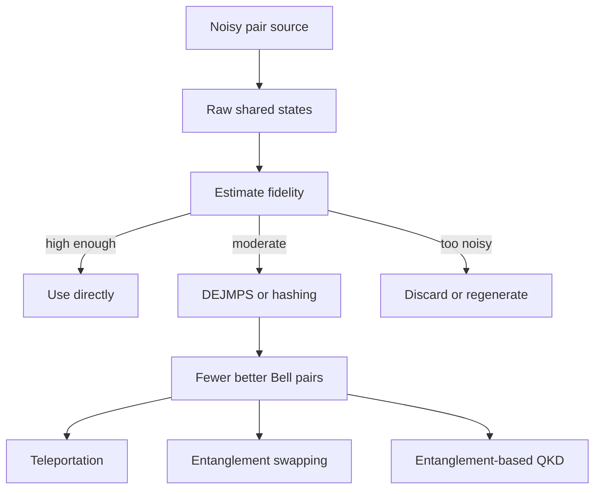

# Entanglement (Network Layer)

Entanglement is the native currency of a quantum internet. A classical network treats a link as a pipe for bits. A quantum network treats a link as a way to create nonclassical correlations between distant systems, then spends those correlations on teleportation, key generation, distributed gates, or sensing. The simplest useful unit is a Bell pair, but real networks must track multipartite states, noisy mixed states, conversion rates, and the operations allowed when parties are separated.

This page focuses on entanglement as a **network resource** rather than only as a paradox of quantum mechanics. The key questions are operational: how many high-quality pairs can a link deliver, how quickly can noisy pairs be distilled, how does multipartite entanglement differ from many pairwise links, and what can be done using only local operations and classical communication?

## Definitions

For two qubits, use the computational basis ordered as

$$
\lvert 00\rangle,\ \lvert 01\rangle,\ \lvert 10\rangle,\ \lvert 11\rangle.
$$

The four Bell states are

$$
\begin{aligned}
\lvert\Phi^+\rangle &= \frac{\lvert 00\rangle+\lvert 11\rangle}{\sqrt{2}}
= \frac{1}{\sqrt{2}}\begin{bmatrix}1\\0\\0\\1\end{bmatrix},\\
\lvert\Phi^-\rangle &= \frac{\lvert 00\rangle-\lvert 11\rangle}{\sqrt{2}}
= \frac{1}{\sqrt{2}}\begin{bmatrix}1\\0\\0\\-1\end{bmatrix},\\
\lvert\Psi^+\rangle &= \frac{\lvert 01\rangle+\lvert 10\rangle}{\sqrt{2}}
= \frac{1}{\sqrt{2}}\begin{bmatrix}0\\1\\1\\0\end{bmatrix},\\
\lvert\Psi^-\rangle &= \frac{\lvert 01\rangle-\lvert 10\rangle}{\sqrt{2}}
= \frac{1}{\sqrt{2}}\begin{bmatrix}0\\1\\-1\\0\end{bmatrix}.
\end{aligned}
$$

They form an orthonormal basis for two-qubit states. Network protocols often aim to deliver $\lvert\Phi^+\rangle$; the other Bell states differ by local Pauli operations.

A pure bipartite state $\lvert\psi\rangle_{AB}$ is **separable** if it can be written as $\lvert a\rangle_A\otimes\lvert b\rangle_B$. It is **entangled** if no such product factorization exists. A mixed state $\rho_{AB}$ is separable if it can be written as a convex mixture of product states,

$$
\rho_{AB}=\sum_i p_i\,\rho_A^{(i)}\otimes\rho_B^{(i)},\qquad p_i\ge 0,\quad \sum_i p_i=1.
$$

Otherwise it is entangled.

The **Schmidt decomposition** states that every pure bipartite state has the form

$$
\lvert\psi\rangle_{AB}=\sum_{k=1}^r \lambda_k \lvert u_k\rangle_A\lvert v_k\rangle_B,
$$

where $\lambda_k\gt 0$, $\sum_k \lambda_k^2=1$, and the local Schmidt vectors are orthonormal. The Schmidt rank $r$ is 1 exactly for product states. For two qubits, $r=2$ indicates pure-state entanglement.

The reduced state of subsystem $A$ is

$$
\rho_A=\mathrm{Tr}_B(\rho_{AB}).
$$

For a pure state, the **entanglement entropy** is

$$
S(\rho_A)=-\mathrm{Tr}(\rho_A\log\rho_A).
$$

Using $\log_2$ gives entropy in ebits. In the Schmidt basis, the eigenvalues of $\rho_A$ are $\lambda_k^2$, so

$$
S(\rho_A)=-\sum_k \lambda_k^2\log_2(\lambda_k^2).
$$

Important multipartite states include the three-qubit GHZ state

$$
\lvert\mathrm{GHZ}\rangle=\frac{\lvert 000\rangle+\lvert 111\rangle}{\sqrt{2}},
$$

and the three-qubit W state

$$
\lvert W\rangle=\frac{\lvert 001\rangle+\lvert 010\rangle+\lvert 100\rangle}{\sqrt{3}}.
$$

They are not interchangeable resources. GHZ entanglement is highly global: if one qubit is measured in the computational basis, the remaining two are left in a product state. W entanglement is more robust to losing one qubit: tracing out one subsystem can leave the other two still entangled.

**LOCC** means local operations and classical communication. Alice, Bob, and other nodes may perform arbitrary quantum operations on systems they locally hold, and they may exchange classical messages. They may not apply a joint quantum gate across separated laboratories unless a quantum channel or previously shared entanglement supplies the missing nonlocal resource.

## Key results

For pure bipartite states, Schmidt coefficients completely characterize entanglement up to local unitaries. If two states have the same Schmidt coefficients, Alice and Bob can convert one to the other by local basis changes. For example,

$$
\frac{\lvert 00\rangle+\lvert 11\rangle}{\sqrt{2}}
$$

and

$$
\frac{\lvert +-\rangle+\lvert -+\rangle}{\sqrt{2}}
$$

are equally entangled; they simply use different local bases.

For pure states, many entanglement tasks have clean asymptotic rates. If Alice and Bob share many copies of $\lvert\psi\rangle_{AB}$, they can distill about $nS(\rho_A)$ Bell pairs from $n$ copies by LOCC in the large-$n$ limit. Conversely, they can prepare about $n$ copies of $\lvert\psi\rangle$ from $nS(\rho_A)$ Bell pairs. Thus pure-state entanglement entropy is both the distillable entanglement and the entanglement cost.

Mixed states are harder. The **distillable entanglement** $E_D$ is the asymptotic rate at which high-fidelity Bell pairs can be extracted from noisy shared states using LOCC. The **entanglement cost** $E_C$ is the asymptotic Bell-pair rate needed to create the state using LOCC. In general,

$$
E_D(\rho)\le E_C(\rho),
$$

and there are bound entangled states for which entanglement is present but no Bell pairs can be distilled by LOCC.

LOCC cannot create entanglement from scratch. This is why entanglement is a resource: if separated parties start with a separable state, any LOCC protocol leaves them with a separable state on average. Classical messages can coordinate choices and postselection, but they cannot replace a quantum channel or shared entanglement.

Monogamy limits how widely strong entanglement can be shared. For three qubits, a common statement uses concurrence:

$$
C^2_{A\mid BC}\ge C^2_{AB}+C^2_{AC}.
$$

If $A$ is maximally entangled with $B$, it cannot also be maximally entangled with $C$. Network protocols rely on this. A Bell pair used for teleportation cannot remain available for another independent teleportation, and security protocols use monogamy to limit how much an eavesdropper can be entangled with honest parties' systems.

Distillation converts several imperfect entangled pairs into fewer better ones. In recurrence-style protocols such as DEJMPS, Alice and Bob operate on two shared noisy pairs at a time. They apply coordinated local rotations, perform bilateral CNOT operations, measure one pair, compare classical outcomes, and keep the other pair only when the outcomes pass a parity test. The kept pair has higher fidelity when the input fidelity is above the protocol threshold, but the protocol is probabilistic and consumes pairs.

Hashing is a one-way asymptotic distillation method for many Bell-diagonal states. If the noisy pairs are described by Bell probabilities $p=(p_1,p_2,p_3,p_4)$, the Bell-state uncertainty is the Shannon entropy

$$
H(p)=-\sum_i p_i\log_2 p_i.
$$

In the favorable regime, hashing can distill at a rate roughly

$$
R\ge 1-H(p)
$$

Bell pairs per input pair. This rate is meaningful only when the uncertainty is below one bit. Hashing is conceptually important because it links entanglement purification with error syndromes and classical coding.

## Visual



| Resource | State form | Network use | Caveat |
|---|---|---|---|
| Bell pair | $\lvert\Phi^+\rangle$ | Teleport one qubit, swap links, entanglement-based QKD | Consumed by many protocols |
| GHZ state | $(\lvert000\rangle+\lvert111\rangle)/\sqrt{2}$ | Broadcast correlations, conference keys, multipartite tests | Fragile under loss of one qubit |
| W state | $(\lvert001\rangle+\lvert010\rangle+\lvert100\rangle)/\sqrt{3}$ | Robust multipartite entanglement under loss | Not locally equivalent to GHZ |
| Bell-diagonal mixture | $\sum_i p_i\lvert B_i\rangle\langle B_i\rvert$ | Distillation analysis and repeater links | Fidelity alone may not describe all noise |
| Cluster or graph state | Stabilizer-defined multipartite state | Measurement-based repeaters and all-photonic schemes | Requires many controlled entangling operations |

## Worked example 1: Schmidt decomposition of a two-qubit state

**Problem.** Find the Schmidt decomposition and entanglement entropy of

$$
\lvert\psi\rangle
=\frac{\sqrt{3}\lvert00\rangle+\lvert01\rangle+\lvert10\rangle+\sqrt{3}\lvert11\rangle}{\sqrt{8}}.
$$

**Method.**

1. Write the coefficient matrix $A$ whose rows index Alice and columns index Bob:

$$
A=\frac{1}{\sqrt{8}}
\begin{bmatrix}
\sqrt{3} & 1\\
1 & \sqrt{3}
\end{bmatrix}.
$$

The state is $\sum_{ij} A_{ij}\lvert i\rangle_A\lvert j\rangle_B$.

2. The matrix is real and symmetric. Its normalized eigenvectors are

$$
\lvert +\rangle=\frac{\lvert0\rangle+\lvert1\rangle}{\sqrt{2}},\qquad
\lvert -\rangle=\frac{\lvert0\rangle-\lvert1\rangle}{\sqrt{2}}.
$$

3. Apply $A$ to these vectors. For $\lvert+\rangle$,

$$
A\lvert+\rangle=\frac{\sqrt{3}+1}{\sqrt{8}}\lvert+\rangle.
$$

For $\lvert-\rangle$,

$$
A\lvert-\rangle=\frac{\sqrt{3}-1}{\sqrt{8}}\lvert-\rangle.
$$

Both eigenvalues are nonnegative, so they are the singular values:

$$
\lambda_+=\frac{\sqrt{3}+1}{\sqrt{8}},\qquad
\lambda_-=\frac{\sqrt{3}-1}{\sqrt{8}}.
$$

4. The Schmidt decomposition is

$$
\lvert\psi\rangle
=\lambda_+\lvert+\rangle_A\lvert+\rangle_B
+\lambda_-\lvert-\rangle_A\lvert-\rangle_B.
$$

5. The reduced-state eigenvalues are

$$
\lambda_+^2=\frac{(\sqrt{3}+1)^2}{8}=\frac{2+\sqrt{3}}{4},
\qquad
\lambda_-^2=\frac{(\sqrt{3}-1)^2}{8}=\frac{2-\sqrt{3}}{4}.
$$

They sum to 1.

6. The entanglement entropy in bits is

$$
S
=-\frac{2+\sqrt{3}}{4}\log_2\left(\frac{2+\sqrt{3}}{4}\right)
-\frac{2-\sqrt{3}}{4}\log_2\left(\frac{2-\sqrt{3}}{4}\right)
\approx 0.355.
$$

**Checked answer.** The state is entangled because both Schmidt coefficients are nonzero. It is not maximally entangled because the squared Schmidt coefficients are unequal, giving about $0.355$ ebits rather than $1$ ebit.

## Worked example 2: Hashing yield for a Bell-diagonal source

**Problem.** A link produces Bell-diagonal pairs with probabilities

$$
p=(0.85,0.05,0.05,0.05)
$$

for $(\Phi^+,\Phi^-,\Psi^+,\Psi^-)$. Estimate the one-way hashing yield.

**Method.**

1. Compute the Shannon entropy:

$$
H(p)=-\sum_i p_i\log_2 p_i.
$$

2. Separate the dominant term and the three equal error terms:

$$
\begin{aligned}
H(p)
&=-0.85\log_2(0.85)-3(0.05\log_2(0.05))\\
&\approx 0.199 + 3(0.216)\\
&\approx 0.847.
\end{aligned}
$$

3. The hashing lower-bound rate is

$$
R\ge 1-H(p)\approx 1-0.847=0.153.
$$

4. Interpreting this asymptotically, a very large block of $N$ noisy pairs can yield roughly $0.153N$ near-perfect Bell pairs under idealized one-way hashing assumptions.

**Checked answer.** The estimated hashing yield is about $0.153$ Bell pairs per noisy input pair. The positive yield indicates that the Bell-state uncertainty is below one bit; if the distribution were more uniform, hashing would no longer give a positive rate.

## Code

```python
import numpy as np

def schmidt_from_coefficients(A, base=2):
    """Return Schmidt coefficients and pure-state entanglement entropy."""
    _, singular_values, vh = np.linalg.svd(A)
    probs = singular_values**2
    nonzero = probs[probs > 1e-14]
    logs = np.log(nonzero) / np.log(base)
    entropy = -np.sum(nonzero * logs)
    return singular_values, entropy, vh

A = np.array([[np.sqrt(3), 1], [1, np.sqrt(3)]], dtype=float) / np.sqrt(8)
coefficients, entropy_bits, _ = schmidt_from_coefficients(A)

print("Schmidt coefficients:", coefficients)
print("Squared coefficients:", coefficients**2)
print("Entanglement entropy:", entropy_bits, "bits")

p = np.array([0.85, 0.05, 0.05, 0.05])
hashing_yield = 1 + np.sum(p * np.log2(p))
print("Hashing yield lower bound:", hashing_yield)
```

## Common pitfalls

- Treating any strong correlation as entanglement. Classical mixtures can be correlated without being entangled; separability depends on whether the state is a mixture of product states.
- Using fidelity as the only quality metric. Two states with the same Bell fidelity can have different error structure, which matters for distillation and swapping.
- Forgetting the basis order when writing Bell vectors. The matrix forms above use $\lvert00\rangle,\lvert01\rangle,\lvert10\rangle,\lvert11\rangle$.
- Assuming GHZ and W states are just different names for the same tripartite resource. They are inequivalent under stochastic LOCC and behave differently under loss.
- Expecting LOCC to create entanglement. LOCC can transform, concentrate, dilute, test, or consume entanglement, but it cannot generate it from separable states.
- Applying pure-state entropy formulas blindly to mixed states. For mixed states, $S(\rho_A)$ includes local uncertainty and is not by itself an entanglement measure.
- Ignoring monogamy in network scheduling. A qubit maximally entangled with one neighbor cannot simultaneously serve as an independent high-quality Bell pair with another neighbor.

## Connections

- [Quantum Internet](/quantum-information-science/quantum-internet/intro)
- [Quantum Teleportation](/quantum-information-science/quantum-internet/teleportation)
- [Quantum Repeater](/quantum-information-science/quantum-internet/quantum-repeater)
- [Density Operator, Entanglement, and Decoherence](/physics/quantum-mechanics/density-operator-entanglement-decoherence)
- [Inner Product Spaces](/math/linear-algebra/inner-product-spaces)
- [Singular Value Decomposition](/math/linear-algebra/singular-value-decomposition)
- [Quantum Communication](/quantum-information-science/quantum-communication/intro)
- [Quantum Error Correction](/quantum-information-science/quantum-computing/error-correction)
