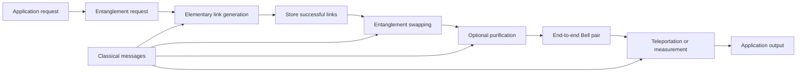

# Quantum Internet

The quantum internet is a network architecture whose main service is not ordinary packet delivery, but the creation, storage, transformation, and consumption of entanglement between remote quantum systems. A classical internet forwards bits by copying, buffering, inspecting headers, and retransmitting. A quantum internet cannot do that to an unknown qubit: measuring it usually disturbs it, and the no-cloning theorem forbids making backup copies. The network therefore moves quantum information indirectly. It first distributes entanglement, then uses local quantum operations and classical messages to turn that entanglement into a communication, computing, sensing, or security resource.

This area sits between [quantum communication](/quantum-information-science/quantum-communication/intro), [quantum computing](/quantum-information-science/quantum-computing/intro), and the quantum mechanics of [density operators and entanglement](/physics/quantum-mechanics/density-operator-entanglement-decoherence). Quantum key distribution can work with relatively simple prepare-and-measure links. A full quantum internet needs stronger primitives: heralded entanglement, quantum memories, entanglement swapping, purification, and eventually fault-tolerant network nodes. In that setting, teleportation becomes the routing primitive: the payload state never travels as a copied packet, but is reconstructed at the destination after an entanglement-assisted Bell measurement and two classical bits.

Nielsen and Chuang's *Quantum Computation and Quantum Information* is the primary reference for the foundational layer of this section. It does not present a modern quantum-internet stack, but it supplies the formal primitives that the stack spends: teleportation from Section 1.3.7, the postulates and reduced density operators from Chapter 2, quantum operations and Kraus maps from Chapter 8, entropy from Chapter 11, and entanglement distillation plus channel-capacity ideas from Chapter 12. The pages in this folder synthesize that canonical treatment with quantum-network terminology rather than creating a separate set of Nielsen-Chuang notes.

## Definitions

A **quantum node** is a device that can prepare, store, manipulate, and measure one or more qubits. Early nodes may be single-qubit devices; advanced nodes may contain many logical qubits protected by [quantum error correction](/quantum-information-science/quantum-computing/error-correction).

A **quantum channel** transmits quantum systems, usually photons in fiber, free space, or waveguides. A **classical channel** transmits ordinary bits. Quantum internet protocols almost always require both: the quantum channel distributes physical carriers or entanglement, while the classical channel announces heralding signals, measurement outcomes, routing decisions, and correction bits.

A **Bell pair** or **EPR pair** is a maximally entangled two-qubit state such as

$$
\lvert\Phi^+\rangle = \frac{\lvert 00\rangle + \lvert 11\rangle}{\sqrt{2}}.
$$

It is the elementary network resource for many protocols. If Alice and Bob share a high-fidelity Bell pair, Alice can teleport an unknown qubit to Bob using a Bell-basis measurement and two classical bits. If two adjacent links share Bell pairs, an intermediate node can perform **entanglement swapping** to create an end-to-end Bell pair between non-neighboring nodes.

The **fidelity** of a delivered quantum state $\rho$ relative to a target pure state $\lvert\psi\rangle$ is

$$
F = \langle\psi\rvert \rho \lvert\psi\rangle.
$$

For a Bell pair target, fidelity measures how close a noisy delivered pair is to the ideal entangled state. Network services usually specify a pair request by endpoints, target fidelity, maximum waiting time, and number of pairs.

A **quantum memory** stores a qubit long enough for remote heralding and classical coordination. Memories are central because elementary entanglement generation is probabilistic: one segment may succeed while another fails, so the successful state must wait.

Stephanie Wehner, David Elkouss, and Ronald Hanson popularized a six-stage technology roadmap for quantum networks. The stages are best read as capability classes, not strict calendar predictions:

| Stage | Capability class | Typical function |
|---:|---|---|
| 1 | Trusted repeater networks | QKD with trusted intermediate nodes |
| 2 | Prepare-and-measure networks | End users prepare and measure qubits directly |
| 3 | Entanglement distribution networks | End-to-end entanglement generation and entanglement-based QKD |
| 4 | Quantum memory networks | Stored entanglement, blind computation, simple distributed protocols |
| 5 | Few-qubit fault-tolerant networks | Small protected processors, clock synchronization, stronger distributed primitives |
| 6 | Quantum computing networks | Distributed quantum computation across networked quantum processors |

## Key results

The first organizing result is that unknown quantum states cannot be forwarded like classical data. Suppose a device could copy every pure qubit state by a unitary transformation $U$:

$$
U\lvert\psi\rangle\lvert 0\rangle = \lvert\psi\rangle\lvert\psi\rangle,\qquad
U\lvert\phi\rangle\lvert 0\rangle = \lvert\phi\rangle\lvert\phi\rangle.
$$

Taking inner products gives

$$
\langle\psi\vert\phi\rangle = \langle\psi\vert\phi\rangle^2.
$$

This holds for orthogonal states and identical states, but not for arbitrary nonorthogonal qubit states. Therefore a network switch cannot make arbitrary backup copies, inspect the payload harmlessly, and retransmit the same state.

The second result is that entanglement plus classical communication can move an unknown qubit without violating no-cloning. In [quantum teleportation](/quantum-information-science/quantum-internet/teleportation), Alice's Bell measurement destroys her local copy and projects Bob's half of a shared Bell pair into one of four Pauli-related versions of the input. Two classical bits identify the correction. The output appears at Bob only after the classical bits arrive, so teleportation does not signal faster than light.

The third result is that repeaters attack exponential photon loss by replacing one long lossy transmission attempt with many shorter probabilistic attempts plus swapping and purification. Fiber transmissivity is often modeled as

$$
\eta(L)=10^{-\alpha L/10},
$$

where $\alpha$ is attenuation in dB per kilometer. Direct transmission success therefore falls exponentially in distance. A [quantum repeater](/quantum-information-science/quantum-internet/quantum-repeater) divides distance into elementary links, stores successful links, swaps entanglement across them, and optionally distills higher-fidelity pairs from multiple noisy pairs.

A useful abstraction is that a quantum internet does not merely connect devices; it allocates entanglement. Applications consume that resource in different ways. QKD consumes measured entanglement to create correlated secret bits. Teleportation consumes one Bell pair and two classical bits to move one qubit. Distributed computing consumes many high-fidelity pairs to implement nonlocal gates, share logical qubits, or coordinate remote processors. Clock synchronization and sensing may consume multipartite entanglement or repeated pair generation to beat classical precision limits under suitable assumptions.

The fourth organizing result is that noisy links are quantum channels, not just lossy pipes. In Nielsen and Chuang's operator-sum language, a link acts as

$$
\mathcal{E}(\rho)=\sum_k E_k\rho E_k^\dagger.
$$

Sending half of a Bell pair through such a channel produces a shared state whose quality determines whether a pair can be used directly, distilled, or discarded. This is the conceptual connection between Chapter 8 quantum operations, Chapter 12 distillable entanglement, and the practical [quantum repeater](/quantum-information-science/quantum-internet/quantum-repeater) pipeline.

## Visual



| Classical internet habit | Quantum-internet replacement |
|---|---|
| Copy payload bits freely | No-cloning forbids copying an unknown qubit |
| Inspect headers and buffers without changing payload | Measurement generally disturbs the quantum state |
| Forward packets hop by hop | Create end-to-end entanglement, then teleport or measure |
| Reliability through retransmission of identical data | Reliability through heralding, memory, purification, and error correction |
| Security mostly computational or protocol based | Some tasks use physical disturbance and entanglement tests |

## Worked example 1: Teleportation as a network service

**Problem.** Alice wants to send the unknown qubit

$$
\lvert\psi\rangle = \frac{3}{5}\lvert 0\rangle + \frac{4}{5}\lvert 1\rangle
$$

to Bob. The network has already delivered one high-fidelity $\lvert\Phi^+\rangle$ pair between Alice and Bob. Alice's Bell measurement returns the two-bit result $10$, using the convention

$$
00 \mapsto I,\quad 01 \mapsto X,\quad 10 \mapsto Z,\quad 11 \mapsto XZ.
$$

What state does Bob hold before and after correction?

**Method.**

1. The input amplitudes are $\alpha=3/5$ and $\beta=4/5$.
2. Teleportation maps Alice's Bell outcome to a Pauli-transformed version of the input at Bob.
3. Outcome $10$ means Bob's uncorrected state is $Z\lvert\psi\rangle$.
4. Apply $Z\lvert 0\rangle=\lvert 0\rangle$ and $Z\lvert 1\rangle=-\lvert 1\rangle$:

$$
Z\lvert\psi\rangle
= \frac{3}{5}\lvert 0\rangle - \frac{4}{5}\lvert 1\rangle.
$$

5. Bob applies the correction $Z$ again. Since $Z^2=I$,

$$
Z\left(\frac{3}{5}\lvert 0\rangle - \frac{4}{5}\lvert 1\rangle\right)
= \frac{3}{5}\lvert 0\rangle + \frac{4}{5}\lvert 1\rangle.
$$

**Checked answer.** Bob's state before correction is $\frac{3}{5}\lvert 0\rangle-\frac{4}{5}\lvert 1\rangle$. After applying $Z$, Bob holds the original state $\lvert\psi\rangle$. Alice no longer has an independent copy because the Bell measurement consumed her input.

## Worked example 2: Direct loss versus segmented links

**Problem.** A fiber has attenuation $\alpha=0.2$ dB/km. Compare the probability that a photon survives direct transmission over $L=100$ km with the probability that it survives one elementary segment when the distance is divided into four equal 25 km links. Ignore coupling loss and detector loss.

**Method.**

1. Use the transmissivity model

$$
\eta(L)=10^{-\alpha L/10}.
$$

2. For direct transmission over 100 km,

$$
\eta(100)=10^{-0.2\cdot 100/10}=10^{-2}=0.01.
$$

Only one photon in one hundred survives on average.
3. For a 25 km elementary link,

$$
\eta(25)=10^{-0.2\cdot 25/10}=10^{-0.5}\approx 0.316.
$$

4. Four segments do not automatically give an end-to-end pair; repeaters need heralding, memory, and swapping. But each elementary attempt is far more likely to produce a link-level success than the single 100 km direct attempt.
5. The improvement is local:

$$
\frac{\eta(25)}{\eta(100)}\approx \frac{0.316}{0.01}=31.6.
$$

**Checked answer.** Direct survival over 100 km is $0.01$. A 25 km elementary segment has survival about $0.316$. The repeater challenge is to convert many more local successes into an end-to-end entangled pair without losing the stored qubits to memory decoherence.

## Code

```python
import numpy as np

I = np.array([[1, 0], [0, 1]], dtype=complex)
X = np.array([[0, 1], [1, 0]], dtype=complex)
Z = np.array([[1, 0], [0, -1]], dtype=complex)

def normalize(v):
    return v / np.linalg.norm(v)

def teleportation_correction(state, outcome):
    corrections = {
        "00": I,
        "01": X,
        "10": Z,
        "11": X @ Z,
    }
    uncorrected = corrections[outcome] @ state
    corrected = corrections[outcome] @ uncorrected
    return uncorrected, corrected

psi = normalize(np.array([3, 4], dtype=complex))
uncorrected, corrected = teleportation_correction(psi, "10")

print("input     =", psi)
print("received  =", uncorrected)
print("corrected =", corrected)
print("fidelity  =", abs(np.vdot(psi, corrected)) ** 2)
```

## Common pitfalls

- Treating teleportation as faster-than-light communication. The correction requires classical bits, so no usable information arrives before the classical message.
- Thinking the qubit travels through the classical channel. The classical bits identify a Pauli correction; they do not contain enough information to reconstruct an arbitrary unknown state.
- Confusing trusted-node QKD with a full quantum repeater. Trusted nodes measure and regenerate classical keys; repeaters preserve quantum correlations by swapping entanglement.
- Forgetting that quantum memory is a timing device. It is needed because probabilistic links succeed at different times.
- Assuming all entanglement is equally useful. Fidelity, rate, latency, memory lifetime, and application tolerance determine whether a delivered pair is valuable.
- Reading the six stages as a guaranteed deployment schedule. They are a capability roadmap, and real systems may mix features from adjacent stages.

## Connections

- [Entanglement as a Network Resource](/quantum-information-science/quantum-internet/entanglement)
- [Quantum Teleportation](/quantum-information-science/quantum-internet/teleportation)
- [Quantum Repeater](/quantum-information-science/quantum-internet/quantum-repeater)
- [Quantum Communication](/quantum-information-science/quantum-communication/intro)
- [Quantum Network](/quantum-information-science/quantum-communication/quantum-network)
- [BB84 Protocol](/quantum-information-science/quantum-communication/bb84)
- [Quantum Error Correction](/quantum-information-science/quantum-computing/error-correction)
- [Density Operator, Entanglement, and Decoherence](/physics/quantum-mechanics/density-operator-entanglement-decoherence)

## Deep-dive papers

- [Entanglement Swapping with Time-Bin Telecom Qubits (Davis et al., 2025)](/quantum-information-science/quantum-internet/entanglement-swapping-time-bin-telecom) explains a deployable 1536.4 nm time-bin entanglement-swapping system with SNSPD heralding, characteristic-function modeling, and source-independent QKD implications.
