# Quantum Repeater

A quantum repeater is a network device or protocol stack that extends entanglement beyond the distance where direct photon transmission is practical. It is the quantum-internet answer to loss. Classical optical networks can amplify, reshape, and retransmit signals because classical bits can be measured and copied. Unknown quantum states cannot be copied, and direct measurement usually destroys the coherence that the network is trying to preserve. A repeater therefore does something more indirect: it creates entanglement on shorter links, stores successful links, swaps entanglement across intermediate nodes, and often distills several noisy pairs into fewer higher-fidelity pairs.

The repeater problem is the central engineering bridge between [entanglement as a network resource](/quantum-information-science/quantum-internet/entanglement) and a useful [quantum internet](/quantum-information-science/quantum-internet/intro). Without repeaters, long-distance quantum communication is dominated by exponential channel loss. With repeaters, idealized scaling can become polynomial in distance, but only if memories, photon interfaces, local gates, heralding, and classical control are good enough.


*Figure: Quantum repeaters require memory-like behavior: successful elementary links must wait while other probabilistic links and heralding messages arrive. Image: [Wikimedia Commons](https://commons.wikimedia.org/wiki/File:Quantum_buffer_%285940501733%29.jpg), National Institute of Standards and Technology / A. Marino, public domain.*


*Figure: Entangled-photon sources are one physical route to the elementary links that repeater protocols try to store, swap, and purify. Image: [Wikimedia Commons](https://commons.wikimedia.org/wiki/File:Quantum_Entanglement_Experiment_via_Spontaneous_Parametric_Down-Conversion_%28SPDC%29.jpg), Farbodk, CC BY-SA 4.0.*

## Definitions

An **elementary link** is a short quantum connection between neighboring nodes. A link attempt may send one or more photons through fiber or free space. A successful attempt is usually **heralded**, meaning detectors and classical messages announce that entanglement has been created.

A **quantum memory** is a matter system or encoded qubit that stores the state associated with a successful link while other links are still being attempted. Candidate platforms include trapped ions, neutral atoms, rare-earth doped crystals, nitrogen-vacancy centers in diamond, quantum dots, and atomic ensembles. For networking, the memory is not just a storage cell; it must interface efficiently with photons, support local operations, survive classical round-trip delays, and be measurable with high fidelity.

**Entanglement swapping** extends entanglement. Suppose Alice shares a Bell pair with repeater node $R$, and $R$ shares another Bell pair with Bob. A Bell measurement at $R$ on its two local qubits projects Alice and Bob into a Bell state up to a known Pauli correction. The intermediate node's qubits are measured and consumed.

**Entanglement purification** or **distillation** takes multiple noisy entangled pairs and, by LOCC, probabilistically outputs fewer pairs with higher fidelity. It is needed because swapping propagates and combines errors. Protocols such as DEJMPS are recurrence-style two-pair protocols; hashing is a large-block asymptotic method.

A **nesting level** describes how many rounds of link extension have been performed. At level 0, elementary links connect neighbors. At level 1, swapping creates links across two elementary segments. At level 2, swapping creates links across four elementary segments, and so on.

The standard fiber loss model is

$$
\eta(L)=10^{-\alpha L/10},
$$

where $L$ is distance in kilometers, $\alpha$ is attenuation in dB/km, and $\eta$ is transmissivity. Around telecom wavelengths, a common idealized value is $\alpha\approx0.2$ dB/km for good fiber, before connector, coupling, detector, and protocol losses.

Nielsen and Chuang do not develop repeater architectures in depth, but Chapter 8 gives the channel language used to model each elementary link. A deterministic noisy quantum channel is a completely positive trace-preserving map

$$
\mathcal{E}(\rho)=\sum_k E_k\rho E_k^\dagger,\qquad \sum_k E_k^\dagger E_k=I.
$$

This is the **operator-sum** or **Kraus** representation. The operators $E_k$ can be derived from a unitary interaction with an environment followed by tracing out that environment. In a repeater, loss, dephasing, imperfect memories, detector dark counts, and local gate errors are all modeled by composing such maps, sometimes with non-trace-preserving branches when a heralded event is conditioned on success.

The **Choi-Jamiolkowski state** of a channel is the state obtained by applying the channel to half of a maximally entangled pair:

$$
J(\mathcal{E})=(I\otimes\mathcal{E})(\lvert\Phi_d\rangle\langle\Phi_d\rvert),
\qquad
\lvert\Phi_d\rangle=\frac{1}{\sqrt{d}}\sum_{i=0}^{d-1}\lvert i\rangle\lvert i\rangle.
$$

This channel-state view is especially natural for repeaters. An elementary entanglement-generation attempt can be analyzed as preparing a Bell pair and letting one half pass through the physical link. The resulting shared state is the channel's Choi state up to normalization and convention. Nielsen and Chuang emphasize the operator-sum and process-tomography descriptions; the Choi form is the compact modern notation for the same background idea.

## Key results

The direct-transmission problem is exponential. If a source emits photons at a clock rate $f$, a very simple upper estimate for the raw arrival rate is

$$
R_{\mathrm{direct}}\approx f\,\eta(L).
$$

Because $\eta(L)$ is exponential in $L$, every additional fixed length in fiber multiplies the success probability by a constant factor below one. This is why direct quantum links become impractical over long distances even when local devices are excellent.

Quantum repeaters avoid copying the unknown state. They do not amplify a qubit in the classical sense. Instead, they distribute entanglement and use measurement to stitch links together. The basic swapping identity can be written schematically as

$$
\lvert\Phi^+\rangle_{AB}\lvert\Phi^+\rangle_{CD}
=\frac{1}{2}\sum_{k\in\{\Phi^+,\Phi^-,\Psi^+,\Psi^-\}}
\lvert k\rangle_{BC}\,\sigma_k\lvert\Phi^+\rangle_{AD},
$$

where a Bell measurement on $B,C$ announces which Pauli frame $\sigma_k$ applies to the remote pair $A,D$. The Pauli correction can be applied physically or tracked in software until the pair is consumed by [teleportation](/quantum-information-science/quantum-internet/teleportation).

### Deployable telecom-band entanglement swapping

Entanglement swapping becomes a repeater primitive only when it is compatible with realistic photonic hardware, timing, and heralding. Davis et al. [1] demonstrated conditional swapping between time-bin qubits at 1536.4 nm using modular fiber-coupled components: electro-optic pulse carving, PPLN nonlinear waveguides, telecom-band SPDC pairs, Charlie's beamsplitter Bell-state measurement, SNSPDs, and time-tagged coincidence logic. The contribution is a deployability-oriented photonic swapping experiment, not a complete repeater node with long-lived memories.

A time-bin qubit has the form

$$
\lvert\psi\rangle=\alpha\lvert e\rangle+\beta\lvert \ell\rangle,
\qquad
\lvert\alpha\rvert^2+\lvert\beta\rvert^2=1,
$$

where $e$ and $\ell$ denote early and late arrival bins. The two sources ideally emit

$$
\lvert\Phi^+\rangle
=\frac{\lvert ee\rangle+\lvert \ell\ell\rangle}{\sqrt{2}}.
$$

If Charlie projects the two middle photons onto

$$
\lvert\Psi^-\rangle
=\frac{\lvert e\ell\rangle-\lvert \ell e\rangle}{\sqrt{2}},
$$

then the remote idler photons are projected into the corresponding Bell state up to the experiment's phase convention. In the ideal algebra,

$$
{}_{CD}\langle\Psi^-|
\lvert\Phi^+\rangle_{AC}\lvert\Phi^+\rangle_{DB}
\propto
\lvert e_A\ell_B\rangle-\lvert \ell_A e_B\rangle.
$$

The reported time-bin separation was 346 ps, large compared with tens-of-picoseconds SNSPD timing jitter, and the source clock was 200 MHz. A useful worked calculation is the visibility-to-fidelity conversion used for Bell-state measurements:

$$
F_{\mathrm{swap}}=\frac{3V_{\mathrm{swap}}+1}{4}.
$$

With $V_{\mathrm{swap}}=0.831$, this gives

$$
F_{\mathrm{swap}}=\frac{3(0.831)+1}{4}=0.87325,
$$

or about $87.3\%$. For the source-independent QKD analysis in [1], the measured error rates $e_t=0.011$ and $e_p=0.079$ with reconciliation efficiency $f=1.22$ give

$$
\frac{R}{R_s}=1-fH_2(e_t)-H_2(e_p)\approx0.50
$$

secret bits per sifted bit under the paper's assumptions. That is a conditional fraction, not the optical swapping rate; the reported swapping rate was about $0.01$ Hz. The repeater lesson is therefore two-sided: telecom-band time-bin swapping can reach nonclassical fidelity with deployable components, but useful long-distance repeaters still need much higher rates, lower loss, stronger indistinguishability, multiplexing, and memory-compatible interfaces.

The channel-state viewpoint turns this into an error-accounting rule. If an elementary link is represented by a Bell-diagonal Choi state, then swapping combines Bell error labels, local memories add additional Kraus noise while a link waits, and purification is an LOCC map on several copies of those shared states. This is why a repeater performance model normally tracks both rate and state quality; a high heralding rate with a poor Choi state may be less useful than a slower link that distills efficiently.

Nielsen and Chuang Chapter 12 connects entanglement distillation with quantum communication. If Alice sends halves of Bell pairs through a noisy channel and then Alice and Bob distill the resulting shared mixed states, the distilled Bell pairs can teleport unknown qubits reliably. Thus distillation can function as an error-correction method for a communication channel, with the achievable rate controlled by the distillable entanglement of the channel-generated state. Repeaters add spatial segmentation and memories to that information-theoretic idea.

Capacity formulas are benchmarks, not repeater designs. The Holevo-Schumacher-Westmoreland expression bounds the classical information rate achievable over a noisy quantum channel with product-state encodings, while quantum capacity is governed by coherent-information regularization in the general theory. For a physical repeater chain, those capacities sit above a more detailed stack: photon survival, heralding probability, memory lifetime, local gate fidelity, purification yield, scheduling policy, and final application fidelity.

The BDCZ scheme, named for Briegel, Duer, Cirac, and Zoller, is the canonical first-generation repeater idea. Its structure is:

1. Divide the total distance into elementary links.
2. Attempt to generate entanglement independently on each elementary link.
3. Store successful links in quantum memories.
4. Purify neighboring noisy pairs when needed.
5. Perform entanglement swapping at intermediate nodes to double the link length.
6. Repeat purification and swapping in a nested hierarchy until the endpoints share an entangled pair.

The square-root scaling intuition appears already in a two-segment repeater. If total transmissivity is $\eta(L)$ and the path is split into two equal halves, each half has transmissivity $\eta(L/2)=\sqrt{\eta(L)}$. A memory lets a successful half-link wait while the other half succeeds. This does not make the end-to-end rate simply $\sqrt{\eta}$, because there are heralding delays, two-link waiting statistics, Bell-measurement success probabilities, memory decay, detector losses, and purification overhead. But it explains why segmented entanglement generation can beat the direct rate proportional to $\eta(L)$ under idealized assumptions. In larger nested repeaters, the goal is to replace exponential distance dependence with a much gentler polynomial-like dependence, again subject to hardware overheads.

DLCZ, named for Duan, Lukin, Cirac, and Zoller, is a landmark ensemble-based repeater proposal. Each node contains an atomic ensemble. A weak write pulse occasionally creates a collective spin-wave excitation and emits a Stokes photon. Interference and detection of photons from two ensembles herald entanglement between the remote spin waves. Later, a read pulse converts the stored spin wave back into a photon for swapping or final use. DLCZ is attractive because ensembles can enhance light-matter coupling collectively, but it is sensitive to multi-excitation errors, phase stability, retrieval efficiency, and memory lifetime.

All-photonic repeaters shift the burden away from long-lived matter memories. Instead of waiting with stored matter qubits, they use large photonic graph states, loss-tolerant encodings, multiplexing, and feedforward measurements. These schemes can, in principle, avoid some memory-coherence bottlenecks, but they demand high-rate deterministic or near-deterministic photonic entangling operations, efficient sources, low-loss switching, and large overhead in prepared photons. They are best viewed as a different allocation of difficulty, not a free escape from loss.

Quantum memory requirements are severe. A useful repeater memory should have coherence time long compared with the classical signaling delay across an elementary link and the expected waiting time for other segments. It should have high write and read efficiency, low noise, compatibility with telecom photons or efficient frequency conversion, multimode capacity for multiplexing, high-fidelity local gates for purification or swapping, and enough stability for phase-sensitive interference. For later-stage networks, memories likely need [quantum error correction](/quantum-information-science/quantum-computing/error-correction), because storing many qubits for many rounds makes unprotected decoherence unacceptable.

Small-scale demonstrations have validated pieces of the stack. Delft/QuTech experiments with nitrogen-vacancy centers in diamond have demonstrated heralded entanglement between separated nodes, multi-node network behavior, and teleportation-like primitives across non-neighboring nodes in laboratory-scale settings. These are not long-haul production repeaters. They are important because they show matter qubits, photons, heralding, memories, and classical control working together in a network architecture.

## Visual

```mermaid
flowchart LR
  subgraph BDCZ["BDCZ nested repeater"]
    direction TB
    A["Alice memory"] --- L0["elementary link<br/>heralded pair"]
    L0 --- R1["Repeater R1<br/>two memories"]
    R1 --- L1["elementary link<br/>heralded pair"]
    L1 --- R2["Repeater R2<br/>two memories"]
    R2 --- L2["elementary link<br/>heralded pair"]
    L2 --- R3["Repeater R3<br/>two memories"]
    R3 --- L3["elementary link<br/>heralded pair"]
    L3 --- B["Bob memory"]
    L0 --> D01["optional purification<br/>consume raw pairs -> higher F"]
    L1 --> D12["optional purification<br/>local bilateral gates + compare bits"]
    L2 --> D23["optional purification<br/>raise link fidelity"]
    L3 --> D34["optional purification<br/>raise link fidelity"]
    D01 --> S1["swap at R1<br/>Bell measurement"]
    D12 --> S1
    D23 --> S2["swap at R3<br/>Bell measurement"]
    D34 --> S2
    S1 --> P02["longer pair A-R2<br/>Pauli frame recorded"]
    S2 --> P24["longer pair R2-B<br/>Pauli frame recorded"]
    P02 --> SF["final swap at R2"]
    P24 --> SF
    SF --> AB["end-to-end pair A-B<br/>fidelity F_AB, rate R_AB"]
  end

  subgraph DLCZ["DLCZ memory-based link"]
    direction TB
    E1["ensemble 1<br/>collective ground state"] --> W1["weak write pulse<br/>rare spin-wave + Stokes photon"]
    E2["ensemble 2<br/>collective ground state"] --> W2["weak write pulse<br/>rare spin-wave + Stokes photon"]
    W1 --> BS["Stokes photons interfere<br/>beamsplitter + detector click"]
    W2 --> BS
    BS --> Herald["single click heralds<br/>entangled spin waves"]
    Herald --> Read["read pulse<br/>spin wave -> photon"]
    Read --> SwapD["photonic Bell measurement<br/>extend entanglement"]
  end

  subgraph Photonic["All-photonic repeater"]
    direction TB
    GSrc["large photonic graph-state source<br/>loss-tolerant encoded clusters"] --> Mux["multiplexing and switching<br/>choose surviving modes"]
    Mux --> Fusion["fusion / Bell measurements<br/>linear optics + feed-forward"]
    Fusion --> Enc["encoded logical link<br/>loss tolerance without long-lived memory"]
    Enc --> End["end-to-end entanglement<br/>high photon overhead"]
  end

  Herald -. "classical herald" .-> D01
  SwapD -. "module primitive" .-> S1
  End -. "alternate architecture" .-> AB
```



The repeater diagram compares three architectures in one place. The BDCZ block shows elementary links, optional purification, nested Bell-measurement swaps, and Pauli-frame propagation toward an end-to-end Bell pair; the DLCZ block expands one memory-based elementary link into write pulses, Stokes-photon interference, heralded spin waves, and readout. The all-photonic block shows the different tradeoff: large graph states and feed-forward reduce long-lived memory dependence but move the difficulty into source scale, loss tolerance, and switching.

| Repeater family | Main resource | Strength | Main bottleneck |
|---|---|---|---|
| BDCZ memory-based | Matter memories, swapping, purification | Clear modular architecture and nested scaling | Memory lifetime, gates, heralding delay |
| DLCZ ensemble-based | Collective atomic spin waves | Natural light-matter interface and heralding | Multi-excitation errors and retrieval efficiency |
| Error-corrected repeater | Encoded logical qubits | Suppresses accumulated errors at scale | Large qubit and gate overhead |
| All-photonic repeater | Photonic graph states and feedforward | Reduces reliance on long-lived matter memory | Huge photonic-source and loss-tolerant encoding overhead |
| Trusted-node chain | Classical measurement and regeneration | Deployable for QKD in limited settings | Nodes must be trusted; no end-to-end entanglement |
| Channel-state analysis | Kraus maps and Choi states | Separates physical link noise from protocol logic | Requires accurate tomography or calibrated noise model |

## Worked example 1: Why elementary links help with loss

**Problem.** A fiber has attenuation $\alpha=0.2$ dB/km. Compare direct transmission over 200 km with elementary-link transmission over 20 km segments. Ignore all losses except fiber attenuation.

**Method.**

1. Use

$$
\eta(L)=10^{-\alpha L/10}.
$$

2. For direct 200 km transmission,

$$
\eta(200)=10^{-0.2\cdot200/10}=10^{-4}=0.0001.
$$

Only one photon in ten thousand survives on average.

3. For a 20 km elementary link,

$$
\eta(20)=10^{-0.2\cdot20/10}=10^{-0.4}.
$$

Since $10^{0.4}\approx2.512$,

$$
\eta(20)\approx0.398.
$$

4. Compare local success probabilities:

$$
\frac{\eta(20)}{\eta(200)}
\approx \frac{0.398}{0.0001}
=3980.
$$

5. Interpret carefully. Ten 20 km links do not automatically give an end-to-end entangled pair. The repeater still needs heralded link generation, memories, swapping, and possibly purification. The calculation only shows why shorter elementary links are attractive: local attempts have far higher survival probability.

**Checked answer.** Direct survival over 200 km is $10^{-4}$. A 20 km elementary attempt has survival about $0.398$. Repeaters exploit this large local advantage, but the final rate depends on memory and swapping overhead.

## Worked example 2: Fidelity loss under one swapping step

**Problem.** Two elementary links each produce a Werner-like Bell-diagonal pair with fidelity $F=0.90$ to $\lvert\Phi^+\rangle$. The other three Bell states each have probability $(1-F)/3$. Assuming perfect local Bell measurement and no memory error, estimate the fidelity after entanglement swapping.

**Method.**

1. Represent the Bell-error distribution as

$$
p_0=F=0.90,\qquad
p_1=p_2=p_3=\frac{1-F}{3}=\frac{0.10}{3}\approx0.0333.
$$

2. Under ideal swapping, Bell error labels combine like a parity sum. The output has no net error when the two input error labels match.

3. Therefore the output fidelity is

$$
F'=\sum_{i=0}^3 p_i^2.
$$

4. Substitute:

$$
\begin{aligned}
F'
&=0.90^2+3(0.0333^2)\\
&=0.81+3(0.00111)\\
&\approx0.8133.
\end{aligned}
$$

5. The output pair spans twice the distance, but the fidelity has dropped from $0.90$ to about $0.813$. After many nesting levels, this degradation can become unacceptable unless the protocol uses purification, error correction, or much cleaner elementary links.

**Checked answer.** One ideal swapping step gives an approximate output fidelity $F'\approx0.813$. This is why repeaters are not only a loss-management problem; they are also an error-management problem.

## Code

```python
import numpy as np

def transmissivity(length_km, alpha_db_per_km=0.2):
    return 10 ** (-alpha_db_per_km * length_km / 10)

def swapped_werner_fidelity(F):
    p = np.array([F, (1 - F) / 3, (1 - F) / 3, (1 - F) / 3])
    return float(np.sum(p * p))

def choi_from_kraus(kraus_ops):
    """Return normalized qubit Choi state for a channel."""
    phi = np.array([1, 0, 0, 1], dtype=complex) / np.sqrt(2)
    rho = np.outer(phi, phi.conj())
    out = np.zeros((4, 4), dtype=complex)
    I = np.eye(2, dtype=complex)
    for E in kraus_ops:
        K = np.kron(I, E)
        out += K @ rho @ K.conj().T
    return out

total_length = 200
segment_length = 20

direct = transmissivity(total_length)
segment = transmissivity(segment_length)

print("direct transmissivity:", direct)
print("20 km segment transmissivity:", segment)
print("local improvement factor:", segment / direct)

F = 0.90
for level in range(4):
    print(f"after {level} swap levels: F = {F:.4f}")
    F = swapped_werner_fidelity(F)

gamma = 0.10
E0 = np.array([[1, 0], [0, np.sqrt(1 - gamma)]], dtype=complex)
E1 = np.array([[0, np.sqrt(gamma)], [0, 0]], dtype=complex)
J = choi_from_kraus([E0, E1])
bell = np.array([1, 0, 0, 1], dtype=complex) / np.sqrt(2)
print("amplitude-damping Choi fidelity:", np.real(bell.conj() @ J @ bell))
```

## Common pitfalls

- Calling any intermediate QKD node a quantum repeater. Trusted nodes can extend key distribution, but they measure and regenerate classical secrets rather than preserving end-to-end entanglement.
- Assuming repeaters amplify unknown qubits. A repeater avoids no-cloning by generating entanglement, storing it, and using Bell measurements.
- Quoting square-root scaling without the overheads. Segmenting a link improves elementary success probabilities, but rates still depend on waiting time, detector loss, memory decay, swapping probability, and purification cost.
- Ignoring memory lifetime. If a stored pair decoheres before neighboring links succeed, the apparent link-generation advantage disappears.
- Treating entanglement swapping as fidelity-neutral. Even perfect swapping combines preexisting link errors; imperfect gates and measurements add more.
- Modeling every link by a single scalar loss probability. Repeaters also need phase noise, memory decay, detector imperfections, and the full shared-state error structure, often represented by Kraus maps or Choi states.
- Assuming all-photonic repeaters remove all hard hardware requirements. They reduce matter-memory dependence but require large photonic graph states, low loss, fast feedforward, and efficient sources.
- Extrapolating small laboratory demonstrations to deployed long-haul service. Current demonstrations validate building blocks; engineering a reliable repeater chain is a larger systems problem.

## Connections

- [Quantum Internet](/quantum-information-science/quantum-internet/intro)
- [Entanglement as a Network Resource](/quantum-information-science/quantum-internet/entanglement)
- [Quantum Teleportation](/quantum-information-science/quantum-internet/teleportation)
- [Quantum Network](/quantum-information-science/quantum-communication/quantum-network)
- [Quantum Communication](/quantum-information-science/quantum-communication/intro)
- [Quantum Key Distribution](/quantum-information-science/quantum-communication/qkd)
- [Quantum Error Correction](/quantum-information-science/quantum-computing/error-correction)
- [Density Operator, Entanglement, and Decoherence](/physics/quantum-mechanics/density-operator-entanglement-decoherence)

## References

[1] S. I. Davis, R. Valivarthi, A. Cameron, C. Pena, S. Xie, L. Narvaez, N. Lauk, C. Li, K. Taylor, R. Youssef, C. Wang, K. Kapoor, B. Korzh, N. Sinclair, M. Shaw, P. Spentzouris, M. Spiropulu. *Entanglement swapping systems toward a quantum internet*. arXiv:2503.18906, 2025.
