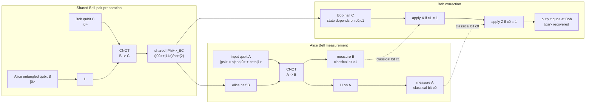

# Quantum Teleportation

Quantum teleportation is the primitive that lets a quantum network move an unknown qubit without copying it or physically forwarding that same qubit through every intermediate device. It consumes one shared Bell pair and two classical bits. The input state disappears from the sender's laboratory, and the same state is reconstructed at the receiver after a Pauli correction. This is why teleportation is a routing primitive for the [quantum internet](/quantum-information-science/quantum-internet/intro): the network can focus on distributing entanglement, then applications can spend that entanglement to transfer quantum states.

The standard protocol was introduced by Bennett, Brassard, Crepeau, Jozsa, Peres, and Wootters in 1993. It is not science-fiction matter transport and it is not faster-than-light signaling. It is a precise circuit identity: a Bell-basis measurement plus two classical correction bits implements the identity channel from Alice's input qubit to Bob's output qubit, provided Alice and Bob initially share a high-quality entangled pair.

Nielsen and Chuang Section 1.3.7 is the primary reference for the circuit derivation used on this page. Their emphasis is useful for networking: teleportation converts resources. One pre-shared EPR pair plus two classical bits can substitute for one use of an ideal qubit channel, while the original input is consumed by measurement.


*Figure: Teleportation consumes a pre-shared entangled pair, which in photonic demonstrations often begins with an optical entanglement source rather than a circuit diagram. Image: [Wikimedia Commons](https://commons.wikimedia.org/wiki/File:Quantum_Entanglement_Experiment_via_Spontaneous_Parametric_Down-Conversion_%28SPDC%29.jpg), Farbodk, CC BY-SA 4.0.*

## Definitions

Let Alice hold an unknown input qubit $A$,

$$
\lvert\psi\rangle_A=\alpha\lvert0\rangle+\beta\lvert1\rangle,\qquad
\lvert\alpha\rvert^2+\lvert\beta\rvert^2=1.
$$

Alice and Bob also share a Bell pair

$$
\lvert\Phi^+\rangle_{BC}
=\frac{\lvert00\rangle_{BC}+\lvert11\rangle_{BC}}{\sqrt{2}},
$$

where Alice holds qubit $B$ and Bob holds qubit $C$.

The Bell basis for Alice's two qubits $A,B$ is

$$
\begin{aligned}
\lvert\Phi^+\rangle &= \frac{\lvert00\rangle+\lvert11\rangle}{\sqrt{2}},&
\lvert\Phi^-\rangle &= \frac{\lvert00\rangle-\lvert11\rangle}{\sqrt{2}},\\
\lvert\Psi^+\rangle &= \frac{\lvert01\rangle+\lvert10\rangle}{\sqrt{2}},&
\lvert\Psi^-\rangle &= \frac{\lvert01\rangle-\lvert10\rangle}{\sqrt{2}}.
\end{aligned}
$$

The Pauli corrections are

$$
I=\begin{bmatrix}1&0\\0&1\end{bmatrix},\quad
X=\begin{bmatrix}0&1\\1&0\end{bmatrix},\quad
Z=\begin{bmatrix}1&0\\0&-1\end{bmatrix},\quad
XZ=\begin{bmatrix}0&-1\\1&0\end{bmatrix}.
$$

The correction $XZ$ differs from some conventions by a global phase or operator order. Global phase has no observable effect, so the network convention only needs to be used consistently.

A **Bell measurement** is a projective measurement in the Bell basis. In circuit form, it can be implemented by a CNOT from the input qubit to the entangled qubit, a Hadamard on the input qubit, and computational-basis measurements of both qubits. The two measurement bits are sent over a classical channel to Bob.

The **teleportation fidelity** for a target pure state is

$$
F=\langle\psi\rvert\rho_{\mathrm{out}}\lvert\psi\rangle.
$$

Ideal teleportation has $F=1$. For unknown qubits drawn uniformly from the Bloch sphere, purely classical measure-and-prepare strategies cannot exceed average fidelity $2/3$, so demonstrations often compare against that benchmark when the assumptions match the benchmark.

## Key results

The full three-qubit input state is

$$
\begin{aligned}
\lvert\psi\rangle_A\lvert\Phi^+\rangle_{BC}
&=(\alpha\lvert0\rangle_A+\beta\lvert1\rangle_A)
\frac{\lvert00\rangle_{BC}+\lvert11\rangle_{BC}}{\sqrt{2}}\\
&=\frac{1}{\sqrt{2}}\left(
\alpha\lvert000\rangle+\alpha\lvert011\rangle
+\beta\lvert100\rangle+\beta\lvert111\rangle
\right),
\end{aligned}
$$

where the qubit order is $A,B,C$.

Nielsen and Chuang's circuit implements the Bell measurement by a CNOT from $A$ to $B$, a Hadamard on $A$, and computational-basis measurements of $A$ and $B$. After the CNOT,

$$
\begin{aligned}
\lvert\psi_1\rangle
&=\frac{1}{\sqrt{2}}\left[
\alpha\lvert0\rangle_A(\lvert00\rangle+\lvert11\rangle)_{BC}
\beta\lvert1\rangle_A(\lvert10\rangle+\lvert01\rangle)_{BC}
\right]\\
&=\frac{1}{\sqrt{2}}\left(
\alpha\lvert000\rangle+\alpha\lvert011\rangle
\beta\lvert110\rangle+\beta\lvert101\rangle
\right).
\end{aligned}
$$

After the Hadamard on $A$,

$$
\begin{aligned}
\lvert\psi_2\rangle
=\frac{1}{2}\big(&
\lvert00\rangle_{AB}(\alpha\lvert0\rangle+\beta\lvert1\rangle)_C\\
&+\lvert01\rangle_{AB}(\beta\lvert0\rangle+\alpha\lvert1\rangle)_C\\
&+\lvert10\rangle_{AB}(\alpha\lvert0\rangle-\beta\lvert1\rangle)_C\\
&+\lvert11\rangle_{AB}(-\beta\lvert0\rangle+\alpha\lvert1\rangle)_C
\big).
\end{aligned}
$$

The four computational outcomes of Alice's two measured qubits therefore correspond to Bob's four possible pre-correction states. Each branch has probability $1/4$, because the squared norm of each Bob-side vector is $\vert \alpha\vert ^2+\vert \beta\vert ^2=1$ and each branch has amplitude factor $1/2$.

Rewrite this state in the Bell basis of $A,B$:

$$
\begin{aligned}
\lvert\psi\rangle_A\lvert\Phi^+\rangle_{BC}
=\frac{1}{2}\big(&
\lvert\Phi^+\rangle_{AB}(\alpha\lvert0\rangle+\beta\lvert1\rangle)_C\\
&+\lvert\Phi^-\rangle_{AB}(\alpha\lvert0\rangle-\beta\lvert1\rangle)_C\\
&+\lvert\Psi^+\rangle_{AB}(\beta\lvert0\rangle+\alpha\lvert1\rangle)_C\\
&+\lvert\Psi^-\rangle_{AB}(-\beta\lvert0\rangle+\alpha\lvert1\rangle)_C
\big).
\end{aligned}
$$

Alice's Bell measurement on $(A,B)$ randomly returns one of the four Bell outcomes, each with probability $1/4$, independent of $\alpha$ and $\beta$. Conditional on that result, Bob's qubit is one Pauli-transformed copy of $\lvert\psi\rangle$:

| Alice Bell outcome | Classical bits | Bob before correction | Bob applies |
|---|---:|---|---|
| $\lvert\Phi^+\rangle$ | 00 | $\lvert\psi\rangle$ | $I$ |
| $\lvert\Psi^+\rangle$ | 01 | $X\lvert\psi\rangle$ | $X$ |
| $\lvert\Phi^-\rangle$ | 10 | $Z\lvert\psi\rangle$ | $Z$ |
| $\lvert\Psi^-\rangle$ | 11 | $XZ\lvert\psi\rangle$ | $XZ$ |

After Bob's correction, the output is $\lvert\psi\rangle$ up to an irrelevant global phase. Alice's original input has been measured as part of the Bell measurement. This is exactly what makes the protocol consistent with no-cloning: the unknown state is relocated, not duplicated.

Before the two classical bits arrive, Bob has no usable information about $\alpha$ and $\beta$. Averaging over Alice's four equally likely outcomes gives

$$
\rho_B
=\frac{1}{4}\left(
\lvert\psi\rangle\langle\psi\rvert
+X\lvert\psi\rangle\langle\psi\rvert X
+Z\lvert\psi\rangle\langle\psi\rvert Z
+XZ\lvert\psi\rangle\langle\psi\rvert ZX
\right)
=\frac{I}{2}.
$$

The reduced state is independent of the teleported qubit. This is the density-operator proof, developed in Nielsen and Chuang Section 2.4.3, that teleportation cannot be used as a faster-than-light communication channel.

Teleportation also gives a clean operational meaning to entanglement. A Bell pair by itself cannot send a message. Two classical bits by themselves cannot specify an arbitrary unknown qubit. Together, a Bell pair and two bits implement the identity quantum channel from Alice to Bob. In network terms, the Bell pair is a pre-distributed nonlocal resource, and the classical bits are the control information that selects the correction.

In a routed network, the correction is often handled as a **Pauli frame** rather than as an immediate physical gate. Bob's controller records that the logical output has an $X$, $Z$, or $XZ$ frame update, and later measurements or gates are interpreted relative to that frame. This is common in fault-tolerant circuits because it avoids unnecessary physical operations. It also makes teleportation naturally compatible with entanglement swapping: intermediate Bell measurements create Pauli-frame information that can be propagated classically until the final consumer of the entangled pair needs a definite interpretation.

If the shared pair is noisy, teleportation becomes a noisy channel. For a qubit isotropic resource with Bell-state fidelity $F_e$ relative to $\lvert\Phi^+\rangle$, the standard teleportation protocol has average fidelity

$$
F_{\mathrm{avg}}=\frac{2F_e+1}{3}.
$$

This formula is a useful engineering rule of thumb: improving the entangled link improves the application-level teleportation fidelity. It also shows why distillation matters. A raw pair with low Bell fidelity may be inadequate for teleportation, while a distilled pair can cross the threshold needed by an application.

The usual classical benchmark is $F_{\mathrm{avg}}\le 2/3$ for an unknown uniformly distributed qubit when the parties have no shared entanglement and use only measure-and-prepare communication. Under the isotropic model above, exceeding that benchmark is equivalent to $F_e\gt 1/2$. More generally, the relevant resource quality is the fully entangled fraction of the shared state, and different noise models may require process fidelity or diamond-norm error rather than only Bell fidelity.

Experimental teleportation has been demonstrated in many physical settings. Early photonic demonstrations appeared in 1997, including the Innsbruck experiment and a related Rome experiment. Satellite-scale work by Jian-Wei Pan's group demonstrated ground-to-satellite teleportation of independent single-photon qubits over distances up to about 1400 km using the Micius satellite. These experiments should be read conservatively: they validate essential primitives under specific assumptions and loss budgets, not yet a general-purpose global quantum internet.

## Visual




*Figure: The teleportation circuit implements a Bell-basis measurement followed by classically controlled Pauli corrections. Image: [Wikimedia Commons](https://commons.wikimedia.org/wiki/File:Quantum_teleportation_circuit_pauli_gates.svg), Buecherdiebin, CC BY-SA 4.0.*

The circuit shows all three resources in the teleportation identity: Alice's unknown input, the pre-shared Bell pair, and the two classical correction bits. Alice performs a CNOT and Hadamard before measuring both local qubits, which destroys the original input while producing $c_0$ and $c_1$. Bob's dotted classical controls select the $X$ and $Z$ Pauli corrections that reconstruct the input state on his qubit.

| Resource consumed | Amount per teleported qubit | Why it is needed |
|---|---:|---|
| Shared Bell pair | 1 | Supplies the nonlocal quantum correlation |
| Classical bits | 2 | Identify Bob's Pauli correction |
| Alice's input qubit | 1 | Destroyed by the Bell measurement |
| Quantum channel during correction | 0 | The quantum resource was pre-distributed |

## Worked example 1: Expanding the protocol for a concrete input

**Problem.** Alice wants to teleport

$$
\lvert\psi\rangle=\frac{1}{\sqrt{5}}\lvert0\rangle+\frac{2}{\sqrt{5}}\lvert1\rangle.
$$

Write Bob's possible uncorrected states and corrections.

**Method.**

1. Identify $\alpha=1/\sqrt{5}$ and $\beta=2/\sqrt{5}$.

2. Use the Bell-basis expansion:

$$
\begin{aligned}
\lvert\psi\rangle_A\lvert\Phi^+\rangle_{BC}
=\frac{1}{2}\big(&
\lvert\Phi^+\rangle_{AB}\lvert\psi\rangle_C\\
&+\lvert\Phi^-\rangle_{AB}Z\lvert\psi\rangle_C\\
&+\lvert\Psi^+\rangle_{AB}X\lvert\psi\rangle_C\\
&+\lvert\Psi^-\rangle_{AB}XZ\lvert\psi\rangle_C
\big).
\end{aligned}
$$

3. Compute each uncorrected state:

$$
I\lvert\psi\rangle
=\frac{1}{\sqrt{5}}\lvert0\rangle+\frac{2}{\sqrt{5}}\lvert1\rangle.
$$

$$
Z\lvert\psi\rangle
=\frac{1}{\sqrt{5}}\lvert0\rangle-\frac{2}{\sqrt{5}}\lvert1\rangle.
$$

$$
X\lvert\psi\rangle
=\frac{2}{\sqrt{5}}\lvert0\rangle+\frac{1}{\sqrt{5}}\lvert1\rangle.
$$

$$
XZ\lvert\psi\rangle
=-\frac{2}{\sqrt{5}}\lvert0\rangle+\frac{1}{\sqrt{5}}\lvert1\rangle.
$$

4. Map outcomes to corrections:

$$
\Phi^+ \mapsto I,\quad
\Phi^- \mapsto Z,\quad
\Psi^+ \mapsto X,\quad
\Psi^- \mapsto XZ.
$$

5. Check the nontrivial corrections. For example,

$$
Z\left(\frac{1}{\sqrt{5}}\lvert0\rangle-\frac{2}{\sqrt{5}}\lvert1\rangle\right)
=\frac{1}{\sqrt{5}}\lvert0\rangle+\frac{2}{\sqrt{5}}\lvert1\rangle.
$$

Also,

$$
XZ\left(-\frac{2}{\sqrt{5}}\lvert0\rangle+\frac{1}{\sqrt{5}}\lvert1\rangle\right)
=-\left(\frac{1}{\sqrt{5}}\lvert0\rangle+\frac{2}{\sqrt{5}}\lvert1\rangle\right),
$$

which is the target up to a global phase $-1$.

**Checked answer.** Each Bell outcome leaves Bob with a Pauli-transformed state. The listed correction recovers the original qubit in all four cases, with the $\Psi^-$ branch differing only by an unobservable global phase.

## Worked example 2: Fidelity from a noisy entangled pair

**Problem.** A network link delivers isotropic Bell pairs with Bell fidelity $F_e=0.88$ relative to $\lvert\Phi^+\rangle$. Estimate the average teleportation fidelity and compare it with the classical benchmark $2/3$.

**Method.**

1. Use the standard qubit teleportation relation

$$
F_{\mathrm{avg}}=\frac{2F_e+1}{3}.
$$

2. Substitute $F_e=0.88$:

$$
F_{\mathrm{avg}}=\frac{2(0.88)+1}{3}
=\frac{1.76+1}{3}
=\frac{2.76}{3}
=0.92.
$$

3. Compare with the classical benchmark:

$$
0.92-\frac{2}{3}\approx 0.92-0.667=0.253.
$$

4. Check the threshold condition:

$$
\frac{2F_e+1}{3}>\frac{2}{3}
$$

is equivalent to

$$
2F_e+1>2,
$$

so

$$
F_e>0.5.
$$

The delivered Bell fidelity $0.88$ is well above this threshold.

**Checked answer.** The predicted average teleportation fidelity is $0.92$, comfortably above $2/3$ under the assumptions of the isotropic-noise model and the usual unknown-qubit benchmark.

## Code

```python
import numpy as np

I = np.eye(2, dtype=complex)
X = np.array([[0, 1], [1, 0]], dtype=complex)
Z = np.array([[1, 0], [0, -1]], dtype=complex)
XZ = X @ Z

correction = {"Phi+": I, "Phi-": Z, "Psi+": X, "Psi-": XZ}
pre_correction = {"Phi+": I, "Phi-": Z, "Psi+": X, "Psi-": XZ}

psi = np.array([1, 2], dtype=complex) / np.sqrt(5)

for outcome in ["Phi+", "Phi-", "Psi+", "Psi-"]:
    bob_before = pre_correction[outcome] @ psi
    bob_after = correction[outcome] @ bob_before
    fidelity = abs(np.vdot(psi, bob_after)) ** 2
    print(outcome, "before =", bob_before, "fidelity after =", fidelity)

Fe = 0.88
Favg = (2 * Fe + 1) / 3
print("average teleportation fidelity:", Favg)
```

A Qiskit-style circuit sketch for the same protocol is:

```python
from qiskit import ClassicalRegister, QuantumCircuit, QuantumRegister

q = QuantumRegister(3, "q")      # q[0]=input, q[1]=Alice EPR half, q[2]=Bob
c = ClassicalRegister(2, "m")    # Alice's two classical bits
qc = QuantumCircuit(q, c)

# Prepare the shared Bell pair between Alice's q[1] and Bob's q[2].
qc.h(q[1])
qc.cx(q[1], q[2])

# Bell measurement on Alice's two qubits.
qc.cx(q[0], q[1])
qc.h(q[0])
qc.measure(q[0], c[0])
qc.measure(q[1], c[1])

# Bob's Pauli correction, written in the Nielsen-Chuang convention.
with qc.if_test((c[1], 1)):
    qc.x(q[2])
with qc.if_test((c[0], 1)):
    qc.z(q[2])

print(qc)
```

## Common pitfalls

- Saying teleportation sends the quantum state through the classical channel. The two classical bits only identify the correction; they do not encode $\alpha$ and $\beta$.
- Forgetting that Alice's input is destroyed. The Bell measurement consumes the input qubit and Alice's half of the shared pair.
- Treating the Bell outcome probabilities as state-dependent. In ideal teleportation, each Bell outcome occurs with probability $1/4$ regardless of the unknown input.
- Mixing correction conventions without checking signs. Some texts use $ZX$ instead of $XZ$ for the last branch; the difference is only a global phase when used consistently.
- Claiming faster-than-light signaling. Bob's reduced state before receiving Alice's two bits is maximally mixed, so he cannot recover the message early.
- Equating a laboratory teleportation demonstration with a deployed internet. A network also needs entanglement scheduling, memories, heralding, loss management, and application-level service definitions.
- Using the fidelity formula outside its assumptions. $F_{\mathrm{avg}}=(2F_e+1)/3$ is for the standard qubit protocol with an isotropic Bell resource.

## Connections

- [Quantum Internet](/quantum-information-science/quantum-internet/intro)
- [Entanglement as a Network Resource](/quantum-information-science/quantum-internet/entanglement)
- [Quantum Repeater](/quantum-information-science/quantum-internet/quantum-repeater)
- [Quantum Communication](/quantum-information-science/quantum-communication/intro)
- [Quantum Network](/quantum-information-science/quantum-communication/quantum-network)
- [Density Operator, Entanglement, and Decoherence](/physics/quantum-mechanics/density-operator-entanglement-decoherence)
- [Inner Product Spaces](/math/linear-algebra/inner-product-spaces)
