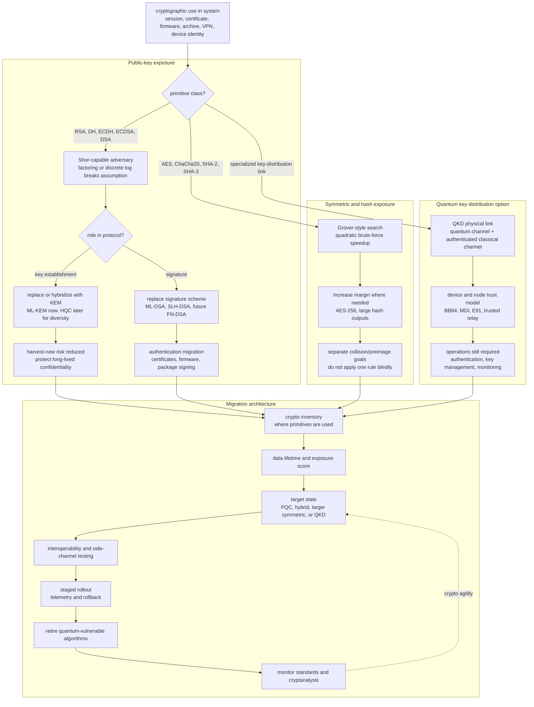

# Quantum Security

Quantum security studies what happens to cryptographic systems when adversaries can use quantum computation or quantum communication. The central practical issue is not that all cryptography disappears. The issue is selective: widely deployed public-key systems based on integer factorization and discrete logarithms become vulnerable to Shor's algorithm, while symmetric encryption and hash functions mostly lose a square root in brute-force cost under Grover's algorithm. That difference is why the migration is focused first on RSA, finite-field Diffie-Hellman, elliptic-curve Diffie-Hellman, ECDSA, DSA, and related public-key infrastructure.

This area sits between [classical cryptography](/cs/cryptography/), [quantum algorithms](/quantum-information-science/quantum-computing/algorithms), and [quantum communication](/quantum-information-science/quantum-communication/qkd). The two main response paths are independent. Post-quantum cryptography, or PQC, replaces vulnerable public-key algorithms with classical algorithms believed to resist quantum attacks. Quantum key distribution, or QKD, uses quantum hardware and physical measurement effects to distribute keys over specialized communication links. PQC is the default path for internet-scale migration; QKD is a specialized hardware approach with different assumptions and deployment constraints.


*Figure: Quantum security is operationally focused on public-key mechanisms, because Shor's algorithm changes the assumptions behind RSA, Diffie-Hellman, and elliptic-curve systems. Image: [Wikimedia Commons](https://commons.wikimedia.org/wiki/File:Public_key_making.svg), Davidgothberg, public domain.*


*Figure: Lattice geometry is one of the main mathematical settings for post-quantum cryptography, especially KEMs and signatures derived from LWE and SIS variants. Image: [Wikimedia Commons](https://commons.wikimedia.org/wiki/File:Lattice-reduction.svg), Catslash, public domain.*

## Definitions

A **cryptographically relevant quantum computer** is a quantum computer large enough, reliable enough, and error-corrected enough to break cryptographic parameter sizes used in real systems. Small noisy quantum devices are not enough. The phrase matters because the migration decision is driven by risk over the lifetime of protected data, not by demonstrations of small quantum circuits.

A **quantum-vulnerable public-key primitive** is a public-key primitive whose security reduces to problems efficiently solved by Shor's algorithm. The standard examples are RSA key transport and signatures, finite-field Diffie-Hellman, elliptic-curve Diffie-Hellman, ECDSA, DSA, and many related number-theoretic constructions. In simplified terms, Shor turns factoring and discrete logarithms from problems with no known efficient classical algorithm into polynomial-time quantum algorithms.

A **post-quantum cryptographic primitive** is a classical cryptographic primitive designed to remain secure against both classical and quantum adversaries. It does not require a quantum computer to run. The best-known families are lattice-based, hash-based, code-based, multivariate, and isogeny-based systems, though some candidates in those families have been broken and should be treated as historical lessons rather than deployment recommendations.

A **key encapsulation mechanism** or **KEM** is a public-key mechanism for establishing a shared secret. A party with a public encapsulation key creates a ciphertext and a shared secret. The private key holder decapsulates the ciphertext to recover the same shared secret. Modern protocol work often prefers KEMs over older "encrypt a premaster secret" phrasing because KEMs fit cleanly into security proofs and hybrid combinations.

A **digital signature scheme** provides signing and verification. In the quantum migration, signatures are often harder operationally than KEMs because certificates, firmware signatures, document signatures, code signatures, and hardware roots of trust can persist for years. Replacing key exchange protects future sessions; replacing signatures also changes identity and supply-chain workflows.

A **harvest now, decrypt later** attack records encrypted traffic or stored ciphertext today and waits until a future capability makes the key establishment breakable. This threat applies most directly to confidential data whose value outlives the migration period: medical records, legal archives, diplomatic traffic, source code, industrial designs, and long-lived personal data. It is less relevant to data that naturally expires in minutes.

The standardization snapshot used in this page is conservative as of May 16, 2026. NIST's first final PQC FIPS were approved on August 13, 2024: FIPS 203 for ML-KEM, derived from CRYSTALS-Kyber; FIPS 204 for ML-DSA, derived from CRYSTALS-Dilithium; and FIPS 205 for SLH-DSA, derived from SPHINCS+. NIST selected HQC for future standardization as an additional KEM in March 2025. Falcon, renamed in the NIST process as FN-DSA, is planned for FIPS 206 and remains in development rather than a final FIPS at this snapshot.

## Key results

The first result is the Shor/Grover split. Shor's algorithm breaks the mathematical assumptions behind RSA and discrete-log systems when implemented on a sufficiently large fault-tolerant quantum computer. For RSA, the private key can be recovered from the public modulus by factoring. For Diffie-Hellman and ECDH, the shared-secret problem is reduced to a discrete logarithm. For ECDSA and DSA, recovering the signing key from the public key is similarly tied to discrete logs. This is not a small parameter adjustment; it invalidates the main hardness assumption.

Grover's algorithm gives a quadratic speedup for unstructured search. If a classical brute-force key search costs about $2^k$ trials, an idealized Grover search costs about $2^{k/2}$ quantum iterations. This is serious but manageable for symmetric primitives: AES-128 has an effective brute-force margin closer to $2^{64}$ against such an idealized attack, while AES-256 restores an effective $2^{128}$ margin. For hash preimage search, SHA-256 has a similar $2^{128}$ quantum preimage scale. Hash collision search has different algorithms and security notions, so it should not be summarized by the same one-line rule, but common modern hash sizes still leave substantial margin.

The second result is that confidentiality and authentication migrate on different clocks. A TLS session using ECDHE for key establishment is exposed to harvest-now risk if the traffic must remain confidential after a future quantum break. A firmware image signed with ECDSA is exposed differently: the old signature may be forgeable in the future, but the operational harm depends on whether devices keep trusting that signature algorithm and key after the migration date. A mature plan separates key exchange, signatures, certificates, code signing, document signing, and roots of trust.

The third result is that PQC and QKD solve different problems. PQC is software and protocol migration: replace RSA/ECC key establishment and signatures with algorithms such as ML-KEM, ML-DSA, and SLH-DSA. QKD is a physical key distribution method that requires quantum channels, trusted devices, and an authenticated classical channel. QKD can be valuable for specialized links, but it does not by itself replace public-key authentication, internet PKI, software signing, or the need for crypto-agile protocols.

The fourth result is that migration has already started before a cryptographically relevant quantum computer exists. That is rational because deployed cryptography has long replacement cycles. NIST began the public PQC standardization process in 2016 and finalized FIPS 203, 204, and 205 in 2024. NSA's CNSA 2.0 guidance for U.S. National Security Systems points toward quantum-resistant migration by 2035, with earlier milestones for some classes of systems. NIST's transition work also frames 2035 as a major end state for removing quantum-vulnerable public-key algorithms from federal standards, with higher-risk systems moving earlier.

## Visual

The practical map is to classify each cryptographic use by what quantum algorithm changes. Then decide whether the replacement is a PQC primitive, a larger symmetric parameter, an operational migration, or a specialized quantum communication link.



This diagram classifies a cryptographic use by the quantum algorithm that changes its security assumption, then routes it into a migration architecture. The public-key branch separates key establishment from signatures because confidentiality and authentication migrate on different clocks, while the symmetric branch shows Grover as a margin problem rather than a total break. The QKD branch is deliberately tied back to authentication and operations so it is not mistaken for a general replacement for PQC.

| Area | Classical baseline | Main quantum impact | Typical response |
|---|---|---|---|
| Key establishment | RSA key transport, DH, ECDH | Shor breaks factoring and discrete logs | ML-KEM, future HQC, hybrid KEMs |
| Signatures | RSA, DSA, ECDSA, EdDSA | Shor can recover signing keys | ML-DSA, SLH-DSA, future FN-DSA |
| Symmetric encryption | AES-128, AES-256, ChaCha20 | Grover square-roots exhaustive key search | Prefer 256-bit keys for long-lived protection |
| Hash preimage resistance | SHA-256, SHA-384, SHA-512 | Grover square-roots preimage search | Keep large outputs; avoid short hashes |
| Key distribution hardware | Classical authenticated channels | Depends on protocol and devices | QKD for niche links, not a PKI replacement |

## Worked example 1: Estimating Grover's effect on symmetric keys

Problem: A system encrypts archived legal records with AES-128. The records must remain confidential for at least 30 years. Estimate the brute-force security level under a simple Grover model, then compare it with AES-256.

1. Model classical brute force. A $k$-bit key has about $2^k$ possible keys. For AES-128, the search space is $2^{128}$.

2. Apply the simple Grover square-root rule. An ideal Grover search over $2^k$ candidates takes on the order of

$$
\sqrt{2^k} = 2^{k/2}
$$

iterations. For AES-128 this gives

$$
2^{128/2} = 2^{64}.
$$

3. Repeat for AES-256:

$$
2^{256/2} = 2^{128}.
$$

4. Interpret the result. AES-128 is not "instantly broken" by the same kind of structural attack that affects RSA. The concern is that its idealized quantum brute-force margin is much lower. AES-256 restores a $2^{128}$ quantum brute-force scale under this simplified model.

Checked answer: for long-lived confidentiality, moving from AES-128 to AES-256 is the usual conservative symmetric-key response. The urgent migration target is still public-key key establishment, because Shor changes ECDH and RSA qualitatively rather than by a square-root factor.

## Worked example 2: Harvest-now risk for a TLS archive

Problem: An organization records encrypted TLS traffic for compliance troubleshooting. Some captured sessions contain medical records with a 25-year confidentiality requirement. The sessions used ECDHE with a classical elliptic curve. Suppose the organization estimates that PQC migration will take 4 years and uses a planning scenario in which a cryptographically relevant quantum computer could exist in 12 years. Is today's traffic in scope for harvest-now planning?

1. Define the relevant dates using relative durations. Let today be $t=0$. The data must remain confidential until

$$
t = 25.
$$

The planning scenario places a quantum-capable adversary at

$$
t = 12.
$$

2. Compare the confidentiality lifetime with the possible break time. Because

$$
12 < 25,
$$

the data is still sensitive when the future adversary might be able to break the ECDHE key establishment from the recorded handshake.

3. Check what migration changes. Migrating in 4 years protects new traffic after the migration, but it does not retroactively protect traffic already recorded under ECDHE unless the original protocol used a quantum-resistant or hybrid key establishment.

4. Decide priority. This traffic belongs in the high-priority migration bucket because it combines classical public-key establishment, passive recordability, and long confidentiality lifetime.

Checked answer: yes. Under this planning scenario, today's recorded TLS traffic is in scope for harvest-now, decrypt-later risk. The fix is not merely to change storage encryption later; new sessions carrying long-lived data should move to PQC or hybrid key establishment as early as feasible.

## Code

The following Python sketch is not a cryptographic implementation. It is a planning helper that classifies primitives by their quantum migration pressure and estimates the simple Grover security level for symmetric key search.

```python
from dataclasses import dataclass

SHOR_VULNERABLE = {"RSA", "DH", "ECDH", "ECDSA", "DSA", "EdDSA"}
GROVER_AFFECTED = {"AES", "ChaCha20", "SHA2-preimage", "SHA3-preimage"}

@dataclass
class PrimitiveUse:
    name: str
    family: str
    bits: int | None
    confidentiality_years: int = 0

def assess(use: PrimitiveUse, crqc_planning_years: int = 15) -> str:
    if use.family in SHOR_VULNERABLE:
        if use.confidentiality_years > crqc_planning_years:
            return "urgent: Shor-vulnerable and long-lived confidentiality"
        return "replace: Shor-vulnerable public-key primitive"

    if use.family in GROVER_AFFECTED and use.bits is not None:
        quantum_bits = use.bits // 2
        return f"parameter check: simple Grover estimate is {quantum_bits} bits"

    return "case-by-case: check protocol role and standards"

inventory = [
    PrimitiveUse("web ECDHE", "ECDH", None, confidentiality_years=20),
    PrimitiveUse("archive encryption", "AES", 256, confidentiality_years=30),
    PrimitiveUse("firmware signatures", "ECDSA", None, confidentiality_years=0),
]

for item in inventory:
    print(f"{item.name}: {assess(item)}")
```

## Common pitfalls

- Treating "quantum breaks cryptography" as a single statement. The impact on RSA/ECC public-key systems is qualitatively different from the impact on AES and hashes.
- Assuming PQC requires quantum hardware. PQC algorithms run on classical computers; they are designed to resist quantum attackers.
- Assuming QKD replaces authentication. QKD still needs an authenticated classical channel and does not solve software signing or certificate identity by itself.
- Waiting for a large quantum computer before migrating. Long-lived confidential data can be harvested before the future break exists.
- Migrating only TLS key exchange and forgetting signatures, certificates, code signing, document signing, backup encryption, and device roots of trust.
- Reading NIST candidate names as final standard names. Kyber became ML-KEM in FIPS 203; Dilithium became ML-DSA in FIPS 204; SPHINCS+ became SLH-DSA in FIPS 205.

## Connections

- [Post-Quantum Cryptography](/quantum-information-science/quantum-security/pqc) for algorithm families, NIST standards, and parameter trade-offs.
- [Quantum-Safe Cryptography (Migration)](/quantum-information-science/quantum-security/quantum-safe-crypto) for inventory, hybrid deployment, and organizational timelines.
- [Classical cryptography](/cs/cryptography/) for RSA, Diffie-Hellman, AES, hashes, signatures, and security definitions.
- [Quantum computing algorithms](/quantum-information-science/quantum-computing/algorithms) for the algorithmic source of Shor and Grover risks.
- [Quantum key distribution](/quantum-information-science/quantum-communication/qkd) for the hardware-based alternative and its limits.
- [Number theory basics](/math/discrete/number-theory-basics) for factoring, modular arithmetic, and discrete logarithms.
- [Linear algebra](/math/linear-algebra/) for vector spaces and lattice geometry used by many PQC constructions.
