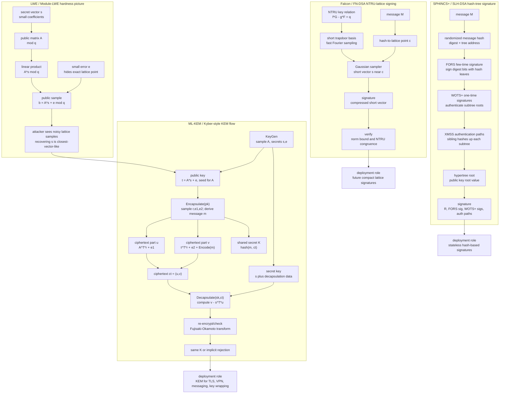

# Post-Quantum Cryptography

Post-quantum cryptography, or PQC, is classical cryptography designed to resist adversaries who have both ordinary computers and future quantum computers. The motivation is narrow but urgent: a sufficiently large fault-tolerant quantum computer would break RSA, finite-field Diffie-Hellman, elliptic-curve Diffie-Hellman, DSA, ECDSA, and related systems through Shor's algorithm. PQC replaces those public-key mechanisms while leaving most symmetric encryption and hashing practices to parameter adjustments rather than wholesale replacement.

The subject is not one algorithm. It is a portfolio of mathematical families with different key sizes, signature sizes, implementation risks, proof styles, and operational roles. Lattice-based schemes are the main general-purpose winners so far, hash-based signatures provide a conservative signature fallback with large signatures, code-based encryption has a long history but large public keys, and multivariate and isogeny-based schemes provide cautionary examples because major candidates were broken during public review.

## Definitions

A **post-quantum algorithm** is an algorithm intended to remain secure against known classical and quantum attacks. It runs on ordinary hardware. The "quantum" in the name describes the attacker model, not the implementation platform.

A **lattice** is a discrete additive subgroup of a vector space, usually represented as all integer combinations of basis vectors. Many lattice schemes hide a short vector or noisy linear relation in a high-dimensional algebraic structure. The relevant background is [linear algebra](/math/linear-algebra/) plus the geometry of integer grids.

The **Learning With Errors** problem, or **LWE**, gives samples

$$
(\mathbf{a}_i, b_i = \langle \mathbf{a}_i, \mathbf{s} \rangle + e_i \bmod q)
$$

where $\mathbf{s}$ is secret and $e_i$ is a small error. Without the errors, linear algebra recovers $\mathbf{s}$. With carefully chosen errors, modulus, and dimension, recovering $\mathbf{s}$ or distinguishing the samples from random is believed hard. **Module-LWE** and **Ring-LWE** add algebraic structure so keys and ciphertexts are smaller and operations are faster. That structure is useful but also means the exact assumption is not the same as unstructured LWE.

The **Short Integer Solution** problem, or **SIS**, asks for a short nonzero vector $\mathbf{x}$ such that $A\mathbf{x}=0 \bmod q$. Lattice signatures often use SIS-like hardness, Fiat-Shamir transforms, rejection sampling, and careful norm bounds to prove that signatures reveal little about the secret key.

**NTRU** is a lattice family built around polynomial rings and convolution-like multiplication. Falcon, now called FN-DSA in NIST's naming, is an NTRU-lattice signature scheme with compact signatures and fast verification, but its signing procedure is more delicate than ML-DSA and historically uses floating-point style Gaussian sampling or carefully designed alternatives.

A **hash-based signature** uses a hash function as the main assumption. One-time signatures such as Winternitz signatures can sign only a small number of messages per key, so practical schemes organize many one-time keys in Merkle trees. **XMSS** and **LMS/HSS** are stateful: the signer must never reuse a one-time signing leaf. **SPHINCS+**, standardized by NIST as **SLH-DSA** in FIPS 205, is stateless and therefore easier to operate safely, but its signatures are much larger.

A **code-based** scheme relies on the hardness of decoding a random-looking error-correcting code. Classic McEliece descends from a 1978 proposal based on binary Goppa codes. It has a long cryptanalytic history and small ciphertexts, but public keys are very large, commonly hundreds of kilobytes to more than a megabyte depending on parameters.

A **multivariate** scheme uses systems of multivariate polynomial equations over finite fields. Some variants can have small signatures, but the family has a history of structural attacks. Rainbow, a prominent NIST candidate, was broken in 2022.

An **isogeny-based** scheme uses maps between elliptic curves. SIKE was a prominent NIST fourth-round candidate, but Castryck and Decru broke it in 2022. SIKE is now mainly a lesson in why long public review matters.

## Key results

NIST's first final PQC standards were approved on August 13, 2024. [FIPS 203](https://csrc.nist.gov/pubs/fips/203/final) specifies ML-KEM, derived from CRYSTALS-Kyber, for key encapsulation. [FIPS 204](https://csrc.nist.gov/pubs/fips/204/final) specifies ML-DSA, derived from CRYSTALS-Dilithium, for signatures. [FIPS 205](https://csrc.nist.gov/pubs/fips/205/final) specifies SLH-DSA, derived from SPHINCS+, for stateless hash-based signatures. These are the foundational deployment targets for most systems starting a PQC migration.

The most important design split is **KEM versus signature**. ML-KEM is for establishing shared secrets in protocols such as TLS, VPNs, messaging handshakes, and key wrapping. ML-DSA and SLH-DSA are for signatures: certificates, firmware updates, signed documents, software packages, audit logs, and identity assertions. A system that migrates only KEMs can protect future session confidentiality while still depending on quantum-vulnerable signatures for authentication.

Lattice-based schemes currently provide the best general-purpose balance. ML-KEM has moderate public keys and ciphertexts, fast operations, and a standard KEM interface. ML-DSA has larger keys and signatures than ECDSA, but remains practical for many certificate and software-signing workflows. Falcon/FN-DSA offers smaller signatures and fast verification, but NIST still lists FIPS 206 as in development as of this page's May 16, 2026 snapshot. That distinction matters: Falcon is selected for future standardization, not yet a final FIPS in the same sense as ML-KEM, ML-DSA, and SLH-DSA.

Hash-based signatures are the conservative signature family. Their security assumptions are close to the properties expected of cryptographic hash functions, which is attractive because hash functions have a deep engineering history and quantum speedups are less devastating than Shor's attack on RSA/ECC. The cost is size and sometimes signing speed. XMSS is specified in RFC 8391, and LMS/HSS is specified in RFC 8554 and NIST SP 800-208. They are stateful: losing track of which leaf has been used can destroy security. SLH-DSA avoids signer state, but pays with much larger signatures than ML-DSA.

Code-based encryption remains important but is not the main first-wave NIST KEM. Classic McEliece is old, fast, and conservative in some respects, but its large public keys make it hard to insert into certificate-heavy and bandwidth-sensitive protocols. In March 2025, NIST selected HQC, another code-based KEM, for future standardization and did not select Classic McEliece for a FIPS at that stage. That does not mean Classic McEliece was "broken"; it means standardization also weighs deployment cost, diversity, confidence, and portfolio fit.

The broken candidates are useful results, not embarrassments to hide. Rainbow's 2022 break showed that attractive signature sizes do not compensate for fragile algebraic structure. SIKE's 2022 break showed that compact keys and elegant mathematics can still hide unexpected attack surfaces. The NIST process deliberately exposed candidates to years of public cryptanalysis before final standardization.

PQC security claims should be stated conservatively. "Believed quantum-resistant" does not mean "proved secure against all future mathematics." It means that after public analysis, no practical classical or quantum attack is known at the target parameter level, under stated assumptions. Implementations still need side-channel resistance, randomness discipline, constant-time code where relevant, robust parsing, and protocol-level security proofs.

## Visual

The family tree below separates current deployment standards, future or alternate candidates, and cautionary historical candidates.



The diagram replaces the family tree with mechanisms: noisy LWE samples, ML-KEM encapsulation/decapsulation, SLH-DSA's hypertree of hash-based signatures, and Falcon's NTRU-lattice trapdoor sampling. The ML-KEM branch labels the public key, ciphertext parts, FO check, and shared-secret derivation so it reads like a KEM rather than generic encryption. The signature branches show why SPHINCS+ is conservative but large and why Falcon/FN-DSA depends on short-vector sampling in an NTRU lattice.

| Family and examples | Main hardness idea | Typical public key or ciphertext size | Signature size | Relative performance | Deployment note |
|---|---|---|---|---|---|
| ML-KEM-768, formerly Kyber768 | Module-LWE | public key 1184 B, ciphertext 1088 B | not a signature | fast encapsulation and decapsulation | General-purpose KEM in FIPS 203 |
| ML-DSA-65, formerly Dilithium3 | Module-LWE and Module-SIS style lattice assumptions | public key 1952 B | signature 3309 B | fast signing and verification | General-purpose signature in FIPS 204 |
| SLH-DSA, formerly SPHINCS+ | Hash-function assumptions | public key 32 to 64 B depending on level | about 8 KB to 50 KB depending on parameter set | slower and much larger than ML-DSA | Stateless conservative signature in FIPS 205 |
| FN-DSA, based on Falcon | NTRU lattices and hash-and-sign | public key about 897 B or 1793 B in Falcon parameter sets | about 666 B or 1280 B | very fast verification, delicate signing | Planned FIPS 206, in development |
| XMSS, LMS/HSS | Hash trees over one-time signatures | small public keys | kilobytes, parameter-dependent | practical but state management is critical | RFC 8391, RFC 8554, NIST SP 800-208 |
| Classic McEliece | Decoding random-looking binary codes | public keys from hundreds of KB to over 1 MB | not a signature | fast encryption/KEM operations | Long history, large keys, not selected by NIST in 2025 |
| RSA-3072, ECDSA P-256, ECDH X25519 | Factoring or discrete logarithms | much smaller public keys than most PQC | RSA signatures hundreds of B, ECDSA about 64 B | mature and compact | Broken by Shor in the CRQC threat model |

## Worked example 1: A tiny LWE sample

Problem: Build a toy LWE instance over modulus $q=17$ and show why the error term prevents ordinary linear solving. Use more equations than unknowns:

$$
A =
\begin{bmatrix}
7 & 11 \\
4 & 6 \\
14 & 13 \\
9 & 8
\end{bmatrix},
\quad
\mathbf{s} =
\begin{bmatrix}
2 \\
4
\end{bmatrix},
\quad
\mathbf{e} =
\begin{bmatrix}
-1 \\
1 \\
-1 \\
0
\end{bmatrix}.
$$

Compute $\mathbf{b}=A\mathbf{s}+\mathbf{e} \bmod 17$.

1. Multiply the rows of $A$ by $\mathbf{s}$:

| Row | Dot product | Add error | Reduce mod 17 |
|---|---:|---:|---:|
| 1 | $7\cdot2+11\cdot4=58$ | $58-1=57$ | $6$ |
| 2 | $4\cdot2+6\cdot4=32$ | $32+1=33$ | $16$ |
| 3 | $14\cdot2+13\cdot4=80$ | $80-1=79$ | $11$ |
| 4 | $9\cdot2+8\cdot4=50$ | $50+0=50$ | $16$ |

So the public LWE sample is

$$
A =
\begin{bmatrix}
7 & 11 \\
4 & 6 \\
14 & 13 \\
9 & 8
\end{bmatrix},
\quad
\mathbf{b} =
\begin{bmatrix}
6 \\
16 \\
11 \\
16
\end{bmatrix}.
$$

2. Check the true secret by subtracting $A\mathbf{s}$ from $\mathbf{b}$:

$$
A\mathbf{s} \equiv
\begin{bmatrix}
58 \\
32 \\
80 \\
50
\end{bmatrix}
\equiv
\begin{bmatrix}
7 \\
15 \\
12 \\
16
\end{bmatrix}
\pmod{17}.
$$

Then

$$
\mathbf{b}-A\mathbf{s}
\equiv
\begin{bmatrix}
6-7 \\
16-15 \\
11-12 \\
16-16
\end{bmatrix}
=
\begin{bmatrix}
-1 \\
1 \\
-1 \\
0
\end{bmatrix}
\pmod{17}.
$$

The residual is small, exactly the error vector.

3. Interpret the toy. In dimension 2 with modulus 17, brute force over all $17^2=289$ secrets is easy. The point is not security; the point is the shape of the problem. A candidate secret is plausible when the centered residual vector is small across all rows. Real LWE and Module-LWE parameters use high dimension, many samples, structured modules, noise distributions, and security reductions so this residual search is computationally infeasible.

Checked answer: $\mathbf{b}=(6,16,11,16)^T$, and the candidate $\mathbf{s}=(2,4)^T$ gives the small centered residual $(-1,1,-1,0)^T$.

## Worked example 2: Budgeting PQC signature sizes

Problem: A vendor signs 10,000 firmware manifests per release cycle. Estimate signature bandwidth for ECDSA P-256, ML-DSA-65, and a representative small SLH-DSA parameter with a 7856-byte signature. Ignore certificate chains and assume each manifest carries exactly one signature.

1. ECDSA P-256 signatures are commonly about 64 bytes in raw $(r,s)$ form. The total is

$$
10{,}000 \cdot 64 = 640{,}000 \text{ bytes}.
$$

In mebibytes:

$$
\frac{640{,}000}{1{,}048{,}576} \approx 0.61 \text{ MiB}.
$$

2. ML-DSA-65 signatures are 3309 bytes. The total is

$$
10{,}000 \cdot 3309 = 33{,}090{,}000 \text{ bytes}.
$$

In mebibytes:

$$
\frac{33{,}090{,}000}{1{,}048{,}576} \approx 31.56 \text{ MiB}.
$$

3. The representative SLH-DSA signature is 7856 bytes. The total is

$$
10{,}000 \cdot 7856 = 78{,}560{,}000 \text{ bytes}.
$$

In mebibytes:

$$
\frac{78{,}560{,}000}{1{,}048{,}576} \approx 74.92 \text{ MiB}.
$$

4. Compare the operational impact. ML-DSA adds roughly

$$
31.56 - 0.61 = 30.95 \text{ MiB}
$$

over raw ECDSA signatures for this release cycle. The representative SLH-DSA choice adds about

$$
74.92 - 0.61 = 74.31 \text{ MiB}.
$$

Checked answer: ML-DSA is much larger than ECDSA but still manageable for many update systems. SLH-DSA is larger again, but may be attractive when conservative hash-based assumptions are worth the bandwidth. The right choice depends on the signing workflow, verification environment, and standards requirements.

## Code

This toy program brute-forces the small LWE instance from worked example 1. It is deliberately tiny so the structure is visible; it is not a cryptographic implementation.

```python
import numpy as np

q = 17
A = np.array([[7, 11], [4, 6], [14, 13], [9, 8]], dtype=int)
b = np.array([6, 16, 11, 16], dtype=int)

def centered_mod(values: np.ndarray, modulus: int) -> np.ndarray:
    return ((values + modulus // 2) % modulus) - modulus // 2

candidates = []
for s0 in range(q):
    for s1 in range(q):
        s = np.array([s0, s1], dtype=int)
        residual = centered_mod(b - A @ s, q)
        score = int(np.max(np.abs(residual)))
        secret = tuple(int(x) for x in s)
        error = tuple(int(x) for x in residual)
        candidates.append((score, secret, error))

candidates.sort(key=lambda item: item[0])

for score, secret, residual in candidates[:5]:
    print(f"secret={secret}, residual={residual}, max_error={score}")
```

For the example data, `(2, 4)` appears with residual `(1, -1)`. Real systems make this search space astronomically large and choose parameters so that known attacks remain infeasible at the target security level.

## Common pitfalls

- Treating every PQC candidate as deployable. Final FIPS standards, selected-but-not-final algorithms, round candidates, and broken historical schemes have different status.
- Saying that all lattice schemes have identical assumptions. LWE, Module-LWE, Ring-LWE, SIS, Module-SIS, and NTRU-style assumptions are related but not interchangeable.
- Ignoring signer state for XMSS or LMS. Reusing a one-time leaf can be catastrophic.
- Looking only at CPU time. Public key, ciphertext, signature, certificate-chain, packet-fragmentation, and memory costs can dominate deployment work.
- Assuming compact classical signatures set the baseline forever. PQC signatures are often much larger, so protocols and formats need length agility.
- Describing Rainbow or SIKE as "less preferred" instead of broken. They should be taught as cryptanalytic lessons, not migration choices.
- Claiming library-level security from algorithm names. Correct implementation, side-channel resistance, validation, and protocol integration are separate questions.

## Connections

- [Quantum Security](/quantum-information-science/quantum-security/intro) for the threat model and Shor/Grover framing.
- [Quantum-Safe Cryptography (Migration)](/quantum-information-science/quantum-security/quantum-safe-crypto) for hybrid deployment, inventories, and timelines.
- [Classical cryptography](/cs/cryptography/) for RSA, ECDH, ECDSA, AES, hash functions, and security notions.
- [Quantum computing algorithms](/quantum-information-science/quantum-computing/algorithms) for Shor's and Grover's algorithms.
- [Number theory basics](/math/discrete/number-theory-basics) for modular arithmetic, finite fields, and RSA background.
- [Linear algebra](/math/linear-algebra/) for vector spaces, matrices, norms, and the geometric language behind lattices.
- [Quantum key distribution](/quantum-information-science/quantum-communication/qkd) for the hardware-based alternative to algorithmic PQC.
